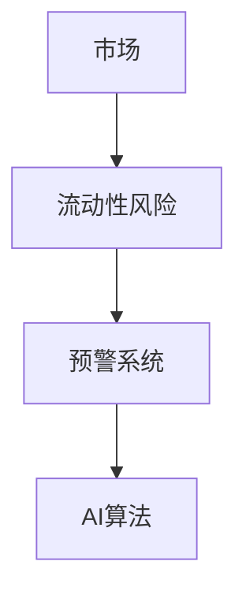
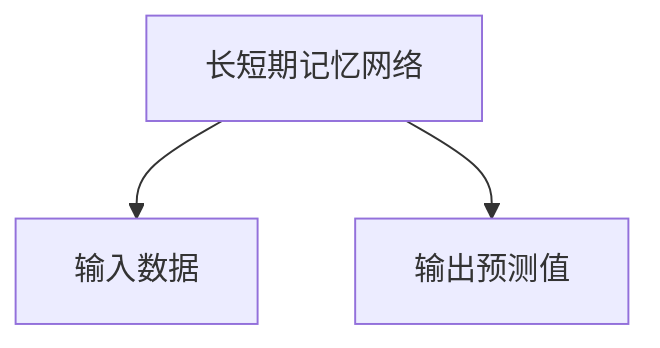
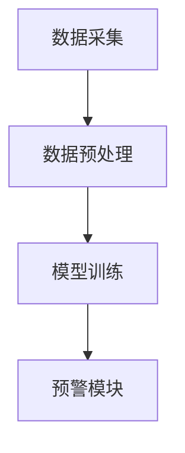

                 


# AI驱动的市场流动性风险预警系统

> 关键词：市场流动性风险、AI、预警系统、算法原理、系统架构

> 摘要：本文介绍了一种基于AI技术的市场流动性风险预警系统，旨在利用先进的算法和系统架构，实时监测和预测市场流动性风险，帮助金融机构做出及时决策，降低潜在风险。

---

## 第1章: 市场流动性风险与AI技术的结合

### 1.1 市场流动性风险的定义与特征

#### 1.1.1 流动性风险的定义
流动性风险是指资产在短时间内难以以合理价格变现的风险。在金融市场中，流动性不足可能导致资产价格剧烈波动，甚至引发系统性风险。

#### 1.1.2 流动性风险的特征
- **波动性**：市场波动可能导致流动性突然下降。
- **传染性**：流动性风险可能在市场中迅速蔓延。
- **不确定性**：难以预测流动性风险的具体发生时间。

#### 1.1.3 流动性风险的分类
- **市场流动性风险**：整体市场流动性不足。
- **个别流动性风险**：特定资产或机构流动性不足。

### 1.2 AI技术在金融领域的应用

#### 1.2.1 AI技术的基本概念
AI（人工智能）通过模拟人类智能，利用机器学习、深度学习等技术，从数据中提取特征，进行预测和决策。

#### 1.2.2 AI在金融分析中的应用
- **股票预测**：利用历史数据预测股票价格走势。
- **风险评估**：通过分析客户数据，评估信用风险。

#### 1.2.3 AI在风险管理中的作用
AI能够实时分析大量数据，识别潜在风险，帮助金融机构制定应对策略。

### 1.3 AI驱动的市场流动性风险预警系统的目标

#### 1.3.1 系统的目标
- 实时监测市场流动性状况。
- 提前预警潜在流动性风险。

#### 1.3.2 系统的预期功能
- 数据采集与处理。
- 风险预测与预警。

#### 1.3.3 系统的创新点
- 利用AI技术提升预警准确性。
- 实现实时监控和快速响应。

---

## 第2章: 市场流动性风险预警系统的核心概念与联系

### 2.1 核心概念原理

#### 2.1.1 市场流动性风险的核心要素
- 交易量。
- 市场深度。
- 买卖价差。

#### 2.1.2 AI技术的核心算法
- 机器学习（如随机森林）。
- 深度学习（如LSTM）。

#### 2.1.3 预警系统的逻辑架构
- 数据输入。
- 特征提取。
- 风险预测。
- 预警输出。

### 2.2 核心概念属性特征对比

| 特性       | 流动性风险 | AI技术   | 预警系统 |
|------------|------------|----------|----------|
| 数据来源   | 市场数据    | 多源数据 | 结构化数据|
| 数据处理   | 实时处理    | 分析处理 | 预处理   |
| 处理目标   | 预警风险    | 辅助决策 | 发出警报  |

### 2.3 ER实体关系图架构



---

## 第3章: 市场流动性风险预警系统的算法原理

### 3.1 算法原理概述

#### 3.1.1 机器学习算法
- 线性回归：用于预测关系。
- 支持向量机：用于分类问题。

#### 3.1.2 深度学习算法
- LSTM：适用于时间序列预测。

#### 3.1.3 时间序列分析
- 分析市场数据的时间依赖性。

### 3.2 基于LSTM的流动性风险预测



#### LSTM模型实现代码

```python
import numpy as np
from tensorflow.keras import layers

model = layers.SimpleRNN(units=64, activation='relu')
model.compile(optimizer='adam', loss='mse')
```

### 3.3 数学模型与公式

#### 3.3.1 ARIMA模型
$$ ARIMA(p, d, q) $$

#### 3.3.2 LSTM模型
$$ f(x) = \sigma(wx + b) $$

---

## 第4章: 市场流动性风险预警系统的系统架构设计

### 4.1 系统架构概述

#### 4.1.1 数据采集模块
- 从多个数据源收集市场数据。

#### 4.1.2 数据预处理模块
- 清洗数据，提取特征。

#### 4.1.3 模型训练模块
- 使用训练数据训练AI模型。

#### 4.1.4 预警模块
- 监控市场数据，触发预警。

### 4.2 系统架构的Mermaid图



---

## 第5章: 项目实战

### 5.1 环境安装
- 安装Python、TensorFlow、Keras等工具。

### 5.2 代码实现

#### 5.2.1 数据预处理
```python
import pandas as pd
data = pd.read_csv('market_data.csv')
```

#### 5.2.2 模型训练
```python
model.fit(train_data, train_labels, epochs=100, batch_size=32)
```

#### 5.2.3 案例分析
分析某次市场波动，验证系统预警效果。

---

## 作者

作者：AI天才研究院/AI Genius Institute & 禅与计算机程序设计艺术 /Zen And The Art of Computer Programming

