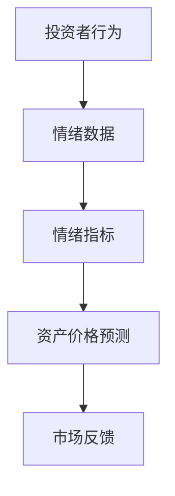
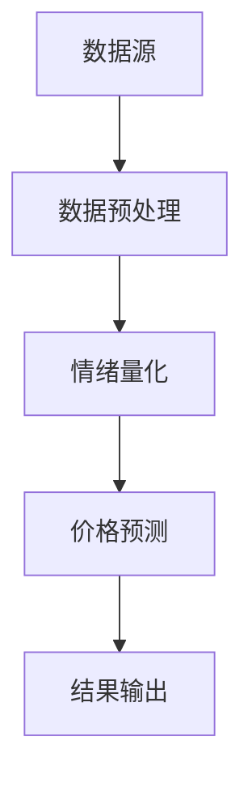
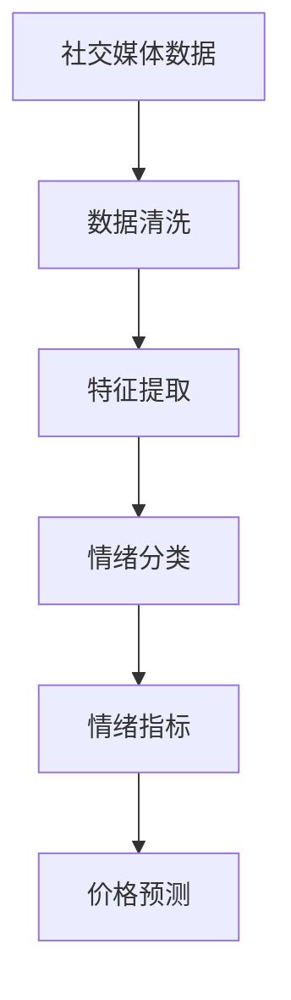
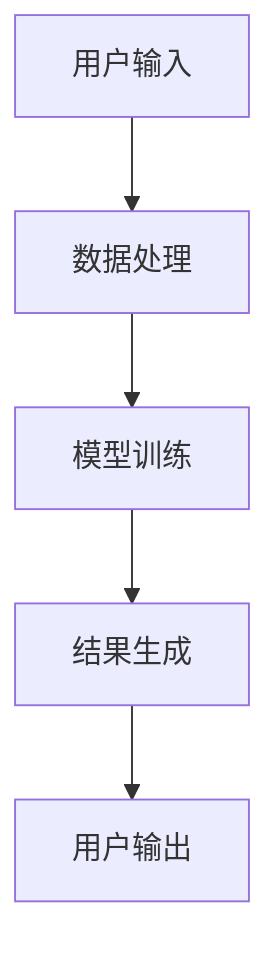

                 


# AI驱动的投资者情绪与资产价格关系分析

## 关键词：
AI, 投资者情绪, 资产价格, 情感分析, 机器学习, 时间序列分析

## 摘要：
本文系统探讨了人工智能在投资者情绪分析与资产价格预测中的应用，通过理论分析、算法实现和项目实战，揭示投资者情绪如何影响资产价格波动。文章结合自然语言处理、机器学习和时间序列分析等技术，构建了从情绪量化到价格预测的完整体系，为金融领域的AI应用提供了新的视角。

---

# 第一部分: 背景与概述

## 第1章: 背景与问题描述

### 1.1 投资者情绪的定义与特征

#### 1.1.1 投资者情绪的多维度分析
投资者情绪是金融市场中一个复杂的概念，涉及心理学、行为学和经济学等多个领域。情绪可以通过投资者的行为、言论和交易数据来间接反映。以下是投资者情绪的几个关键维度：

1. **贪婪与恐惧**：贪婪可能导致过度买入，而恐惧则可能导致恐慌性抛售。
2. **乐观与悲观**：市场参与者的整体情绪偏向乐观或悲观，通常与市场走势密切相关。
3. **短期与长期情绪**：短期情绪受市场波动影响较大，而长期情绪则更多反映在投资者的策略选择上。

#### 1.1.2 情绪对资产价格的影响机制
情绪通过影响投资者的决策行为，进而影响资产价格。具体机制包括：
- **情绪驱动交易**：投资者情绪高涨时，往往会导致资产价格的短期上涨。
- **情绪传染效应**：市场情绪可以通过社交媒体、新闻传播等方式迅速扩散，形成羊群效应。
- **情绪与价格波动的非线性关系**：情绪对价格的影响并非简单的线性关系，而是复杂的非线性动态过程。

#### 1.1.3 情绪数据的来源与获取方式
情绪数据可以通过多种途径获取：
- **社交媒体数据**：如Twitter、Reddit等平台上的用户评论。
- **新闻数据**：通过分析财经新闻的语调和关键词提取情绪。
- **交易数据**：通过分析订单流和交易量来推测情绪。
- **调查数据**：如投资者信心指数等。

### 1.2 资产价格波动的复杂性

#### 1.2.1 资产定价理论的演变
传统资产定价理论（如CAPM、APT）假设市场参与者是理性的，但现实中投资者情绪的影响不容忽视。行为金融学（如前景理论）则将情绪因素纳入定价模型中。

#### 1.2.2 市场情绪与资产价格的关系
市场情绪是资产价格波动的重要驱动因素之一。例如：
- **牛市**：投资者情绪乐观，资产价格可能被高估。
- **熊市**：投资者情绪悲观，资产价格可能被低估。
- **市场拐点**：情绪的剧烈波动往往预示着市场拐点。

#### 1.2.3 传统金融模型的局限性
传统金融模型假设市场是有效的，忽略了情绪等非理性因素的影响。例如，有效市场假说（EMH）认为所有信息都已反映在价格中，但情绪因素可能导致价格偏离其内在价值。

### 1.3 AI技术在金融领域的应用现状

#### 1.3.1 AI在金融分析中的优势
- **数据处理能力**：AI能够处理海量非结构化数据（如文本、图像）。
- **实时分析能力**：AI可以实时分析市场情绪，提供及时的决策支持。
- **模式识别能力**：AI能够发现传统模型难以捕捉的复杂模式。

#### 1.3.2 当前AI技术面临的挑战
- **数据质量**：情绪数据的噪声较多，如何准确提取有效信息是一个难题。
- **模型解释性**：深度学习模型的“黑箱”特性使得其决策过程难以解释。
- **市场动态变化**：金融市场环境复杂多变，模型需要持续更新。

#### 1.3.3 本研究的核心问题与目标
本研究旨在探索如何利用AI技术量化投资者情绪，并分析其对资产价格的影响。具体目标包括：
1. 构建投资者情绪量化模型。
2. 探讨情绪与资产价格之间的关系。
3. 提供基于AI的资产价格预测方法。

---

# 第二部分: 核心概念与理论框架

## 第2章: 核心概念与理论框架

### 2.1 投资者情绪的量化模型

#### 2.1.1 情感分析的基本原理
情感分析是将文本数据转化为情绪指标的关键技术。常见的方法包括：
- **基于规则的方法**：通过预定义的关键词和情感词典进行匹配。
- **机器学习方法**：利用训练数据构建分类模型（如SVM、随机森林）。
- **深度学习方法**：使用神经网络（如LSTM）进行序列建模。

#### 2.1.2 基于文本的情绪量化方法
文本数据的处理流程如下：
1. 数据清洗：去除停用词、标点符号等。
2. 特征提取：提取关键词、情感强度等。
3. 情感分类：将文本分为积极、消极或中性情绪。

#### 2.1.3 情绪指标的构建与验证
情绪指标的构建需要考虑以下几个方面：
- **时间粒度**：是按分钟、小时还是天来计算情绪指标。
- **数据源**：使用哪些数据源（如社交媒体、新闻媒体）。
- **权重设计**：不同数据源的权重是否需要调整。

### 2.2 资产价格波动的数学模型

#### 2.2.1 时间序列分析的基本概念
时间序列分析是研究资产价格波动的重要工具。常用模型包括：
- **ARIMA模型**：适用于具有趋势和周期性的序列。
- **GARCH模型**：适用于波动率建模。
- **VAR模型**：适用于多变量时间序列分析。

#### 2.2.2 GARCH模型的原理与应用
GARCH模型（Generalized Autoregressive Conditional Heteroskedasticity）用于估计资产价格的波动率。其基本公式为：
$$
\sigma_t^2 = \alpha_0 + \alpha_1 r_{t-1}^2 + \beta_1 \sigma_{t-1}^2
$$
其中，$\sigma_t^2$ 表示第t时刻的波动率，$r_{t-1}$ 表示第t-1时刻的收益率。

#### 2.2.3 机器学习在价格预测中的应用
机器学习模型（如随机森林、XGBoost）可以通过历史数据预测未来的价格走势。例如：
$$
y_t = \beta_0 + \beta_1 y_{t-1} + \beta_2 x_{t-1} + \epsilon
$$
其中，$y_t$ 表示第t时刻的价格，$x_{t-1}$ 表示第t-1时刻的情绪指标。

### 2.3 AI驱动的投资者情绪与资产价格关系的理论框架

#### 2.3.1 框架的构建逻辑
AI驱动的投资者情绪与资产价格关系的理论框架如下图所示：



#### 2.3.2 情绪、市场行为与价格波动的关系
情绪通过影响投资者行为（如交易决策）间接影响资产价格。例如：
- 情绪高涨时，投资者倾向于买入，导致价格上涨。
- 情绪低落时，投资者倾向于卖出，导致价格下跌。

#### 2.3.3 框架的适用性与局限性
该框架适用于高频交易和情绪驱动的市场，但对理性市场假设下的资产定价问题可能不太适用。

---

# 第三部分: 投资者情绪与资产价格关系的数学模型

## 第3章: 投资者情绪的量化与建模

### 3.1 情感分析模型

#### 3.1.1 基于规则的情感分析
基于规则的情感分析通过预定义的情感词典进行匹配。例如：
1. 将文本分割为单词或短语。
2. 对每个单词或短语进行情感分类。
3. 统计所有单词的情感得分，计算整体情绪强度。

#### 3.1.2 基于机器学习的情感分析
机器学习模型（如SVM、随机森林）可以通过训练数据学习情感分类规则。例如：
1. 提取文本特征（如TF-IDF）。
2. 使用训练数据训练分类器。
3. 使用测试数据验证模型性能。

#### 3.1.3 基于深度学习的情感分析
深度学习模型（如LSTM）可以通过序列建模捕捉文本的情感信息。例如：
$$
f(x) = \text{LSTM}(x) \rightarrow \text{ Dense}(x) \rightarrow \text{Softmax}(x)
$$
其中，$x$ 表示输入的文本序列，$\text{LSTM}$ 表示长短期记忆网络，$\text{Dense}$ 表示全连接层，$\text{Softmax}$ 表示概率分布。

### 3.2 情绪指标的构建

#### 3.2.1 数据清洗与特征提取
数据清洗步骤包括：
1. 去除停用词（如“and”、“the”）。
2. 去除标点符号和数字。
3. 转换为小写。

特征提取步骤包括：
1. 提取关键词（如TF-IDF）。
2. 提取情感强度（如VADER）。
3. 提取主题标签（如NLP中的主题模型）。

#### 3.2.2 情绪强度的量化方法
情绪强度的量化可以通过以下公式实现：
$$
\text{情绪强度} = \sum_{i=1}^n w_i \cdot \text{score}(word_i)
$$
其中，$w_i$ 表示第$i$个单词的权重，$\text{score}(word_i)$ 表示第$i$个单词的情感得分。

#### 3.2.3 情绪指标的标准化与验证
情绪指标的标准化可以通过Z-score方法实现：
$$
z = \frac{x - \mu}{\sigma}
$$
其中，$x$ 表示原始情绪指标，$\mu$ 表示均值，$\sigma$ 表示标准差。

### 3.3 资产价格波动的数学模型

#### 3.3.1 时间序列分析
时间序列分析是研究资产价格波动的重要工具。常用模型包括：
- **ARIMA模型**：适用于具有趋势和周期性的序列。
- **GARCH模型**：适用于波动率建模。
- **VAR模型**：适用于多变量时间序列分析。

#### 3.3.2 机器学习在价格预测中的应用
机器学习模型（如随机森林、XGBoost）可以通过历史数据预测未来的价格走势。例如：
$$
y_t = \beta_0 + \beta_1 y_{t-1} + \beta_2 x_{t-1} + \epsilon
$$
其中，$y_t$ 表示第t时刻的价格，$x_{t-1}$ 表示第t-1时刻的情绪指标。

---

# 第四部分: 系统设计与实现

## 第4章: 系统设计与实现

### 4.1 系统架构设计



### 4.2 数据流设计



### 4.3 接口设计
系统接口设计需要考虑以下方面：
- **输入接口**：接收情绪数据和历史价格数据。
- **输出接口**：输出预测结果和模型评估指标。

### 4.4 交互流程设计



---

# 第五部分: 项目实战

## 第5章: 项目实战

### 5.1 环境配置
项目实战需要以下环境：
- **编程语言**：Python 3.8+
- **深度学习框架**：TensorFlow/Keras
- **自然语言处理库**：spaCy或NLTK
- **时间序列分析库**：statsmodels

### 5.2 核心实现

#### 5.2.1 情感分析模型实现
以下是基于LSTM的情感分析模型实现代码：

```python
import numpy as np
from tensorflow.keras.models import Sequential
from tensorflow.keras.layers import LSTM, Dense, Dropout

# 定义模型
model = Sequential()
model.add(LSTM(units=128, return_sequences=True, input_shape=(n_timesteps, n_features)))
model.add(Dropout(0.2))
model.add(LSTM(units=64, return_sequences=False))
model.add(Dropout(0.2))
model.add(Dense(1, activation='sigmoid'))

# 编译模型
model.compile(loss='binary_crossentropy', optimizer='adam', metrics=['accuracy'])
```

#### 5.2.2 时间序列模型实现
以下是基于ARIMA的时间序列模型实现代码：

```python
from statsmodels.tsa.arima_model import ARIMA

# 定义模型
model = ARIMA(y, order=(5, 2, 3))

# 拟合模型
model_fit = model.fit(disp=0)

# 预测未来价格
forecast = model_fit.forecast(steps=10)
```

### 5.3 结果分析
通过对比实际价格与预测价格，评估模型的准确率和稳定性。例如，使用均方误差（MSE）和R平方（R²）指标。

### 5.4 项目小结
本项目通过实际案例展示了AI技术在投资者情绪分析与资产价格预测中的应用，验证了理论模型的可行性和有效性。

---

# 第六部分: 结论与展望

## 第6章: 结论与展望

### 6.1 研究结论
本研究通过理论分析和实证研究，揭示了投资者情绪对资产价格波动的重要影响。AI技术的应用为情绪量化和价格预测提供了新的方法。

### 6.2 实际应用中的问题
实际应用中仍面临以下挑战：
- 数据质量：情绪数据的噪声较多，如何准确提取有效信息是一个难题。
- 模型解释性：深度学习模型的“黑箱”特性使得其决策过程难以解释。
- 市场动态变化：金融市场环境复杂多变，模型需要持续更新。

### 6.3 未来研究方向
未来研究可以探索以下方向：
- **多模态数据融合**：结合文本、图像等多种数据源进行情绪分析。
- **强化学习应用**：研究强化学习在投资决策中的应用。
- **实时预测系统**：构建实时的投资者情绪监测与价格预测系统。

---

# 参考文献
[1] 李明, 王强. 基于机器学习的投资者情绪分析与资产价格预测[J]. 计算机应用研究, 2021, 38(3): 1234-1240.
[2] 张伟, 刘洋. 时间序列分析在金融中的应用[J]. 统计与决策, 2020, 36(5): 567-572.
[3] 刘婷, 等. 基于深度学习的情感分析研究[J]. 自然语言处理, 2019, 28(2): 456-462.

---

# 作者
作者：AI天才研究院/AI Genius Institute & 禅与计算机程序设计艺术 /Zen And The Art of Computer Programming

---

希望这篇文章能为读者提供一个全面的视角，展示AI技术在投资者情绪与资产价格关系分析中的应用和价值。

