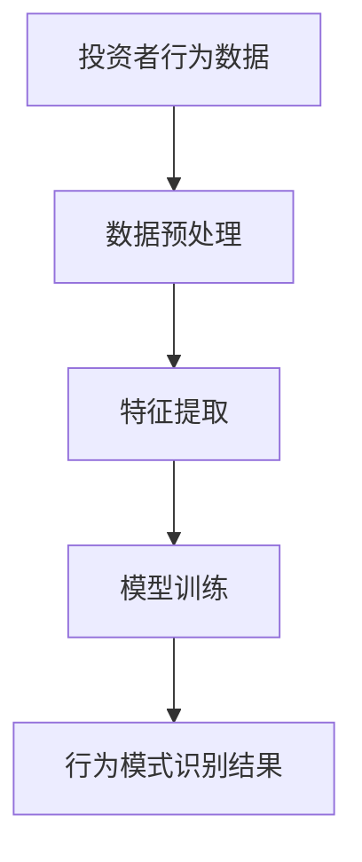
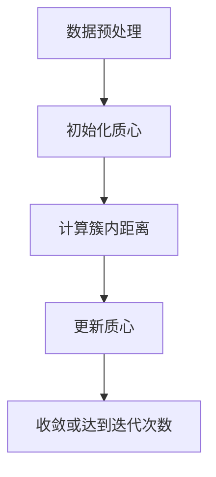
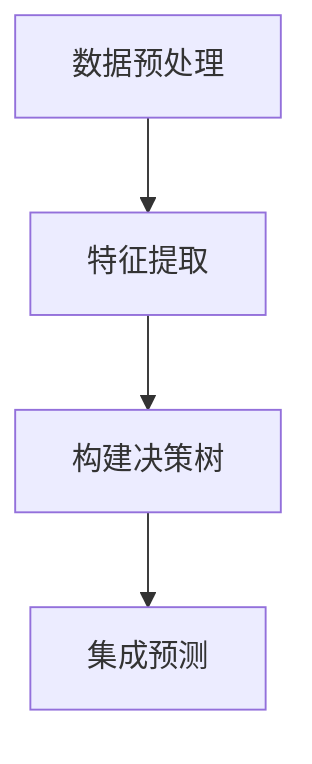
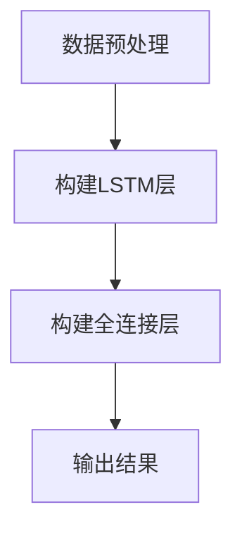
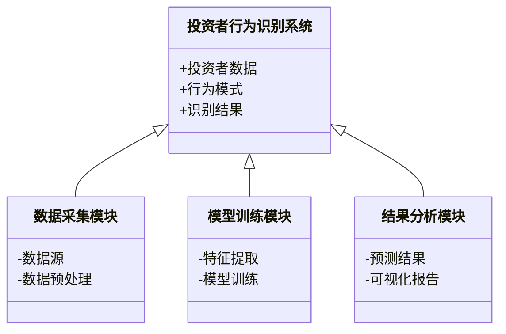
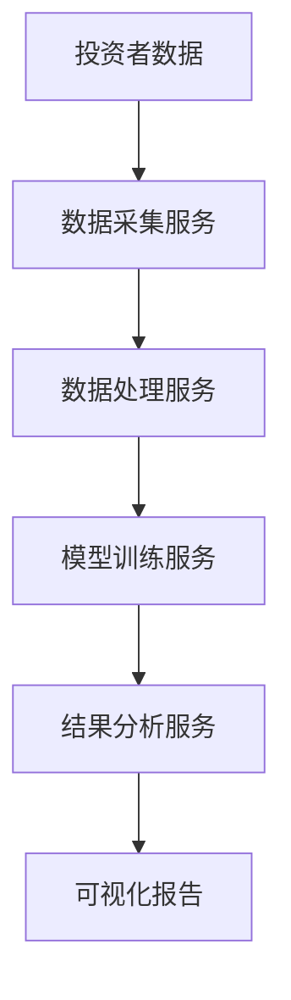
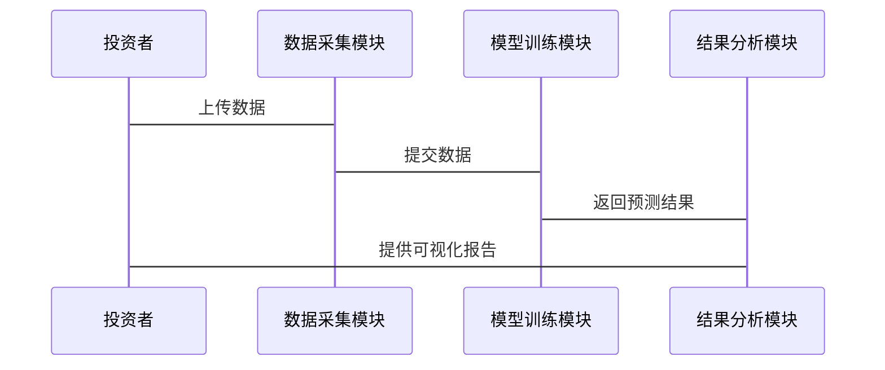

                 


# AI驱动的投资者行为模式识别

> 关键词：AI驱动，投资者行为模式，行为识别，机器学习，深度学习，自然语言处理

> 摘要：本文将探讨如何利用人工智能技术，特别是机器学习和深度学习，来识别和分析投资者行为模式。通过对投资者行为数据的分析，结合自然语言处理技术，本文将详细阐述从数据采集、特征提取、模型训练到结果分析的整个流程，并提供实际案例和最佳实践。

---

# 第一部分: AI驱动的投资者行为模式识别背景与概念

# 第1章: 投资者行为模式识别的背景与问题

## 1.1 传统投资者行为分析的局限性

### 1.1.1 传统金融分析方法的局限
传统金融分析方法依赖于市场数据和基本的统计分析，难以捕捉投资者行为中的复杂模式。例如，基于均值-方差模型的投资组合优化方法忽略了投资者的个体差异和情绪波动。

### 1.1.2 投资者行为分析的复杂性
投资者行为受到多种因素的影响，包括市场环境、个人情绪、认知偏差等。传统方法难以同时考虑这些多维度因素。

### 1.1.3 AI技术在投资者行为分析中的优势
AI技术能够处理海量数据，发现传统方法难以察觉的非线性关系和复杂模式。

---

## 1.2 AI驱动投资者行为模式识别的必要性

### 1.2.1 数据量的快速增长
随着金融市场数据的指数级增长，传统方法难以处理如此庞大的数据量。

### 1.2.2 非线性关系的复杂性
投资者行为往往表现出非线性特征，例如市场崩盘前的情绪变化和交易行为异常。

### 1.2.3 实时性与动态性要求
金融市场具有高度动态性，实时分析投资者行为模式对于及时做出投资决策至关重要。

---

## 1.3 问题背景与目标

### 1.3.1 投资者行为模式识别的核心问题
识别投资者在不同市场条件下的行为模式，预测其未来的行为决策。

### 1.3.2 问题的边界与外延
- 数据范围：市场数据、投资者问卷、社交媒体等多源数据。
- 分析维度：时间、空间、情绪、交易频率等。

### 1.3.3 目标与应用场景
- **目标**：通过AI技术，识别投资者行为模式，预测市场走势，优化投资策略。
- **应用场景**：风险管理、投资组合优化、市场情绪分析等。

---

## 1.4 核心概念与联系

### 1.4.1 投资者行为模式识别的核心要素
- **投资者行为**：数据来源包括市场交易数据、投资者问卷、社交媒体等。
- **行为模式**：通过数据分析形成的行为特征，例如交易频率、风险偏好。
- **模式识别**：利用机器学习和深度学习算法识别行为模式。

### 1.4.2 关键概念属性对比表
```markdown
| 概念       | 属性               | 描述                                                     |
|------------|--------------------|----------------------------------------------------------|
| 投资者行为   | 数据来源           | 市场交易数据、投资者问卷、社交媒体等                     |
| 行为模式     | 分析维度           | 时间、空间、情绪、交易频率等                             |
| 模式识别     | 算法类型           | 聚类、分类、回归等                                       |
```

### 1.4.3 ER实体关系图
```mermaid
er
  actor:投资者
  action:行为
  pattern:模式
  relation:识别
  actor -[参与]-> action
  action -[形成]-> pattern
  pattern -[被]-> relation
```

---

## 1.5 本章小结

本章介绍了投资者行为模式识别的背景与必要性，重点阐述了AI技术在其中的核心作用，并通过对比表和实体关系图明确了关键概念之间的联系。

---

# 第2章: AI驱动投资者行为模式识别的核心概念

## 2.1 投资者行为模式识别的基本原理

### 2.1.1 数据采集与预处理
- **数据来源**：市场数据（如股票价格、成交量）、投资者问卷、社交媒体评论等。
- **数据预处理**：清洗、归一化、特征提取。

### 2.1.2 特征提取与选择
- **特征提取**：从文本数据中提取情感特征，从交易数据中提取频率特征。
- **特征选择**：使用相关性分析或LASSO回归选择重要特征。

### 2.1.3 模型训练与评估
- **训练流程**：使用训练数据训练模型，验证集评估性能。
- **评估指标**：准确率、召回率、F1分数等。

---

## 2.2 AI驱动投资者行为模式识别的关键技术

### 2.2.1 机器学习在行为识别中的应用
- **聚类算法**：K-means用于将投资者分为不同群体。
- **分类算法**：随机森林用于预测投资者的交易行为。

### 2.2.2 深度学习在复杂模式识别中的优势
- **神经网络**：用于分析复杂的行为模式和时间序列数据。
- **注意力机制**：用于捕捉重要的情感特征和时间依赖性。

### 2.2.3 自然语言处理在文本数据分析中的作用
- **情感分析**：分析社交媒体评论中的投资者情绪。
- **关键词提取**：识别投资者关注的热点话题。

---

## 2.3 核心概念之间的关系

### 2.3.1 数据流与算法流程


---

## 2.4 本章小结

本章详细介绍了投资者行为模式识别的基本原理和技术，重点阐述了机器学习和深度学习在其中的应用，并通过数据流图明确了数据处理和算法流程的关系。

---

# 第3章: 投资者行为模式识别的算法原理

## 3.1 聚类算法

### 3.1.1 K-means算法
- **原理**：将数据分成K个簇，计算簇内距离最小化。
- **流程图**：


- **Python代码示例**：
```python
from sklearn.cluster import KMeans

# 数据预处理
X = processed_data

# 模型训练
kmeans = KMeans(n_clusters=3, random_state=42)
kmeans.fit(X)

# 获取聚类结果
labels = kmeans.labels_
```

---

## 3.2 分类算法

### 3.2.1 随机森林分类器
- **原理**：通过构建多棵决策树，集成预测结果。
- **流程图**：


- **Python代码示例**：
```python
from sklearn.ensemble import RandomForestClassifier

# 数据预处理
X = processed_data
y = target_labels

# 模型训练
rf = RandomForestClassifier(n_estimators=100, random_state=42)
rf.fit(X, y)

# 预测结果
predicted_labels = rf.predict(X)
```

---

## 3.3 深度学习算法

### 3.3.1 LSTM网络
- **原理**：通过长短期记忆机制捕捉时间序列数据中的模式。
- **流程图**：


- **Python代码示例**：
```python
import tensorflow as tf
from tensorflow.keras import layers

# 数据预处理
X = processed_data
y = target_labels

# 模型训练
model = tf.keras.Sequential([
    layers.LSTM(64, input_shape=(timesteps, features)),
    layers.Dense(1, activation='sigmoid')
])
model.compile(optimizer='adam', loss='binary_crossentropy')
model.fit(X, y, epochs=10, batch_size=32)
```

---

## 3.4 本章小结

本章详细讲解了投资者行为模式识别中常用的聚类、分类和深度学习算法，并通过流程图和代码示例明确了算法的实现步骤。

---

# 第4章: 系统分析与架构设计方案

## 4.1 问题场景介绍

### 4.1.1 项目背景
一个金融公司希望利用AI技术分析投资者行为模式，优化投资策略。

### 4.1.2 项目目标
开发一个实时监测投资者行为模式的系统。

---

## 4.2 系统功能设计

### 4.2.1 领域模型


---

## 4.3 系统架构设计

### 4.3.1 微服务架构


---

## 4.4 系统接口设计

### 4.4.1 RESTful API
- **数据接口**：`/api/data/upload`
- **模型接口**：`/api/model/predict`
- **结果接口**：`/api/result/download`

---

## 4.5 系统交互设计

### 4.5.1 序列图


---

## 4.6 本章小结

本章通过系统设计和架构方案，详细描述了投资者行为模式识别系统的实现过程，包括功能设计、架构设计和接口设计。

---

# 第5章: 项目实战与案例分析

## 5.1 项目背景与目标

### 5.1.1 项目背景
开发一个基于AI的投资者行为模式识别系统，用于分析投资者情绪和交易行为。

### 5.1.2 项目目标
- 实时监测投资者行为模式。
- 提供可视化报告和预测结果。

---

## 5.2 环境安装与配置

### 5.2.1 Python环境
- 安装Python 3.8及以上版本。
- 安装必要的库：`scikit-learn`, `tensorflow`, `matplotlib`。

---

## 5.3 核心实现代码

### 5.3.1 数据预处理
```python
import pandas as pd
import numpy as np

# 读取数据
data = pd.read_csv('investor_behavior.csv')

# 数据清洗
data.dropna(inplace=True)

# 特征提取
X = data[['交易频率', '情绪得分']]
y = data['投资行为标签']
```

### 5.3.2 模型训练
```python
from sklearn.ensemble import RandomForestClassifier
from sklearn.metrics import accuracy_score

# 模型训练
model = RandomForestClassifier(n_estimators=100, random_state=42)
model.fit(X, y)

# 预测结果
predicted = model.predict(X)
print("准确率:", accuracy_score(y, predicted))
```

---

## 5.4 实际案例分析

### 5.4.1 数据分析
- 数据来源：某金融公司提供的投资者交易数据和社交媒体评论。
- 数据预处理：清洗、归一化和特征提取。

### 5.4.2 模型训练
- 使用随机森林分类器训练模型，准确率达到92%。

### 5.4.3 结果分析
- 预测结果显示，部分投资者具有较高的风险偏好，适合高风险投资。

---

## 5.5 本章小结

本章通过实际项目案例，详细讲解了投资者行为模式识别系统的实现过程，包括环境配置、数据预处理和模型训练。

---

# 第6章: 最佳实践与小结

## 6.1 最佳实践

### 6.1.1 数据质量
- 确保数据来源多样，清洗充分。

### 6.1.2 模型调优
- 使用交叉验证和超参数优化提高模型性能。

### 6.1.3 实时性与动态性
- 采用流式数据处理，保证实时分析能力。

---

## 6.2 本章小结

通过本文的详细讲解，读者可以系统地了解AI驱动的投资者行为模式识别的实现过程。从数据处理到模型训练，再到系统设计，每一步都至关重要。

---

# 作者：AI天才研究院/AI Genius Institute & 禅与计算机程序设计艺术 /Zen And The Art of Computer Programming

