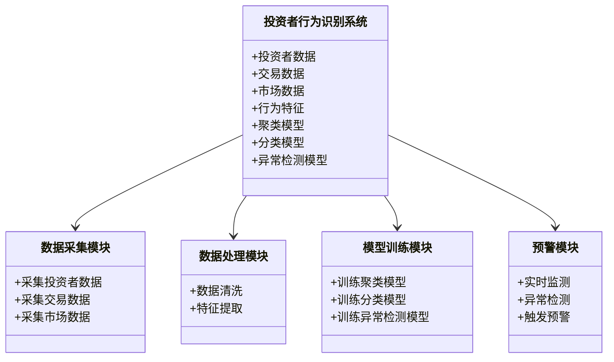

                 


# AI驱动的投资者行为模式识别与异常预警

## 关键词：
AI技术、投资者行为、模式识别、异常预警、机器学习、深度学习

## 摘要：
本文系统地探讨了AI技术在投资者行为模式识别与异常预警中的应用。通过分析投资者行为模式的特征，结合机器学习和深度学习算法，提出了基于聚类、分类和深度学习模型的解决方案。文章详细阐述了算法原理、系统架构设计及实现方案，并通过实际案例展示了AI技术在投资者行为分析中的实际应用，为相关领域的研究和实践提供了有价值的参考。

---

## 第1章: 背景与概述

### 1.1 投资者行为分析的背景
#### 1.1.1 传统投资者行为分析的局限性
传统投资者行为分析主要依赖于人工观察和经验判断，存在以下问题：
- **主观性**：分析结果受到分析师主观判断的影响。
- **低效性**：面对海量数据时，人工分析效率低下。
- **滞后性**：难以实时捕捉投资者行为的动态变化。
- **有限性**：难以发现复杂模式和隐含关联。

#### 1.1.2 AI技术在投资者行为分析中的优势
AI技术通过机器学习、深度学习等方法，能够高效地处理海量数据，发现潜在规律，具有以下优势：
- **高效性**：自动化处理大量数据，提高分析效率。
- **准确性**：通过模型学习，减少人为误差。
- **实时性**：能够实时监测投资者行为，及时发现异常。
- **扩展性**：支持多维度、多层次的行为分析。

#### 1.1.3 当前市场环境下的需求
在当前金融市场中，投资者行为的复杂性和不确定性增加，传统方法已难以满足需求。AI技术的应用能够帮助机构更好地理解投资者行为，优化投资策略，降低风险。

### 1.2 问题背景与目标
#### 1.2.1 投资者行为模式识别的必要性
投资者行为模式识别能够帮助机构理解不同类型投资者的行为特征，例如：
- **情绪化交易者**：容易受市场情绪影响，交易频繁。
- **理性投资者**：基于基本面分析，交易策略稳定。
- **羊群效应者**：跟随市场潮流，容易出现跟风或恐慌性抛售。

#### 1.2.2 异常行为预警的现实意义
投资者的异常行为可能引发市场波动，例如：
- **杠杆交易者**：过度杠杆可能导致市场剧烈波动。
- **内幕交易者**：可能破坏市场公平性。
- **恐慌性抛售**：可能引发市场崩盘。

通过识别异常行为，机构可以提前采取措施，降低市场风险。

#### 1.2.3 本书的研究目标
本书旨在通过AI技术，构建投资者行为模式识别与异常预警系统，具体目标包括：
- **识别投资者行为模式**：基于交易数据，提取行为特征，分类投资者类型。
- **建立异常行为预警机制**：通过实时监测，识别潜在风险。
- **实现系统化解决方案**：从数据采集、特征提取、模型训练到预警触发，提供完整的系统架构。

---

## 第2章: 投资者行为模式识别的核心概念

### 2.1 投资者行为模式的定义与分类
#### 2.1.1 行为模式的定义
投资者行为模式是指投资者在特定市场条件下表现出的交易习惯、决策风格和行为特征。这些模式可以通过交易数据（如交易频率、交易时间、交易金额）和市场数据（如价格波动、市场情绪）进行建模和识别。

#### 2.1.2 常见的投资者行为类型
以下是常见的投资者行为类型：
1. **情绪化投资者**：交易行为受市场情绪影响较大。
2. **理性投资者**：基于基本面分析进行交易。
3. **短期交易者**：频繁进行短线交易。
4. **长期投资者**：注重长期价值，交易频率低。
5. **羊群效应者**：跟随市场潮流进行交易。

#### 2.1.3 行为模式的特征分析
投资者行为模式的特征可以从以下几个维度进行分析：
- **交易频率**：高频交易者与低频交易者的区别。
- **交易时间**：集中交易时间段 vs 分散交易。
- **交易金额**：大额交易 vs 小额交易。
- **市场敏感性**：对价格波动的反应速度。

### 2.2 异常行为预警的定义与机制
#### 2.2.1 异常行为的定义
异常行为是指投资者的交易行为偏离正常模式，可能对市场造成负面影响。例如：
- **异常交易量**：短时间内大量买入或卖出某只股票。
- **异常价格波动**：交易行为导致价格异常波动。
- **异常交易时间**：在非交易时间段进行交易。

#### 2.2.2 异常行为预警的机制
异常行为预警机制包括以下步骤：
1. **数据采集**：实时采集投资者的交易数据。
2. **特征提取**：提取交易行为的特征。
3. **异常检测**：通过算法识别异常行为。
4. **预警触发**：当异常行为达到预设阈值时，触发预警。

#### 2.2.3 异常行为的分类与影响
异常行为可以分为以下几类：
1. **市场操纵**：通过虚假交易操纵市场价格。
2. **内幕交易**：利用未公开信息进行交易。
3. **恐慌性抛售**：投资者因恐慌大量抛售资产。
4. **杠杆交易失控**：杠杆过高导致强制平仓。

### 2.3 投资者行为模式识别与异常预警的关系
#### 2.3.1 识别与预警的逻辑关系
投资者行为模式识别是异常预警的基础。通过识别正常行为模式，可以建立异常行为的判断标准。

#### 2.3.2 数据驱动与规则驱动的结合
- **数据驱动**：基于历史数据训练模型，识别模式。
- **规则驱动**：基于市场规则和经验，设定预警阈值。

#### 2.3.3 系统化识别与实时预警的特点
系统化识别具有以下特点：
- **实时性**：能够实时监测投资者行为。
- **动态性**：根据市场变化动态调整识别模型。
- **可扩展性**：支持大规模数据处理。

---

## 第3章: 核心概念与联系

### 3.1 投资者行为模式识别的核心原理
#### 3.1.1 数据驱动的模式识别方法
数据驱动的方法通过机器学习算法，从数据中学习投资者行为模式。常用算法包括：
- **聚类分析**：将投资者分为不同类别。
- **分类算法**：根据特征将投资者分类。
- **深度学习**：通过神经网络提取特征。

#### 3.1.2 基于行为特征的模式识别
行为特征包括：
- **交易频率**：高频 vs 低频。
- **交易时间**：集中 vs 分散。
- **交易金额**：大额 vs 小额。

#### 3.1.3 AI技术在模式识别中的应用
AI技术通过以下方式实现模式识别：
- **特征提取**：提取交易行为特征。
- **模型训练**：训练分类器识别模式。
- **实时监测**：实时分析交易数据。

### 3.2 异常行为预警的系统架构
#### 3.2.1 数据采集与预处理
数据来源包括：
- **交易数据**：包括订单、成交、持仓数据。
- **市场数据**：包括价格、成交量、市场指数。

#### 3.2.2 行为特征提取
特征提取步骤：
1. **数据清洗**：处理缺失值和异常值。
2. **特征选择**：选择对行为识别有影响力的特征。
3. **特征工程**：构建有意义的特征组合。

#### 3.2.3 异常检测算法
常用异常检测算法：
- **基于聚类的异常检测**：如DBSCAN。
- **基于分类的异常检测**：如随机森林。
- **基于深度学习的异常检测**：如AE（自编码器）。

#### 3.2.4 预警触发机制
预警触发机制包括：
1. **阈值设定**：设定异常行为的触发条件。
2. **实时监控**：实时分析交易数据。
3. **预警通知**：通过邮件、短信等方式通知相关人员。

---

## 第4章: 算法原理与数学模型

### 4.1 基于聚类算法的投资者行为模式识别
#### 4.1.1 聚类算法原理
聚类是一种无监督学习方法，用于将数据分成若干类别。常用算法包括K-means、DBSCAN等。

#### 4.1.2 聚类算法实现
以下是一个基于K-means算法的实现示例：

```python
from sklearn.cluster import KMeans
import pandas as pd

# 假设我们有一个包含投资者行为特征的数据集
data = pd.DataFrame({
    '交易频率': [0.2, 0.5, 0.8, 0.3, 0.6],
    '交易金额': [1000, 2000, 1500, 500, 1800]
})

# 使用K-means进行聚类
kmeans = KMeans(n_clusters=2, random_state=0)
kmeans.fit(data)

# 获取聚类结果
labels = kmeans.labels_
print(labels)
```

#### 4.1.3 聚类算法的优缺点
- **优点**：简单高效，适用于数据分布不明确的情况。
- **缺点**：需要预先设定簇的数量，对噪声敏感。

---

## 第5章: 系统分析与架构设计

### 5.1 系统功能设计
#### 5.1.1 领域模型
以下是一个领域模型的Mermaid类图：



---

## 第6章: 项目实战

### 6.1 环境安装
- **Python版本**：建议使用Python 3.8及以上。
- **依赖库安装**：
  ```bash
  pip install numpy pandas scikit-learn tensorflow matplotlib
  ```

### 6.2 核心代码实现
#### 6.2.1 数据预处理
```python
import pandas as pd
import numpy as np

# 生成模拟数据
data = pd.DataFrame({
    '交易频率': np.random.uniform(0.1, 0.9, 100),
    '交易金额': np.random.normal(1000, 500, 100),
    '市场情绪': np.random.randint(1, 5, 100)
})
```

#### 6.2.2 模型训练
```python
from sklearn.cluster import KMeans
from sklearn.ensemble import RandomForestClassifier
from tensorflow.keras import layers

# 聚类模型
kmeans = KMeans(n_clusters=3, random_state=0)
kmeans.fit(data[['交易频率', '交易金额']])

# 分类模型
rf = RandomForestClassifier(n_estimators=100, random_state=0)
rf.fit(data[['交易频率', '交易金额', '市场情绪']], data['投资者类型'].values)

# 异常检测模型（简单AE示例）
model = tf.keras.Sequential()
model.add(layers.Dense(64, activation='relu', input_shape=(3,)))
model.add(layers.Dense(1, activation='sigmoid'))
model.compile(optimizer='adam', loss='binary_crossentropy')
model.fit(data[['交易频率', '交易金额', '市场情绪']], data['异常行为'].values, epochs=10, batch_size=32)
```

#### 6.2.3 实际案例分析
以下是一个实际案例分析：
```python
# 假设我们有一个投资者的交易数据
test_data = pd.DataFrame({
    '交易频率': [0.6],
    '交易金额': [1500],
    '市场情绪': [3]
})

# 预测投资者类型
predicted_type = rf.predict(test_data[['交易频率', '交易金额', '市场情绪']])
print(predicted_type)
```

---

## 第7章: 最佳实践

### 7.1 小结
通过AI技术，投资者行为模式识别与异常预警系统能够实现：
- **精准识别**：准确分类投资者行为类型。
- **实时监测**：快速发现异常行为。
- **降低风险**：提前预警潜在风险。

### 7.2 注意事项
- **数据质量**：数据质量直接影响模型效果。
- **模型更新**：需要定期更新模型，以适应市场变化。
- **隐私保护**：投资者数据可能涉及隐私问题。

### 7.3 拓展阅读
- **相关书籍**：《机器学习实战》、《深度学习入门》。
- **论文推荐**：《基于深度学习的投资者行为分析》、《AI驱动的金融市场异常检测》。

---

## 作者：AI天才研究院 & 禅与计算机程序设计艺术

---

以上是《AI驱动的投资者行为模式识别与异常预警》的完整目录和内容概览。如果需要进一步展开某个部分或添加更多细节，请随时告知！

