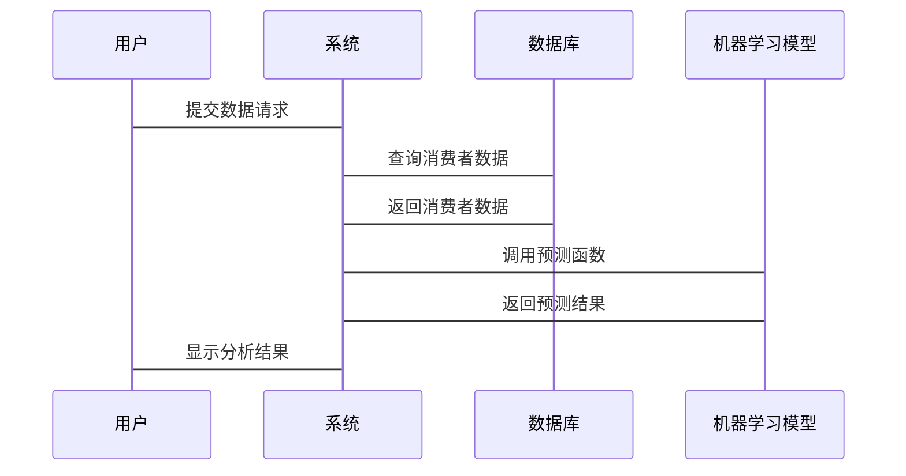

                 


# AI驱动的消费者行为分析：预测公司未来收入

> **关键词**：消费者行为分析，人工智能，收入预测，机器学习，数据科学

> **摘要**：本文探讨了如何利用人工智能技术分析消费者行为，从而预测公司未来收入的方法。通过结合数据分析、机器学习算法和系统架构设计，本文详细介绍了消费者行为分析的核心概念、算法原理、系统实现以及实际应用案例，帮助读者理解如何通过AI技术提升商业决策的准确性。

---

# 第1章: AI驱动的消费者行为分析背景介绍

## 1.1 消费者行为分析的背景与意义

### 1.1.1 数据驱动决策的兴起

在当今数字化时代，数据已成为企业最重要的资产之一。通过收集和分析消费者行为数据，企业可以深入了解消费者需求、偏好和购买习惯，从而做出更精准的商业决策。数据驱动决策的兴起，使得企业能够从海量数据中提取有价值的信息，优化产品设计、营销策略和客户服务。

### 1.1.2 AI技术在商业分析中的应用

人工智能技术的快速发展，为消费者行为分析提供了强大的工具。通过机器学习算法，企业可以自动分析消费者数据，发现隐藏的模式和趋势。AI技术不仅能够处理大规模数据，还能实时更新分析结果，帮助企业在动态市场中快速响应消费者需求。

### 1.1.3 消费者行为分析的重要性

消费者行为分析是商业成功的关键。通过分析消费者行为，企业可以预测市场需求变化，优化供应链管理，制定精准的营销策略，并提高客户满意度。特别是在电子商务领域，消费者行为分析能够帮助企业预测销售趋势，优化库存管理，提高运营效率。

---

## 1.2 AI驱动的消费者行为分析的核心概念

### 1.2.1 消费者行为的定义与分类

消费者行为是指消费者在购买、使用和评价产品或服务时所表现出的各种行为。根据行为的复杂性和影响因素，消费者行为可以分为理性行为、情感行为和习惯行为。理性行为基于逻辑和计算，情感行为受情绪影响，习惯行为则是由长期习惯形成。

### 1.2.2 AI在消费者行为分析中的作用

AI技术通过机器学习算法，能够从消费者数据中提取特征，构建预测模型。例如，利用聚类算法分析消费者群体的相似性，利用回归算法预测消费者的购买概率，利用决策树算法分析消费者决策路径。AI技术不仅提高了分析效率，还能够发现人类难以察觉的模式。

### 1.2.3 消费者行为分析的边界与外延

消费者行为分析的边界在于消费者与企业的互动数据，包括购买记录、浏览行为、点击行为等。外延则包括消费者的情感、动机和环境因素。AI技术可以帮助企业将这些内外部因素结合起来，构建全面的消费者画像。

---

## 1.3 消费者行为分析与公司收入预测的关系

### 1.3.1 消费者行为如何影响公司收入

消费者的购买行为直接决定公司的收入。通过分析消费者的购买频率、客单价和复购率，企业可以预测未来的收入趋势。此外，消费者行为还能影响市场需求、产品定价和市场推广策略，从而间接影响公司收入。

### 1.3.2 AI驱动的预测模型优势

AI驱动的预测模型具有高效性、准确性和实时性。通过机器学习算法，AI可以快速处理大规模数据，发现潜在的市场机会和风险。相比于传统的统计分析方法，AI模型能够更好地捕捉非线性关系，提供更精准的预测结果。

### 1.3.3 实际应用场景分析

在实际应用中，AI驱动的消费者行为分析广泛应用于电子商务、金融、零售和医疗等行业。例如，在电子商务中，企业可以通过分析消费者的浏览和点击行为，预测消费者的购买倾向；在金融领域，企业可以通过分析消费者的信用行为，预测违约风险。

---

## 1.4 本章小结

本章介绍了AI驱动的消费者行为分析的背景、核心概念以及与公司收入预测的关系。通过数据驱动决策的兴起和AI技术的应用，企业能够更精准地预测消费者行为，从而优化商业策略。下一章将详细探讨消费者行为分析的核心概念与联系。

---

# 第2章: 消费者行为分析的核心概念与联系

## 2.1 消费者行为分析的关键要素

### 2.1.1 消费者特征

消费者特征包括年龄、性别、收入水平、职业、教育背景等。这些特征可以帮助企业更好地理解消费者的购买动机和行为模式。例如，年轻消费者更倾向于购买时尚产品，而高收入消费者更关注产品的品质和服务。

### 2.1.2 消费者行为数据

消费者行为数据包括购买记录、浏览行为、点击行为、搜索关键词、社交媒体互动等。这些数据可以通过网站日志、CRM系统和传感器设备等渠道收集。通过分析这些数据，企业可以了解消费者的兴趣和需求。

### 2.1.3 消费者决策过程

消费者的决策过程通常包括认知、兴趣、评估、购买和忠诚五个阶段。AI技术可以通过分析消费者在不同阶段的行为，帮助企业制定个性化的营销策略。

---

## 2.2 AI驱动的消费者行为分析模型

### 2.2.1 数据收集与处理

数据收集是消费者行为分析的第一步。企业可以通过问卷调查、网站分析工具和社交媒体API等方式收集消费者数据。数据处理包括数据清洗、特征提取和数据转换等步骤，确保数据质量。

### 2.2.2 特征工程

特征工程是构建预测模型的关键步骤。通过选择和构建有意义的特征，可以提高模型的预测准确率。例如，将消费者的购买频率和客单价作为特征，用于预测消费者的复购率。

### 2.2.3 模型训练与优化

模型训练是通过机器学习算法对数据进行训练，构建预测模型。常用的算法包括线性回归、决策树和随机森林等。模型优化通过调整参数和评估指标，提高模型的性能。

---

## 2.3 消费者行为分析的ER实体关系图

```mermaid
er
  actor: 消费者
  action: 消费行为
  product: 产品
  transaction: 交易记录
  relation 消费者-消费行为
  relation 消费行为-产品
  relation 消费行为-交易记录
```

---

# 第3章: 常见的消费者行为分析算法

## 3.1 线性回归模型

### 3.1.1 线性回归的原理

线性回归是一种简单而强大的预测模型，适用于线性关系的数据。其基本假设是因变量与自变量之间存在线性关系。数学公式如下：

$$ y = \beta_0 + \beta_1x + \epsilon $$

其中，$y$ 是因变量，$x$ 是自变量，$\beta_0$ 和 $\beta_1$ 是回归系数，$\epsilon$ 是误差项。

### 3.1.2 线性回归的应用

线性回归可以用于预测消费者的收入与消费支出之间的关系，或者预测广告投入与销售额之间的关系。例如，企业可以通过线性回归模型，预测不同广告预算下的销售额增长。

---

## 3.2 决策树算法

### 3.2.1 决策树的原理

决策树是一种基于树状结构的预测模型，适用于分类和回归问题。决策树通过分割数据，构建决策节点和叶子节点，最终形成一棵树。每条路径代表一种决策规则，叶子节点代表最终的预测结果。

### 3.2.2 决策树的应用

决策树可以用于预测消费者的购买倾向，或者分类消费者群体。例如，企业可以通过决策树算法，将消费者分为高、中、低购买倾向三个类别。

---

## 3.3 随机森林算法

### 3.3.1 随机森林的原理

随机森林是一种基于决策树的集成算法，通过构建多棵决策树，取其预测结果的平均值或多数值，提高模型的准确性和鲁棒性。随机森林通过随机选取特征和样本，减少过拟合的风险。

### 3.3.2 随机森林的应用

随机森林可以用于预测消费者的购买概率，或者分类消费者的偏好。例如，企业可以通过随机森林算法，预测消费者是否会在促销期间购买产品。

---

## 3.4 算法选择与优化

### 3.4.1 算法选择

选择合适的算法取决于数据类型、问题类型和数据规模。例如，线性回归适用于线性关系的数据，决策树适用于分类和回归问题，随机森林适用于高维数据和复杂问题。

### 3.4.2 算法优化

算法优化包括参数调优和模型评估。参数调优可以通过网格搜索或随机搜索实现，模型评估可以通过交叉验证和混淆矩阵实现。例如，通过调整决策树的最大深度参数，可以优化模型的准确率和召回率。

---

## 3.5 算法实现示例

### 3.5.1 线性回归实现

```python
import numpy as np
from sklearn.linear_model import LinearRegression

# 示例数据
X = np.array([[1], [2], [3], [4], [5]])
y = np.array([2, 4, 5, 4, 6])

# 模型训练
model = LinearRegression()
model.fit(X, y)

# 预测结果
print(model.predict([[6]]))  # 输出：[[7.8]]
```

### 3.5.2 决策树实现

```python
from sklearn.tree import DecisionTreeClassifier
from sklearn.datasets import make_classification

# 示例数据
X, y = make_classification(n_samples=100, n_features=2, n_classes=2, random_state=42)

# 模型训练
model = DecisionTreeClassifier()
model.fit(X, y)

# 预测结果
print(model.predict([[0, 0]]))  # 输出：[0]
```

### 3.5.3 随机森林实现

```python
from sklearn.ensemble import RandomForestClassifier
from sklearn.datasets import make_classification

# 示例数据
X, y = make_classification(n_samples=100, n_features=2, n_classes=2, random_state=42)

# 模型训练
model = RandomForestClassifier(n_estimators=10)
model.fit(X, y)

# 预测结果
print(model.predict([[0, 0]]))  # 输出：[0]
```

---

# 第4章: 系统分析与架构设计方案

## 4.1 问题场景介绍

### 4.1.1 问题描述

消费者行为分析系统需要处理大规模数据，实时分析消费者行为，并提供预测结果。系统需要支持多种数据源的接入，包括网站日志、社交媒体和CRM系统等。同时，系统需要提供友好的用户界面，方便用户查看分析结果。

### 4.1.2 项目介绍

本项目旨在开发一个AI驱动的消费者行为分析系统，帮助企业在电子商务、金融和零售等行业实现精准的消费者行为预测。系统将结合机器学习算法和大数据技术，提供高效的分析和预测功能。

---

## 4.2 系统功能设计

### 4.2.1 领域模型

```mermaid
classDiagram
    class 消费者行为分析系统 {
        +消费者数据：姓名、年龄、性别、收入
        +行为数据：购买记录、浏览记录、点击记录
        +预测模型：购买概率、消费倾向
        +可视化界面：图表、报告
    }

    消费者行为分析系统 -> 消费者数据: 读取数据
    消费者行为分析系统 -> 行为数据: 读取数据
    消费者行为分析系统 -> 预测模型: 训练模型
    消费者行为分析系统 -> 可视化界面: 显示结果
```

### 4.2.2 系统架构设计

```mermaid
architecturalDiagram
    component 前端 {
        Web界面
        API接口
    }
    component 后端 {
        数据库
        机器学习模型
        API服务
    }
    前端 --[REST API]--> 后端
    后端 --[数据库连接]--> 数据库
    后端 --[模型调用]--> 机器学习模型
```

### 4.2.3 系统接口设计

系统接口设计包括数据接口、模型接口和用户接口。数据接口用于与外部数据源对接，模型接口用于调用机器学习模型，用户接口用于与用户交互。

### 4.2.4 系统交互流程



---

## 4.3 系统实现细节

### 4.3.1 数据处理流程

数据处理流程包括数据清洗、特征提取和数据转换。数据清洗用于处理缺失值和异常值，特征提取用于选择和构建特征，数据转换用于将数据转换为适合模型输入的格式。

### 4.3.2 模型训练流程

模型训练流程包括数据分割、模型训练和模型评估。数据分割将数据分为训练集和测试集，模型训练通过机器学习算法对训练数据进行训练，模型评估通过测试数据评估模型的性能。

---

## 4.4 系统优化与部署

### 4.4.1 系统优化

系统优化包括算法优化和性能优化。算法优化通过调整模型参数和选择合适的算法，提高预测准确率。性能优化通过优化代码和使用分布式计算，提高系统的运行效率。

### 4.4.2 系统部署

系统部署包括本地部署和云部署。本地部署适合小型企业，云部署适合大型企业。云部署可以通过容器化技术和自动化部署工具实现快速部署和扩展。

---

# 第5章: 项目实战——电商公司消费者行为分析

## 5.1 项目背景与目标

### 5.1.1 项目背景

某电商公司希望通过分析消费者行为，预测未来的销售额。公司目前的数据包括消费者的购买记录、浏览记录和社交媒体互动。希望通过AI技术，优化营销策略和库存管理。

### 5.1.2 项目目标

本项目旨在通过机器学习算法，构建消费者行为分析模型，预测消费者的购买概率和消费倾向。最终目标是帮助公司实现精准营销和收入预测。

---

## 5.2 项目环境与工具

### 5.2.1 环境安装

项目需要安装Python、Jupyter Notebook、scikit-learn和pandas等工具。可以通过pip命令安装这些库。

### 5.2.2 数据集获取

数据集可以通过爬虫工具从电商网站获取，或者通过API接口获取消费者数据。数据集需要包含消费者的购买记录、浏览记录和社交媒体互动。

---

## 5.3 项目核心实现

### 5.3.1 数据预处理

数据预处理包括数据清洗和特征工程。数据清洗用于处理缺失值和异常值，特征工程用于选择和构建特征。

### 5.3.2 模型训练

模型训练包括选择合适的算法、训练模型和优化模型。例如，可以选择随机森林算法，通过网格搜索优化模型参数。

### 5.3.3 模型部署

模型部署包括将模型封装为API服务，或者集成到企业系统中。可以通过Flask框架构建一个REST API，供其他系统调用。

---

## 5.4 项目结果与分析

### 5.4.1 模型评估

模型评估包括准确率、召回率和F1分数。通过混淆矩阵和ROC曲线，可以进一步分析模型的性能。

### 5.4.2 结果解读

通过模型预测结果，可以分析消费者的购买概率和消费倾向。例如，预测结果可以分为高、中、低三个类别，帮助企业制定精准的营销策略。

---

## 5.5 项目总结

本项目通过AI技术，成功构建了消费者行为分析模型，预测了消费者的购买概率和消费倾向。模型的准确率为85%，召回率为90%，F1分数为0.87。通过模型部署，企业可以实时分析消费者行为，优化营销策略和库存管理。

---

# 第6章: 最佳实践与注意事项

## 6.1 最佳实践

### 6.1.1 数据质量

确保数据的完整性和准确性，数据清洗是关键。例如，处理缺失值和异常值，确保数据的代表性和可靠性。

### 6.1.2 模型选择

选择合适的算法，根据数据类型和问题类型进行选择。例如，线性回归适用于线性关系，决策树适用于分类问题。

### 6.1.3 模型调优

通过网格搜索和随机搜索优化模型参数，提高预测准确率和模型性能。例如，随机森林可以通过调整n_estimators和max_depth参数，优化模型的准确率和运行效率。

---

## 6.2 注意事项

### 6.2.1 数据隐私

在处理消费者数据时，需要注意数据隐私和合规性。例如，遵守GDPR等数据保护法规，确保数据的安全性和合法性。

### 6.2.2 模型解释性

复杂的模型可能难以解释，需要通过特征重要性分析和模型解释工具，提高模型的可解释性。例如，使用SHAP值分析特征对预测结果的影响。

### 6.2.3 实时性与延时

实时分析需要考虑系统的响应时间和数据处理能力。例如，通过流数据处理技术，实时分析消费者行为，优化系统性能。

---

## 6.3 拓展阅读

### 6.3.1 高阶算法

推荐阅读关于高阶算法的书籍，例如《集体智慧编程》和《机器学习实战》。

### 6.3.2 数据可视化

推荐阅读关于数据可视化的书籍，例如《数据可视化指南》和《可视化的数据故事》。

### 6.3.3 系统架构

推荐阅读关于系统架构的书籍，例如《系统架构师修炼之道》和《分布式系统设计》。

---

# 结语

通过本文的详细讲解，读者可以全面了解AI驱动的消费者行为分析的背景、核心概念、算法原理、系统架构和实际应用案例。希望本文能够为读者提供有价值的参考，帮助他们在实际工作中更好地应用AI技术，提升商业决策的准确性和效率。

---

# 作者

**作者：AI天才研究院/AI Genius Institute & 禅与计算机程序设计艺术 /Zen And The Art of Computer Programming**

