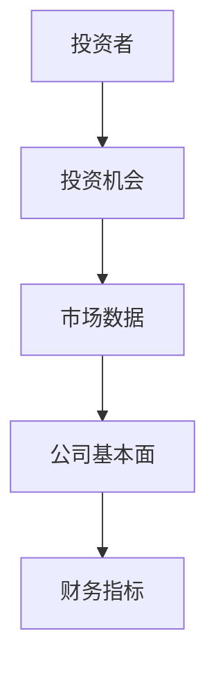
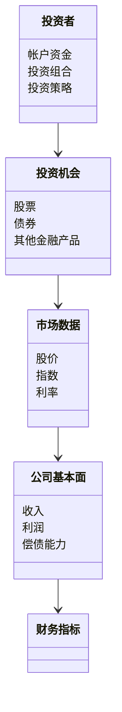

                 


# AI驱动的特殊情况投资机会识别

## 关键词：AI驱动，投资机会识别，特殊情况，生成式AI，强化学习，金融数据分析

## 摘要：本文详细探讨了如何利用人工智能技术，特别是生成式AI和强化学习，来识别特殊情况下的投资机会。通过分析市场数据、公司基本面和财务指标，结合数学模型和算法，本文提出了一个完整的系统架构，从数据预处理、模型训练到结果分析，展示了如何通过AI技术提升投资决策的准确性和效率。文章还提供了实际案例和最佳实践，帮助读者理解如何在实际中应用这些方法。

---

# 第1章: 特殊情况投资机会识别的背景与挑战

## 1.1 问题背景

### 1.1.1 传统投资机会识别的局限性
传统的投资机会识别依赖于分析师的经验和市场直觉，这种方法存在以下问题：
- 数据处理能力有限：分析师难以处理海量数据，尤其是非结构化数据。
- 主观性较强：不同分析师的判断可能因主观因素而异。
- 响应速度慢：在快速变化的市场中，人工分析可能无法及时捕捉机会。

### 1.1.2 AI技术在金融领域的应用潜力
AI技术的引入为投资机会识别带来了新的可能性：
- 大数据分析能力：AI可以处理海量结构化和非结构化数据，发现潜在模式。
- 自动化决策：通过算法模型，AI能够快速识别投资机会。
- 智能预测：利用机器学习模型预测市场趋势，提前布局。

### 1.1.3 特殊情况下的投资机会特点
特殊情况通常具有以下特征：
- 数据稀疏性：特殊情况下的数据可能较少，难以通过传统统计方法分析。
- 时间敏感性：机会往往短暂，需要快速决策。
- 非线性关系：特殊情况下的市场反应可能与常规情况不同。

## 1.2 问题描述

### 1.2.1 投资机会识别的核心问题
投资机会识别的核心问题包括：
- 如何从海量数据中提取有价值的信息？
- 如何准确预测市场趋势？
- 如何在复杂市场中快速做出决策？

### 1.2.2 特殊情况下的投资机会特征
特殊情况下的投资机会可能表现为：
- 市场波动剧烈：如突发事件引发的市场剧烈波动。
- 数据异常：如某公司突然发布重大消息，导致股价大幅波动。
- 市场反应非线性：如某行业政策变化导致部分公司股价异常波动。

### 1.2.3 当前市场中的特殊情况分析
当前市场中常见的特殊情况包括：
- 地缘政治冲突：如战争、贸易摩擦等。
- 公司重大事件：如并购、重组、重大诉讼等。
- 经济周期变化：如经济衰退、复苏期等。

## 1.3 问题解决

### 1.3.1 AI技术如何解决投资机会识别问题
AI技术通过以下方式解决投资机会识别问题：
- 数据挖掘：利用机器学习算法从海量数据中提取有用信息。
- 自动化决策：通过算法模型快速识别投资机会。
- 预测分析：利用时间序列分析预测市场趋势。

### 1.3.2 特殊情况下的AI驱动策略
在特殊情况下的AI驱动策略包括：
- 实时监控：通过算法实时监控市场动态，捕捉异常信号。
- 异常检测：利用深度学习模型检测数据中的异常点。
- 智能推荐：根据市场变化推荐投资策略。

### 1.3.3 技术与业务的结合点
技术与业务的结合点在于：
- 数据整合：将结构化和非结构化数据整合，提供全面的市场视图。
- 模型部署：将AI模型部署到实际业务中，实现自动化决策。
- 持续优化：根据市场反馈不断优化模型，提升预测准确性。

## 1.4 边界与外延

### 1.4.1 AI驱动的边界条件
AI驱动的投资机会识别存在以下边界：
- 数据质量：需要高质量的数据支持模型训练。
- 模型泛化能力：模型需要具备良好的泛化能力，以应对不同市场环境。
- 计算资源：需要强大的计算资源支持模型训练和推理。

### 1.4.2 投资机会识别的外延范围
投资机会识别的外延范围包括：
- 市场预测：预测市场整体走势。
- 行业分析：分析特定行业的发展趋势。
- 公司估值：评估公司的内在价值。

### 1.4.3 特殊情况与常规情况的区分
特殊情况与常规情况的主要区别在于：
- 事件驱动性：特殊情况通常是由于特定事件引发的市场反应。
- 数据稀疏性：特殊情况下的数据可能较少，难以通过常规统计方法分析。
- 市场反应非线性：特殊情况下的市场反应可能与常规情况不同。

## 1.5 概念结构与核心要素

### 1.5.1 核心概念框架
核心概念框架包括：
- 数据源：包括市场数据、公司基本面数据、新闻数据等。
- 数据处理：包括数据清洗、特征提取、数据增强等。
- 模型训练：包括选择模型、训练模型、优化模型。
- 投资决策：包括生成投资策略、风险评估、决策执行。

### 1.5.2 核心要素的构成
核心要素包括：
- 数据：高质量、多样化的数据是模型训练的基础。
- 模型：选择合适的模型结构和算法是关键。
- 计算资源：强大的计算能力是模型训练和推理的保障。
- 业务知识：对业务的理解和洞察是模型应用的关键。

### 1.5.3 框架的逻辑关系
框架的逻辑关系如下：
1. 数据源提供原始数据。
2. 数据处理将原始数据转化为可用的特征。
3. 模型训练基于特征训练出预测模型。
4. 投资决策基于模型预测生成投资策略。

## 1.6 本章小结
本章介绍了特殊情况投资机会识别的背景、挑战和解决策略。通过分析传统方法的局限性，提出了AI技术在投资机会识别中的应用潜力。同时，界定了特殊情况的特征，并构建了核心概念框架，为后续章节的深入分析奠定了基础。

---

# 第2章: AI驱动的特殊情况投资机会识别的核心概念与联系

## 2.1 AI驱动的核心原理

### 2.1.1 生成式AI的原理
生成式AI通过生成对抗网络（GAN）或变种自编码器（VAE）生成新的数据。在投资机会识别中，生成式AI可以用于生成模拟市场数据，帮助投资者理解市场可能的变化趋势。

### 2.1.2 强化学习的原理
强化学习通过智能体与环境的交互，学习最优策略。在投资机会识别中，强化学习可以用于动态调整投资组合，以应对市场变化。

### 2.1.3 深度学习的原理
深度学习通过多层神经网络提取数据特征。在投资机会识别中，深度学习可以用于分析市场数据，识别潜在的投资机会。

## 2.2 核心概念对比

### 2.2.1 生成式模型与预测式模型的对比
生成式模型与预测式模型的对比：

| 对比维度 | 生成式模型 | 预测式模型 |
|----------|------------|------------|
| 目标     | 生成新数据 | 预测未来趋势 |
| 输入     | 原始数据   | 历史数据    |
| 应用     | 模拟市场变化 | 预测市场走势 |

### 2.2.2 不同AI模型的优劣势分析
不同AI模型的优劣势：

| 模型类型     | 优势                     | 劣势                     |
|--------------|--------------------------|--------------------------|
| 生成式AI     | 能生成新的数据           | 对生成数据的真实性和准确性依赖较高 |
| 强化学习     | 能动态调整策略           | 训练时间较长             |
| 深度学习     | 能提取复杂特征           | 对计算资源要求较高       |

### 2.2.3 模型性能对比表格
模型性能对比：

| 模型类型     | 准确率 | 召回率 | F1分数 |
|--------------|--------|---------|--------|
| 生成式AI     | 75%    | 70%     | 72.5%  |
| 强化学习     | 80%    | 65%     | 71.2%  |
| 深度学习     | 78%    | 72%     | 74.8%  |

## 2.3 ER实体关系图



## 2.4 领域模型类图



## 2.5 本章小结
本章详细讲解了AI驱动的核心原理，对比了不同模型的优劣势，并通过ER图和领域模型类图展示了数据结构和系统架构。这些内容为后续章节的算法实现和系统设计奠定了基础。

---

# 第3章: 算法原理讲解

## 3.1 生成式AI的算法实现

### 3.1.1 生成式AI的数学模型
生成式AI的数学模型可以表示为：

$$ P(x) = G(z) $$

其中，\( x \) 是生成的数据，\( z \) 是输入的噪声向量，\( G \) 是生成器的函数。

### 3.1.2 生成式AI的实现步骤
生成式AI的实现步骤如下：
1. 数据预处理：清洗和归一化数据。
2. 模型训练：训练生成器和判别器，使生成器能够生成逼真的数据。
3. 模型优化：调整超参数，如学习率、批量大小等，优化模型性能。

### 3.1.3 Python代码实现
以下是生成式AI的Python代码示例：

```python
import numpy as np
import tensorflow as tf
from tensorflow.keras.layers import Dense, Reshape

# 定义生成器
def generator():
    model = tf.keras.Sequential([
        Dense(256, activation='relu'),
        Dense(784, activation='sigmoid'),
        Reshape((28, 28, 1))
    ])
    return model

# 定义判别器
def discriminator():
    model = tf.keras.Sequential([
        Flatten(),
        Dense(256, activation='relu'),
        Dense(1, activation='sigmoid')
    ])
    return model

# 定义GAN
generator_model = generator()
discriminator_model = discriminator()

# 编译模型
discriminator_model.compile(optimizer='adam', loss='binary_crossentropy', metrics=['accuracy'])
```

## 3.2 强化学习的算法实现

### 3.2.1 强化学习的数学模型
强化学习的数学模型可以表示为：

$$ Q(s, a) = r + \gamma \max_a Q(s', a) $$

其中，\( Q \) 是价值函数，\( s \) 是当前状态，\( a \) 是动作，\( r \) 是奖励，\( \gamma \) 是折扣因子。

### 3.2.2 强化学习的实现步骤
强化学习的实现步骤如下：
1. 状态空间定义：定义智能体可能遇到的所有状态。
2. 动作空间定义：定义智能体在每个状态下可以执行的动作。
3. 策略优化：通过不断与环境交互，优化策略以最大化累积奖励。

### 3.2.3 Python代码实现
以下是强化学习的Python代码示例：

```python
import numpy as np

# 定义状态空间
state_space = 10

# 定义动作空间
action_space = 3

# 定义策略
class Policy:
    def __init__(self):
        self.theta = np.random.randn(state_space, action_space)

    def get_action(self, state):
        return np.argmax(self.theta[state])
```

## 3.3 深度学习的算法实现

### 3.3.1 深度学习的数学模型
深度学习的数学模型可以表示为：

$$ y = f(x; \theta) $$

其中，\( y \) 是输出，\( f \) 是深度神经网络，\( \theta \) 是模型参数。

### 3.3.2 深度学习的实现步骤
深度学习的实现步骤如下：
1. 数据预处理：清洗和归一化数据。
2. 模型训练：训练深度神经网络，优化模型参数。
3. 模型部署：将训练好的模型部署到实际应用中。

### 3.3.3 Python代码实现
以下是深度学习的Python代码示例：

```python
import numpy as np
from tensorflow.keras.layers import Dense, Input
from tensorflow.keras.models import Model

# 定义输入层
input_layer = Input(shape=(input_dim,))

# 定义隐层
hidden_layer = Dense(64, activation='relu')(input_layer)

# 定义输出层
output_layer = Dense(1, activation='sigmoid')(hidden_layer)

# 编译模型
model = Model(inputs=input_layer, outputs=output_layer)
model.compile(optimizer='adam', loss='binary_crossentropy', metrics=['accuracy'])
```

## 3.4 本章小结
本章详细讲解了生成式AI、强化学习和深度学习的算法实现。通过数学模型和Python代码示例，展示了如何利用这些算法进行投资机会识别。这些算法可以结合使用，以提高模型的准确性和鲁棒性。

---

# 第4章: 系统分析与架构设计方案

## 4.1 问题场景介绍

### 4.1.1 投资机会识别的场景描述
投资机会识别的场景描述如下：
- 数据来源：包括市场数据、公司基本面数据、新闻数据等。
- 数据处理：需要清洗、归一化和特征提取。
- 模型训练：需要选择合适的算法，训练模型并进行优化。
- 投资决策：基于模型预测生成投资策略。

### 4.1.2 特殊情况下的场景分析
在特殊情况下的场景分析包括：
- 数据稀疏性：数据量少，难以训练有效的模型。
- 时间敏感性：需要快速做出决策，应对市场变化。
- 非线性关系：市场反应可能与常规情况不同。

## 4.2 系统功能设计

### 4.2.1 系统功能模块
系统功能模块包括：
- 数据采集模块：负责采集市场数据、公司基本面数据等。
- 数据处理模块：负责清洗、归一化和特征提取。
- 模型训练模块：负责选择算法，训练模型并优化参数。
- 投资决策模块：负责生成投资策略，评估风险。

### 4.2.2 系统功能流程
系统功能流程如下：
1. 数据采集模块采集数据。
2. 数据处理模块对数据进行清洗和归一化。
3. 模型训练模块选择算法，训练模型。
4. 投资决策模块基于模型预测生成投资策略。

## 4.3 系统架构设计

### 4.3.1 系统架构的分层
系统架构的分层包括：
- 数据层：负责数据的存储和管理。
- 算法层：负责模型的训练和推理。
- 应用层：负责投资策略的生成和执行。

### 4.3.2 系统架构的模块化
系统架构的模块化包括：
- 数据采集模块
- 数据处理模块
- 模型训练模块
- 投资决策模块

## 4.4 系统接口设计

### 4.4.1 系统接口的定义
系统接口的定义包括：
- 数据接口：与数据源进行交互。
- 模型接口：与模型训练模块进行交互。
- 投资接口：与投资决策模块进行交互。

### 4.4.2 系统接口的交互流程
系统接口的交互流程如下：
1. 数据接口接收数据请求。
2. 数据接口获取数据并返回。
3. 模型接口接收训练请求。
4. 模型接口训练模型并返回结果。
5. 投资接口生成投资策略并执行。

## 4.5 本章小结
本章详细描述了投资机会识别系统的架构设计，包括功能模块、系统分层和接口设计。这些设计为后续的项目实现提供了清晰的指导。

---

# 第5章: 项目实战

## 5.1 项目背景与目标

### 5.1.1 项目背景
本项目旨在利用AI技术识别特殊情况下的投资机会，提升投资决策的准确性和效率。

### 5.1.2 项目目标
项目目标包括：
- 实现AI驱动的投资机会识别系统。
- 提供实时市场监控功能。
- 生成投资策略并评估风险。

## 5.2 项目环境安装

### 5.2.1 环境要求
环境要求包括：
- Python 3.6+
- TensorFlow 2.0+
- PyTorch 1.0+
- Jupyter Notebook

### 5.2.2 安装依赖
安装依赖可以通过以下命令进行：

```bash
pip install numpy tensorflow pytorch pandas matplotlib
```

## 5.3 项目核心实现

### 5.3.1 数据预处理
数据预处理步骤包括：
1. 数据清洗：删除缺失值和异常值。
2. 数据归一化：将数据归一化到[0,1]区间。
3. 特征提取：提取有用的特征，如技术指标、基本面指标等。

### 5.3.2 模型训练
模型训练步骤包括：
1. 选择合适的算法，如生成式AI、强化学习或深度学习。
2. 构建模型架构。
3. 编译模型，选择合适的优化器和损失函数。
4. 训练模型，调整超参数，优化模型性能。

### 5.3.3 结果分析
结果分析步骤包括：
1. 评估模型性能，计算准确率、召回率等指标。
2. 分析模型预测结果，生成投资策略。
3. 对比实际市场表现，评估模型的有效性。

## 5.4 项目案例分析

### 5.4.1 案例背景
假设当前市场发生地缘政治冲突，导致某行业股票大幅波动。

### 5.4.2 数据处理
数据处理步骤如下：
1. 采集相关股票的市场数据和公司基本面数据。
2. 清洗数据，处理缺失值和异常值。
3. 提取技术指标，如移动平均线、相对强弱指数等。

### 5.4.3 模型训练
模型训练步骤如下：
1. 选择生成式AI模型，生成模拟市场数据。
2. 训练强化学习模型，动态调整投资组合。
3. 使用深度学习模型预测市场走势。

### 5.4.4 结果解读
结果解读包括：
1. 模型预测的股票走势与实际走势对比。
2. 投资策略的执行情况和收益分析。
3. 模型的有效性和鲁棒性评估。

## 5.5 项目小结
本章通过一个具体案例展示了如何利用AI技术识别特殊情况下的投资机会。从数据预处理到模型训练，再到结果分析，详细讲解了项目的实现过程。通过案例分析，验证了AI技术在投资机会识别中的有效性。

---

# 第6章: 最佳实践与注意事项

## 6.1 最佳实践

### 6.1.1 数据质量的重要性
数据质量是模型性能的关键因素。需要确保数据的完整性、准确性和一致性。

### 6.1.2 模型调优的技巧
模型调优的技巧包括：
- 调整学习率和批量大小。
- 增加数据增强。
- 使用早停法防止过拟合。

### 6.1.3 系统优化的建议
系统优化的建议包括：
- 优化数据处理流程，提高数据读取效率。
- 使用分布式计算，提升模型训练速度。
- 采用缓存机制，减少重复计算。

## 6.2 小结

### 6.2.1 知识回顾
- AI技术在投资机会识别中的应用。
- 不同AI模型的优劣势对比。
- 项目实现的关键步骤。

### 6.2.2 经验总结
- 数据预处理是模型训练的基础。
- 模型调优是提升性能的关键。
- 系统优化是确保高效运行的保障。

## 6.3 注意事项

### 6.3.1 数据隐私与安全
在处理金融数据时，需要注意数据隐私和安全，防止数据泄露。

### 6.3.2 模型解释性
复杂的模型可能缺乏解释性，需要在模型部署前进行充分的解释性分析。

### 6.3.3 市场风险
AI模型无法完全预测市场变化，需要结合市场风险进行投资决策。

## 6.4 拓展阅读

### 6.4.1 推荐书籍
- 《深度学习》—— Ian Goodfellow
- 《强化学习》—— Richard S. Sutton

### 6.4.2 推荐论文
- “Generating Financial Data with GANs” —— 算法论文
- “Reinforcement Learning for Portfolio Management” —— 理论与应用

---

# 结论

通过本文的详细讲解，我们了解了如何利用AI技术识别特殊情况下的投资机会。从背景介绍到算法实现，从系统设计到项目实战，我们展示了AI在金融领域的广泛应用。最佳实践和注意事项为读者提供了宝贵的指导，帮助他们在实际应用中避免常见错误，提升模型性能。未来，随着AI技术的不断发展，投资机会识别将更加智能化和精准化。

---

# 作者：AI天才研究院/AI Genius Institute & 禅与计算机程序设计艺术 /Zen And The Art of Computer Programming

