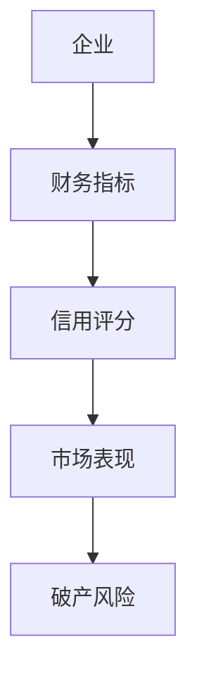
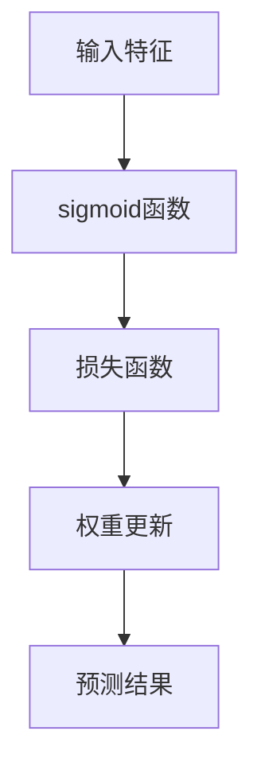
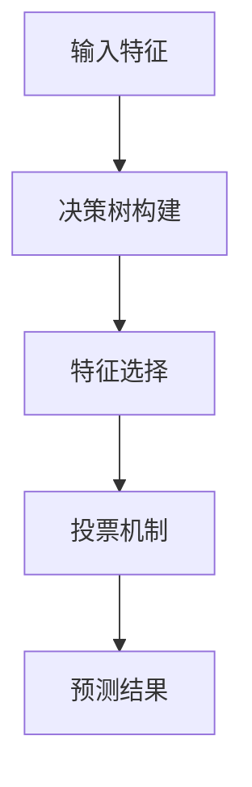
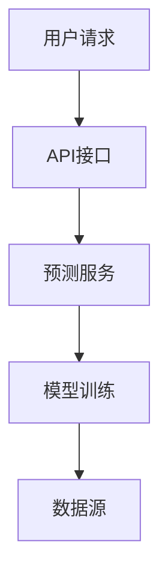
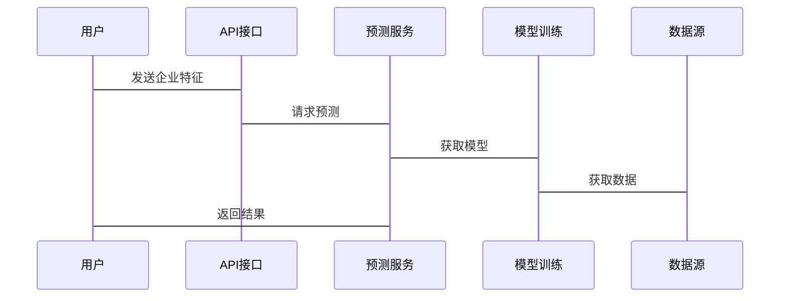

                 


# AI驱动的破产风险预测：增强价值投资的安全性

> 关键词：AI技术、破产风险预测、价值投资、风险管理、机器学习、金融分析

> 摘要：本文深入探讨了如何利用人工智能技术进行企业破产风险预测，以增强价值投资的安全性。通过分析AI驱动的破产预测模型的核心原理、算法实现和系统架构，结合实际项目案例，展示了如何利用AI技术提升风险管理能力，为投资者提供更可靠的投资决策支持。

---

## 第一部分: 破产风险预测的背景与基础

## 第1章: 研究背景与问题定义

### 1.1 研究背景
#### 1.1.1 破产风险预测的定义与意义
破产风险预测是通过对企业的财务数据、市场表现、经营状况等多维度信息进行分析，预测企业在未来一定时期内发生破产的可能性。在价值投资中，准确的破产风险预测可以帮助投资者识别潜在的财务危机，避免投资损失，从而增强投资组合的安全性。

#### 1.1.2 价值投资中的风险管理
价值投资的核心在于寻找被市场低估的企业，但忽视了企业的经营风险，尤其是破产风险。通过引入AI技术，可以更精准地识别企业的财务风险，帮助投资者在价值投资中降低风险敞口。

#### 1.1.3 AI技术在金融领域的应用趋势
AI技术在金融领域的应用日益广泛，尤其是在风险预测、量化交易、客户画像等领域。破产风险预测作为金融风险管理的重要组成部分，通过AI技术的引入，可以显著提升预测的准确性和效率。

### 1.2 问题描述
#### 1.2.1 破产风险预测的核心问题
破产风险预测的核心问题是通过多维度数据，构建一个能够准确预测企业破产风险的模型。模型需要考虑企业的财务状况、市场环境、经营能力等多个因素。

#### 1.2.2 价值投资中的安全性需求
价值投资者在选择投资标的时，往往关注企业的内在价值，而忽视了企业的财务风险。通过破产风险预测，可以帮助投资者在选择标的时，优先考虑财务健康的企业，从而增强投资组合的安全性。

#### 1.2.3 破产风险预测的边界与外延
破产风险预测的边界在于预测的准确性，而其外延则包括对预测结果的解释和应用，例如结合其他风险因素，构建全面的风险管理体系。

---

## 第2章: 核心概念与联系

### 2.1 核心概念原理
#### 2.1.1 破产风险预测的特征
破产风险预测的核心特征包括数据的多维性、模型的可解释性、预测的实时性等。多维性指需要考虑企业的财务、市场、经营等多个维度的数据；可解释性指模型需要能够解释预测结果的来源；实时性指模型需要能够及时更新数据，反映最新的市场变化。

#### 2.1.2 AI驱动的预测模型
AI驱动的预测模型包括监督学习、无监督学习等。监督学习通过历史数据训练模型，预测未来的破产风险；无监督学习则通过聚类分析，发现潜在的财务风险。

#### 2.1.3 价值投资的安全性增强
通过AI技术，可以构建一个全面的风险评估体系，帮助投资者在选择投资标的时，优先考虑财务健康、风险较低的企业，从而增强投资组合的安全性。

### 2.2 核心概念属性特征对比
| 特征维度 | 传统方法 | AI驱动方法 | 优势对比 |
|----------|----------|------------|----------|
| 数据来源 | 单一维度数据 | 多维度数据 | 数据全面性 |
| 模型复杂度 | 线性模型为主 | 非线性模型为主 | 模型灵活性 |
| 预测精度 | 较低 | 较高 | 预测准确性 |
| 计算效率 | 低效 | 高效 | 计算效率 |

### 2.3 ER实体关系图


---

## 第3章: 破产风险预测的数学模型

### 3.1 算法原理
#### 3.1.1 逻辑回归模型
逻辑回归是一种常用的分类算法，适用于二分类问题。其核心思想是通过 sigmoid 函数将线性回归的结果映射到概率空间，从而实现分类。

##### 3.1.1.1 逻辑回归的工作流程


##### 3.1.1.2 逻辑回归的数学公式
$$ P(y=1|x) = \frac{1}{1 + e^{-(w \cdot x + b)}} $$

##### 3.1.1.3 逻辑回归的损失函数
$$ L(w) = -\sum_{i=1}^{n} [y_i \log(p_i) + (1 - y_i)\log(1 - p_i)] $$

#### 3.1.2 随机森林模型
随机森林是一种基于决策树的集成学习算法，适用于分类和回归问题。其核心思想是通过随机采样和特征选择，构建多棵决策树，并通过投票机制得到最终结果。

##### 3.1.2.1 随机森林的工作流程


##### 3.1.2.2 随机森林的数学公式
$$ y = \sum_{i=1}^{n} \text{Tree}(x_i) $$

### 3.2 算法对比与选择
| 算法名称 | 优势 | 劣势 | 适用场景 |
|----------|------|------|----------|
| 逻辑回归 | 模型简单，解释性强 | 非线性拟合能力弱 | 破产风险二分类问题 |
| 随机森林 | 非线性拟合能力强，抗过拟合 | 解释性差 | 复杂数据场景 |

---

## 第4章: 系统分析与架构设计方案

### 4.1 问题场景介绍
破产风险预测系统需要处理企业财务数据、市场数据、行业数据等多维度信息，构建一个能够实时预测企业破产风险的系统。

### 4.2 项目介绍
破产风险预测系统的目标是通过AI技术，构建一个能够实时预测企业破产风险的系统，帮助投资者进行风险管理。

### 4.3 系统功能设计
#### 4.3.1 领域模型


#### 4.3.2 系统架构


#### 4.3.3 系统接口设计
| 接口名称 | 输入 | 输出 | 描述 |
|----------|------|------|------|
| 预测接口 | 企业特征 | 破产风险概率 | 返回企业的破产风险概率 |
| 训练接口 | 数据集 | 模型 | 返回训练好的模型 |

#### 4.3.4 系统交互流程


---

## 第5章: 项目实战

### 5.1 环境搭建
#### 5.1.1 安装Python
```bash
python --version
pip install --upgrade pip
```

#### 5.1.2 安装依赖
```bash
pip install pandas numpy scikit-learn
```

### 5.2 系统核心实现
#### 5.2.1 数据预处理
```python
import pandas as pd
import numpy as np

data = pd.read_csv('企业数据.csv')
data = data.dropna()
```

#### 5.2.2 特征工程
```python
from sklearn.preprocessing import StandardScaler

scaler = StandardScaler()
X_scaled = scaler.fit_transform(X)
```

#### 5.2.3 模型训练
```python
from sklearn.linear_model import LogisticRegression

model = LogisticRegression()
model.fit(X_scaled, y)
```

#### 5.2.4 模型评估
```python
from sklearn.metrics import accuracy_score

y_pred = model.predict(X_test_scaled)
print(accuracy_score(y_test, y_pred))
```

### 5.3 实际案例分析
以某企业为例，分析其财务数据，预测其破产风险。通过模型训练和评估，验证模型的准确性和稳定性。

---

## 第6章: 高级主题与最佳实践

### 6.1 模型的可解释性
通过特征重要性分析，解释模型的预测结果，帮助投资者理解破产风险的主要驱动因素。

### 6.2 模型的实时预测
通过流数据处理技术，实现模型的实时更新和预测，确保预测结果的及时性和准确性。

### 6.3 模型的融合与优化
通过集成学习和超参数优化，提升模型的预测精度和稳定性。

### 6.4 风险管理策略
结合破产风险预测结果，制定风险管理策略，优化投资组合，降低风险敞口。

### 6.5 小结与展望
总结破产风险预测的核心内容和实际应用，展望未来的研究方向和技术发展趋势。

---

## 附录

### 附录A: 数据集下载链接
提供破产风险预测数据集的下载链接。

### 附录B: 核心代码示例
提供完整的代码示例，包括数据预处理、特征工程、模型训练和评估等内容。

---

## 作者：AI天才研究院 & 禅与计算机程序设计艺术

本文作者为AI天才研究院（AI Genius Institute）与“禅与计算机程序设计艺术”（Zen And The Art of Computer Programming）团队，专注于人工智能技术的研究与应用，致力于通过技术创新推动金融领域的智能化发展。

