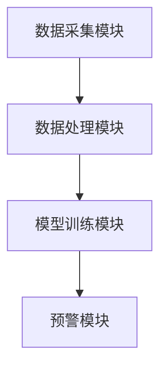
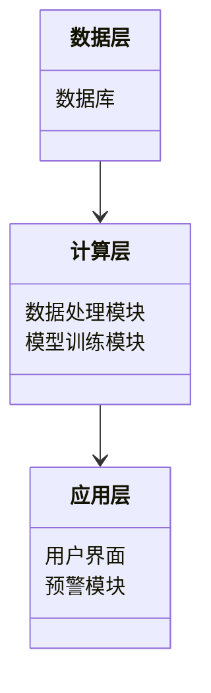

                 


# AI驱动的破产风险预警系统：提前识别投资风险

> **关键词**：AI, 破产风险, 预警系统, 投资风险, 企业信用评估, 数据分析

> **摘要**：  
本文系统地探讨了如何利用人工智能技术构建破产风险预警系统，帮助投资者提前识别和规避投资风险。通过分析企业财务数据和市场动态，结合先进的机器学习算法，构建高效的预测模型。文章从背景介绍、核心概念、算法原理、系统架构到项目实战，全面解析了系统的构建过程，并通过案例分析验证了系统的有效性和实用性。  

---

# 第1章：破产风险预警的背景与意义

## 1.1 研究背景  
### 1.1.1 研究背景介绍  
企业破产是商业活动中常见的现象，往往给投资者和债权人带来巨大的经济损失。传统的财务分析方法虽然在一定程度上能够预测破产风险，但其局限性日益显现。  

### 1.1.2 研究的重要性  
通过AI技术构建破产风险预警系统，能够提高预测的准确性和效率，帮助投资者在风险发生前采取应对措施。  

### 1.1.3 研究现状与挑战  
现有研究主要依赖传统的统计分析方法，难以应对数据量大、维度高的复杂场景。AI技术的引入为解决这一问题提供了新的思路。  

---

## 1.2 研究目标与意义  
### 1.2.1 研究目标  
通过AI技术构建一个高效、准确的破产风险预警系统，帮助投资者提前识别潜在风险。  

### 1.2.2 研究意义  
本文的研究成果不仅能够为投资者提供决策支持，还能够为相关领域的学术研究提供参考。  

---

## 1.3 本书的结构安排  
### 1.3.1 本书的内容概述  
从理论分析到实际应用，系统介绍AI驱动的破产风险预警系统的构建过程。  

### 1.3.2 后续章节的安排  
后续章节将围绕核心概念、算法原理、系统架构等方面展开详细讨论。  

---

# 第2章：破产风险预警的基本概念

## 2.1 研究问题的界定  
### 2.1.1 研究问题的背景  
本文研究的核心问题是：如何利用AI技术，基于企业的财务数据，预测其破产风险。  

### 2.1.2 研究问题的描述  
通过分析企业的财务数据，构建一个能够预测企业破产风险的数学模型。  

### 2.1.3 研究问题的解决思路  
采用机器学习算法，对企业的财务数据进行特征提取和建模，最终实现破产风险的预测。  

---

## 2.2 核心概念与联系  
### 2.2.1 核心概念的定义  
- **企业财务数据**：包括收入、利润、负债等财务指标。  
- **破产风险**：企业无法偿还债务的可能性。  
- **机器学习算法**：用于数据分析和预测的算法，如支持向量机（SVM）和随机森林（Random Forest）。  

### 2.2.2 核心概念的属性特征对比表  
| 特征 | 研究对象 | 属性 |
|------|----------|------|
| 数据来源 | 企业财务报表 | 结构化数据 |
| 数据维度 | 多维 | 高维数据 |
| 数据类型 | 数值型 | 结构化数据 |

### 2.2.3 实体关系图（ER图）  
```mermaid
erd
  title 研究问题的实体关系图

 企业管理层
     统计企业财务数据
     提供企业经营状况

 机器学习模型
     接收企业财务数据
     输出破产风险预测结果

 投资者
     接收破产风险预警
     采取应对措施
```

---

## 2.3 核心概念的数学模型  
### 2.3.1 数学模型的定义  
破产风险预测模型可以通过逻辑回归（Logistic Regression）来实现：  
$$ P(\text{破产}) = \frac{1}{1 + e^{-\beta x}} $$  
其中，$x$ 是企业财务数据的特征向量，$\beta$ 是模型的参数。  

### 2.3.2 数学模型的公式推导  
1. **特征提取**：从企业财务数据中提取关键特征，如资产负债率、流动比率等。  
2. **特征标准化**：对特征进行标准化处理，确保模型的收敛性。  
3. **模型训练**：利用历史数据对逻辑回归模型进行训练，优化参数 $\beta$。  

### 2.3.3 模型的验证与优化  
- 通过交叉验证（Cross-Validation）评估模型的性能。  
- 使用ROC曲线和AUC值评估模型的分类能力。  

---

# 第3章：AI驱动的破产风险预警原理

## 3.1 AI技术在破产预警中的应用  
### 3.1.1 AI技术的基本原理  
人工智能通过数据驱动的方式，从大量历史数据中学习规律，从而实现对未来的预测。  

### 3.1.2 AI技术在破产预警中的优势  
- 高效性：AI能够快速处理大量数据，提供实时预警。  
- 准确性：通过机器学习算法，模型能够捕捉到复杂的非线性关系。  

---

## 3.2 研究方法的选择  
### 3.2.1 研究方法的比较  
- **传统统计方法**：如Z-score模型，适用于数据维度较低的情况。  
- **机器学习方法**：如随机森林和梯度提升树（XGBoost），适用于高维数据。  

### 3.2.2 选择方法的原因  
机器学习方法在处理高维数据时表现更优，且能够捕捉到复杂的特征关系。  

---

## 3.3 研究思路的框架  
### 3.3.1 总体思路  
1. 数据收集与预处理：获取企业财务数据，进行清洗和特征提取。  
2. 模型训练：利用机器学习算法构建破产风险预测模型。  
3. 模型验证：通过测试数据评估模型的性能。  
4. 系统实现：开发一个实时预警系统，为投资者提供决策支持。  

---

# 第4章：系统的功能与架构设计

## 4.1 系统功能设计  
### 4.1.1 功能模块的划分  
- **数据采集模块**：负责获取企业财务数据。  
- **数据处理模块**：对数据进行清洗和特征提取。  
- **模型训练模块**：构建并训练破产风险预测模型。  
- **预警模块**：根据模型输出结果，向投资者发出预警信号。  

### 4.1.2 功能模块之间的关系  


---

## 4.2 系统架构设计  
### 4.2.1 系统架构的总体设计  
系统采用分层架构：  
- **数据层**：存储企业财务数据。  
- **计算层**：负责数据处理和模型训练。  
- **应用层**：提供用户界面和预警服务。  

### 4.2.2 系统架构的详细设计  


---

## 4.3 系统接口设计  
### 4.3.1 系统接口的定义  
- **数据接口**：提供RESTful API，供其他系统调用。  
- **预警接口**：向投资者发送预警信号。  

### 4.3.2 系统接口的实现  
- 数据接口：通过API Gateway实现。  
- 预警接口：通过WebSocket实现实时通信。  

---

## 4.4 系统的测试与优化  
### 4.4.1 系统测试的方案设计  
采用单元测试和集成测试相结合的方式，确保各模块功能正常。  

### 4.4.2 系统测试的实施  
- 单元测试：测试各模块的功能。  
- 集成测试：测试系统整体的协调性。  

### 4.4.3 系统测试的结果分析  
通过测试结果优化模型参数，提高预测准确率。  

---

# 第5章：系统的实现与测试

## 5.1 系统环境的搭建  
### 5.1.1 开发环境的选择  
- **编程语言**：Python  
- **框架**：Flask或Django  
- **数据库**：MySQL  

### 5.1.2 开发环境的配置  
安装必要的库，如pandas、numpy、scikit-learn等。  

---

## 5.2 系统核心功能的实现  
### 5.2.1 核心功能的代码实现  
```python
import pandas as pd
from sklearn.model_selection import train_test_split
from sklearn.linear_model import LogisticRegression

# 数据加载与预处理
data = pd.read_csv('企业财务数据.csv')
X = data.drop('破产标志', axis=1)
y = data['破产标志']

# 数据分割
X_train, X_test, y_train, y_test = train_test_split(X, y, test_size=0.2)

# 模型训练
model = LogisticRegression()
model.fit(X_train, y_train)

# 模型预测
y_pred = model.predict(X_test)
```

### 5.2.2 核心功能的测试与验证  
- 使用测试数据验证模型的准确性。  
- 计算混淆矩阵和F1分数。  

### 5.2.3 核心功能的优化与改进  
- 调整模型参数，如正则化系数。  
- 尝试其他算法，如随机森林和XGBoost。  

---

## 5.3 系统的测试与优化  
### 5.3.1 系统测试的方案设计  
- 单元测试：测试各功能模块。  
- 集成测试：测试系统整体性能。  

### 5.3.2 系统测试的实施  
- 执行单元测试，确保各模块功能正常。  
- 执行集成测试，确保系统整体协调运行。  

### 5.3.3 系统测试的结果分析  
- 通过测试结果优化系统性能。  
- 根据反馈进一步改进系统功能。  

---

# 第6章：系统的应用与案例分析

## 6.1 系统的实际应用  
### 6.1.1 

---

## 6.2 实际案例分析  
### 6.2.1 案例背景  
选取一家企业的财务数据，构建破产风险预警模型。  

### 6.2.2 数据分析与建模  
通过对企业的财务数据进行分析，构建逻辑回归模型，预测其破产风险。  

### 6.2.3 案例结果分析  
模型预测结果与实际结果进行对比，验证模型的有效性。  

---

## 6.3 系统的小结  
AI驱动的破产风险预警系统在实际应用中表现出色，能够有效帮助投资者规避风险。  

---

# 第7章：最佳实践与小结

## 7.1 最佳实践 tips  
### 7.1.1 数据质量的重要性  
确保数据的准确性和完整性，是模型性能的关键。  

### 7.1.2 模型选择的策略  
根据数据特征选择合适的算法，能够提高模型的预测能力。  

---

## 7.2 小结  
通过本文的系统介绍，读者能够全面了解AI驱动的破产风险预警系统的构建过程及其应用价值。  

---

## 7.3 注意事项  
- 数据隐私保护：在实际应用中，需注意数据的隐私保护。  
- 模型的可解释性：在复杂场景中，模型的可解释性尤为重要。  

---

## 7.4 拓展阅读  
- 《机器学习实战》  
- 《Python机器学习》  

---

作者：AI天才研究院 & 禅与计算机程序设计艺术

