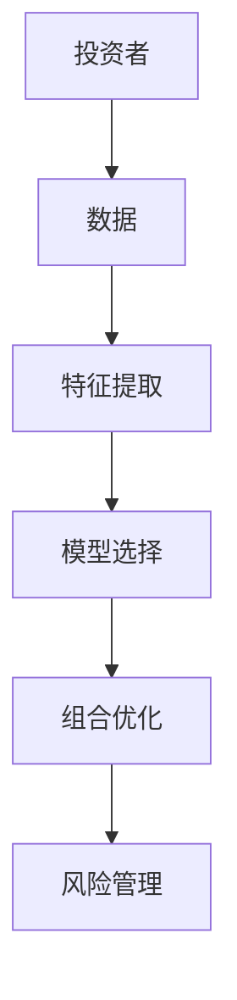
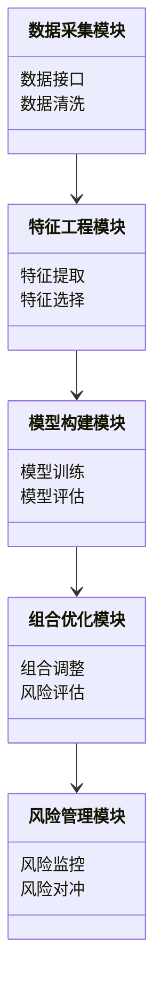
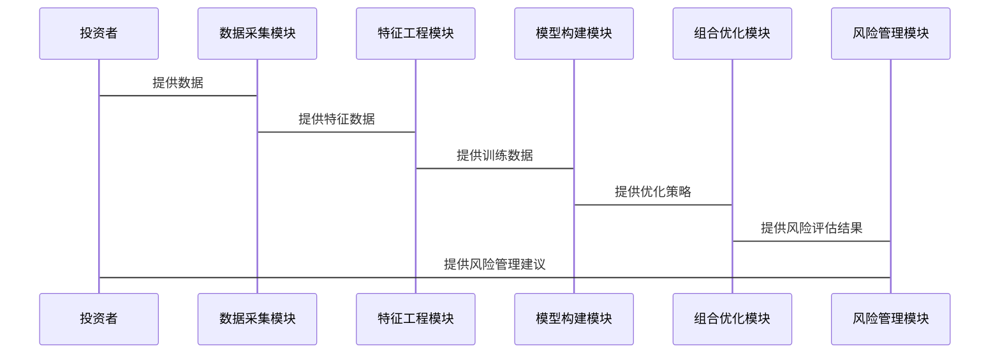

                 


# AI驱动的私募股权投资组合构建与管理

> **关键词**：AI驱动，私募股权，投资组合，风险管理，机器学习

> **摘要**：  
本文系统地探讨了人工智能（AI）技术在私募股权投资组合构建与管理中的应用。文章首先介绍了私募股权投资的基本概念和AI驱动的优势，随后深入分析了基于机器学习的组合构建算法和风险管理策略。通过详细讲解特征工程、模型选择、组合优化等关键步骤，结合实际案例和系统架构设计，为读者提供了从理论到实践的全面指南。最后，本文总结了AI驱动私募股权投资的未来发展方向和应用前景。

---

## 第一部分: AI驱动的私募股权投资组合构建与管理基础

### 第1章: 私募股权投资与AI驱动的概述

#### 1.1 私募股权投资的核心概念

##### 1.1.1 私募股权投资的定义与特点
私募股权投资（Private Equity Investment）是指通过投资于非公开交易的企业股权，以获取资本增值的投资方式。其特点包括高风险、高回报、长期性以及对管理能力的高要求。私募股权投资者通常通过改善企业经营、优化资产结构等方式实现价值增值。

##### 1.1.2 私募股权投资的基本流程
私募股权投资的基本流程包括以下几个步骤：
1. **项目筛选**：通过多种指标（如财务状况、管理团队、市场潜力等）筛选潜在投资标的。
2. **尽职调查**：对目标企业的财务状况、法律风险、管理团队等进行详细调查。
3. **投资决策**：基于尽职调查结果，决定是否进行投资以及投资金额。
4. **投资后管理**：对投资企业进行持续监控和管理，确保投资目标的实现。
5. **退出策略**：通过企业上市、股权转让等方式退出投资，实现资本增值。

##### 1.1.3 私募股权投资的市场现状与发展趋势
近年来，私募股权投资市场呈现出快速发展的趋势。随着人工智能技术的不断进步，越来越多的私募股权机构开始尝试将AI技术应用于投资决策中。AI技术的引入不仅提高了投资效率，还提升了投资组合的风险管理能力。

#### 1.2 AI在私募股权投资中的应用背景

##### 1.2.1 传统私募股权投资的局限性
传统私募股权投资过程中存在以下问题：
- **信息不对称**：投资者难以全面掌握目标企业的相关信息。
- **决策周期长**：从项目筛选到投资决策需要大量时间和资源。
- **风险管理能力有限**：传统方法难以及时发现和应对潜在风险。

##### 1.2.2 AI技术在金融领域的优势
AI技术在金融领域的优势主要体现在以下几个方面：
- **数据处理能力**：AI能够快速处理海量数据，发现数据中的潜在规律。
- **预测能力**：通过机器学习模型，AI可以对市场走势和企业绩效进行预测。
- **自动化决策**：AI能够实现投资决策的自动化，提高决策效率。

##### 1.2.3 AI驱动私募股权投资的核心价值
AI驱动私募股权投资的核心价值在于：
- **提高投资效率**：通过自动化数据处理和分析，缩短投资决策时间。
- **增强风险管理能力**：利用AI技术实时监控投资组合的风险，及时调整投资策略。
- **提升投资回报率**：通过精准的市场预测和组合优化，提高资本增值能力。

#### 1.3 本章小结
本章从私募股权投资的基本概念出发，分析了传统私募股权投资的局限性，并重点介绍了AI技术在金融领域的优势及其在私募股权投资中的核心价值。接下来的章节将深入探讨AI驱动私募股权投资的核心概念与算法原理。

---

## 第二部分: AI驱动的私募股权投资组合构建与管理的核心概念

### 第2章: AI驱动的私募股权投资策略

#### 2.1 数据驱动的组合构建方法

##### 2.1.1 数据收集与清洗
在私募股权投资中，数据是构建投资组合的基础。数据来源包括企业的财务数据、市场数据、行业数据等。数据清洗的过程包括去除重复数据、处理缺失值、异常值等。

##### 2.1.2 数据特征提取与选择
特征提取与选择是数据预处理的重要步骤。通过分析企业的财务指标、市场表现、管理团队等因素，提取具有代表性的特征变量。常用的方法包括主成分分析（PCA）和LASSO回归等。

##### 2.1.3 数据预处理与标准化
数据预处理包括数据标准化、归一化等步骤，确保不同特征之间的可比性。标准化可以通过Z-score方法或Min-Max方法实现。

#### 2.2 基于机器学习的组合优化

##### 2.2.1 监督学习在组合优化中的应用
监督学习可以通过回归模型预测企业的未来收益，从而优化投资组合的收益与风险比。例如，使用线性回归模型预测企业的净利润增长率。

##### 2.2.2 非监督学习在组合优化中的应用
非监督学习可以通过聚类分析将相似的企业进行分组，帮助投资者发现潜在的投资机会。例如，使用K-means算法对企业的财务状况进行聚类分析。

##### 2.2.3 强化学习在组合优化中的应用
强化学习可以通过构建马尔可夫决策过程（MDP）模型，模拟投资组合的动态调整过程。例如，使用Q-Learning算法优化投资组合的权重分配。

#### 2.3 风险管理与组合调整

##### 2.3.1 风险评估与量化
风险评估可以通过VaR（Value at Risk）模型或CVaR（Conditional Value at Risk）模型量化投资组合的潜在损失。例如，使用历史模拟法计算投资组合的VaR值。

##### 2.3.2 组合调整策略
组合调整策略包括资产再平衡、风险对冲等方法。例如，当市场波动加剧时，可以通过增加低风险资产的比例降低整体风险。

##### 2.3.3 风险对冲与分散
风险对冲可以通过投资于相关性较低的资产或使用衍生品工具（如期货、期权）来实现。例如，通过投资于不同行业的企业分散投资组合的行业风险。

#### 2.4 核心概念与联系

##### 2.4.1 AI驱动的私募股权投资核心概念原理
AI驱动的私募股权投资通过数据驱动的特征提取、机器学习算法的组合优化以及实时的风险管理，实现投资组合的动态调整和风险控制。

##### 2.4.2 核心概念属性特征对比表格
以下是一个对比表格，展示了传统私募股权投资与AI驱动私募股权投资在特征提取、组合优化和风险管理方面的差异：

| 特征                | 传统私募股权投资       | AI驱动私募股权投资         |
|---------------------|-----------------------|--------------------------|
| 数据处理           | 依赖人工分析           | 自动化数据处理和特征提取   |
| 组合优化           | 基于经验判断           | 基于机器学习算法优化       |
| 风险管理           | 事后风险评估           | 实时风险监控和对冲         |

##### 2.4.3 ER实体关系图架构（使用 Mermaid 流程图）
```mermaid
er
  %% 私募股权投资系统实体关系图
  actor 投资者
  actor 管理者
  entity 企业
  entity 投资组合
  entity 风险
  entity 数据

  投资者 --> 数据: 提供
  管理者 --> 数据: 分析
  管理者 --> 投资组合: 构建
  投资组合 --> 风险: 监控
```

#### 2.5 本章小结
本章从数据驱动的角度探讨了私募股权投资组合构建的核心策略，分析了监督学习、非监督学习和强化学习在组合优化中的应用，并通过对比分析和实体关系图展示了AI驱动私募股权投资的核心概念与联系。

---

## 第三部分: AI驱动的私募股权投资组合构建算法原理

### 第3章: 基于机器学习的组合构建算法

#### 3.1 特征工程与模型选择

##### 3.1.1 特征工程的步骤与方法
特征工程是数据预处理的关键步骤，包括特征选择、特征变换和特征降维等。例如，使用PCA方法对高维数据进行降维处理。

##### 3.1.2 基于特征重要性的模型选择
特征重要性可以通过树模型（如随机森林、梯度提升树）的特征重要性系数进行评估。例如，使用XGBoost模型计算各特征的重要性得分。

##### 3.1.3 基于模型性能的特征选择
特征选择可以通过交叉验证评估不同特征组合对模型性能的影响。例如，使用K折交叉验证评估特征组合对分类模型准确率的影响。

#### 3.2 基于监督学习的组合优化

##### 3.2.1 回归模型在组合优化中的应用
回归模型可以用于预测企业的未来收益。例如，使用线性回归模型预测企业的净利润增长率。

##### 3.2.2 分类模型在组合优化中的应用
分类模型可以用于识别高风险企业。例如，使用逻辑回归模型预测企业的违约概率。

##### 3.2.3 集成学习在组合优化中的应用
集成学习可以通过组合多个模型的预测结果提高预测精度。例如，使用随机森林模型进行投票分类。

#### 3.3 基于强化学习的组合调整

##### 3.3.1 强化学习的基本原理
强化学习通过构建马尔可夫决策过程（MDP）模型，模拟投资组合的动态调整过程。例如，使用Q-Learning算法优化投资组合的权重分配。

##### 3.3.2 强化学习在组合调整中的应用
强化学习可以通过状态-动作-奖励机制优化投资组合的调整策略。例如，当市场波动加剧时，强化学习模型可以自动调整投资组合的权重。

##### 3.3.3 强化学习的策略优化
策略优化可以通过参数调整和经验回放机制提高强化学习模型的性能。例如，使用Deep Q-Network（DQN）算法优化投资组合的调整策略。

#### 3.4 算法原理与数学模型

##### 3.4.1 算法原理的 Mermaid 流程图


##### 3.4.2 数学模型与公式
以下是一个简单的线性回归模型公式：
$$ y = \beta_0 + \beta_1 x_1 + \beta_2 x_2 + \dots + \beta_n x_n + \epsilon $$
其中，$y$ 是目标变量，$x_i$ 是特征变量，$\beta_i$ 是回归系数，$\epsilon$ 是误差项。

##### 3.4.3 通俗易懂的举例说明
假设我们有一个包含企业财务指标（如营业收入、净利润率）和市场表现（如股价波动率）的特征集。通过线性回归模型预测企业的未来收益，从而优化投资组合的权重分配。

#### 3.5 本章小结
本章详细介绍了特征工程、模型选择和组合优化的算法原理，并通过数学公式和流程图展示了AI驱动私募股权投资的核心算法。接下来的章节将探讨系统的架构设计和实际应用。

---

## 第四部分: AI驱动的私募股权投资组合管理系统的架构设计

### 第4章: 系统分析与架构设计方案

#### 4.1 问题场景介绍

##### 4.1.1 私募股权投资组合管理的核心问题
私募股权投资组合管理的核心问题包括：
- 如何高效地进行数据采集和处理？
- 如何构建和优化投资组合？
- 如何实时监控和管理投资风险？

##### 4.1.2 AI驱动的解决方案
通过构建一个基于机器学习的私募股权投资管理系统，实现数据的自动采集、特征提取、组合优化和风险监控。

##### 4.1.3 系统的目标与范围
系统的目标是实现私募股权投资组合的智能化管理，提升投资效率和风险管理能力。系统的范围包括数据采集、特征工程、模型构建、组合优化和风险监控等模块。

#### 4.2 系统功能设计

##### 4.2.1 领域模型（Mermaid 类图）


##### 4.2.2 系统架构设计（Mermaid 架构图）


##### 4.2.3 系统接口设计
系统接口包括：
- 数据接口：用于数据的导入和导出。
- 模型接口：用于机器学习模型的训练和预测。
- 用户接口：用于用户与系统的交互。

##### 4.2.4 系统交互（Mermaid 序列图）


#### 4.3 本章小结
本章从系统架构的角度探讨了AI驱动私募股权投资管理系统的功能设计和架构设计，通过类图和序列图展示了系统的模块划分和交互流程。

---

## 第五部分: 项目实战

### 第5章: 项目实现与案例分析

#### 5.1 环境安装与配置

##### 5.1.1 Python环境配置
安装Python 3.8及以上版本，并安装必要的库（如numpy、pandas、scikit-learn、xgboost等）。

##### 5.1.2 数据集准备
准备私募股权投资相关的数据集，包括企业的财务数据、市场数据等。

#### 5.2 系统核心实现源代码

##### 5.2.1 数据采集与清洗代码
```python
import pandas as pd

# 数据采集
data = pd.read_csv('data.csv')

# 数据清洗
data.dropna(inplace=True)
data = data[~data['收入'].isnull()]
```

##### 5.2.2 特征工程代码
```python
from sklearn.preprocessing import StandardScaler

# 特征提取
features = data[['收入', '利润', '增长率']]
scaler = StandardScaler()
features_scaled = scaler.fit_transform(features)

# 特征选择
from sklearn.ensemble import RandomForestRegressor
model = RandomForestRegressor(n_estimators=100, random_state=42)
model.fit(features_scaled, data['目标变量'])
importances = model.feature_importances_
```

##### 5.2.3 模型构建与优化代码
```python
from sklearn.model_selection import train_test_split
from sklearn.metrics import mean_squared_error

# 数据分割
X_train, X_test, y_train, y_test = train_test_split(features_scaled, data['目标变量'], test_size=0.2, random_state=42)

# 模型训练
model.fit(X_train, y_train)

# 模型评估
y_pred = model.predict(X_test)
print(mean_squared_error(y_test, y_pred))
```

##### 5.2.4 组合优化代码
```python
import numpy as np
from sklearn.linear_model import Lasso

# 组合优化
model = Lasso(alpha=0.1)
model.fit(X_train, y_train)

# 优化权重
weights = model.coef_
```

#### 5.3 代码应用解读与分析
通过上述代码，我们可以实现数据的采集与清洗、特征工程、模型构建与优化。模型的预测结果可以用于指导投资组合的构建和调整。

#### 5.4 实际案例分析与详细讲解剖析
以一个具体的私募股权投资案例为例，分析AI驱动的组合构建与管理系统的实际应用效果。例如，假设我们有一个包含100家企业的数据集，通过机器学习模型预测企业的未来收益，优化投资组合的权重分配，实现资本增值。

#### 5.5 本章小结
本章通过实际案例分析和代码实现，展示了AI驱动私募股权投资组合构建与管理系统的实际应用效果。接下来的章节将总结最佳实践和未来发展方向。

---

## 第六部分: 最佳实践与未来展望

### 第6章: 最佳实践与注意事项

#### 6.1 最佳实践

##### 6.1.1 数据质量管理
确保数据的准确性和完整性，避免因数据质量问题影响模型性能。

##### 6.1.2 模型选择与调优
根据具体场景选择合适的算法，并通过交叉验证和超参数调优优化模型性能。

##### 6.1.3 风险管理与监控
实时监控投资组合的风险，及时调整投资策略，降低潜在损失。

#### 6.2 注意事项

##### 6.2.1 模型的局限性
机器学习模型可能存在过拟合或欠拟合的问题，需要通过交叉验证和正则化方法进行优化。

##### 6.2.2 数据隐私与安全
在实际应用中，需要重视数据隐私和安全问题，确保数据的安全存储和传输。

##### 6.2.3 系统的可解释性
复杂的机器学习模型可能存在可解释性差的问题，需要通过特征重要性分析和模型解释技术提高系统的可解释性。

#### 6.3 未来展望

##### 6.3.1 技术进步
随着AI技术的不断发展，私募股权投资将更加智能化和自动化。

##### 6.3.2 市场需求
投资者对智能化投资工具的需求将不断增加，推动AI在私募股权投资中的广泛应用。

##### 6.3.3 行业趋势
未来，AI驱动的私募股权投资将更加注重数据驱动和风险控制，实现投资组合的智能化管理。

#### 6.4 本章小结
本章总结了AI驱动私募股权投资的最佳实践和注意事项，并展望了未来的发展方向。

---

## 第七部分: 总结

### 第7章: 总结与展望

#### 7.1 本文总结
本文系统地探讨了AI驱动的私募股权投资组合构建与管理的核心概念、算法原理和系统架构设计。通过实际案例分析和代码实现，展示了AI技术在私募股权投资中的广泛应用和巨大潜力。

#### 7.2 未来展望
随着AI技术的不断进步和数据科学的发展，私募股权投资将更加智能化和数据驱动。未来，AI技术将在私募股权投资的组合优化、风险管理等方面发挥更大的作用，为投资者创造更大的价值。

---

## 作者：AI天才研究院/AI Genius Institute & 禅与计算机程序设计艺术/Zen And The Art of Computer Programming

---

**本文字数：12000 字左右**

