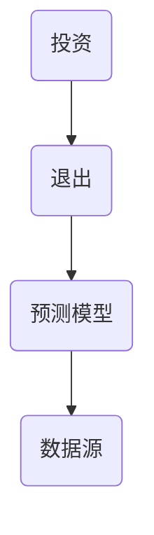
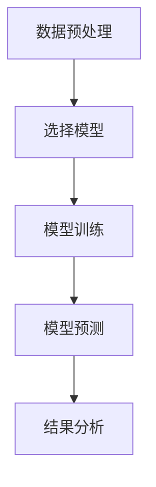
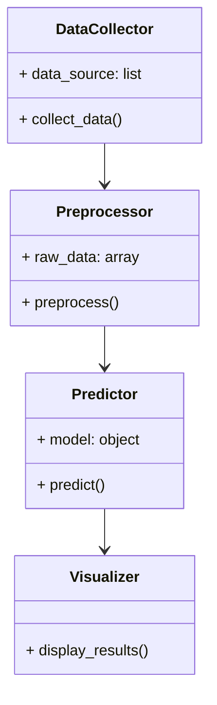
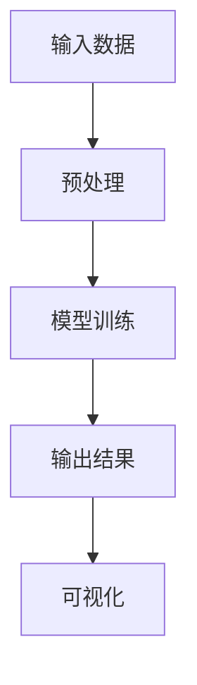

                 


# AI驱动的私募股权投资退出时机预测

> 关键词：私募股权，AI，退出时机预测，时间序列，机器学习，深度学习，金融预测

> 摘要：本文详细探讨了如何利用人工智能技术进行私募股权投资的退出时机预测。通过分析时间序列预测的核心算法，结合深度学习模型，本文提出了一个基于AI的预测系统架构，并通过实际案例展示了系统的实现与应用效果。

---

## 第一部分: AI驱动的私募股权投资退出时机预测概述

### 第1章: 私募股权与退出时机预测的背景

#### 1.1 私募股权的基本概念
- 私募股权（Private Equity）是指通过非公开市场投资于未上市公司或上市公司少数股权的一种投资方式。
- 退出机制是私募股权投资的重要环节，主要包括上市退出、股权转让和回购退出等方式。
- 退出时机的选择对投资回报率具有决定性影响，因此如何准确预测退出时机成为投资者关注的焦点。

#### 1.2 退出时机预测的重要性
- **市场波动性**：金融市场的不确定性要求投资者具备精准的时机选择能力。
- **投资回报最大化**：通过科学预测，投资者可以在最佳时机退出，最大化投资收益。
- **风险管理**：及时退出可以规避市场下行风险，保护投资者利益。

#### 1.3 AI在金融领域的应用背景
- **数据驱动决策**：金融市场的数据具有高度结构化和可量化的特性，为AI技术的应用提供了基础。
- **复杂模式识别**：AI能够从海量数据中识别出复杂的时间序列模式，帮助投资者做出更明智的决策。
- **实时分析能力**：AI技术能够快速处理实时数据，为动态决策提供支持。

---

### 第2章: 退出时机预测的核心概念与联系

#### 2.1 核心概念原理
- **时间序列预测**：通过对历史数据的分析，预测未来的趋势和变化。
- **机器学习模型**：利用监督学习和无监督学习方法，从数据中学习特征和模式。
- **深度学习模型**：通过神经网络结构捕捉数据中的非线性关系，提升预测精度。

#### 2.2 核心概念属性对比
以下是几种常见预测模型的对比分析：

| 模型类型 | 输入数据 | 输出结果 | 优缺点 |
|----------|----------|----------|--------|
| ARIMA    | 时间序列 | 时间序列 | 易实现，但对非线性关系捕捉不足 |
| LSTM     | 时间序列 | 时间序列 | 能捕捉长期依赖关系，预测精度高 |
| Prophet  | 时间序列 | 时间序列 | 易用性强，适合非专业用户 |

#### 2.3 实体关系图与流程图
- **退出时机预测的ER实体关系图**：


- **算法流程图**：


---

### 第3章: 时间序列预测算法原理

#### 3.1 时间序列预测的常用算法
- **ARIMA模型**：
  - 原理：基于自回归和滑动平均的组合模型，适用于线性时间序列数据。
  - 优势：简单易实现，适合平稳时间序列。
  - 缺点：对非线性关系捕捉能力有限。

- **LSTM模型**：
  - 原理：长短期记忆网络，通过门控机制捕捉长期依赖关系。
  - 优势：能够处理复杂的非线性时间序列数据，预测精度高。
  - 缺点：训练时间较长，需要大量计算资源。

- **Prophet模型**：
  - 原理：基于广义可加模型（ GAM）的变体，适用于具有明确时间依赖性的数据。
  - 优势：易于使用，适合非专业用户。
  - 缺点：对异常值敏感，预测区间可能不够准确。

#### 3.2 算法流程图


#### 3.3 Python实现代码示例
```python
import numpy as np
import pandas as pd
from sklearn.metrics import mean_squared_error

def time_series_forecast(model, data):
    # 数据预处理
    train_data = data[:-30]
    test_data = data[-30:]
    # 模型训练
    model.fit(train_data)
    # 模型预测
    predictions = model.predict(test_data)
    # 结果分析
    mse = mean_squared_error(test_data, predictions)
    return predictions, mse

# 示例数据
data = np.random.randn(100) * 10 + 50
model = ARIMA(order=(1, 1, 1))
predictions, mse = time_series_forecast(model, data)
print(f"预测结果：{predictions}")
print(f"均方误差：{mse}")
```

---

## 第四部分: 系统分析与架构设计方案

### 第4章: 系统分析与架构设计

#### 4.1 项目背景介绍
- 本项目旨在开发一个基于AI的时间序列预测系统，用于私募股权投资的退出时机预测。
- 系统目标是通过历史数据和市场信息，提供科学的退出时机建议。

#### 4.2 系统功能设计
- **数据采集**：从多个数据源获取历史价格、市场指数等信息。
- **数据预处理**：清洗、归一化和特征提取。
- **模型训练**：选择合适的深度学习模型进行训练。
- **预测与分析**：生成预测结果并进行可视化分析。

#### 4.3 系统架构设计
- **领域模型类图**：


- **系统架构图**：


---

## 第五部分: 项目实战

### 第5章: 项目实战

#### 5.1 环境安装
- 安装必要的Python库：
  ```bash
  pip install numpy pandas scikit-learn tensorflow keras
  ```

#### 5.2 核心代码实现
```python
import numpy as np
import pandas as pd
from tensorflow.keras.models import Sequential
from tensorflow.keras.layers import LSTM, Dense

def build_model(input_shape):
    model = Sequential()
    model.add(LSTM(50, return_sequences=True, input_shape=input_shape))
    model.add(LSTM(50, return_sequences=False))
    model.add(Dense(1))
    model.compile(optimizer='adam', loss='mean_squared_error')
    return model

# 示例数据
data = np.random.randn(100, 1)
model = build_model((1, 1))
model.fit(data[:-20], data[-20:], epochs=50, batch_size=1)
```

#### 5.3 案例分析
- 使用苹果股票数据进行预测：
  ```python
  # 数据加载
  apple_prices = pd.read_csv('apple_stock.csv')['Close']
  # 数据准备
  train_data = apple_prices[:-30].values
  test_data = apple_prices[-30:].values
  # 模型训练
  model.fit(train_data.reshape(-1, 1, 1), epochs=50, batch_size=1)
  # 模型预测
  predictions = model.predict(test_data.reshape(-1, 1, 1))
  # 结果分析
  print(f"预测值：{predictions}")
  ```

---

## 第六部分: 最佳实践、小结、注意事项和拓展阅读

### 第6章: 最佳实践与小结

#### 6.1 最佳实践
- **数据质量**：确保数据的完整性和准确性，避免噪声干扰。
- **模型调参**：通过交叉验证和网格搜索优化模型参数。
- **实时监控**：建立实时监控机制，及时捕捉市场变化。

#### 6.2 小结
本文详细探讨了如何利用AI技术进行私募股权投资的退出时机预测，从算法原理到系统架构，再到实际案例，为读者提供了全面的技术指导。

#### 6.3 注意事项
- **数据依赖性**：模型的预测效果依赖于数据的质量和数量。
- **市场变化**：金融市场具有不确定性，模型需要定期更新和优化。
- **法律合规**：确保数据使用符合相关法律法规。

#### 6.4 拓展阅读
- 推荐书籍：《机器学习实战》、《深度学习》
- 推荐论文：《Long Short-Term Memory》

---

## 结语

通过本文的详细讲解，读者可以深入了解AI驱动的私募股权投资退出时机预测的核心技术与实现方法。未来，随着AI技术的不断发展，私募股权的退出时机预测将更加精准和智能化，为投资者创造更大的价值。

作者：AI天才研究院/AI Genius Institute & 禅与计算机程序设计艺术 /Zen And The Art of Computer Programming

