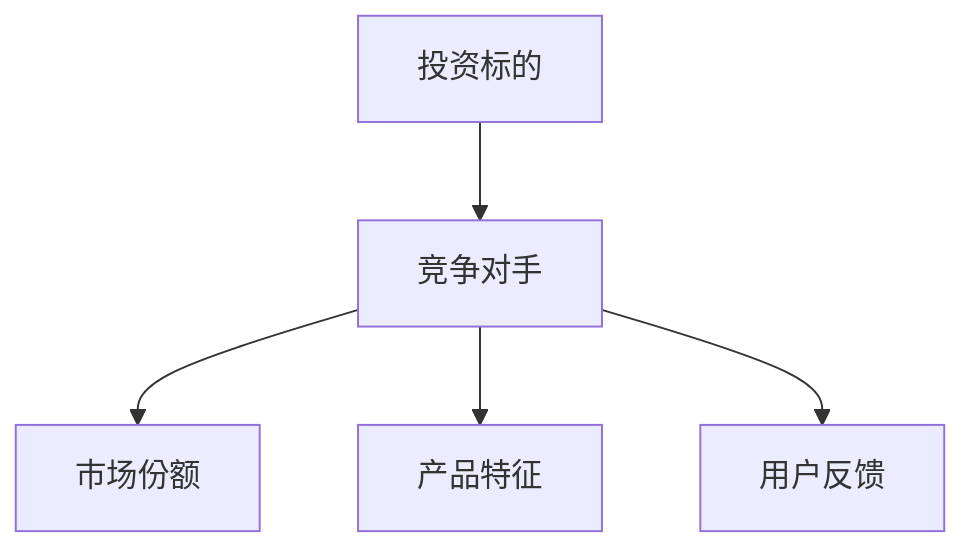
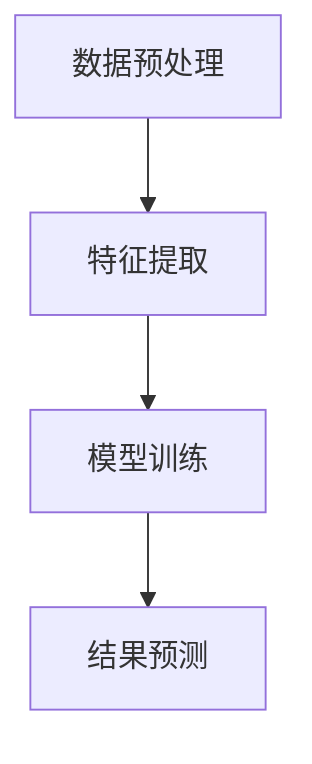
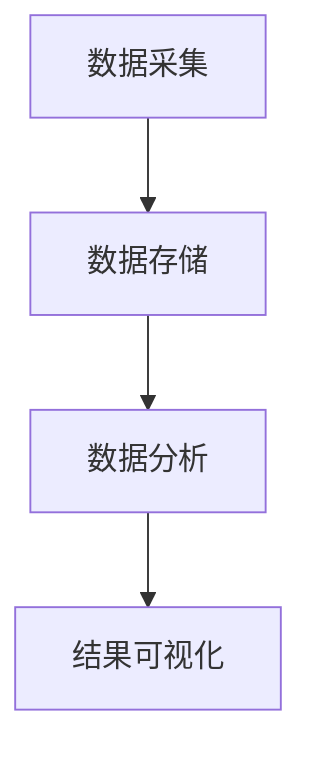
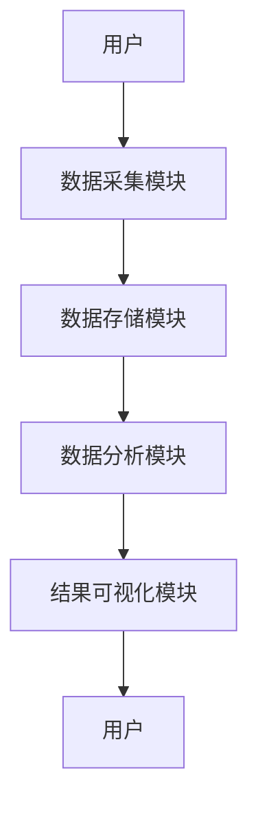

                 


# AI驱动的竞争对手分析：全面评估投资标的的市场地位

## 关键词：AI，竞争对手分析，投资标的，市场地位，机器学习，自然语言处理，数据挖掘

## 摘要：  
本文详细探讨了如何利用人工智能技术进行竞争对手分析，以全面评估投资标的的市场地位。文章从AI驱动的竞争对手分析的基本概念出发，逐步深入讲解了数据挖掘、自然语言处理和机器学习等核心技术在竞争分析中的应用，结合实际案例和系统设计，提供了从理论到实践的全面指导。

---

## 第1章 AI驱动的竞争对手分析概述

### 1.1 竞争对手分析的定义与重要性  
竞争对手分析是指通过研究市场中的竞争对手，评估其市场地位、产品特点、竞争优势和潜在威胁，从而为投资决策提供支持。在传统分析方法的基础上，人工智能技术的引入显著提升了分析的深度和广度。  

#### 1.1.1 数据的重要性  
数据是AI驱动分析的基础。通过收集竞争对手的产品信息、市场表现、用户反馈等数据，可以提取有价值的信息。例如，通过自然语言处理技术分析用户评论，可以洞察竞争对手的产品优劣势。  

#### 1.1.2 AI技术的核心作用  
AI技术能够从海量数据中提取规律，发现潜在的市场趋势和竞争对手的动态。例如，通过机器学习模型预测竞争对手的市场表现，为投资决策提供科学依据。  

#### 1.1.3 投资标的市场地位评估  
市场地位是评估投资标的的关键指标。AI技术可以帮助分析投资标的在市场中的定位、竞争优势和潜在威胁，从而优化投资策略。  

### 1.2 竞争对手分析的背景与现状  
传统竞争对手分析方法依赖人工调研，耗时且成本高。随着AI技术的发展，数据挖掘、自然语言处理和机器学习等技术的应用，使得竞争对手分析更加高效和精准。  

#### 1.2.1 传统分析方法的局限性  
传统方法依赖人工调研，存在数据量小、分析深度不足等问题。例如，手动分析竞争对手的产品评论，效率低下且容易遗漏关键信息。  

#### 1.2.2 AI技术如何弥补不足  
AI技术能够快速处理海量数据，发现隐藏的模式。例如，通过自然语言处理技术分析竞争对手的产品评论，提取关键词和主题，从而快速识别竞争对手的优势和劣势。  

#### 1.2.3 当前市场环境下竞争分析的新趋势  
当前，竞争分析更加注重实时性和动态性。AI技术可以帮助企业实时跟踪竞争对手的市场动态，及时调整战略。  

### 1.3 AI驱动的竞争对手分析的价值链  
AI驱动的竞争对手分析包括数据收集、数据分析和结果应用三个环节。  

#### 1.3.1 数据收集与处理  
数据是AI分析的基础。通过爬虫技术收集竞争对手的产品信息、市场数据和用户评论，然后进行清洗和预处理。  

#### 1.3.2 数据分析与建模  
通过机器学习模型分析数据，提取竞争对手的市场地位、产品特点和用户反馈。  

#### 1.3.3 结果可视化与决策支持  
将分析结果可视化，为投资决策提供支持。例如，生成竞争对手的市场份额分布图，帮助投资者制定策略。  

---

## 第2章 核心概念与技术原理

### 2.1 数据挖掘与特征提取  
数据挖掘是从海量数据中提取有价值信息的过程。  

#### 2.1.1 数据特征的提取方法  
特征提取是数据挖掘的关键步骤。例如，从竞争对手的产品评论中提取关键词，识别竞争对手的优势和劣势。  

#### 2.1.2 数据清洗与预处理  
数据清洗是确保数据质量的重要步骤。例如，去除重复数据、处理缺失值和异常值。  

### 2.2 自然语言处理在竞争分析中的应用  
自然语言处理（NLP）技术可以分析文本数据，提取竞争对手的信息。  

#### 2.2.1 文本分析的基本原理  
NLP技术包括分词、句法分析和情感分析等。例如，通过情感分析技术识别竞争对手的产品评论中的情感倾向。  

#### 2.2.2 基于NLP的情感分析与主题挖掘  
情感分析可以帮助识别竞争对手的产品优劣势。例如，分析用户评论，识别竞争对手的产品优势。  

#### 2.2.3 语义网络构建与关键词提取  
通过构建语义网络，可以识别竞争对手的核心产品特点。例如，提取用户评论中的关键词，构建语义网络。  

### 2.3 机器学习模型在竞争分析中的应用  
机器学习模型可以帮助预测竞争对手的市场表现。  

#### 2.3.1 监督学习与无监督学习的对比  
监督学习需要标注数据，适用于分类任务。例如，通过监督学习模型预测竞争对手的市场份额。  
无监督学习适用于聚类任务。例如，通过聚类分析识别竞争对手的产品类别。  

#### 2.3.2 常见的机器学习算法及其适用场景  
- **K-近邻算法（KNN）**：适用于分类任务。  
- **支持向量机（SVM）**：适用于分类和回归任务。  
- **随机森林**：适用于分类和回归任务。  

#### 2.3.3 深度学习模型在竞争分析中的优势  
深度学习模型（如LSTM和BERT）能够处理复杂的文本数据，适用于情感分析和语义理解任务。  

### 2.4 核心概念对比分析  
通过对比分析，可以更好地理解不同技术的特点和适用场景。  

#### 2.4.1 数据挖掘 vs. 机器学习  
数据挖掘注重数据处理和模式发现，机器学习注重模型训练和预测。  

#### 2.4.2 NLP vs. 数据可视化  
NLP注重文本分析，数据可视化注重数据呈现。  

#### 2.4.3 有监督学习 vs. 无监督学习  
有监督学习需要标注数据，无监督学习不需要标注数据。  

### 2.5 ER实体关系图  
通过ER图可以清晰地展示数据之间的关系。  



---

## 第3章 竞争对手分析的算法原理

### 3.1 数据预处理与特征工程  
数据预处理是确保模型准确性的关键步骤。  

#### 3.1.1 数据清洗的步骤  
- 去除重复数据  
- 处理缺失值  
- 标准化数据  

#### 3.1.2 特征提取的方法  
- 词袋模型  
- TF-IDF  

### 3.2 基于机器学习的竞争对手分析模型  

#### 3.2.1 算法流程图  


#### 3.2.2 数学模型  
- **线性回归**：用于预测竞争对手的市场份额。  
  $$ y = \beta_0 + \beta_1x + \epsilon $$
- **逻辑回归**：用于分类任务。  
  $$ P(Y=1|X) = \frac{e^{\beta_0 + \beta_1x}}{1 + e^{\beta_0 + \beta_1x}} $$

---

## 第4章 系统设计与实现

### 4.1 系统架构设计  
系统架构决定了系统的功能和性能。  

#### 4.1.1 系统功能设计  
- 数据采集模块  
- 数据分析模块  
- 结果可视化模块  

#### 4.1.2 系统架构图  


### 4.2 系统接口设计  
系统接口设计需要考虑模块之间的交互。  

#### 4.2.1 接口描述  
- 数据采集接口：用于收集竞争对手的数据。  
- 数据分析接口：用于处理数据并生成分析结果。  

### 4.3 系统交互流程  
系统交互流程展示了用户与系统之间的交互过程。  



---

## 第5章 项目实战

### 5.1 环境安装  
项目实战需要安装必要的库，例如Python的scikit-learn、NLTK和Word2Vec。  

#### 5.1.1 安装步骤  
```bash
pip install scikit-learn
pip install NLTK
pip install word2vec
```

### 5.2 核心实现源代码  
以下是竞争对手分析的核心代码示例：  

```python
from sklearn.feature_extraction.text import TfidfVectorizer
from sklearn.metrics.pairwise import cosine_similarity

# 数据预处理
def preprocess(text):
    return text.lower().split()

# 特征提取
vectorizer = TfidfVectorizer(preprocessor=preprocess)
tfidf_matrix = vectorizer.fit_transform(texts)

# 计算余弦相似度
similarity_matrix = cosine_similarity(tfidf_matrix)
```

### 5.3 案例分析  
以投资标的A为例，分析其竞争对手B的市场表现。  

#### 5.3.1 数据收集  
收集竞争对手B的产品评论、市场份额和用户反馈。  

#### 5.3.2 数据分析  
使用机器学习模型预测竞争对手B的市场份额。  

#### 5.3.3 结果解读  
预测结果显示，竞争对手B的市场份额将增加，投资标的A需要调整策略。  

---

## 第6章 最佳实践与小结

### 6.1 最佳实践  
- 数据质量是分析的基础，确保数据准确性和完整性。  
- 选择合适的算法，根据任务需求选择监督学习或无监督学习。  

### 6.2 小结  
本文详细介绍了AI驱动的竞争对手分析的核心概念、算法原理和系统设计。通过实际案例和系统设计，展示了如何利用AI技术提升竞争分析的效率和准确性。

---

## 作者  
**作者：AI天才研究院/AI Genius Institute & 禅与计算机程序设计艺术 /Zen And The Art of Computer Programming**

