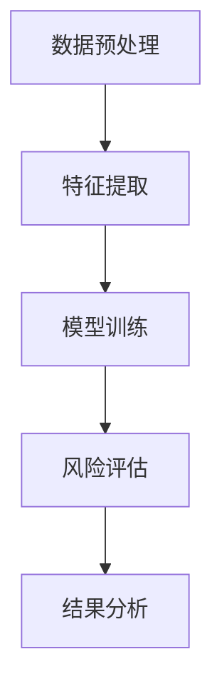
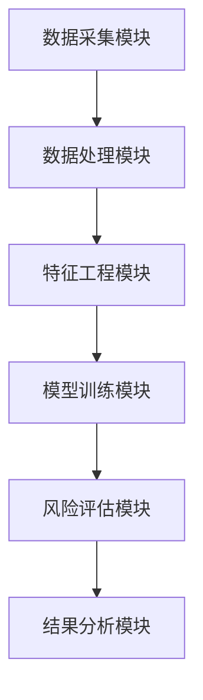
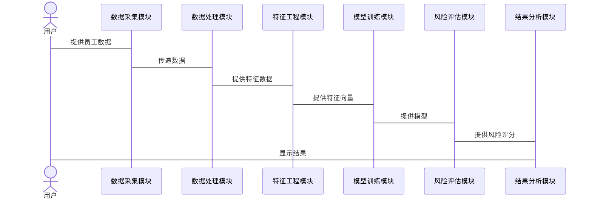

                 


# AI驱动的管理层继任计划分析：评估长期领导力风险

> 关键词：AI，管理层继任，领导力风险，数据分析，机器学习

> 摘要：随着企业竞争的日益激烈，管理层的领导力和稳定性对企业的发展至关重要。本文将探讨如何利用AI技术驱动管理层继任计划的优化，通过数据驱动的方法评估领导力风险，分析潜在继任者的综合素质，并提出基于AI的解决方案，以确保企业领导层的稳定性和可持续发展。

---

## 第1章: 背景介绍

### 1.1 问题背景

#### 1.1.1 传统管理层继任计划的局限性
传统的管理层继任计划主要依赖于主观评估和经验判断，这种方式存在以下问题：
- **主观性过强**：继任者的能力和潜力往往依赖于上级的主观评价，容易受到个人偏见的影响。
- **数据不足**：传统方法缺乏系统化的数据支持，难以全面评估潜在继任者的综合素质。
- **风险滞后**：在实际任命后才发现继任者的不足，可能导致企业战略受损。

#### 1.1.2 数字化转型与AI技术的兴起
随着企业数字化转型的推进，AI技术在各个领域的应用日益广泛。AI技术能够通过数据分析和机器学习算法，帮助企业更科学地评估领导力潜力，优化继任计划。

#### 1.1.3 领导力风险对企业长期发展的潜在影响
领导力风险指的是潜在继任者在实际工作中可能表现出的不足，这些不足可能导致企业在关键时刻出现领导层断层，影响企业的稳定性和发展。通过提前识别和评估这些风险，企业可以制定更加稳健的继任计划。

### 1.2 问题描述

#### 1.2.1 管理层继任计划的核心目标
管理层继任计划的核心目标是确保企业在关键岗位上有合适的接班人，保持企业战略的连续性和稳定性。通过科学的评估方法，识别出具备潜力的继任者，并为其制定个性化的发展计划。

#### 1.2.2 领导力风险的多维度特征
领导力风险可以从多个维度进行评估，包括：
- **能力不足**：继任者在关键技能上存在明显短板。
- **适应性问题**：继任者难以适应新的岗位要求或企业环境。
- **潜在冲突**：继任者与团队或企业战略存在潜在冲突。

#### 1.2.3 AI驱动的继任计划分析的必要性
AI技术可以通过数据分析和机器学习算法，帮助企业在海量数据中发现潜在的领导力风险，从而优化继任计划。AI的引入使得继任计划更加客观、科学和高效。

### 1.3 问题解决

#### 1.3.1 AI技术在领导力评估中的应用潜力
AI技术可以用于分析员工的历史表现、行为数据和绩效评估，通过这些数据预测潜在继任者的领导力潜力。

#### 1.3.2 数据驱动的领导力风险分析方法
通过收集和分析员工的多维度数据，利用机器学习模型预测潜在继任者的领导力风险，帮助企业提前制定应对策略。

#### 1.3.3 继任计划优化的AI解决方案框架
构建一个基于AI的继任计划优化框架，包括数据采集、特征提取、模型训练和结果分析等步骤，帮助企业制定科学的继任计划。

### 1.4 边界与外延

#### 1.4.1 AI驱动继任计划的适用范围
AI驱动的继任计划适用于需要高度专业化的管理岗位，尤其适合那些对企业发展至关重要的关键职位。

#### 1.4.2 与其他领导力管理工具的区别
传统继任计划工具主要依赖于主观评估和经验判断，而AI驱动的继任计划工具则利用数据和算法进行客观评估，具有更高的科学性和准确性。

#### 1.4.3 与企业战略规划的关联性
AI驱动的继任计划能够与企业战略规划紧密结合，确保企业在关键岗位上有合适的接班人，支持企业长期发展目标。

### 1.5 核心概念与联系

#### 1.5.1 核心概念原理
通过数据分析和机器学习算法，AI技术能够从员工的历史表现、行为数据和绩效评估中提取特征，预测潜在继任者的领导力潜力和风险。

#### 1.5.2 数据特征对比表格
下表展示了领导力评估中的关键数据特征及其重要性对比：

| 数据特征         | 描述                         | 重要性 |
|------------------|------------------------------|--------|
| 绩效指标         | 员工的历史绩效表现           | 高     |
| 领导风格         | 员工的领导风格和行为模式     | 中高   |
| 决策能力         | 员工在决策任务中的表现       | 高     |
| 团队合作能力     | 员工在团队中的合作表现       | 中     |
| 适应性           | 员工适应新环境和变化的能力   | 高     |

#### 1.5.3 ER实体关系图架构
下图展示了领导力评估数据模型的ER图架构：

```mermaid
erd
database "Leadership Assessment"

entity "Employee" {
  key id: string
  name: string
  position: string
}

entity "Performance Metrics" {
  key id: string
  employee_id: string
  metrics: string
  score: integer
}

entity "Leadership Style" {
  key id: string
  employee_id: string
  style: string
  description: string
}

entity "Decision Making" {
  key id: string
  employee_id: string
  task: string
  outcome: string
}

relationship "Employee -> Performance Metrics" {
  employee_id: string
  performance_id: string
}

relationship "Employee -> Leadership Style" {
  employee_id: string
  style_id: string
}

relationship "Employee -> Decision Making" {
  employee_id: string
  decision_id: string
}
```

---

## 第2章: 核心概念与联系

### 2.1 核心概念原理

#### 2.1.1 数据驱动的领导力评估模型
数据驱动的领导力评估模型通过分析员工的历史数据和行为数据，预测潜在继任者的领导力潜力和风险。模型的关键步骤包括数据预处理、特征提取、模型训练和结果分析。

#### 2.1.2 AI算法在领导力预测中的作用
AI算法（如随机森林、支持向量机等）通过分析员工的多维度数据，识别出潜在的领导力风险，并为继任计划提供科学依据。

#### 2.1.3 继任计划优化的数学模型
数学模型通过将员工的多维度数据转化为风险评分，帮助企业识别出潜在的领导力风险，并制定相应的优化策略。

### 2.2 数据特征对比表格

| 数据特征         | 描述                         | 对比分析                         |
|------------------|------------------------------|-----------------------------------|
| 绩效指标         | 员工的历史绩效表现           | 高绩效员工更有可能成为优秀的继任者 |
| 领导风格         | 员工的领导风格和行为模式     | 不同领导风格对继任者的影响不同   |
| 决策能力         | 员工在决策任务中的表现       | 决策能力是领导力的核心要素       |
| 团队合作能力     | 员工在团队中的合作表现       | 团队合作能力影响团队凝聚力       |
| 适应性           | 员工适应新环境和变化的能力   | 适应性强的员工更适合高位继任     |

### 2.3 ER实体关系图架构

```mermaid
erd
database "Leadership Assessment"

entity "Employee" {
  key id: string
  name: string
  position: string
}

entity "Performance Metrics" {
  key id: string
  employee_id: string
  metrics: string
  score: integer
}

entity "Leadership Style" {
  key id: string
  employee_id: string
  style: string
  description: string
}

entity "Decision Making" {
  key id: string
  employee_id: string
  task: string
  outcome: string
}

relationship "Employee -> Performance Metrics" {
  employee_id: string
  performance_id: string
}

relationship "Employee -> Leadership Style" {
  employee_id: string
  style_id: string
}

relationship "Employee -> Decision Making" {
  employee_id: string
  decision_id: string
}
```

---

## 第3章: 算法原理讲解

### 3.1 算法流程图



### 3.2 Python源代码实现

```python
import pandas as pd
from sklearn.model_selection import train_test_split
from sklearn.ensemble import RandomForestClassifier
from sklearn.metrics import accuracy_score

# 加载数据
data = pd.read_csv('leadership_risk.csv')

# 数据预处理
# 假设 'risk' 是目标变量，其他列为特征
X = data.drop('risk', axis=1)
y = data['risk']

# 划分训练集和测试集
X_train, X_test, y_train, y_test = train_test_split(X, y, test_size=0.2, random_state=42)

# 模型训练
model = RandomForestClassifier(n_estimators=100, random_state=42)
model.fit(X_train, y_train)

# 预测与评估
y_pred = model.predict(X_test)
print("Accuracy:", accuracy_score(y_test, y_pred))
```

### 3.3 数学模型

领导力风险预测模型的数学公式可以表示为：

$$
\text{风险评分} = \sum_{i=1}^{n} (w_i \times f_i)
$$

其中，\( w_i \) 是特征 \( f_i \) 的权重，\( n \) 是特征的总数。

例如，假设我们有三个特征：绩效（权重 0.4）、领导风格（权重 0.3）和决策能力（权重 0.3），则风险评分为：

$$
\text{风险评分} = 0.4 \times \text{绩效} + 0.3 \times \text{领导风格} + 0.3 \times \text{决策能力}
$$

---

## 第4章: 系统分析与架构设计方案

### 4.1 系统架构设计



### 4.2 系统架构图

```mermaid
---System Architecture---
module "Leadership Risk Assessment System"

component "数据采集模块" {
  calls 数据采集模块 -> 数据存储模块: 保存数据
}

component "数据处理模块" {
  calls 数据处理模块 -> 特征工程模块: 提供特征数据
}

component "特征工程模块" {
  calls 特征工程模块 -> 模型训练模块: 提供特征向量
}

component "模型训练模块" {
  calls 模型训练模块 -> 风险评估模块: 提供模型
}

component "风险评估模块" {
  calls 风险评估模块 -> 结果分析模块: 提供风险评分
}

component "结果分析模块" {
  calls 结果分析模块 -> 用户界面: 显示结果
}
```

### 4.3 系统交互设计



---

## 第5章: 项目实战

### 5.1 环境安装

```bash
pip install scikit-learn pandas numpy
```

### 5.2 核心实现代码

```python
import pandas as pd
from sklearn.ensemble import RandomForestClassifier
from sklearn.metrics import classification_report

# 加载数据
data = pd.read_csv('leadership_risk.csv')

# 数据预处理
X = data.drop('risk', axis=1)
y = data['risk']

# 划分训练集和测试集
X_train, X_test, y_train, y_test = train_test_split(X, y, test_size=0.2, random_state=42)

# 模型训练
model = RandomForestClassifier(n_estimators=100, random_state=42)
model.fit(X_train, y_train)

# 预测与评估
y_pred = model.predict(X_test)
print(classification_report(y_test, y_pred))
```

### 5.3 案例分析

假设有以下员工数据：

| 员工ID | 绩效 | 领导风格 | 决策能力 | 风险 |
|-------|------|----------|----------|------|
| 001   | 0.8  | 分权型    | 0.7      | 高   |
| 002   | 0.6  | 指导型    | 0.5      | 中   |
| 003   | 0.9  | 参与型    | 0.8      | 低   |

通过模型预测，我们可以识别出员工001的领导风格和决策能力可能存在潜在风险，需要进一步评估和培养。

---

## 第6章: 最佳实践与小结

### 6.1 最佳实践

#### 6.1.1 数据隐私保护
在处理员工数据时，必须严格遵守数据隐私法规，确保数据的安全性和合规性。

#### 6.1.2 模型维护与更新
定期更新模型，确保模型的准确性和适用性。同时，根据企业需求调整模型参数和特征。

#### 6.1.3 与企业战略结合
将继任计划与企业战略紧密结合，确保继任者的能力与企业目标一致。

### 6.2 小结

通过AI技术驱动的管理层继任计划分析，企业可以更科学地评估领导力风险，优化继任计划，确保企业的长期稳定发展。

### 6.3 注意事项

- AI模型的结果仅供参考，最终决策需要结合企业的实际情况。
- 在实际应用中，需要根据企业特点调整模型和参数。
- 数据质量和特征选择对模型的准确性有重要影响。

### 6.4 拓展阅读

- 《机器学习实战》
- 《数据驱动的领导力发展》
- 《AI在企业管理中的应用》

---

## 作者：AI天才研究院/AI Genius Institute & 禅与计算机程序设计艺术/Zen And The Art of Computer Programming

---

以上是《AI驱动的管理层继任计划分析：评估长期领导力风险》的技术博客文章的完整目录大纲和内容。

