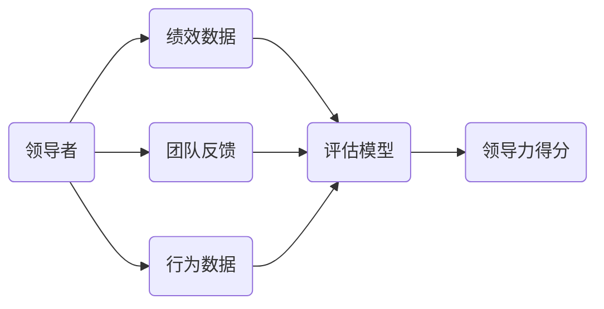
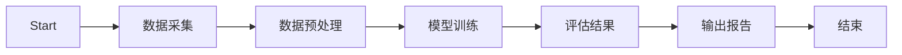
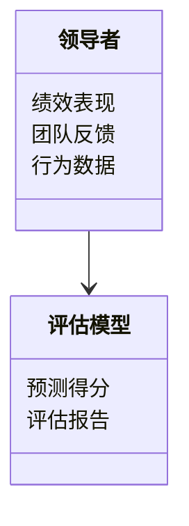
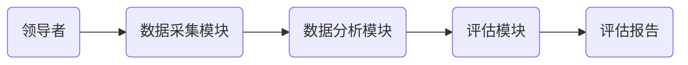

                 


# AI驱动的管理层能力评估：量化领导力对公司价值的影响

> 关键词：AI、领导力评估、公司价值、量化领导力、数据驱动决策

> 摘要：本文探讨了如何利用AI技术量化领导力对公司价值的影响，通过详细分析AI在领导力评估中的应用原理、算法实现、系统架构以及实际案例，展示了AI如何帮助公司优化管理层能力，提升企业绩效。

---

## 第1章: AI驱动的管理层能力评估背景介绍

### 1.1 问题背景与描述

#### 1.1.1 管理层能力评估的现状与挑战
现代企业面临着复杂多变的市场环境，管理层的能力直接关系到企业的生存与发展。然而，传统的领导力评估方法存在以下挑战：
- 主观性过强：依赖主观判断，缺乏客观数据支持。
- 评估维度单一：通常只关注部分能力，忽视整体表现。
- 数据孤岛：各部门数据分散，难以整合。

#### 1.1.2 问题解决与边界定义
AI技术的引入为领导力评估提供了新的解决方案：
- 数据驱动决策：通过收集和分析大量数据，提供客观、量化的评估结果。
- 全面性：AI能够整合多维度数据，全面评估领导者的各项能力。
- 实时反馈：AI系统可以实时监控领导者的绩效表现。

#### 1.1.3 核心概念的结构与组成
AI驱动的领导力评估系统包括以下核心组件：
1. 数据采集模块：收集领导者的行为数据、绩效数据和团队反馈。
2. 数据分析模块：利用机器学习算法对数据进行处理和建模。
3. 评估模块：生成领导者的综合评估报告。
4. 反馈与优化模块：提供个性化的反馈和改进建议。

---

### 1.2 核心概念与联系

#### 1.2.1 AI与领导力评估的关系
AI通过以下方式影响领导力评估：
- 数据处理：AI能够快速处理大量数据，提取关键指标。
- 模型构建：基于机器学习的模型可以预测领导者的潜在表现。
- 个性化反馈：AI可以根据个体差异提供定制化的评估结果。

#### 1.2.2 领导力与公司价值的关联
领导力是公司价值的核心驱动因素之一。通过量化领导力，企业可以：
- 优化领导团队：识别高潜力领导者，提升团队整体绩效。
- 提高决策效率：基于数据的决策更加科学和精准。
- 增强组织韧性：通过动态评估及时发现并解决问题。

#### 1.2.3 数据驱动决策的必要性
数据驱动决策能够帮助企业在复杂环境中做出最优选择，具体表现为：
- 提高决策的透明度和可追溯性。
- 降低人为偏差，确保评估结果的客观性。
- 为长期战略规划提供可靠依据。

---

## 第2章: AI驱动的领导力评估核心概念

### 2.1 核心概念原理

#### 2.1.1 AI在领导力评估中的应用原理
AI通过以下步骤实现领导力评估：
1. 数据收集：整合领导者的历史数据、行为数据和团队反馈。
2. 数据预处理：清洗和标准化数据，确保数据质量。
3. 模型训练：利用机器学习算法构建评估模型。
4. 结果输出：生成评估报告并提供改进建议。

#### 2.1.2 数据驱动决策的数学模型
领导力评估模型基于以下数学模型：
$$
\text{领导力得分} = \alpha \cdot \text{绩效表现} + \beta \cdot \text{团队反馈} + \gamma \cdot \text{行为数据}
$$
其中，$\alpha$、$\beta$、$\gamma$是模型权重，通过训练数据优化得出。

#### 2.1.3 领导力评估的指标体系
常见的领导力评估指标包括：
1. 战略思维能力
2. 沟通与协调能力
3. 团队管理能力
4. 决策能力
5. 创新能力

---

### 2.2 核心概念属性对比

#### 2.2.1 领导力评估方法对比表格

| 评估方法 | 优点 | 缺点 |
|----------|------|------|
| 传统主观评估 | 操作简单 | 主观性强，缺乏数据支持 |
| 数据驱动评估 | 客观、全面 | 数据收集和处理成本高 |
| AI驱动评估 | 高效、精准 | 对技术依赖性强 |

#### 2.2.2 不同评估模型的优缺点分析
- 传统模型：适用于小型组织，但难以应对复杂场景。
- 数据驱动模型：适合中大型企业，能够提供较全面的评估结果。
- AI驱动模型：在数据充足的情况下，能够提供高精度的评估结果。

#### 2.2.3 实体关系图（ER图）



---

## 第3章: AI驱动的领导力评估算法原理

### 3.1 算法原理讲解

#### 3.1.1 算法流程图



#### 3.1.2 算法实现的 Python 源代码

```python
import pandas as pd
from sklearn.model import LinearRegression

# 数据加载与预处理
data = pd.read_csv('leadership_data.csv')
X = data[['绩效表现', '团队反馈', '行为数据']]
y = data['领导力得分']

# 模型训练
model = LinearRegression()
model.fit(X, y)

# 评估结果
predictions = model.predict(X)
print('预测结果:', predictions)
```

---

### 3.2 数学模型与公式

#### 3.2.1 领导力评估的数学模型
$$
\text{预测得分} = \beta_0 + \beta_1 \cdot \text{绩效表现} + \beta_2 \cdot \text{团队反馈} + \beta_3 \cdot \text{行为数据}
$$

其中，$\beta_0$是截距，$\beta_1$、$\beta_2$、$\beta_3$是回归系数，通过最小二乘法优化得出。

#### 3.2.2 关键公式与推导过程
回归模型的优化目标是最小化预测值与实际值的平方差之和：
$$
\text{最小化} \sum_{i=1}^{n} (y_i - \hat{y}_i)^2
$$

---

### 3.3 举例说明

#### 3.3.1 典型案例分析
假设某公司领导者的历史数据如下：

| 绩效表现 | 团队反馈 | 行为数据 | 领导力得分 |
|----------|----------|----------|------------|
| 80       | 75       | 85       | 80         |

通过模型训练，得到回归系数：
$$
\beta_0 = 50, \quad \beta_1 = 0.5, \quad \beta_2 = 0.4, \quad \beta_3 = 0.6
$$

预测得分：
$$
\hat{y} = 50 + 0.5 \cdot 80 + 0.4 \cdot 75 + 0.6 \cdot 85 = 80
$$

预测结果与实际结果一致，模型表现良好。

#### 3.3.2 通俗易懂的解释
通过AI算法，我们可以将领导者的绩效表现、团队反馈和行为数据转化为具体的分数，从而量化其领导力水平。这种量化方法能够帮助企业在招聘、晋升和培训决策中更加科学。

---

## 第4章: 领导力评估系统分析与架构设计

### 4.1 系统功能设计

#### 4.1.1 领域模型 Mermaid 类图



#### 4.1.2 系统架构设计 Mermaid 图



---

## 第5章: 项目实战与案例分析

### 5.1 环境安装与配置

#### 5.1.1 开发环境搭建
- Python 3.8+
- Jupyter Notebook
- Pandas、Scikit-learn库

#### 5.1.2 数据集准备
下载领导力评估数据集（例如：CSV格式）。

---

### 5.2 核心代码实现

#### 5.2.1 代码实现与解读

```python
import pandas as pd
from sklearn.model import LinearRegression

# 数据加载
data = pd.read_csv('leadership_data.csv')

# 特征与目标变量
X = data[['绩效表现', '团队反馈', '行为数据']]
y = data['领导力得分']

# 模型训练
model = LinearRegression()
model.fit(X, y)

# 预测与评估
 predictions = model.predict(X)
 print('预测结果:', predictions)
```

---

### 5.3 案例分析与总结

#### 5.3.1 典型案例分析
通过实际数据训练模型，验证其预测能力，并分析误差来源。

#### 5.3.2 项目小结与经验分享
总结项目实施的经验和教训，提出改进建议。

---

## 第6章: 最佳实践与注意事项

### 6.1 最佳实践 tips

#### 6.1.1 数据收集与处理
- 确保数据的完整性和准确性。
- 使用数据清洗技术处理缺失值和异常值。

#### 6.1.2 模型优化
- 调整模型参数，优化算法性能。
- 使用交叉验证评估模型的泛化能力。

#### 6.1.3 系统部署与维护
- 采用云部署，确保系统的可扩展性。
- 定期更新模型，适应业务变化。

---

### 6.2 注意事项与风险提示

#### 6.2.1 数据隐私与合规性
- 遵守数据保护法规，确保数据安全。
- 获取相关人员的知情同意。

#### 6.2.2 模型局限性
- AI模型可能存在偏差，需结合人工判断。
- 数据质量直接影响评估结果的准确性。

#### 6.2.3 系统性能优化
- 优化算法复杂度，提升处理速度。
- 使用分布式计算，提高数据处理能力。

---

### 6.3 拓展阅读与未来方向

#### 6.3.1 相关领域推荐书籍
- 《领导力21法则》
- 《数据驱动的决策》

#### 6.3.2 未来研究方向
- 结合自然语言处理技术，分析领导者沟通能力。
- 研究多模态数据的融合方法，提升评估精度。

#### 6.3.3 技术发展趋势
- 深度学习在领导力评估中的应用。
- 自适应模型的开发与部署。

---

## 第7章: 总结与展望

### 7.1 全书总结
通过本文的介绍，读者可以了解到AI如何驱动领导力评估的变革，量化领导力对公司价值的影响。

### 7.2 未来展望
随着AI技术的不断发展，领导力评估将更加智能化和个性化。未来的研究将聚焦于如何进一步提升评估的精度和实用性。

---

## 作者：AI天才研究院 & 禅与计算机程序设计艺术

---

以上是《AI驱动的管理层能力评估：量化领导力对公司价值的影响》的技术博客文章的完整大纲和内容。通过系统化的分析与实践，本文详细阐述了AI在领导力评估中的应用，为企业的领导力管理提供了新的思路和解决方案。

