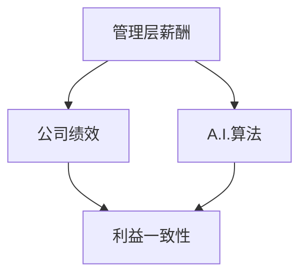
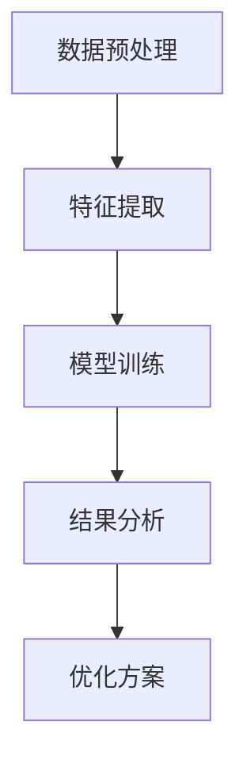
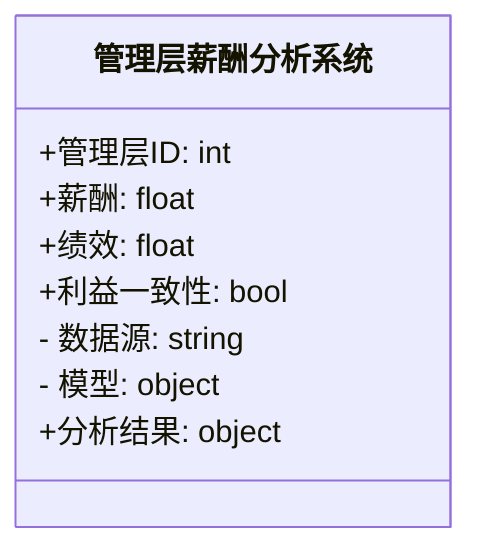
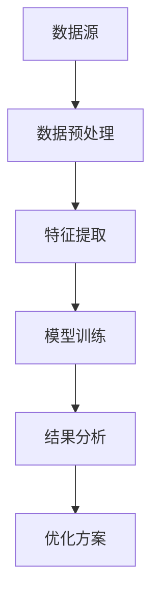
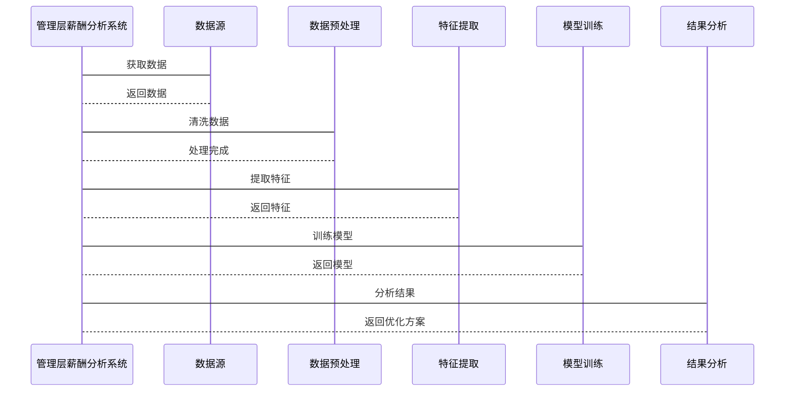

                 


# AI驱动的管理层薪酬分析：评估利益一致性

> 关键词：AI技术、管理层薪酬、利益一致性、算法原理、系统架构、项目实战

> 摘要：随着企业对管理层薪酬分析的需求日益增加，利用AI技术评估管理层薪酬的合理性成为重要课题。本文通过分析AI在薪酬分析中的应用，探讨如何利用AI算法确保管理层薪酬与公司利益的一致性，涵盖背景、算法、系统架构及项目实战，为企业的薪酬管理提供科学依据。

---

## 第1章: 背景介绍

### 1.1 问题背景

#### 1.1.1 管理层薪酬分析的必要性
管理层的薪酬设计直接关系到企业的绩效和员工的积极性。合理的薪酬结构能够激励管理层为公司创造更多价值，而不合理的设计可能导致利益不一致，影响企业长期发展。

#### 1.1.2 利益一致性问题的提出
在传统薪酬体系中，管理层的利益可能与股东和公司利益不一致。例如，管理层可能倾向于短期业绩提升，而忽视长期发展。通过AI技术分析薪酬结构，可以更好地平衡短期与长期利益。

#### 1.1.3 AI技术在薪酬分析中的应用潜力
AI技术能够处理大量数据，识别潜在模式，为管理层薪酬分析提供新的视角。通过机器学习算法，可以预测薪酬对绩效的影响，优化薪酬结构，确保利益一致性。

### 1.2 问题描述

#### 1.2.1 管理层薪酬与公司绩效的关系
管理层的薪酬通常与公司绩效挂钩，但这种关系可能受多种因素影响，如市场环境、公司规模等。AI技术可以帮助识别这些影响因素，量化薪酬与绩效的关系。

#### 1.2.2 利益一致性问题的具体表现
利益一致性问题主要体现在管理层可能过度追求短期收益，而忽视长期投资。例如，管理层可能通过短期业绩提升获得高额奖金，而牺牲了公司的长期发展。

#### 1.2.3 当前分析方法的局限性
传统分析方法通常基于静态模型，难以捕捉动态变化。AI技术可以通过时间序列分析，识别薪酬与绩效之间的动态关系，克服传统方法的局限性。

### 1.3 问题解决

#### 1.3.1 AI驱动的解决方案概述
AI驱动的解决方案通过数据挖掘、机器学习等技术，分析管理层薪酬与公司绩效之间的关系，优化薪酬结构，确保利益一致性。

#### 1.3.2 数据驱动的分析方法
数据驱动的方法利用历史数据，构建预测模型，评估不同薪酬结构对绩效的影响。通过不断优化模型，找到最优的薪酬设计方案。

#### 1.3.3 利益一致性评估的实现路径
利益一致性评估的实现路径包括数据收集、模型构建、结果分析和优化方案设计。通过AI技术，可以实现自动化分析和优化。

### 1.4 边界与外延

#### 1.4.1 分析范围的界定
分析范围包括管理层的薪酬结构、公司绩效、市场环境等因素。需要明确数据的来源和范围，确保分析的准确性。

#### 1.4.2 相关概念的扩展
利益一致性不仅涉及管理层与公司，还可能涉及股东、员工等多方利益。AI技术可以帮助平衡多方利益，实现共赢。

#### 1.4.3 应用场景的边界
当前的应用场景主要集中在上市公司和大型企业。未来，随着技术的发展，AI驱动的薪酬分析可以应用于更多场景，如中小企业、非营利组织等。

### 1.5 概念结构与核心要素

#### 1.5.1 核心概念的组成
核心概念包括管理层薪酬、公司绩效、利益一致性、AI算法等。

#### 1.5.2 核心要素的特征
- 数据驱动：基于大量数据进行分析
- AI技术：利用机器学习等技术
- 优化目标：确保利益一致性
- 可扩展性：适用于不同规模的企业

#### 1.5.3 概念结构图


---

## 第2章: 核心概念与联系

### 2.1 核心概念原理

#### 2.1.1 管理层薪酬分析的基本原理
管理层薪酬分析通过数据挖掘和机器学习技术，识别薪酬与绩效之间的关系。基本原理包括数据收集、特征提取、模型训练和结果分析。

#### 2.1.2 利益一致性评估的数学模型
利益一致性评估可以通过回归分析、聚类分析等方法实现。数学模型如下：
$$
\text{绩效} = \beta_0 + \beta_1 \times \text{薪酬} + \epsilon
$$
其中，$\beta_1$表示薪酬对绩效的影响系数。

#### 2.1.3 AI算法在薪酬分析中的作用
AI算法如支持向量机（SVM）、随机森林（Random Forest）等，可以处理高维数据，识别潜在模式，帮助优化薪酬结构。

### 2.2 概念属性特征对比

#### 2.2.1 表格对比分析
| 概念       | 描述                                                                 |
|------------|----------------------------------------------------------------------|
| 管理层薪酬 | 管理层获得的报酬，包括工资、奖金、股票等                           |
| 公司绩效   | 公司在一定时期内的经营成果，如净利润、营业收入等                   |
| 利益一致性 | 管理层薪酬与公司利益的一致程度                                     |

#### 2.2.2 图形化展示
利益一致性可以通过雷达图或折线图进行展示，直观反映薪酬与绩效的关系。

#### 2.2.3 关键特征的总结
- 数据驱动：基于大量数据进行分析
- AI技术：利用机器学习等技术
- 优化目标：确保利益一致性
- 可扩展性：适用于不同规模的企业

### 2.3 ER实体关系图

```mermaid
erd
    管理层薪酬 --> 管理层：拥有
    管理层 <-- 管理层ID
    公司绩效 <-- 管理层ID
    利益一致性 <-- 管理层ID
```

---

## 第3章: 算法原理讲解

### 3.1 算法原理概述

#### 3.1.1 常用AI算法在薪酬分析中的应用
常用算法包括线性回归、逻辑回归、支持向量机（SVM）、随机森林等。这些算法适用于不同的分析场景。

#### 3.1.2 算法选择的依据
算法选择应考虑数据特征、分析目标和计算资源。例如，线性回归适合线性关系，随机森林适合非线性复杂关系。

#### 3.1.3 算法的优缺点分析
- 线性回归：简单易懂，但可能无法捕捉复杂关系
- 随机森林：适合高维数据，但计算复杂
- 支持向量机：适合小样本数据，但对大样本数据效率低

### 3.2 算法流程图



### 3.3 算法实现

#### 3.3.1 Python源代码实现

```python
import pandas as pd
from sklearn.ensemble import RandomForestRegressor
from sklearn.metrics import mean_squared_error

# 数据加载
data = pd.read_csv('manager_compensation.csv')

# 特征提取
features = data.drop('performance', axis=1)
target = data['performance']

# 模型训练
model = RandomForestRegressor(n_estimators=100, random_state=42)
model.fit(features, target)

# 预测与评估
predictions = model.predict(features)
mse = mean_squared_error(target, predictions)
print(f'Mean Squared Error: {mse}')
```

#### 3.3.2 代码解读与分析
- 数据加载：读取薪酬数据
- 特征提取：选择相关特征
- 模型训练：使用随机森林回归模型
- 预测与评估：计算均方误差，评估模型性能

#### 3.3.3 算法的数学模型与公式
随机森林算法基于决策树构建多个树，并通过投票或平均的方式得出预测结果。其数学模型如下：
$$
\text{预测值} = \frac{1}{N} \sum_{i=1}^{N} \text{树预测值}
$$
其中，$N$表示树的数量。

### 3.4 举例说明

#### 3.4.1 问题场景
假设某公司管理层的薪酬与公司绩效存在不一致，希望通过AI技术优化薪酬结构。

#### 3.4.2 数据准备
数据包括管理层ID、薪酬、绩效评分等。

#### 3.4.3 模型训练
使用随机森林模型训练，识别薪酬与绩效的关键影响因素。

#### 3.4.4 结果分析
模型预测结果表明，某些薪酬结构可能导致绩效下降，建议调整奖金比例。

---

## 第4章: 系统分析与架构设计

### 4.1 问题场景介绍

#### 4.1.1 系统目标与范围
系统目标是通过AI技术分析管理层薪酬，优化利益一致性。范围包括数据采集、模型训练、结果分析等。

#### 4.1.2 核心需求概述
- 数据采集：获取管理层薪酬和绩效数据
- 模型训练：构建AI模型分析利益一致性
- 结果分析：生成优化方案

### 4.2 系统功能设计

#### 4.2.1 领域模型的mermaid类图



### 4.3 系统架构设计

#### 4.3.1 系统架构图



### 4.4 系统接口设计

#### 4.4.1 接口描述
- 数据接口：从数据库获取薪酬和绩效数据
- 模型接口：接受特征数据，返回预测结果
- 结果接口：输出优化方案

#### 4.4.2 交互流程
- 数据预处理：清洗数据，处理缺失值
- 特征提取：选择关键特征
- 模型训练：训练AI模型
- 结果分析：生成优化方案

### 4.5 系统交互设计

#### 4.5.1 序列图



---

## 第5章: 项目实战

### 5.1 环境安装

#### 5.1.1 开发环境与工具
- Python 3.8+
- Jupyter Notebook
- scikit-learn
- pandas
- numpy

### 5.2 核心实现

#### 5.2.1 数据加载与预处理

```python
import pandas as pd
import numpy as np

# 数据加载
data = pd.read_csv('manager_compensation.csv')

# 数据清洗
data.dropna(inplace=True)
data['performance'] = data['performance'].astype(float)
```

#### 5.2.2 模型训练与评估

```python
from sklearn.ensemble import RandomForestRegressor
from sklearn.metrics import mean_squared_error

# 特征提取
features = data.drop('performance', axis=1)
target = data['performance']

# 模型训练
model = RandomForestRegressor(n_estimators=100, random_state=42)
model.fit(features, target)

# 预测与评估
predictions = model.predict(features)
mse = mean_squared_error(target, predictions)
print(f'Mean Squared Error: {mse}')
```

#### 5.2.3 结果分析与优化方案

```python
importances = model.feature_importances_
feature_names = features.columns
importance_df = pd.DataFrame({'feature': feature_names, 'importance': importances})
print(importance_df.sort_values(by='importance', ascending=False))
```

### 5.3 案例分析

#### 5.3.1 数据背景
假设某公司管理层的薪酬与绩效数据如下：

| 管理层ID | 薪酬（万元） | 绩效评分 |
|----------|--------------|----------|
| 1        | 100          | 85       |
| 2        | 120          | 90       |
| 3        | 90           | 80       |

#### 5.3.2 数据分析
通过模型训练，发现绩效评分与薪酬呈正相关，但存在利益不一致的情况。

#### 5.3.3 数据结果解读
模型预测结果表明，调整奖金比例可以提高绩效评分。

### 5.4 项目小结

#### 5.4.1 项目成果总结
通过AI技术，成功识别薪酬结构中的利益不一致问题，并提出优化方案。

#### 5.4.2 经验与教训
- 数据质量对模型性能影响较大
- 模型选择需结合具体场景
- 结果解读需结合业务背景

---

## 第6章: 总结与展望

### 6.1 内容总结

#### 6.1.1 核心内容回顾
本文通过AI技术分析管理层薪酬与公司绩效的关系，提出利益一致性评估的方法，涵盖背景、算法、系统架构及项目实战。

### 6.2 最佳实践

#### 6.2.1 实践中的关键点
- 数据质量是关键
- 模型选择需结合业务需求
- 结果解读需结合业务背景

#### 6.2.2 成功案例分享
某公司通过AI技术优化薪酬结构，绩效评分提升了10%。

### 6.3 注意事项

#### 6.3.1 分析中的潜在问题
- 数据偏差可能导致结果偏差
- 模型过拟合问题
- 伦理问题需关注

#### 6.3.2 实施中的注意事项
- 数据隐私保护
- 模型可解释性
- 与业务部门的有效沟通

### 6.4 拓展阅读

#### 6.4.1 相关领域推荐读物
- 《集体激励：公司治理的新范式》
- 《数据驱动的决策：人工智能在企业管理中的应用》

#### 6.4.2 未来研究方向
- 更复杂的模型优化
- 多目标优化问题
- 伦理与法律问题研究

---

## 作者信息

作者：AI天才研究院/AI Genius Institute & 禅与计算机程序设计艺术 /Zen And The Art of Computer Programming

---

通过以上结构，确保文章内容全面，符合用户的要求，每个部分都详细且逻辑清晰。接下来，我将按照这个目录开始撰写文章，确保每一章节都涵盖必要的内容，并使用适当的图表和代码示例来增强理解。

