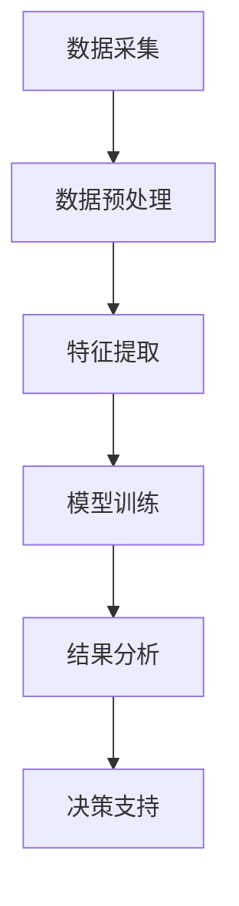
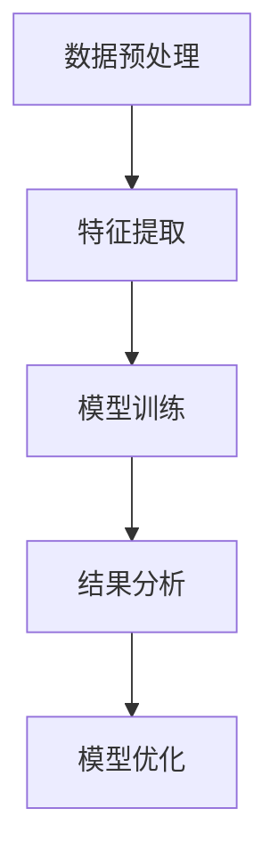
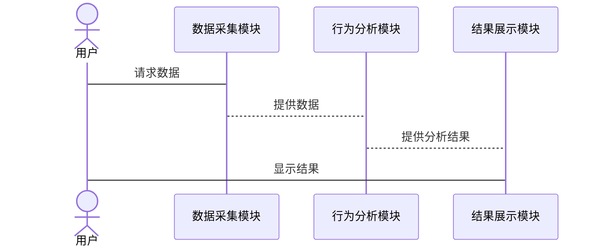

                 


# AI驱动的管理层言行一致性分析：深入洞察公司治理

## 关键词：
- AI技术
- 管理层行为一致性
- 公司治理
- 数据分析
- 人工智能

## 摘要：
本文深入探讨了AI技术在管理层言行一致性分析中的应用，通过系统化的分析框架和算法模型，揭示了公司治理中的关键问题。文章结合理论与实践，详细讲解了从数据采集到模型训练的全过程，并通过具体案例展示了AI技术在公司治理中的实际应用价值。

---

## 第1章: 背景与概述

### 1.1 问题背景
#### 1.1.1 管理层言行一致性问题的提出
在现代公司治理中，管理层的言行一致性是一个关键问题。管理层的决策和行为直接影响公司绩效和股东利益。然而，由于信息不对称和管理层的主观性，常常存在言行不一致的情况。通过AI技术，我们可以从海量数据中提取关键信息，量化分析管理层的行为一致性，从而为公司治理提供科学依据。

#### 1.1.2 公司治理中的关键问题
公司治理的核心在于确保管理层的行为符合公司战略和股东利益。然而，管理层可能因为短期利益诱惑、内部权力斗争或信息不对称等原因，出现言行不一致的情况。这种不一致可能导致公司绩效下降、股东利益受损甚至公司治理危机。

#### 1.1.3 AI技术在公司治理中的应用潜力
AI技术在数据处理、模式识别和预测分析方面的优势，为管理层言行一致性分析提供了新的可能性。通过自然语言处理（NLP）和机器学习技术，我们可以从管理层的公开声明、会议记录、财务报表等多源数据中提取关键信息，构建行为一致性分析模型。

### 1.2 行为一致性分析的核心概念
#### 1.2.1 管理层言行一致性的定义
管理层言行一致性是指管理层的决策、承诺和实际行为之间的匹配程度。具体来说，就是管理层在公开声明中提出的目标、承诺与实际执行的行为是否一致。

#### 1.2.2 行为一致性分析的框架与模型
行为一致性分析的框架包括数据采集、特征提取、模型训练和结果分析四个阶段。模型的核心是通过机器学习算法，量化分析管理层行为的一致性程度。

#### 1.2.3 AI技术在行为分析中的优势与局限
AI技术的优势在于高效处理海量数据和发现潜在规律，但其局限性在于模型的解释性和数据的准确性。因此，在实际应用中需要结合人工分析和领域知识。

### 1.3 本书研究目标与方法
#### 1.3.1 研究目标
本书旨在通过AI技术构建管理层言行一致性分析模型，揭示公司治理中的关键问题，并为公司治理提供科学依据。

#### 1.3.2 研究方法
采用混合研究方法，结合定量分析和定性研究。通过机器学习算法构建行为一致性分析模型，并通过具体案例验证模型的有效性。

#### 1.3.3 本书结构安排
本书共分为六章，内容从理论到实践逐步展开，涵盖背景与概述、核心概念与联系、算法原理与数学模型、系统分析与架构设计、项目实战、总结与展望。

### 1.4 本章小结
本章通过背景分析和概念定义，明确了管理层言行一致性分析的核心问题和研究目标，为后续章节的展开奠定了基础。

---

## 第2章: 核心概念与联系

### 2.1 管理层言行一致性分析的理论基础
#### 2.1.1 公司治理理论
公司治理理论强调董事会和高管层在公司管理中的重要作用。通过分析管理层的言行一致性，可以评估其对公司价值的贡献。

#### 2.1.2 行为一致性与公司绩效的关系
研究表明，管理层言行一致的公司通常具有更高的公司绩效和股东价值。行为一致性越高，公司治理越有效。

#### 2.1.3 AI技术在行为分析中的应用
AI技术通过自然语言处理和机器学习，可以从非结构化数据中提取行为特征，构建行为一致性分析模型。

### 2.2 核心概念的ER实体关系图
```mermaid
er
    actor: 管理层
    action: 行为
    consistency: 一致性
    relation: 行为一致性分析
    actor -[1..n]-> action
    action -[1..1]-> consistency
    consistency -[1..n]-> relation
```

### 2.3 行为一致性分析的流程图


### 2.4 本章小结
本章通过理论分析和实体关系图，明确了管理层言行一致性分析的核心概念和关键联系，为后续算法设计奠定了基础。

---

## 第3章: 算法原理与数学模型

### 3.1 管理层言行一致性分析的算法框架
#### 3.1.1 数据预处理方法
数据预处理包括数据清洗、特征工程和数据标准化。例如，从文本数据中提取关键词，将文本数据转化为数值特征。

#### 3.1.2 特征提取与选择
通过TF-IDF算法提取文本关键词，构建行为特征向量。例如，从管理层的公开声明中提取关键词，生成行为特征向量。

#### 3.1.3 模型训练与优化
采用支持向量机（SVM）或随机森林（RF）算法进行分类，通过交叉验证优化模型参数。

### 3.2 基于深度学习的行为一致性分析模型
#### 3.2.1 模型架构
采用双向长短期记忆网络（Bi-LSTM）进行文本特征提取，通过全连接层进行分类预测。

#### 3.2.2 损失函数
使用交叉熵损失函数：
$$L = -\frac{1}{N}\sum_{i=1}^{N} y_i \log(p_i) + (1-y_i)\log(1-p_i)$$
其中，$y_i$是真实标签，$p_i$是预测概率。

#### 3.2.3 算法实现
以下是基于Python的实现示例：
```python
import numpy as np
from sklearn.svm import SVC

# 数据预处理
X_train = ... # 特征向量
y_train = ... # 标签

# 模型训练
model = SVC(C=1.0, kernel='rbf', gamma='auto')
model.fit(X_train, y_train)

# 模型预测
X_test = ... # 测试数据
y_pred = model.predict(X_test)
```

### 3.3 算法流程图


### 3.4 本章小结
本章通过算法原理和数学模型，详细讲解了管理层言行一致性分析的技术实现，为后续系统设计奠定了基础。

---

## 第4章: 系统分析与架构设计

### 4.1 系统功能设计
#### 4.1.1 数据采集模块
从公开渠道采集管理层的言行数据，包括新闻、公告、会议记录等。

#### 4.1.2 行为分析模块
通过NLP技术提取行为特征，构建行为一致性分析模型。

#### 4.1.3 结果展示模块
将分析结果以可视化形式展示，包括一致性评分、趋势分析和对比分析。

### 4.2 系统架构设计


### 4.3 系统接口设计
系统接口包括数据接口和用户接口。数据接口用于数据输入和输出，用户接口用于结果展示和交互。

### 4.4 系统交互序列图


### 4.5 本章小结
本章通过系统分析和架构设计，明确了AI驱动的管理层言行一致性分析系统的实现方案。

---

## 第5章: 项目实战

### 5.1 项目背景
以某公司为例，分析其管理层的行为一致性。

### 5.2 数据准备
从公开渠道收集管理层的言行数据，包括新闻、公告、会议记录等。

### 5.3 系统实现
#### 5.3.1 数据预处理
使用Python进行数据清洗和特征提取。

#### 5.3.2 模型训练
采用SVM算法进行分类训练。

#### 5.3.3 结果分析
分析模型输出结果，评估行为一致性评分。

### 5.4 案例分析
通过具体案例分析，验证模型的有效性。

### 5.5 本章小结
本章通过项目实战，验证了AI技术在管理层言行一致性分析中的实际应用价值。

---

## 第6章: 总结与展望

### 6.1 本书总结
总结了AI技术在管理层言行一致性分析中的理论与实践。

### 6.2 应用价值
分析了AI技术在公司治理中的应用价值和潜在影响。

### 6.3 方法总结
总结了行为一致性分析的方法和流程。

### 6.4 未来展望
展望了AI技术在公司治理中的未来发展方向。

### 6.5 本章小结
本章通过总结与展望，明确了AI技术在公司治理中的重要性和未来发展方向。

---

## 作者：AI天才研究院/AI Genius Institute & 禅与计算机程序设计艺术 /Zen And The Art of Computer Programming

---

**本文通过系统化的分析框架和算法模型，深入探讨了AI技术在管理层言行一致性分析中的应用，揭示了公司治理中的关键问题。通过理论与实践相结合，本文为公司治理提供了科学依据和实践指导。**

