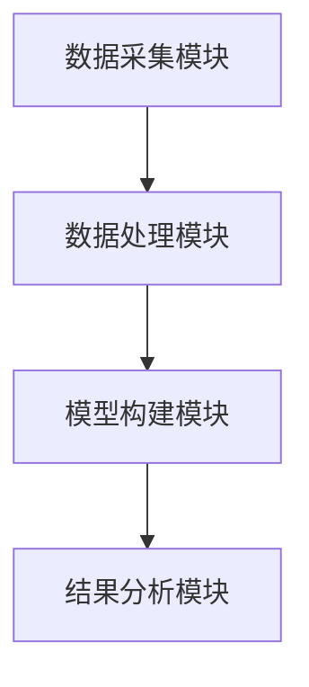
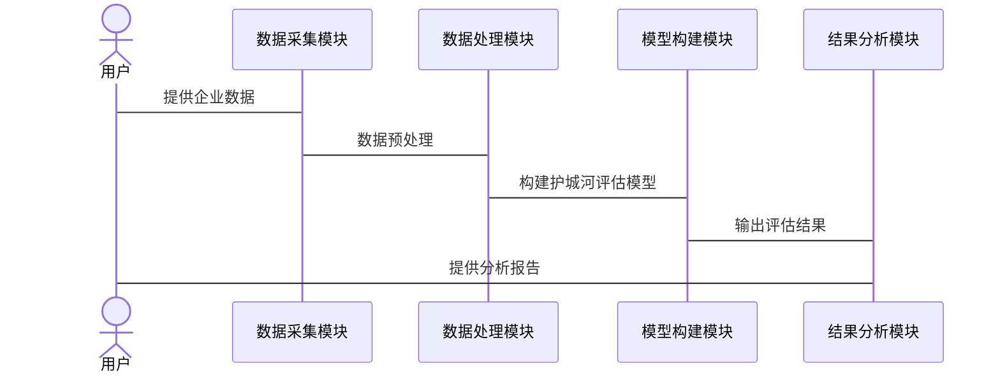

                 


# AI驱动的经济护城河评估：价值投资中的多智能体应用

---

## 关键词：
- AI驱动
- 经济护城河评估
- 多智能体系统
- 价值投资
- 投资策略优化

---

## 摘要：
本文深入探讨了人工智能（AI）在经济护城河评估中的应用，特别是在价值投资中的多智能体系统的应用。文章首先介绍了经济护城河的基本概念和AI在金融投资中的应用现状，然后详细阐述了多智能体协同学习在护城河评估中的优势。通过数学模型和算法流程图，本文详细解释了多智能体协同学习的原理及其在护城河评估中的具体应用。最后，文章通过实际案例分析展示了如何利用多智能体系统进行经济护城河评估，并总结了最佳实践和投资策略优化的建议。

---

# 第一部分: AI驱动的经济护城河评估背景与基础

## 第1章: 经济护城河的基本概念

### 1.1 经济护城河的定义与内涵

#### 1.1.1 经济护城河的定义
经济护城河是指企业在市场中形成的竞争优势，使其能够抵御竞争对手的侵蚀并保持长期盈利能力。这些竞争优势可以来自成本优势、资源控制、品牌影响力、技术壁垒等多个方面。

#### 1.1.2 经济护城河的核心要素
经济护城河的核心要素包括：
- **成本优势**：企业能够在低于竞争对手的成本下提供产品或服务。
- **资源控制**：企业拥有独特的资源或数据，使其在行业中占据优势。
- **品牌影响力**：强大的品牌认知度能够吸引更多的客户。
- **技术壁垒**：拥有专利技术或独特的研发能力，防止竞争对手复制。

#### 1.1.3 护城河的类型与特征对比
以下是几种常见护城河类型的特征对比：

| 护城河类型   | 特征描述                                                                 |
|--------------|--------------------------------------------------------------------------|
| 成本优势     | 低成本生产模式，能够以更低的价格提供产品或服务。                      |
| 资源控制     | 拥有独特的资源，如专利、专有技术或特定行业数据。                     |
| 品牌影响力   | 强大的品牌认知度，客户更倾向于选择知名品牌的产品或服务。               |
| 技术壁垒     | 通过技术专利或复杂的技术流程，防止竞争对手快速复制。                |

### 1.2 价值投资中的经济护城河评估

#### 1.2.1 价值投资的基本原理
价值投资是一种投资策略，旨在通过寻找市场价格低于其内在价值的股票进行投资。其核心在于识别那些具有长期竞争优势和稳定盈利能力的公司。

#### 1.2.2 经济护城河在价值投资中的作用
在价值投资中，经济护城河是评估企业长期竞争力的关键指标。拥有强大护城河的企业能够在市场中持续盈利，为投资者带来稳定的回报。

#### 1.2.3 护城河评估的挑战与难点
护城河评估的难点在于如何准确量化企业的竞争优势。传统的财务指标往往无法完全反映企业的护城河强度，因此需要结合多维度的分析。

---

## 第2章: AI在金融投资中的应用现状

### 2.1 人工智能在金融领域的应用概述

#### 2.1.1 AI在金融数据分析中的应用
人工智能技术在金融数据分析中的应用包括：
- **数据清洗**：通过机器学习算法自动识别和处理异常数据。
- **模式识别**：利用AI技术发现数据中的隐藏模式，帮助投资者识别潜在的投资机会。

#### 2.1.2 AI在风险评估与管理中的应用
AI在风险评估中的应用包括：
- **信用评分**：通过机器学习模型评估客户的信用风险。
- **市场风险预测**：利用AI技术预测市场波动，帮助投资者规避风险。

#### 2.1.3 AI在投资策略优化中的应用
AI在投资策略优化中的应用包括：
- **量化交易**：通过算法交易系统实现自动化的投资决策。
- **策略优化**：利用AI技术优化投资组合，提高收益并降低风险。

### 2.2 多智能体系统在金融投资中的优势

#### 2.2.1 多智能体系统的定义与特点
多智能体系统是由多个相互作用的智能体组成的系统，这些智能体能够通过协同工作实现复杂的任务。其特点包括：
- **分布式智能**：智能体之间通过局部信息进行决策。
- **协同合作**：智能体之间通过通信和协调实现共同目标。

#### 2.2.2 多智能体在金融投资中的应用场景
多智能体在金融投资中的应用场景包括：
- **量化交易**：通过多智能体协同完成复杂的交易策略。
- **市场预测**：利用多智能体系统预测市场趋势，提供投资建议。

#### 2.2.3 多智能体系统的优势与挑战
多智能体系统的优势在于能够通过分布式计算提高系统的容错性和鲁棒性。然而，其挑战在于智能体之间的通信和协调需要复杂的算法支持。

---

## 第3章: 经济护城河评估的核心概念

### 3.1 经济护城河评估的框架与模型

#### 3.1.1 经济护城河评估的基本框架
经济护城河评估的基本框架包括以下几个步骤：
1. **数据收集**：收集企业的财务数据、市场数据等。
2. **数据分析**：通过数据分析识别企业的竞争优势。
3. **模型构建**：构建护城河评估模型，量化企业的护城河强度。

#### 3.1.2 多智能体模型在护城河评估中的应用
多智能体模型在护城河评估中的应用包括：
- **数据处理**：通过多智能体协同完成数据清洗和特征提取。
- **模型优化**：利用多智能体系统优化护城河评估模型。

#### 3.1.3 护城河评估的关键指标与权重分配
护城河评估的关键指标包括：
- **成本优势**：企业的生产成本相对于竞争对手的优势。
- **资源控制**：企业拥有的独特资源和数据。
- **品牌影响力**：品牌的市场认知度和客户忠诚度。

---

## 第4章: 多智能体协同学习算法

### 4.1 多智能体协同学习的基本原理

#### 4.1.1 多智能体协同学习的定义
多智能体协同学习是指多个智能体通过协同工作，共同完成一个复杂任务的学习过程。

#### 4.1.2 多智能体协同学习的优势
多智能体协同学习的优势包括：
- **分布式计算**：通过分布式计算提高系统的计算效率。
- **任务分解**：将复杂任务分解为多个子任务，由不同智能体完成。

### 4.2 多智能体协同学习的算法实现

#### 4.2.1 基于Q-learning的多智能体协同学习
Q-learning是一种经典的强化学习算法，适用于多智能体协同学习。其基本公式为：

$$ Q(s, a) = (1 - \alpha) Q(s, a) + \alpha [r + \max_{a'} Q(s', a')] $$

其中，\( s \) 是状态，\( a \) 是动作，\( \alpha \) 是学习率，\( r \) 是奖励，\( s' \) 是下一个状态。

#### 4.2.2 多智能体协同学习的应用场景
多智能体协同学习的应用场景包括：
- **量化交易**：通过多智能体协同完成复杂的交易策略。
- **市场预测**：利用多智能体系统预测市场趋势。

---

## 第5章: 系统分析与架构设计方案

### 5.1 系统功能设计

#### 5.1.1 系统功能模块
经济护城河评估系统的功能模块包括：
1. **数据采集模块**：采集企业的财务数据、市场数据等。
2. **数据处理模块**：对采集到的数据进行清洗和预处理。
3. **模型构建模块**：构建护城河评估模型，量化企业的护城河强度。
4. **结果分析模块**：对模型的输出结果进行分析和解释。

#### 5.1.2 系统架构图
以下是经济护城河评估系统的架构图：



### 5.2 系统交互设计

#### 5.2.1 系统交互序列图
以下是系统交互的序列图：



---

## 第6章: 项目实战

### 6.1 项目环境配置

#### 6.1.1 系统环境
- **操作系统**：Linux/Windows
- **编程语言**：Python
- **框架与库**：TensorFlow、Keras、scikit-learn

### 6.2 核心代码实现

#### 6.2.1 数据预处理代码
```python
import pandas as pd

# 读取数据
data = pd.read_csv('企业数据.csv')

# 数据清洗
data = data.dropna()
data = data.drop_duplicates()
```

#### 6.2.2 模型构建代码
```python
from sklearn.model_selection import train_test_split
from sklearn.ensemble import RandomForestClassifier

# 划分训练集和测试集
X_train, X_test, y_train, y_test = train_test_split(data.drop('护城河强度', axis=1), data['护城河强度'], test_size=0.2)

# 构建随机森林模型
model = RandomForestClassifier(n_estimators=100)
model.fit(X_train, y_train)

# 预测结果
y_pred = model.predict(X_test)
```

### 6.3 案例分析与结果解读

#### 6.3.1 案例分析
以某行业为例，利用上述模型评估该行业的护城河强度。假设模型预测该行业的护城河强度为0.8，说明该行业具有较强的护城河。

#### 6.3.2 结果解读
护城河强度的评分范围通常为0到1，评分越高，表示企业的护城河越强。评分0.8意味着该企业具有较强的竞争优势，能够在市场中保持长期的盈利能力。

---

## 第7章: 最佳实践与总结

### 7.1 最佳实践

#### 7.1.1 数据质量的重要性
在护城河评估中，数据质量至关重要。建议投资者选择可靠的数据源，并确保数据的完整性和准确性。

#### 7.1.2 模型更新与维护
由于市场环境不断变化，护城河评估模型需要定期更新和维护，以确保其预测能力。

### 7.2 小结

本文详细探讨了人工智能在经济护城河评估中的应用，特别是在价值投资中的多智能体系统的应用。通过数学模型和算法流程图，本文详细解释了多智能体协同学习的原理及其在护城河评估中的具体应用。最后，文章通过实际案例分析展示了如何利用多智能体系统进行经济护城河评估，并总结了最佳实践和投资策略优化的建议。

---

## 作者：AI天才研究院 & 禅与计算机程序设计艺术

---

**感谢您的阅读！**

