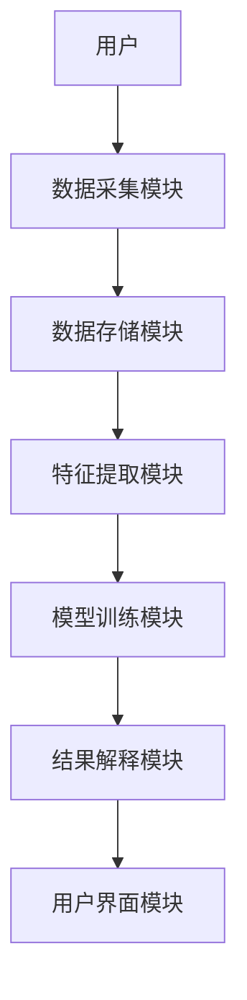

                 


# AI驱动的股东权益分析：深入理解公司治理

---

## 关键词  
人工智能、股东权益、公司治理、财务分析、自然语言处理、机器学习、数据驱动决策

---

## 摘要  
随着人工智能技术的快速发展，股东权益分析正逐步从传统的经验驱动模式向数据驱动模式转变。本文深入探讨了AI在股东权益分析中的应用，结合公司治理的多维度视角，分析了如何利用机器学习算法、自然语言处理技术以及大数据分析能力，提升股东权益评估的准确性和效率。文章从背景介绍、核心概念、算法原理、系统架构、项目实战等多个维度展开，全面解析了AI驱动的股东权益分析的实现路径与实际应用。

---

## 第一部分: 股东权益分析的背景与核心概念

### 第1章: 股东权益分析的基本概念

#### 1.1 股东权益的定义与重要性  
股东权益是公司治理中的核心组成部分，指股东对公司净资产的所有权。它不仅反映了企业的财务健康状况，还直接关系到股东的收益与风险。  

- **股东权益的基本概念**  
  股东权益包括所有者权益、未分配利润、股本等，是公司资产负债表中的重要组成部分。  

- **股东权益在公司治理中的作用**  
  股东权益分析是评估公司价值、制定投资决策的重要依据。通过分析股东权益的变化，可以洞察公司的经营状况、财务健康度以及管理层的决策能力。  

- **股东权益分析的必要性**  
  在复杂的市场环境中，传统的财务分析方法难以满足实时性和精准性的需求，而AI技术的引入为股东权益分析提供了新的解决方案。  

---

#### 1.2 公司治理的基本框架  

- **公司治理的定义与内涵**  
  公司治理是指通过董事会、管理层和股东之间的关系，确保公司战略目标的实现和利益相关者的权益保护。  

- **股东、董事会与管理层的关系**  
  股东是公司的最终所有者，董事会是决策机构，管理层是执行机构。三者之间的制衡与协作是公司治理的核心。  

- **公司治理的国际标准与规范**  
  如《萨班斯-奥克斯利法案》（SOX法案）、《企业治理原则》（OECD原则）等，为公司治理提供了明确的指导框架。  

---

### 第2章: AI在股东权益分析中的作用  

#### 2.1 传统股东权益分析的局限性  

- **数据量与复杂性的问题**  
  传统分析方法依赖人工经验，难以处理海量数据和复杂的财务关系。  

- **传统分析方法的局限性**  
  例如，单一的财务指标分析可能忽略企业整体风险和潜在问题。  

- **人工分析的效率与准确性问题**  
  人工分析耗时且容易受到主观因素的影响，难以满足实时分析的需求。  

---

#### 2.2 AI技术在股东权益分析中的优势  

- **大数据分析能力**  
  AI能够处理海量的结构化和非结构化数据，发现隐藏的模式和趋势。  

- **自然语言处理在文本分析中的应用**  
  利用NLP技术分析公司公告、新闻报道等非结构化数据，提取关键信息。  

- **机器学习在预测与分类中的优势**  
  通过训练机器学习模型，AI可以准确预测股东权益的变化趋势，分类企业的财务风险等级。  

---

#### 2.3 股东权益分析的AI驱动新范式  

- **数据驱动的决策模式**  
  基于AI的分析工具能够提供实时、动态的股东权益评估，帮助投资者做出更明智的决策。  

- **智能化分析工具的应用**  
  结合自然语言处理和机器学习技术，AI工具可以自动提取财务数据、分析文本信息并生成报告。  

- **从经验驱动到数据驱动的转变**  
  AI技术的应用使得股东权益分析更加客观、精准，减少了人为判断的偏差。  

---

## 第二部分: AI驱动的股东权益分析核心概念  

### 第3章: 数据特征与分析维度  

#### 3.1 股东权益分析的关键数据特征  

- **财务数据特征**  
  包括收入、利润、资产负债率等指标。  

- **非财务数据特征**  
  包括市场情绪、行业趋势、政策变化等外部因素。  

- **数据特征的维度分析**  
  通过多维度数据的综合分析，可以更全面地评估股东权益的价值。  

---

#### 3.2 数据预处理与清洗  

- **数据清洗的方法**  
  包括去除重复数据、填补缺失值、处理异常值等。  

- **数据特征的工程处理**  
  如标准化、归一化等，确保数据适合模型输入。  

- **数据特征的维度分析**  
  使用主成分分析（PCA）等方法，降低数据维度并提取关键特征。  

---

## 第三部分: 算法原理与系统架构  

### 第4章: 机器学习算法在股东权益分析中的应用  

#### 4.1 算法选择与实现  

- **线性回归模型**  
  用于预测股东权益的变化趋势。  

- **决策树模型**  
  用于分类企业财务风险等级。  

- **随机森林模型**  
  提高模型的准确性和鲁棒性。  

---

#### 4.2 算法实现的代码示例  

```python
import pandas as pd
from sklearn.model_selection import train_test_split
from sklearn.linear_model import LinearRegression
from sklearn.metrics import mean_squared_error

# 数据加载
data = pd.read_csv('shareholder_equity.csv')

# 数据预处理
X = data[['revenue', 'profit', 'debt']]
y = data['equity']

# 划分训练集与测试集
X_train, X_test, y_train, y_test = train_test_split(X, y, test_size=0.2, random_state=42)

# 模型训练
model = LinearRegression()
model.fit(X_train, y_train)

# 模型预测
y_pred = model.predict(X_test)

# 模型评估
mse = mean_squared_error(y_test, y_pred)
print(f'Mean Squared Error: {mse}')
```

---

#### 4.3 算法原理的数学模型  

线性回归的数学模型如下：  
$$ y = \beta_0 + \beta_1x_1 + \beta_2x_2 + \ldots + \beta_nx_n + \epsilon $$  
其中，$y$是目标变量，$x_i$是自变量，$\beta_i$是回归系数，$\epsilon$是误差项。  

---

### 第5章: 系统架构与实现  

#### 5.1 系统功能设计  

- **模块化设计**  
  包括数据采集、特征提取、模型训练、结果解释和用户界面。  

- **系统架构设计**  
  使用微服务架构，确保系统的可扩展性和灵活性。  

- **系统交互设计**  
  用户通过界面输入数据，系统输出分析结果。  

---

#### 5.2 系统架构图  



---

## 第四部分: 项目实战与最佳实践  

### 第6章: 项目实战  

#### 6.1 环境安装与数据加载  

- **环境安装**  
  安装Python、Pandas、Scikit-learn等库。  

- **数据加载**  
  使用Pandas加载CSV格式的股东权益数据。  

---

#### 6.2 模型实现与结果分析  

```python
import pandas as pd
from sklearn.model_selection import train_test_split
from sklearn.ensemble import RandomForestRegressor
from sklearn.metrics import r2_score

# 数据加载
data = pd.read_csv('shareholder_equity.csv')

# 数据预处理
X = data[['revenue', 'profit', 'debt']]
y = data['equity']

# 划分训练集与测试集
X_train, X_test, y_train, y_test = train_test_split(X, y, test_size=0.2, random_state=42)

# 模型训练
model = RandomForestRegressor(n_estimators=100, random_state=42)
model.fit(X_train, y_train)

# 模型预测
y_pred = model.predict(X_test)

# 模型评估
r2 = r2_score(y_test, y_pred)
print(f'R² Score: {r2}')
```

---

#### 6.3 结果分析与优化  

- **结果分析**  
  使用混淆矩阵、准确率等指标评估模型性能。  

- **模型优化**  
  调整模型参数，如增加特征工程、引入超参数调优等。  

---

### 第7章: 最佳实践与小结  

#### 7.1 最佳实践  

- **数据质量的重要性**  
  确保数据的完整性和准确性。  

- **模型调优的技巧**  
  使用交叉验证、网格搜索等方法优化模型性能。  

- **持续学习与更新**  
  定期更新模型，适应市场变化和企业发展的新趋势。  

---

## 第五部分: 总结与展望  

### 第8章: 总结与展望  

#### 8.1 总结  

- AI技术为股东权益分析提供了新的工具和方法，显著提升了分析的效率和准确性。  
- 通过机器学习和自然语言处理技术，可以实现对公司治理的全面洞察。  

---

#### 8.2 展望  

- **多模态数据的融合**  
  结合文本、图像等多种数据源，提升分析的深度和广度。  

- **可解释性AI的发展**  
  提升模型的可解释性，帮助用户更好地理解分析结果。  

- **实时分析的应用**  
  结合流数据处理技术，实现股东权益的实时监控与预警。  

---

## 作者  
作者：AI天才研究院 & 禅与计算机程序设计艺术

