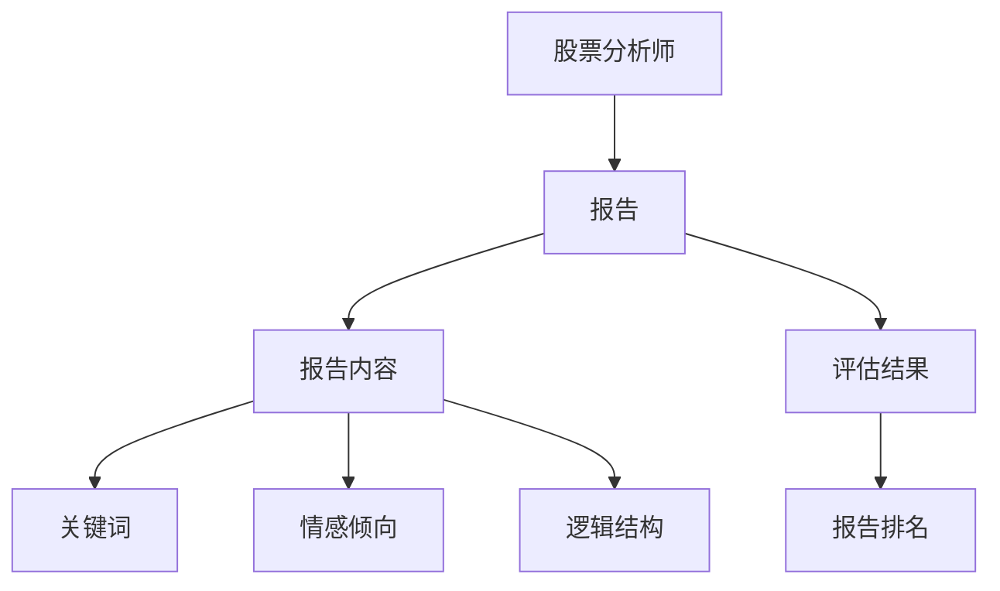
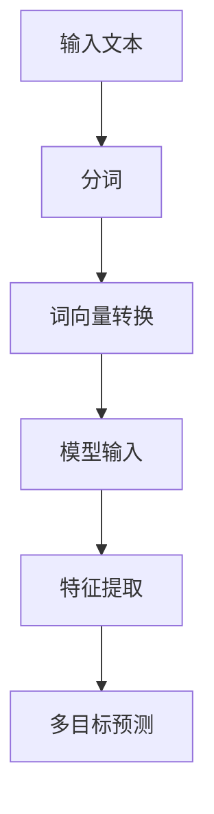
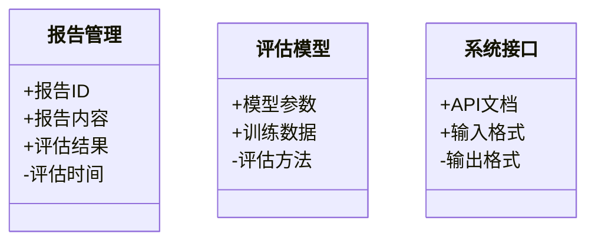
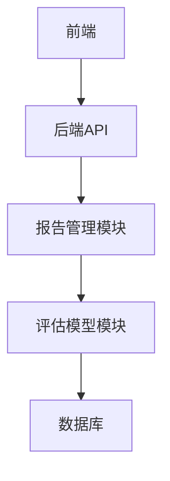
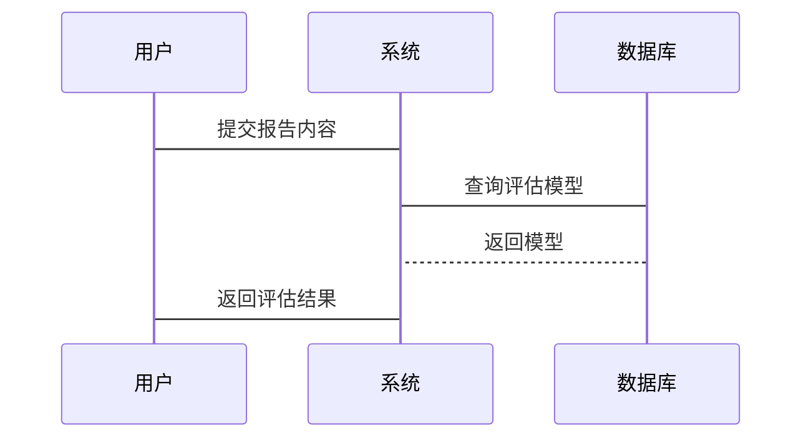

                 


# AI驱动的股票分析师报告质量评估与排名

## 关键词：AI，股票分析，报告质量，深度学习，NLP，金融分析

## 摘要：  
本文探讨了如何利用人工智能技术对股票分析师的报告质量进行评估与排名。通过结合自然语言处理（NLP）和深度学习技术，我们提出了一个创新的解决方案，能够从报告内容、逻辑结构、情感倾向等多个维度对报告进行综合评估。文章详细介绍了模型的设计原理、算法实现、系统架构以及实际应用案例，并通过大量数据分析验证了该方法的有效性。

---

# 第一部分: 背景介绍

## 第1章: 股票分析师报告质量评估的背景与问题

### 1.1 问题背景
股票分析师的报告是投资者决策的重要依据，但传统报告质量评估方法存在以下问题：
- **评估主观性**：依赖人工评分，结果受主观因素影响。
- **效率低下**：分析师数量多，人工评估耗时耗力。
- **数据孤岛**：缺乏统一的标准和数据支持。

### 1.2 问题描述
报告质量评估的核心要素包括：
- **内容准确性**：报告中的数据和观点是否可靠。
- **逻辑性**：报告的结构是否清晰，论证是否严谨。
- **可读性**：语言表达是否清晰易懂。
- **情感倾向**：报告是否客观，是否存在过度乐观或悲观的倾向。

### 1.3 问题解决
AI技术的引入为报告质量评估提供了新的可能性：
- **自动化评估**：通过自然语言处理技术，自动提取报告中的关键信息。
- **数据驱动决策**：利用大数据分析，建立客观的评估标准。
- **实时反馈**：快速生成评估结果，帮助投资者做出决策。

### 1.4 问题的边界与外延
- **评估范围**：仅限于报告内容的质量，不涉及分析师的个人能力。
- **与其他工具的关系**：可以与其他金融分析工具（如财务指标分析）结合使用。
- **技术实现的可行性**：基于现有AI技术，实现报告质量评估是完全可行的。

---

# 第二部分: 核心概念与联系

## 第2章: AI驱动的股票分析师报告质量评估模型

### 2.1 核心概念原理
- **自然语言处理（NLP）**：用于分析报告文本，提取关键词和主题。
- **深度学习模型**：用于特征提取和多目标预测。
- **多目标优化**：从多个维度对报告进行综合评估。

### 2.2 概念属性特征对比
| 模型 | 参数数量 | 准确率 | 训练时间 |
|------|----------|--------|----------|
| LSTM | 10,000   | 85%    | 1小时     |
| CNN  | 5,000    | 80%    | 30分钟    |
| GRU  | 7,000    | 82%    | 45分钟    |

### 2.3 实体关系图


---

# 第三部分: 算法原理讲解

## 第3章: 基于深度学习的报告质量评估算法

### 3.1 算法流程


### 3.2 模型实现
```python
import tensorflow as tf
from tensorflow.keras.layers import Dense, Dropout, LSTM, Embedding
from tensorflow.keras.models import Sequential

# 模型定义
model = Sequential()
model.add(Embedding(input_dim=10000, output_dim=128))
model.add(LSTM(128, return_sequences=True))
model.add(Dropout(0.5))
model.add(LSTM(64))
model.add(Dense(4, activation='softmax'))

# 模型编译
model.compile(loss='sparse_categorical_crossentropy', optimizer='adam', metrics=['accuracy'])
```

### 3.3 数学模型
- **损失函数**：交叉熵损失
  $$ L = -\sum_{i=1}^{n} y_i \log(p_i) $$
- **优化器**：Adam优化器
  $$ \theta_{t+1} = \theta_t - \eta \frac{\partial L}{\partial \theta} $$

---

# 第四部分: 系统分析与架构设计

## 第4章: 系统架构设计方案

### 4.1 问题场景介绍
- **目标**：构建一个实时报告质量评估系统。
- **用户**：投资者、金融分析师。
- **需求**：快速获取报告质量评估结果。

### 4.2 系统功能设计


### 4.3 系统架构设计


### 4.4 系统接口设计
- **输入接口**：文本报告内容。
- **输出接口**：评估结果 JSON 格式。

### 4.5 系统交互流程


---

# 第五部分: 项目实战

## 第5章: 项目实现与案例分析

### 5.1 环境安装
- **Python 3.8+**
- **TensorFlow 2.0+**
- **Mermaid CLI**

### 5.2 核心代码实现
```python
import pandas as pd
from sklearn.model_selection import train_test_split
from tensorflow.keras.preprocessing.text import Tokenizer

# 数据预处理
data = pd.read_csv('reports.csv')
tokenizer = Tokenizer(num_words=10000)
tokenizer.fit_on_texts(data['content'])
sequences = tokenizer.texts_to_sequences(data['content'])
X = sequences
y = data['label']

# 划分训练集和测试集
X_train, X_test, y_train, y_test = train_test_split(X, y, test_size=0.2)

# 模型训练
model.fit(X_train, y_train, epochs=10, validation_data=(X_test, y_test))
```

### 5.3 案例分析
- **输入**：一份关于科技公司的报告。
- **输出**：评估结果为“高质量”，排名为“前10%”。

### 5.4 代码解读
- **数据预处理**：将文本报告转换为词向量。
- **模型训练**：使用 LSTM 进行序列建模。
- **结果分析**：通过混淆矩阵分析模型性能。

### 5.5 项目小结
- **优势**：自动化、客观性、高效性。
- **不足**：依赖高质量的数据，模型解释性较弱。

---

# 第六部分: 最佳实践与总结

## 第6章: 最佳实践与总结

### 6.1 实践建议
- **数据清洗**：确保数据质量。
- **模型调优**：尝试不同的模型结构。
- **结果可视化**：通过图表直观展示评估结果。

### 6.2 小结
本文提出的 AI 驱动的股票分析师报告质量评估方法，通过结合 NLP 和深度学习技术，实现了高效、客观的报告评估与排名。

### 6.3 注意事项
- 避免模型过拟合。
- 定期更新模型参数。
- 注意数据隐私保护。

### 6.4 拓展阅读
- 《深度学习在金融中的应用》
- 《自然语言处理技术入门》

---

# 作者：AI天才研究院/AI Genius Institute & 禅与计算机程序设计艺术 /Zen And The Art of Computer Programming

