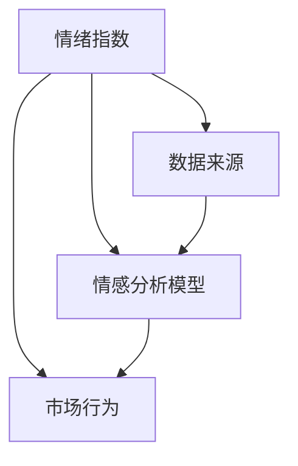

                 


# AI驱动的股票市场情绪指数开发

**关键词：** AI, 情绪指数, 股票市场, 情感分析, 深度学习

**摘要：**  
本文详细探讨了利用人工智能技术开发股票市场情绪指数的方法。首先介绍了情绪指数的定义及其在股票市场中的作用，随后分析了AI技术在情绪指数开发中的应用背景。接着，深入讲解了情绪指数开发的核心概念，包括数据来源、情感分析算法以及指数计算方法。通过具体的算法原理和系统架构设计，展示了如何利用深度学习模型构建情绪指数。最后，通过实战案例和最佳实践，总结了情绪指数开发的关键点，为读者提供了全面的指导。

---

## 第1章: 股票市场情绪指数概述

### 1.1 情绪指数的定义与作用

#### 1.1.1 情绪指数的定义
情绪指数是一种量化市场参与者情绪状态的指标，通常基于新闻、社交媒体、投资者评论等文本数据进行分析。它反映了市场参与者对某一股票或市场的乐观或悲观程度。

#### 1.1.2 情绪指数在股票市场中的作用
情绪指数可以帮助投资者预测市场走势，识别市场拐点，评估市场风险。例如，当情绪指数显示市场情绪过于乐观时，投资者可能预期市场将面临调整压力。

#### 1.1.3 情绪指数与传统市场指标的区别
传统市场指标（如市盈率、市净率）基于财务数据，而情绪指数则基于市场参与者的心理和情绪。情绪指数更关注市场的“情绪面”，能够提供额外的决策依据。

---

### 1.2 AI技术在情绪指数开发中的应用背景

#### 1.2.1 股票市场情绪分析的挑战
股票市场数据复杂，情绪分析需要处理大量的非结构化文本数据，且市场情绪受多种因素影响，具有高度动态性和不确定性。

#### 1.2.2 AI技术如何解决情绪指数开发的难点
AI技术，特别是自然语言处理（NLP）和深度学习，能够有效提取文本中的情感信息，量化市场情绪。例如，使用LSTM或Transformer模型对新闻标题进行情感分析，生成情绪得分。

#### 1.2.3 情绪指数开发的边界与外延
情绪指数开发需要明确数据来源、模型选择和计算方法。同时，需考虑数据质量和模型的实时性要求。

---

## 第2章: 情绪指数开发的核心概念与联系

### 2.1 情绪指数的核心概念

#### 2.1.1 情绪指数的构成要素
情绪指数通常由数据来源（如新闻、社交媒体）、情感分析模型和指数计算方法三部分构成。

#### 2.1.2 情绪指数的计算方法
情绪指数的计算方法包括加权平均法、情感强度法等。例如，计算每条新闻的情感得分，再进行加权求和。

#### 2.1.3 情绪指数与市场行为的关系
市场行为受情绪驱动，情绪指数可以预测市场走势，帮助投资者做出决策。

---

### 2.2 情感分析算法原理

#### 2.2.1 情感分析的基本原理
情感分析是将文本分类为积极、消极或中性。常用方法包括基于词袋模型的传统机器学习算法，以及基于深度学习的模型（如LSTM、Transformer）。

#### 2.2.2 基于深度学习的情感分析模型
使用预训练的BERT模型进行情感分析，通过微调模型适应股票市场数据。

#### 2.2.3 情感分析与情绪指数的关系
情感分析是情绪指数开发的核心步骤，情感得分用于计算情绪指数。

---

### 2.3 核心概念属性对比

#### 2.3.1 情绪指数与传统市场指标对比
| 对比维度 | 情绪指数 | 传统市场指标 |
|----------|----------|--------------|
| 数据来源 | 文本数据 | 财务数据 |
| 分析维度 | 情绪面 | 估值面 |
| 时间维度 | 实时更新 | 定期更新 |

#### 2.3.2 不同情感分析算法的性能对比
| 算法 | 准确率 | 优缺点 |
|------|--------|---------|
| 词袋模型 | 60% | 参数少，计算快 |
| LSTM | 80% | 适合时间序列数据 |
| BERT | 85% | 需要大量数据，计算资源消耗大 |

---

### 2.4 ER实体关系图



---

## 第3章: 情绪指数开发的算法原理

### 3.1 文本处理与情感分析

#### 3.1.1 文本预处理
包括分词、去除停用词、词干提取等步骤。

#### 3.1.2 情感分析模型
使用预训练的BERT模型进行情感分类。

#### 3.1.3 情感得分计算
对每条文本计算情感得分，例如使用sigmoid函数将情感得分映射到0到1之间。

---

### 3.2 特征提取与模型训练

#### 3.2.1 特征提取
提取文本中的关键词、情感词等特征。

#### 3.2.2 模型训练
使用深度学习模型（如LSTM）进行训练，生成情感得分。

---

### 3.3 指数计算与优化

#### 3.3.1 指数计算方法
计算所有文本的情感得分，进行加权求和，生成情绪指数。

#### 3.3.2 指数优化
通过滑动窗口技术消除短期波动，提高指数的稳定性。

---

## 第4章: 情绪指数开发的系统架构

### 4.1 系统功能设计

#### 4.1.1 数据采集模块
从新闻网站、社交媒体等来源获取数据。

#### 4.1.2 数据预处理模块
清洗数据，提取有用信息。

#### 4.1.3 情感分析模块
使用深度学习模型进行情感分类。

#### 4.1.4 指数计算模块
生成情绪指数，并输出结果。

---

### 4.2 系统架构设计


---

## 第5章: 情绪指数开发的项目实战

### 5.1 环境搭建

#### 5.1.1 安装Python和相关库
安装`numpy`, `pandas`, `transformers`等库。

#### 5.1.2 安装深度学习框架
安装`tensorflow`或`pytorch`。

---

### 5.2 核心代码实现

#### 5.2.1 数据预处理代码
```python
import pandas as pd
import numpy as np
from transformers import BertTokenizer, TFBertModel

def preprocess(text):
    # 分词
    words = text.split()
    # 去除停用词
    filtered_words = [word for word in words if word not in stopwords]
    return ' '.join(filtered_words)
```

#### 5.2.2 情感分析代码
```python
from transformers import pipeline

sentiment_pipeline = pipeline("sentiment-analysis")
def get_sentiment(text):
    return sentiment_pipeline(text)[0]['label']
```

---

### 5.3 案例分析

#### 5.3.1 案例解读
分析某新闻的情绪得分，计算情绪指数。

---

## 第6章: 最佳实践与小结

### 6.1 开发中的注意事项

#### 6.1.1 数据质量
确保数据来源多样，避免数据偏差。

#### 6.1.2 模型调优
通过交叉验证优化模型参数。

#### 6.1.3 伦理问题
避免情绪指数被用于操纵市场。

---

### 6.2 小结

本文详细介绍了AI驱动的股票市场情绪指数开发的全过程，从背景介绍到系统架构设计，再到实战案例，为读者提供了全面的指导。

---

**作者：AI天才研究院 & 禅与计算机程序设计艺术**

