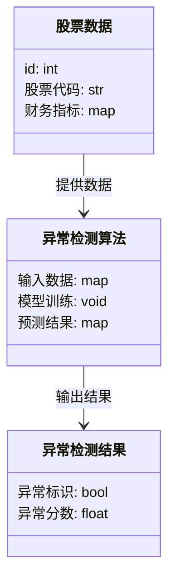
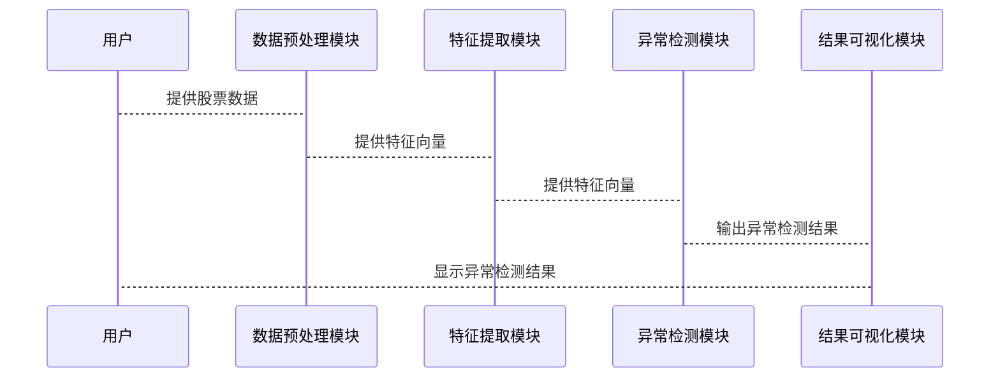

                 


# AI驱动的股票财务指标异常检测

## 关键词：AI，股票，财务指标，异常检测，机器学习

## 摘要：  
本文深入探讨了如何利用人工智能技术，特别是机器学习算法，来实现股票市场中财务指标的异常检测。文章从股票市场的基本概念出发，分析了财务指标的特征及其在异常检测中的重要性。接着，详细介绍了异常检测的基本原理，包括统计方法和机器学习方法，并结合具体算法（如孤立森林和自动编码器）进行分析。最后，通过实际案例展示了如何基于这些算法构建一个完整的股票财务指标异常检测系统，探讨了系统的架构设计、实现细节及优化方法。

---

## 第一部分: AI驱动的股票财务指标异常检测概述

## 第1章: 股票市场与财务指标概述

### 1.1 股票市场的基本概念

#### 1.1.1 股票市场的定义与组成
股票市场是投资者交易公司股份的场所，由上市公司、投资者、交易机构和监管机构组成。股票价格反映了市场的供需关系，但其波动性也受到多种因素的影响，包括公司财务状况、市场情绪等。

#### 1.1.2 财务指标在股票分析中的重要性
财务指标是衡量公司财务健康状况的核心工具，包括市盈率（P/E）、市净率（P/B）、每股收益（EPS）等。这些指标能够帮助投资者评估公司的盈利能力、成长潜力和风险水平。

#### 1.1.3 异常检测在股票投资中的应用价值
股票市场的异常事件（如突然的价格波动、财务数据突变）往往预示着潜在的投资机会或风险。通过异常检测技术，投资者可以及时发现这些异常信号，从而做出更明智的投资决策。

### 1.2 财务指标的核心概念

#### 1.2.1 财务指标的分类与特征
财务指标可以分为盈利能力、成长能力、偿债能力、运营能力和估值能力五大类。每类指标都有其独特的特征，例如盈利能力指标关注收入与利润的关系，而成长能力指标关注收入和利润的增长速度。

| 财务指标类别 | 核心指标 | 特征 |
|----------------|----------|------|
| 盈利能力       | 净利润、毛利率 | 反映公司赚钱能力 |
| 成长能力       | 收入增长率、净利润增长率 | 反映公司发展速度 |
| 偿债能力       | 负债率、流动比率 | 反映公司财务健康度 |
| 运营能力       | 存货周转率、应收账款周转率 | 反映公司运营效率 |
| 估值能力       | 市盈率、市净率 | 反映市场对公司的估值 |

#### 1.2.2 异常检测的定义与目标
异常检测是指识别数据中偏离正常模式的样本或行为。在股票市场中，异常检测的目标是发现那些可能影响股票价格或公司财务状况的异常事件。

#### 1.2.3 股票市场异常事件的类型与影响
股票市场的异常事件可以分为市场整体异常和个股异常两类。市场整体异常通常由宏观经济因素或重大事件引发，而个股异常则可能由公司财务造假、重大诉讼等事件引起。这些异常事件可能导致股票价格的剧烈波动，影响投资者的决策。

### 1.3 本章小结

#### 1.3.1 股票市场的基本构成
股票市场由上市公司、投资者、交易机构和监管机构共同构成，是一个复杂的生态系统。

#### 1.3.2 财务指标异常检测的核心目标
通过识别财务指标中的异常值，帮助投资者发现潜在的投资机会或风险。

#### 1.3.3 异常检测在投资决策中的潜在价值
异常检测技术能够帮助投资者及时发现市场中的异常信号，从而做出更明智的投资决策。

---

## 第二部分: 异常检测的核心概念与联系

## 第2章: 异常检测的基本原理

### 2.1 异常检测的定义与分类

#### 2.1.1 异常检测的定义
异常检测是指通过分析数据，识别出偏离正常模式的样本或行为。在股票市场中，异常检测可以帮助投资者发现潜在的市场风险或投资机会。

#### 2.1.2 基于统计的异常检测方法
基于统计的方法通常通过计算数据的均值和标准差来识别异常值。例如，使用Z-score方法检测数据点是否偏离均值超过一定标准差。

#### 2.1.3 基于机器学习的异常检测方法
基于机器学习的方法（如孤立森林和自动编码器）能够自动学习数据的分布，从而识别出异常样本。

### 2.2 财务指标的特征分析

#### 2.2.1 财务指标的时间序列特征
财务指标通常具有时间序列特性，可以通过时间序列分析方法进行建模。

#### 2.2.2 财务指标的分布特征
财务指标的分布可能呈现正态分布或其他分布形式，异常检测方法需要针对不同的分布特性进行设计。

#### 2.2.3 异常点的识别特征
异常点通常表现为极端值或偏离正常模式的数据点。

### 2.3 异常检测的核心概念联系

#### 2.3.1 异常检测与统计学方法的联系
统计学方法为异常检测提供了基础理论，例如Z-score方法和箱线图方法。

#### 2.3.2 异常检测与机器学习的结合
机器学习方法（如孤立森林和自动编码器）能够处理高维数据，适用于复杂的股票市场数据。

#### 2.3.3 异常检测在股票市场中的应用场景
股票市场中的异常检测可以应用于市场监控、风险管理、投资决策等领域。

### 2.4 本章小结

#### 2.4.1 异常检测的核心概念总结
异常检测是识别偏离正常模式的数据点，可以基于统计方法或机器学习方法实现。

#### 2.4.2 异常检测在股票市场中的应用价值
通过异常检测，投资者可以发现潜在的市场风险或投资机会，从而做出更明智的投资决策。

#### 2.4.3 异常检测与财务指标分析的结合
将异常检测技术应用于财务指标分析，可以帮助投资者发现财务数据中的异常情况，从而评估公司的财务健康状况。

---

## 第三部分: 异常检测的算法原理

## 第3章: 基于统计的异常检测算法

### 3.1 基于均值和标准差的异常检测方法

#### 3.1.1 Z-score方法
Z-score方法通过计算数据点与均值的距离标准化值来识别异常值。公式如下：

$$ Z = \frac{x - \mu}{\sigma} $$

其中，$\mu$ 是数据的均值，$\sigma$ 是标准差。

#### 3.1.2 箱线图方法
箱线图方法通过绘制数据的四分位数来识别异常值。异常值通常位于 whisker 之外。

### 3.2 基于孤立森林的异常检测算法

#### 3.2.1 算法原理
孤立森林是一种无监督学习算法，通过构建决策树来识别异常点。算法的核心思想是通过随机选择特征和样本，构建多个决策树，从而识别出异常样本。

#### 3.2.2 算法实现步骤
1. 对数据进行预处理，去除缺失值和重复值。
2. 构建孤立森林模型，训练数据。
3. 使用模型预测异常分数。
4. 根据异常分数阈值，识别异常样本。

#### 3.2.3 代码实现
以下是基于Python的孤立森林算法实现代码：

```python
import numpy as np
from sklearn.ensemble import IsolationForest

# 示例数据
X = np.random.randn(100, 5)  # 生成100个样本，5个特征

# 初始化孤立森林模型
iforest = IsolationForest(n_estimators=100, random_state=42)

# 训练模型
iforest.fit(X)

# 预测异常分数
y_scores = iforest.decision_function(X)
y_labels = iforest.predict(X)
```

---

## 第四部分: 系统分析与架构设计方案

## 第4章: 异常检测系统架构设计

### 4.1 问题场景介绍
本系统旨在实现股票市场中财务指标的异常检测，帮助投资者及时发现异常事件，从而做出更明智的投资决策。

### 4.2 系统功能设计

#### 4.2.1 领域模型设计
以下是领域模型的Mermaid类图：



### 4.3 系统架构设计

#### 4.3.1 系统架构图
以下是系统架构的Mermaid架构图：


### 4.4 系统接口设计

#### 4.4.1 数据接口
系统需要从股票数据源获取原始数据，并进行预处理和特征提取。

#### 4.4.2 模型接口
异常检测模块需要与模型训练和预测接口进行交互。

### 4.5 系统交互设计

#### 4.5.1 交互流程图
以下是系统交互的Mermaid序列图：



---

## 第五部分: 项目实战

## 第5章: 股票财务指标异常检测系统实现

### 5.1 环境搭建

#### 5.1.1 安装必要的库
需要安装以下Python库：
- pandas
- numpy
- scikit-learn
- matplotlib

### 5.2 系统核心实现

#### 5.2.1 数据预处理
1. 读取股票数据
2. 清洗数据（去除缺失值和重复值）
3. 标准化数据（使用标准Scaler进行标准化）

#### 5.2.2 模型训练
使用孤立森林算法训练模型，具体实现如下：

```python
from sklearn.preprocessing import StandardScaler

# 数据预处理
scaler = StandardScaler()
X_scaled = scaler.fit_transform(X)

# 模型训练
iforest = IsolationForest(n_estimators=100, random_state=42)
iforest.fit(X_scaled)
```

#### 5.2.3 异常检测与可视化
使用训练好的模型对测试数据进行预测，并可视化结果：

```python
# 预测结果
y_scores = iforest.decision_function(X_scaled)
y_labels = iforest.predict(X_scaled)

# 可视化结果
import matplotlib.pyplot as plt

plt.scatter(X[:, 0], X[:, 1], c=y_labels, cmap='viridis')
plt.colorbar(label='异常标识')
plt.xlabel('特征1')
plt.ylabel('特征2')
plt.show()
```

### 5.3 项目实战案例分析

#### 5.3.1 案例分析
假设我们有一个包含股票财务指标的数据集，通过异常检测算法识别出某只股票的财务指标异常，可能意味着该公司存在财务造假或业绩下滑的风险。

#### 5.3.2 结果分析
通过分析异常检测结果，投资者可以及时调整投资策略，规避潜在风险。

### 5.4 本章小结

#### 5.4.1 项目实现的核心步骤
1. 数据预处理
2. 模型训练
3. 异常检测
4. 结果可视化

#### 5.4.2 项目实现的关键点
- 数据预处理的重要性
- 模型选择与调优
- 结果解读与可视化

---

## 第六部分: 总结与展望

## 第6章: 总结与展望

### 6.1 本章小结

#### 6.1.1 异常检测的核心概念总结
异常检测是识别偏离正常模式的数据点，可以基于统计方法或机器学习方法实现。

#### 6.1.2 异常检测在股票市场中的应用价值
通过异常检测，投资者可以发现潜在的市场风险或投资机会，从而做出更明智的投资决策。

#### 6.1.3 异常检测与财务指标分析的结合
将异常检测技术应用于财务指标分析，可以帮助投资者发现财务数据中的异常情况，从而评估公司的财务健康状况。

### 6.2 未来展望

#### 6.2.1 技术展望
随着机器学习技术的不断发展，异常检测算法的性能和准确性将不断提升，未来可能结合自然语言处理（NLP）和时间序列分析等技术，进一步提高异常检测的精度。

#### 6.2.2 应用展望
异常检测技术在股票市场中的应用将更加广泛，可能涉及市场监控、风险管理、投资决策等多个领域。

### 6.3 最佳实践 tips

#### 6.3.1 数据预处理的重要性
在异常检测中，数据预处理是关键步骤，包括数据清洗、标准化和特征选择等。

#### 6.3.2 模型选择与调优
选择合适的异常检测算法，并根据数据特点进行模型调优，可以显著提高检测效果。

#### 6.3.3 结果解读与可视化
通过可视化工具，将异常检测结果直观地展示出来，有助于更好地理解和分析结果。

---

## 作者：AI天才研究院/AI Genius Institute & 禅与计算机程序设计艺术 /Zen And The Art of Computer Programming

