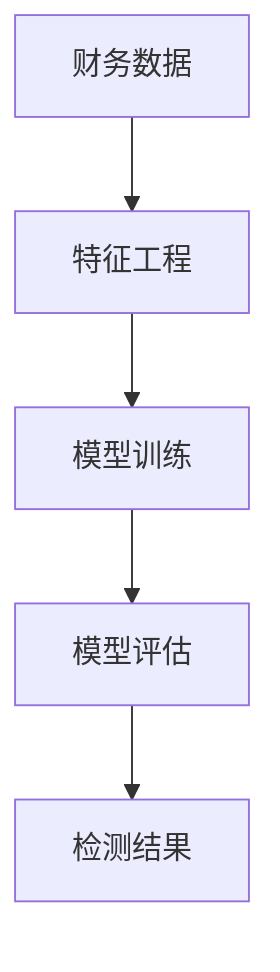
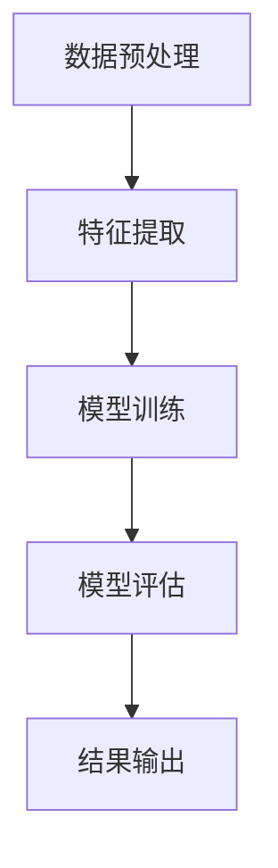
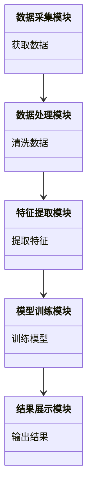
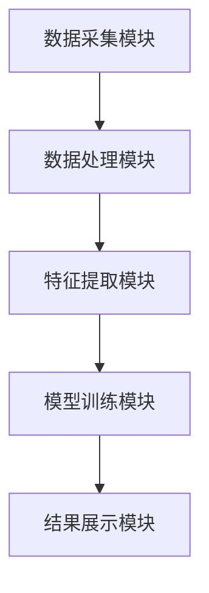

                 


# AI驱动的股票财务造假检测模型

> 关键词：AI，股票市场，财务造假，机器学习，检测模型

> 摘要：本文探讨了如何利用人工智能技术构建股票财务造假检测模型。通过分析财务数据，结合监督学习算法，提出了一个基于特征工程的检测框架，并通过实际案例验证了模型的有效性。

---

# 第一部分: 背景与概念

## 第1章: 问题背景与描述

### 1.1 问题背景

#### 1.1.1 股票市场中的财务造假现象
股票市场是资金流动的核心场所，上市公司通过财务报表向投资者展示经营状况。然而，部分公司为了追求短期利益，可能会篡改财务数据，虚报收入、隐瞒亏损或虚增资产等。这些行为严重损害了市场的公平性和投资者的利益。

#### 1.1.2 财务造假的危害与影响
财务造假不仅破坏了市场的信任机制，还可能导致投资者损失惨重。例如，安然事件暴露了财务造假的巨大危害性，引发了对审计和监管机制的深刻反思。此外，财务造假还会扭曲市场资源配置，影响经济的健康发展。

#### 1.1.3 传统财务造假检测的局限性
传统的财务造假检测主要依赖人工审查和审计，这种方法效率低、成本高，且容易受到主观因素的影响。审计师可能因经验不足或资源限制，难以发现复杂的造假手段。此外，传统方法通常只能检测明显的财务异常，对于隐蔽性较强的造假行为往往束手无策。

### 1.2 问题描述

#### 1.2.1 财务造假检测的核心目标
通过分析公司的财务数据，识别出可能存在造假行为的公司，帮助投资者和监管机构及时采取措施，维护市场的公平性和透明度。

#### 1.2.2 股票市场中的关键数据特征
- 财务报表数据：收入、利润、资产、负债等。
- 财务指标：如毛利率、净利率、应收账款周转率等。
- 时间序列数据：如季度或年度财务数据的变化趋势。

#### 1.2.3 财务造假检测的难点与挑战
- 数据的不完整性：部分公司可能提供虚假或不完整的财务数据。
- 数据的复杂性：财务数据涉及多个维度，且造假手段多样化。
- 模型的可解释性：复杂的AI模型可能导致检测结果难以解释，影响信任度。

### 1.3 问题解决思路

#### 1.3.1 引入AI技术的必要性
AI技术能够处理大量复杂数据，并通过特征工程和模型训练，识别出传统方法难以察觉的异常模式。

#### 1.3.2 AI在财务数据中的潜在价值
- 自动化分析：快速处理大量财务数据，提取关键特征。
- 异常检测：通过机器学习算法识别异常模式。
- 预测性分析：预测未来财务状况的变化趋势。

#### 1.3.3 检测模型的设计与实现思路
- 数据收集与预处理：清洗数据，处理缺失值和异常值。
- 特征工程：提取关键财务指标，构建特征向量。
- 模型训练：使用监督学习算法训练分类模型。
- 模型评估：通过准确率、召回率等指标评估模型性能。

### 1.4 边界与外延

#### 1.4.1 股票财务数据的边界定义
仅关注上市公司的财务数据，不涉及非公开信息或其他市场数据。

#### 1.4.2 检测模型的适用范围
适用于公开的财务报表数据，对数据质量和完整性有一定要求。

#### 1.4.3 模型的局限性与改进方向
- 数据依赖性：模型性能依赖于数据质量和数量。
- 模型的可解释性：复杂的AI模型可能导致结果难以解释。
- 动态适应性：市场环境和造假手段不断变化，模型需要持续更新。

### 1.5 概念结构与核心要素

#### 1.5.1 模型的核心组成要素
- 数据源：公开的财务报表数据。
- 特征工程：提取关键财务指标。
- 模型算法：如随机森林、支持向量机等。
- 评估指标：准确率、召回率、F1分数等。

#### 1.5.2 数据、特征与模型的关系
数据是模型的输入，特征是数据的加工形式，模型通过特征学习数据中的模式，从而实现分类或预测。

#### 1.5.3 财务造假检测的逻辑流程
数据预处理 → 特征提取 → 模型训练 → 模型评估 → 实际应用。

---

# 第二部分: 核心概念与联系

## 第2章: AI驱动的财务造假检测模型核心概念

### 2.1 AI模型的基本原理

#### 2.1.1 监督学习与分类任务
监督学习是基于标记数据的训练，目标是通过输入特征预测目标类别。在财务造假检测中，目标类别通常是“正常”或“造假”。

#### 2.1.2 特征工程与数据预处理
特征工程是将原始数据转换为适合模型输入的特征向量。数据预处理包括缺失值处理、标准化、去噪等。

#### 2.1.3 模型训练与评估指标
模型训练需要选择合适的算法，并通过交叉验证优化参数。评估指标包括准确率、召回率、F1分数等。

### 2.2 财务数据特征与AI模型的结合

#### 2.2.1 财务数据的特征类型
- 财务指标：如毛利率、净利率、应收账款周转率等。
- 时间序列特征：如季度或年度数据的变化趋势。
- 文本特征：如财务报告中的关键词分析。

#### 2.2.2 数据特征对模型性能的影响
关键特征能够显著提高模型的准确性和召回率，而无关特征可能增加模型的复杂性，降低性能。

#### 2.2.3 特征选择与降维方法
特征选择方法包括基于统计的特征筛选和基于模型的特征重要性分析。降维方法如主成分分析（PCA）可以减少特征维度。

### 2.3 财务造假检测的核心算法

#### 2.3.1 常见的分类算法对比
- 线性模型：如逻辑回归（Logistic Regression）。
- 树模型：如决策树（Decision Tree）、随机森林（Random Forest）。
- 超参数化模型：如支持向量机（SVM）。
- 神经网络模型：如深度学习模型。

#### 2.3.2 基于深度学习的模型选择
深度学习模型在处理复杂特征和非线性关系时表现优异，但需要大量数据支持。

#### 2.3.3 模型调优与优化策略
通过交叉验证选择最优参数，利用网格搜索或随机搜索优化模型性能。

### 2.4 模型的实体关系图



---

# 第三部分: 算法原理

## 第3章: AI驱动的财务造假检测模型算法原理

### 3.1 算法流程



### 3.2 数据预处理

#### 3.2.1 数据清洗
- 删除缺失值。
- 处理异常值。

#### 3.2.2 数据标准化
对特征进行归一化处理，消除量纲影响。

### 3.3 特征提取

#### 3.3.1 特征选择
基于统计方法或模型重要性进行特征筛选。

#### 3.3.2 特征工程
构建复合特征，如财务指标的组合特征。

### 3.4 模型训练

#### 3.4.1 模型选择
选择合适的分类算法，如随机森林。

#### 3.4.2 模型训练
使用训练数据训练模型，调整超参数。

### 3.5 模型评估

#### 3.5.1 评估指标
准确率（Accuracy）、召回率（Recall）、F1分数。

#### 3.5.2 混淆矩阵
通过混淆矩阵分析模型的性能。

### 3.6 模型优化

#### 3.6.1 超参数优化
使用网格搜索或随机搜索优化模型参数。

#### 3.6.2 模型调优
通过交叉验证选择最优模型。

---

## 第4章: 系统分析与架构设计

### 4.1 项目背景

#### 4.1.1 项目目标
构建一个高效的财务造假检测系统，帮助投资者和监管机构识别潜在的财务造假行为。

#### 4.1.2 项目范围
仅关注公开的财务报表数据，不涉及其他数据源。

### 4.2 系统功能设计

#### 4.2.1 功能模块
- 数据采集模块：获取上市公司财务数据。
- 数据处理模块：清洗和预处理数据。
- 特征提取模块：提取关键特征。
- 模型训练模块：训练分类模型。
- 结果展示模块：输出检测结果。

#### 4.2.2 领域模型类图



### 4.3 系统架构设计

#### 4.3.1 系统架构图



#### 4.3.2 系统接口设计
- 数据接口：与数据源交互。
- 模型接口：与其他模块交互。
- 用户接口：展示检测结果。

#### 4.3.3 系统交互流程图

```mermaid
sequenceDiagram
    User -> 数据采集模块: 获取数据
    数据采集模块 -> 数据处理模块: 数据清洗
    数据处理模块 -> 特征提取模块: 提取特征
    特征提取模块 -> 模型训练模块: 训练模型
    模型训练模块 -> 结果展示模块: 输出结果
    User <- 结果展示模块: 显示结果
```

---

## 第5章: 项目实战

### 5.1 环境安装

#### 5.1.1 安装Python
安装Python 3.8及以上版本。

#### 5.1.2 安装依赖库
安装pandas、numpy、scikit-learn、xgboost等库。

### 5.2 核心代码实现

#### 5.2.1 数据预处理代码

```python
import pandas as pd
import numpy as np

# 加载数据
data = pd.read_csv('financial_data.csv')

# 删除缺失值
data.dropna(inplace=True)

# 标准化处理
from sklearn.preprocessing import StandardScaler
scaler = StandardScaler()
scaled_data = scaler.fit_transform(data[['revenue', 'net_profit', 'assets', 'liabilities']])
```

#### 5.2.2 特征工程代码

```python
from sklearn.feature_selection import SelectKBest, chi2

# 特征选择
selector = SelectKBest(score_func=chi2, k=4)
selected_data = selector.fit_transform(scaled_data, target)

# 特征重要性分析
importances = selector.scores_
```

#### 5.2.3 模型训练代码

```python
from sklearn.ensemble import RandomForestClassifier

# 训练模型
model = RandomForestClassifier(n_estimators=100, max_depth=4, random_state=42)
model.fit(selected_data, target)

# 模型评估
from sklearn.metrics import accuracy_score, recall_score, f1_score

y_pred = model.predict(selected_data)
print(f'Accuracy: {accuracy_score(target, y_pred)}')
print(f'Recall: {recall_score(target, y_pred)}')
print(f'F1: {f1_score(target, y_pred)}')
```

### 5.3 实际案例分析

#### 5.3.1 数据来源
使用公开的财务数据，如上市公司的年度报告。

#### 5.3.2 模型训练
使用历史数据训练模型，识别出可能存在造假行为的公司。

#### 5.3.3 案例分析
通过模型预测，发现某公司的财务数据异常，进一步分析确认其存在造假行为。

### 5.4 项目小结

#### 5.4.1 项目总结
成功构建了一个高效的财务造假检测模型，能够准确识别异常数据。

#### 5.4.2 关键点总结
- 数据预处理是关键。
- 特征工程是核心。
- 模型选择和调优至关重要。

---

## 第6章: 最佳实践与小结

### 6.1 最佳实践

#### 6.1.1 数据来源选择
优先选择高质量、完整的公开数据。

#### 6.1.2 模型调优
通过交叉验证选择最优参数，避免过拟合。

#### 6.1.3 模型解释
通过特征重要性分析，解释模型的决策过程。

### 6.2 小结

#### 6.2.1 本文总结
本文构建了一个基于AI的股票财务造假检测模型，通过特征工程和模型训练，实现了对财务造假行为的准确检测。

#### 6.2.2 拓展思考
未来可以结合自然语言处理技术，分析财务报告中的文本信息，进一步提高检测的准确性。

#### 6.2.3 注意事项
模型的性能依赖于数据质量和特征选择，需要持续优化和更新。

---

# 结语

AI技术为股票财务造假检测提供了新的可能性，通过结合特征工程和机器学习算法，能够有效识别异常数据，帮助投资者和监管机构维护市场公平性。未来，随着技术的进步，检测模型将更加智能化和高效化。

---

# 作者

作者：AI天才研究院/AI Genius Institute & 禅与计算机程序设计艺术 /Zen And The Art of Computer Programming

