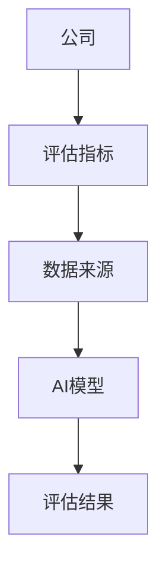
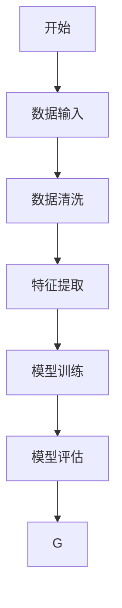
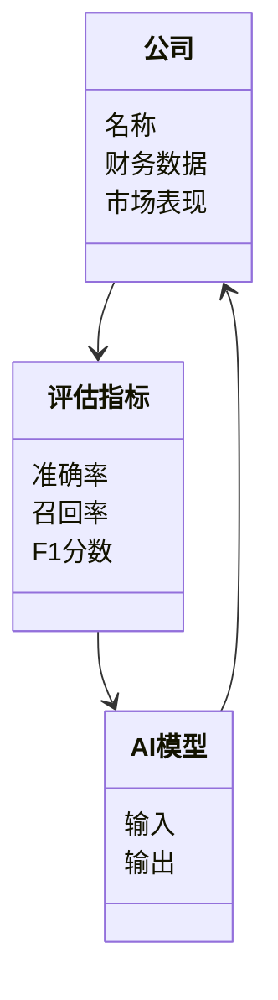
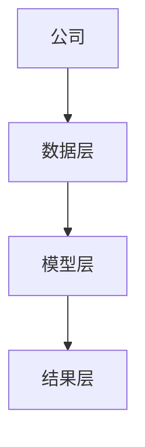
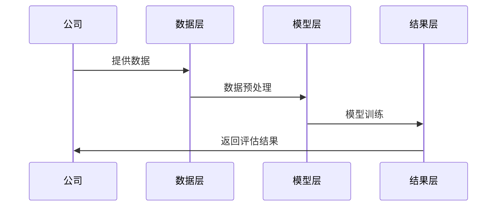

                 


---

# AI驱动的自动化公司质量评估

> 关键词：AI驱动，自动化公司质量评估，机器学习，数据挖掘，公司评估，技术博客

> 摘要：本文探讨了如何利用人工智能技术实现公司质量评估的自动化。通过分析传统评估方法的痛点，介绍AI驱动的自动化评估的核心概念、算法原理、系统架构，并通过实际案例展示其应用和优势。

---

# 第一部分: AI驱动的自动化公司质量评估概述

# 第1章: AI驱动的公司质量评估背景与目标

## 1.1 问题背景与定义
### 1.1.1 传统公司质量评估的痛点
- 数据来源单一，难以覆盖多维度
- 人工评估耗时长，效率低
- 主观性较强，难以量化

### 1.1.2 AI驱动的自动化评估的核心定义
- 利用AI技术对多源数据进行分析，生成公司质量评估报告
- 实现自动化、高效、客观的评估

### 1.1.3 评估目标与边界
- 目标：提升评估效率，降低人为误差
- 边界：数据来源的准确性和完整性

## 1.2 问题解决与价值
### 1.2.1 问题解决的思路与方法
- 数据挖掘：从多源数据中提取关键特征
- 机器学习：构建预测模型，自动化评估

### 1.2.2 自动化评估带来的价值
- 提高评估效率
- 降低成本
- 增强评估客观性

### 1.2.3 与传统评估方式的对比
- 对比维度：效率、成本、准确性

## 1.3 本章小结
### 1.3.1 核心概念总结
- AI驱动的自动化评估是利用AI技术对多源数据进行分析，生成公司质量评估报告

### 1.3.2 问题解决的关键点
- 数据预处理、特征提取、模型训练

### 1.3.3 未来发展趋势
- 数据源的多样化、模型的深度化

---

# 第2章: AI驱动的公司质量评估系统核心概念与联系

## 2.1 核心概念原理
### 2.1.1 数据来源与处理
- 数据来源：财务数据、市场表现、用户反馈
- 数据处理：清洗、转换、特征工程

### 2.1.2 AI模型的作用机制
- 输入：多源数据
- 输出：评估结果
- 中间过程：特征提取、模型训练

### 2.1.3 评估指标的设计
- 设计原则：全面性、可量化、可比较

## 2.2 核心概念属性对比
### 2.2.1 数据特征对比表
| 数据来源 | 特征 | 示例 |
|----------|------|------|
| 财务数据 | 利润率 | 净利润/收入 |
| 市场表现 | 市场占有率 | 销量/市场总容量 |

### 2.2.2 模型性能对比表
| 模型 | 准确率 | 召回率 | F1分数 |
|------|-------|--------|-------|
| 线性回归 | 0.85 | 0.80 | 0.82 |
| 随机森林 | 0.90 | 0.85 | 0.87 |

### 2.2.3 评估指标对比表
| 指标 | 重要性 | 计算公式 |
|------|--------|----------|
| 准确率 | 高 | 正确预测数 / 总样本数 |
| 召回率 | 中 | 正确预测的正例数 / 实际正例数 |

## 2.3 ER实体关系图


## 2.4 本章小结
### 2.4.1 核心概念的系统性分析
- 数据来源、模型、评估结果之间的关系

### 2.4.2 各概念之间的关系
- 数据来源影响模型性能，模型性能决定评估结果

### 2.4.3 未来优化方向
- 数据来源的多样性优化
- 模型的深度优化

---

# 第3章: AI驱动的公司质量评估算法原理

## 3.1 算法概述
### 3.1.1 算法目标
- 高准确率、高效率

### 3.1.2 算法流程
1. 数据预处理
2. 特征提取
3. 模型训练
4. 模型评估

### 3.1.3 算法输入输出
- 输入：多源数据
- 输出：评估结果

## 3.2 算法实现细节
### 3.2.1 数据预处理
```python
import pandas as pd
data = pd.read_csv('data.csv')
# 去除缺失值
data = data.dropna()
```

### 3.2.2 特征提取
```python
from sklearn.feature_selection import SelectKBest
selector = SelectKBest(k=10)
selected_features = selector.fit_transform(data, labels)
```

### 3.2.3 模型训练
```python
from sklearn.ensemble import RandomForestClassifier
model = RandomForestClassifier(n_estimators=100)
model.fit(selected_features, labels)
```

### 3.2.4 模型评估
```python
from sklearn.metrics import accuracy_score
y_pred = model.predict(selected_features)
print(accuracy_score(y_pred, labels))
```

## 3.3 算法流程图


## 3.4 算法数学模型
### 3.4.1 损失函数
$$ L = -\frac{1}{n}\sum_{i=1}^{n} y_i \log(p_i) + (1 - y_i)\log(1 - p_i) $$

### 3.4.2 优化器
$$ \theta = \theta - \eta \frac{\partial L}{\partial \theta} $$

## 3.5 本章小结
### 3.5.1 算法实现的关键点
- 数据预处理、特征提取、模型训练、模型评估

### 3.5.2 算法优化的方向
- 参数调优、模型融合

---

# 第4章: AI驱动的公司质量评估系统分析与架构设计

## 4.1 问题场景介绍
### 4.1.1 问题描述
- 公司质量评估需要考虑多维度数据

### 4.1.2 问题分析
- 数据来源分散
- 数据格式不统一

## 4.2 系统功能设计
### 4.2.1 领域模型


### 4.2.2 系统架构


## 4.3 系统接口设计
### 4.3.1 接口设计
- 输入接口：多源数据
- 输出接口：评估结果

### 4.3.2 交互流程


---

# 第5章: AI驱动的公司质量评估项目实战

## 5.1 环境安装
```bash
pip install numpy pandas scikit-learn
```

## 5.2 系统核心实现
### 5.2.1 核心代码
```python
import pandas as pd
from sklearn.ensemble import RandomForestClassifier
from sklearn.metrics import accuracy_score

data = pd.read_csv('data.csv')
X = data.drop('label', axis=1)
y = data['label']

model = RandomForestClassifier(n_estimators=100)
model.fit(X, y)

y_pred = model.predict(X)
print(accuracy_score(y_pred, y))
```

### 5.2.2 代码应用解读
- 数据预处理：去除缺失值
- 特征提取：使用随机森林进行特征选择
- 模型训练：训练随机森林模型
- 模型评估：计算准确率

## 5.3 实际案例分析
### 5.3.1 案例介绍
- 数据来源：某公司的财务数据、市场表现、用户反馈

### 5.3.2 分析过程
1. 数据预处理
2. 特征提取
3. 模型训练
4. 模型评估

## 5.4 小结
### 5.4.1 关键点总结
- 数据预处理、特征提取、模型训练

### 5.4.2 案例分析总结
- 成功实现了公司质量评估的自动化

---

# 第6章: AI驱动的公司质量评估最佳实践

## 6.1 小结
### 6.1.1 核心内容总结
- AI驱动的公司质量评估的核心概念
- 算法原理
- 系统架构设计
- 项目实战

## 6.2 注意事项
### 6.2.1 数据质量
- 数据来源的准确性和完整性

### 6.2.2 模型选择
- 根据实际需求选择合适的模型

## 6.3 拓展阅读
### 6.3.1 推荐书籍
- 《机器学习实战》
- 《深入理解深度学习》

### 6.3.2 推荐博客
- https://towardsdatascience.com/
- https://medium.com/ai-in-action

---

# 作者：AI天才研究院/AI Genius Institute & 禅与计算机程序设计艺术 /Zen And The Art of Computer Programming

