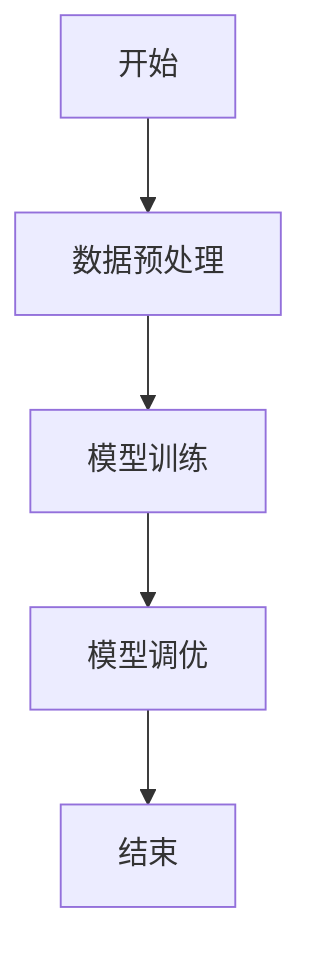
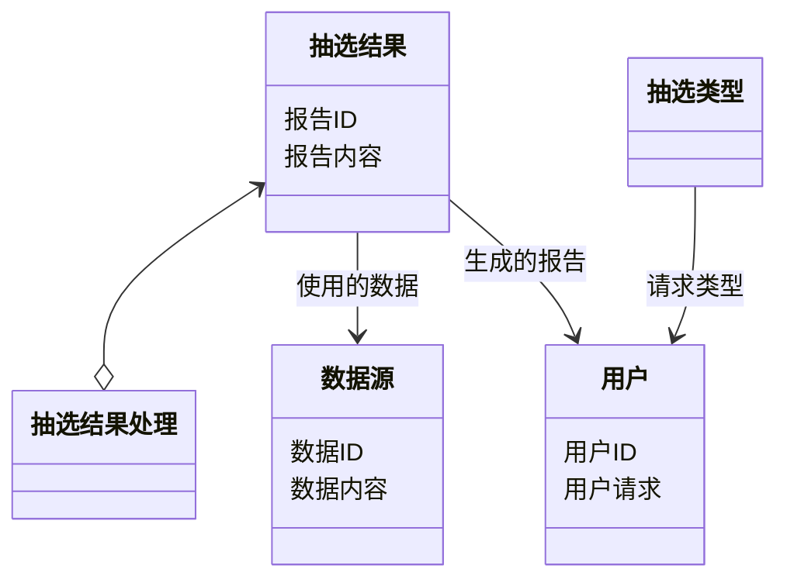

                 


# AI驱动的自动化投资报告生成

> 关键词：AI驱动，自动化投资，报告生成，自然语言处理，金融数据分析

> 摘要：本文探讨了AI技术在投资报告生成中的应用，分析了其背后的核心概念、算法原理、系统架构，并通过实际案例展示了如何利用这些技术实现自动化投资报告生成。文章内容丰富，涵盖了从理论到实践的各个方面，为读者提供了详尽的技术指导。

## 第一部分：背景介绍

### 第1章：AI驱动的自动化投资报告概述

#### 1.1 问题背景

投资报告的生成在金融领域一直是一个繁琐且耗时的过程。传统的报告生成依赖于手动数据收集、分析和撰写，不仅效率低下，而且容易出错。随着AI技术的发展，尤其是自然语言处理（NLP）和生成式AI的进步，自动化投资报告生成成为可能。

#### 1.2 问题描述

投资报告生成涉及大量的数据处理和分析，包括市场趋势、财务数据、公司基本面分析等。传统的手工方式不仅效率低，还容易受到主观因素的影响。此外，金融市场的动态变化要求报告能够快速生成，以适应瞬息万变的市场环境。

#### 1.3 问题解决

通过引入AI技术，特别是生成式AI模型，可以实现投资报告的自动化生成。AI模型能够快速处理大量数据，自动生成结构化的报告内容，大大提高了效率和准确性。

#### 1.4 边界与外延

自动化投资报告生成的边界包括数据来源的限制、模型的准确性和生成内容的可读性。外延则涉及与其他金融工具的集成，如实时数据源、交易系统等。

#### 1.5 核心概念

- **AI大模型**：如GPT-3、BERT等，用于自然语言理解和生成。
- **自然语言处理**：涉及文本的分析、理解和生成。
- **金融数据分析**：包括市场数据、财务报表等的处理和分析。

## 第二部分：核心概念与联系

### 第2章：AI大模型的原理与应用

#### 2.1 AI大模型的基本原理

AI大模型，尤其是生成式AI模型，通过大量的训练数据学习语言的结构和模式。在投资报告生成中，模型能够根据输入的金融数据生成相应的报告内容。

#### 2.2 核心概念的对比分析

| 模型类型   | 优点                     | 缺点                     |
|------------|--------------------------|--------------------------|
| 生成式AI   | 高度灵活，能够生成多样内容 | 可能生成不准确的信息       |
| 检索式AI   | 基于已有数据，准确性较高   | 内容生成不够灵活           |

#### 2.3 实体关系图

```mermaid
er
  entity 投资报告 {
    报告ID (PK)
   抽选时间
   抽选结果
   抽选类型
  }
  entity 数据源 {
    数据ID (PK)
    数据类型
    数据内容
  }
  entity 用户 {
    用户ID (PK)
    用户角色
    用户权限
  }
  relation 实体关系 {
   抽选结果 -> 数据源: 使用的数据
   抽选结果 -> 用户: 生成的报告
   抽选类型 -> 用户: 请求类型
  }
```

## 第三部分：算法原理讲解

### 第3章：AI大模型的训练与优化

#### 3.1 算法流程

1. **数据预处理**：清洗和格式化数据，确保模型输入的正确性。
2. **模型训练**：使用训练数据调整模型参数，优化生成效果。
3. **模型调优**：通过微调和参数调整，提高生成报告的质量。

#### 3.2 算法流程图



#### 3.3 Python代码实现

```python
import torch
import torch.nn as nn
import torch.optim as optim

class InvestmentReportGenerator(nn.Module):
    def __init__(self, vocab_size, embedding_dim, hidden_dim):
        super(InvestmentReportGenerator, self).__init__()
        self.embedding = nn.Embedding(vocab_size, embedding_dim)
        self.lstm = nn.LSTM(embedding_dim, hidden_dim, batch_first=True)
        self.fc = nn.Linear(hidden_dim, vocab_size)

    def forward(self, input, hidden):
        embeds = self.embedding(input)
        output, hidden = self.lstm(embeds, hidden)
        output = self.fc(output.view(-1, output.size(2)))
        return output, hidden

model = InvestmentReportGenerator(vocab_size=10000, embedding_dim=256, hidden_dim=512)
optimizer = optim.Adam(model.parameters(), lr=0.001)
criterion = nn.CrossEntropyLoss()

# 示例训练步骤
for epoch in range(num_epochs):
    for batch in batches:
        inputs, targets = batch
        outputs, _ = model(inputs, None)
        loss = criterion(outputs, targets)
        loss.backward()
        optimizer.step()
        model.zero_grad()
```

#### 3.4 数学模型与公式

- **交叉熵损失函数**：用于衡量模型输出与实际标签的差异。
  $$\mathcal{L} = -\frac{1}{N}\sum_{i=1}^{N} \sum_{j=1}^{M} y_{ij}\log p(y_{ij}|x_i)$$

- **梯度下降算法**：用于优化模型参数。
  $$\theta = \theta - \eta \frac{\partial \mathcal{L}}{\partial \theta}$$

## 第四部分：系统分析与架构设计

### 第4章：投资报告生成系统的架构

#### 4.1 项目介绍

投资报告生成系统的目标是利用AI技术实现自动化报告生成，提高效率和准确性。项目范围包括数据采集、模型训练、报告生成和用户交互。

#### 4.2 系统功能设计



#### 4.3 系统架构设计


#### 4.4 系统接口设计

接口主要用于用户请求处理和数据交互，采用RESTful API设计。

## 第五部分：项目实战

### 第5章：项目实战与案例分析

#### 5.1 环境安装

安装必要的库，如PyTorch、Transformers等。

#### 5.2 核心实现

编写数据处理、模型训练和报告生成的代码。

#### 5.3 案例分析

通过具体案例展示AI生成投资报告的实际效果和优势。

## 第六部分：总结与展望

### 第6章：总结与展望

#### 6.1 最佳实践

- 数据质量至关重要，确保数据的准确性和完整性。
- 模型调优需要结合具体场景进行微调，以提高生成效果。

#### 6.2 小结

通过本文的介绍，读者可以全面了解AI驱动的自动化投资报告生成的技术细节和实现方法。随着技术的不断进步，未来将有更多可能性被探索。

## 作者

作者：AI天才研究院/AI Genius Institute & 禅与计算机程序设计艺术 /Zen And The Art of Computer Programming

---

本文通过详细讲解AI驱动的自动化投资报告生成的背景、核心概念、算法原理、系统架构和项目实战，为读者提供了一个全面的技术指南。希望本文能够帮助读者理解这一领域的技术细节，并为实际应用提供参考。

