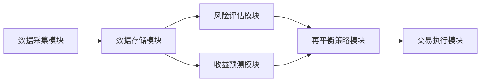
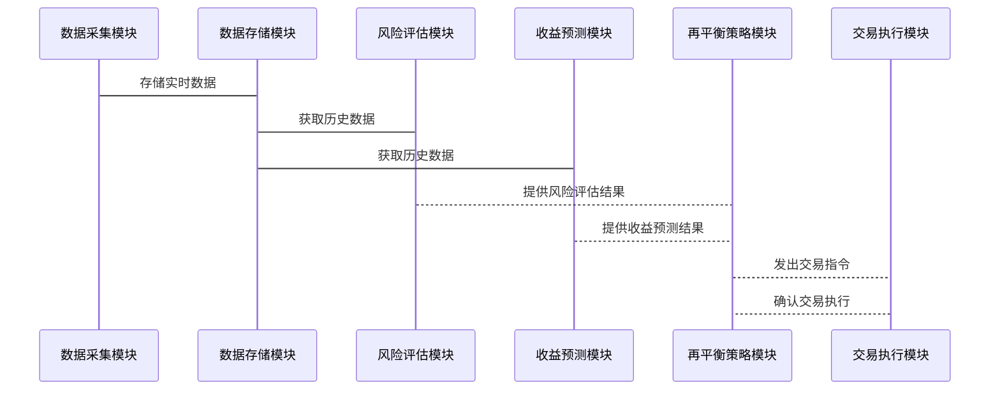

                 


# AI驱动的自动化投资组合再平衡

> 关键词：AI，投资组合，自动化再平衡，机器学习，金融，风险管理

> 摘要：本文探讨了AI在投资组合管理中的应用，重点分析了如何利用机器学习技术实现投资组合的自动化再平衡。文章从背景介绍、核心概念、算法原理、系统架构到项目实战，全面解析了AI驱动的自动化投资组合再平衡的实现过程。通过详细的技术分析和实际案例，展示了如何利用AI技术优化投资组合，提升收益并降低风险。

---

## 第一部分：背景与基础

### 第1章：投资组合再平衡概述

#### 1.1 投资组合再平衡的基本概念

##### 1.1.1 问题背景与问题描述

投资组合再平衡是金融投资中一个关键的管理策略，旨在定期调整投资组合的构成，以维持预期的风险和收益水平。传统上，再平衡是基于固定的时间间隔或特定的市场条件手动进行的，这种方法存在效率低、响应慢等问题。

**问题背景**  
在金融市场中，资产价格波动频繁，投资者的预期收益和风险承受能力可能随市场变化而调整。传统的投资组合管理方式难以实时捕捉这些变化，导致投资组合可能偏离预期目标。

**问题描述**  
投资组合再平衡的目的是确保投资组合的构成与投资者的风险偏好和市场环境保持一致。然而，手动或半自动化的再平衡方法效率低下，且难以应对市场的快速变化。

**问题解决**  
引入人工智能技术可以实现投资组合的自动化再平衡，通过实时数据处理和预测模型，优化投资组合的构成，提升收益并降低风险。

##### 1.1.2 投资组合再平衡的边界与外延

**边界**  
- 再平衡的频率：每日、每周、每月等。
- 资产类别：股票、债券、基金等。
- 风险承受能力：根据投资者的承受能力调整再平衡策略。

**外延**  
- 市场环境变化：宏观经济指标、市场情绪等。
- 交易成本：包括佣金、滑点等。
- 税务影响：不同资产的税务处理可能影响再平衡策略。

##### 1.1.3 核心要素与概念结构

**核心要素**  
- **资产配置**：决定投资组合中各类资产的比例。
- **风险评估**：量化投资组合的风险，如波动率、VaR（Value at Risk）等。
- **收益预测**：预测不同资产的预期收益。
- **交易执行**：根据再平衡策略执行交易。

**概念结构**  
投资组合再平衡涉及多个模块的协同工作，包括数据采集、风险评估、收益预测、策略生成和交易执行。

### 第2章：AI在金融投资中的应用

#### 2.1 AI在金融投资中的核心作用

**AI的核心作用**  
- 数据处理：处理海量金融数据，提取有用信息。
- 预测模型：构建机器学习模型预测资产价格和风险。
- 自动化决策：基于模型结果自动调整投资组合。

#### 2.2 机器学习在投资组合管理中的应用

**机器学习的应用场景**  
- 风险预测：使用机器学习模型预测市场风险。
- 资产分配：根据市场状况调整资产配置比例。
- 市场情绪分析：利用自然语言处理技术分析市场情绪。

#### 2.3 自动化投资组合再平衡的现状与趋势

**现状**  
- 现有解决方案多为半自动化，依赖人工干预。
- 数据处理能力有限，难以实时捕捉市场变化。

**趋势**  
- AI技术的引入将推动投资组合管理的自动化和智能化。
- 结合大数据和云计算，提升数据处理能力。

---

## 第二部分：算法原理

### 第3章：风险评估与收益预测

#### 3.1 风险评估

##### 3.1.1 现代投资组合理论（MPT）

**MPT的核心思想**  
通过优化资产配置，使投资组合在给定风险水平下实现最大收益，或在给定收益水平下实现最小风险。

**数学模型**  
投资组合的预期收益和风险可以用以下公式表示：

$$
\text{收益} = \sum_{i=1}^{n} w_i \times r_i
$$

$$
\text{风险} = \sqrt{\sum_{i=1}^{n} \sum_{j=1}^{n} w_i w_j \sigma_i \sigma_j \rho_{ij}}
$$

其中，\( w_i \) 是资产 \( i \) 的权重，\( r_i \) 是资产 \( i \) 的预期收益，\( \sigma_i \) 是资产 \( i \) 的波动率，\( \rho_{ij} \) 是资产 \( i \) 和 \( j \) 的相关系数。

##### 3.1.2 均值-方差优化（MVO）

**MVO的目标**  
找到最优资产配置，使投资组合的风险最小化，或收益最大化。

**优化过程**  
通过拉格朗日乘数法求解以下优化问题：

$$
\min_{w} \sigma_p^2
$$

$$
\text{subject to} \quad \sum_{i=1}^{n} w_i = 1
$$

其中，\( \sigma_p \) 是投资组合的波动率，\( w \) 是资产权重向量。

---

### 第4章：收益预测

#### 4.1 时间序列预测

##### 4.1.1 ARIMA模型

**ARIMA模型的结构**  
ARIMA（自回归积分滑动平均模型）适用于时间序列数据的预测。

**模型公式**  
$$
y_t = c + \sum_{i=1}^{p} \phi_i y_{t-i} + \sum_{j=1}^{q} \theta_j \epsilon_{t-j} + \epsilon_t
$$

其中，\( c \) 是常数项，\( \phi_i \) 是自回归系数，\( \theta_j \) 是滑动平均系数，\( \epsilon_t \) 是白噪声。

##### 4.1.2 长短期记忆网络（LSTM）

**LSTM的优势**  
适用于处理长期依赖关系，适合金融时间序列数据的预测。

**LSTM结构**  
$$
f_t = \sigma(W_f \cdot [h_{t-1}, x_t])
$$

$$
i_t = \sigma(W_i \cdot [h_{t-1}, x_t])
$$

$$
o_t = \sigma(W_o \cdot [h_{t-1}, x_t])
$$

$$
h_t = f_t \cdot c_{t-1} + i_t \cdot \tilde{c}_t
$$

$$
c_t = h_t
$$

其中，\( f_t \) 是遗忘门，\( i_t \) 是输入门，\( o_t \) 是输出门，\( h_t \) 是隐藏状态，\( c_t \) 是细胞状态，\( \sigma \) 是sigmoid函数。

---

## 第三部分：系统架构设计

### 第5章：系统模块设计

#### 5.1 数据采集模块

**功能**  
实时采集股票、债券等资产的价格数据。

**接口**  
通过API接口从数据供应商获取实时数据。

#### 5.2 风险评估模块

**功能**  
计算投资组合的风险指标，如VaR、波动率等。

**输入**  
资产价格数据和权重。

**输出**  
风险评估结果。

#### 5.3 收益预测模块

**功能**  
预测未来资产的收益。

**输入**  
历史价格数据和当前市场状态。

**输出**  
资产收益预测结果。

#### 5.4 再平衡策略模块

**功能**  
根据风险评估和收益预测结果，生成再平衡策略。

**输入**  
风险评估结果和收益预测结果。

**输出**  
资产调整建议。

#### 5.5 交易执行模块

**功能**  
根据再平衡策略执行交易。

**输入**  
调整建议和交易指令。

**输出**  
交易确认和执行报告。

### 第6章：系统架构设计

#### 6.1 系统架构图



#### 6.2 接口设计

**数据接口**  
- 数据采集模块通过API接口获取实时数据。
- 数据存储模块提供查询接口，供其他模块调用。

**交易接口**  
- 再平衡策略模块生成交易指令。
- 交易执行模块通过API接口执行交易。

#### 6.3 系统交互流程



---

## 第四部分：项目实战

### 第7章：环境搭建与代码实现

#### 7.1 环境搭建

**工具安装**  
- 安装Python和必要的库（如pandas、numpy、scikit-learn、tensorflow）。
- 安装Jupyter Notebook用于数据分析和可视化。

**数据源**  
从Yahoo Finance获取股票数据。

#### 7.2 核心代码实现

**数据预处理**  
```python
import pandas as pd
import numpy as np

# 从Yahoo Finance获取数据
def get_data(tickers, start_date, end_date):
    data = pd.DataFrame()
    for ticker in tickers:
        df = pdDataReader(ticker, 'yahoo', start_date, end_date)
        data[ticker] = df['Adj Close']
    return data
```

**风险评估**  
```python
from sklearn.covariance import LedoitWolf

def compute_risk(returns, method='ledoit-wolf'):
    if method == 'ledoit-wolf':
        cov = LedoitWolf().fit(returns)
    else:
        cov = np.cov(returns.T)
    eigenvalues = np.linalg.eigh(cov)[0]
    return np.mean(eigenvalues)
```

**收益预测**  
```python
from sklearn.preprocessing import MinMaxScaler
from tensorflow.keras.models import Sequential
from tensorflow.keras.layers import LSTM, Dense

def build_lstm_model(input_shape):
    model = Sequential()
    model.add(LSTM(50, input_shape=input_shape))
    model.add(Dense(1))
    model.compile(loss='mse', optimizer='adam')
    return model
```

---

## 第五部分：高级主题与扩展

### 第8章：强化学习与动态再平衡

#### 8.1 强化学习在投资组合管理中的应用

**强化学习的优势**  
能够根据市场反馈动态调整策略，适应复杂多变的市场环境。

**DQN算法**  
深度Q学习网络（DQN）可以用于投资组合管理，通过经验回放和策略评估优化投资决策。

### 第9章：系统安全与合规性

#### 9.1 系统安全性

**数据安全**  
确保数据传输和存储的安全性，防止数据泄露。

**系统防护**  
采用防火墙、入侵检测系统等措施，保护系统免受攻击。

#### 9.2 合规性

**合规要求**  
遵守金融监管机构的相关规定，如《证券法》、《投资顾问业务暂行规定》等。

**风险管理**  
建立风险预警机制，及时发现和处理潜在风险。

---

## 结论

AI驱动的自动化投资组合再平衡通过机器学习和大数据技术，显著提升了投资组合管理的效率和准确性。然而，实际应用中仍需关注系统安全、合规性和模型的可解释性。未来，随着AI技术的不断发展，投资组合管理将更加智能化和个性化。

---

## 作者

作者：AI天才研究院/AI Genius Institute & 禅与计算机程序设计艺术 /Zen And The Art of Computer Programming

