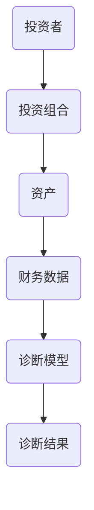
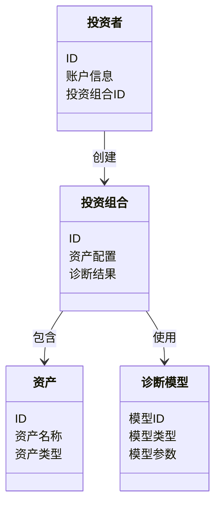
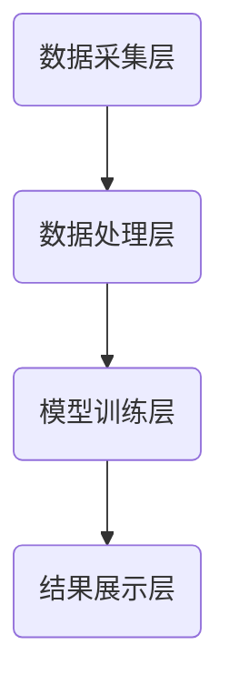
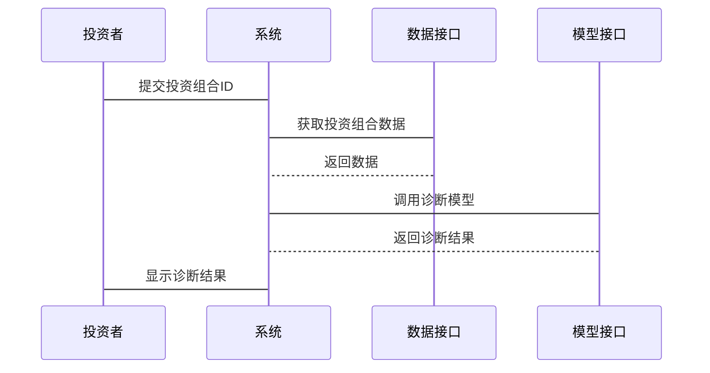

                 


# AI驱动的自动化投资组合诊断

> 关键词：AI技术，投资组合诊断，自动化诊断，时间序列分析，机器学习算法

> 摘要：本文深入探讨了AI驱动的自动化投资组合诊断的实现原理、核心算法及其在金融领域的应用价值。通过系统化的分析和案例研究，详细介绍了如何利用机器学习算法和大数据技术实现投资组合的智能化诊断，为企业和个人投资者提供科学的决策支持。

---

# 第1章: 投资组合诊断的背景与意义

## 1.1 投资组合诊断的背景与意义

### 1.1.1 投资组合诊断的背景

在金融领域，投资组合诊断是评估和优化资产配置的重要环节。传统的投资组合管理依赖于人工分析，效率低且容易受到主观因素的影响。随着人工智能（AI）技术的快速发展，自动化投资组合诊断成为可能，这不仅提高了诊断效率，还能通过大数据分析发现潜在风险，帮助投资者做出更科学的决策。

### 1.1.2 AI技术在金融领域的应用前景

AI技术在金融领域的应用日益广泛，从股票预测到风险评估，再到投资组合管理，AI正在改变传统的金融业务模式。通过机器学习算法，AI能够处理海量数据，发现隐藏的规律，并提供实时的决策支持。投资组合诊断作为金融领域的重要环节，AI的应用将极大地提升其效率和准确性。

### 1.1.3 自动化投资组合诊断的核心价值

自动化投资组合诊断的核心价值在于其能够快速、准确地识别投资组合中的潜在问题，并提供优化建议。通过AI技术，投资者可以实时监控资产表现，及时调整投资策略，从而降低风险，提高收益。

## 1.2 投资组合诊断的核心概念

### 1.2.1 投资组合的基本构成

投资组合由多种资产组成，包括股票、债券、基金等。每种资产都有其独特的风险和收益特征，通过合理的资产配置，可以实现收益与风险的最佳平衡。

### 1.2.2 自动化诊断的关键技术

自动化投资组合诊断依赖于先进的AI技术，包括机器学习算法、时间序列分析、自然语言处理等。这些技术能够帮助系统快速分析海量数据，识别潜在风险，并生成诊断报告。

### 1.2.3 诊断过程的自动化优势

自动化诊断的优势在于其高效性和准确性。通过AI技术，系统可以在短时间内完成复杂的分析任务，并提供实时的诊断结果。这不仅节省了时间，还减少了人为错误的可能性。

## 1.3 投资组合诊断的核心要素

### 1.3.1 数据来源与类型

投资组合诊断的数据来源包括历史价格数据、市场新闻、财务报表等。不同类型的数据需要进行清洗和预处理，以确保其质量和一致性。

### 1.3.2 诊断指标体系

诊断指标体系包括收益、风险、流动性等多个维度。通过多维度的指标分析，可以全面评估投资组合的表现，并识别潜在问题。

### 1.3.3 自动化诊断的流程框架

自动化诊断的流程通常包括数据收集、特征提取、模型训练、诊断分析和结果输出五个阶段。每个阶段都有其独特的任务和目标，共同构成完整的诊断流程。

## 1.4 本章小结

本章主要介绍了投资组合诊断的背景、核心概念和关键要素。通过AI技术的引入，自动化诊断成为可能，其高效性和准确性为投资者提供了有力支持。

---

# 第2章: AI驱动的自动化投资组合诊断核心概念与联系

## 2.1 核心概念的原理与联系

### 2.1.1 数据与模型的关系

数据是AI诊断的基础，模型是数据处理的核心工具。通过模型，系统能够从数据中提取有价值的信息，并生成诊断结果。

### 2.1.2 算法与诊断结果的关联

不同的算法适用于不同的诊断场景。选择合适的算法，能够显著提高诊断的准确性和效率。

### 2.1.3 多模型集成的优势

多模型集成能够充分利用不同算法的优势，通过投票或加权的方式，生成更可靠的诊断结果。这种方法在处理复杂问题时表现尤为突出。

## 2.2 投资组合诊断的ER实体关系图



## 2.3 本章小结

本章通过ER实体关系图，详细阐述了投资组合诊断的核心概念及其相互关系。多模型集成的优势为诊断结果的准确性提供了保障。

---

# 第3章: 数据驱动的投资组合诊断

## 3.1 数据收集与预处理

### 3.1.1 数据来源与类型

数据来源包括历史价格数据、市场新闻、财务报表等。不同类型的数据需要进行清洗和预处理，以确保其质量和一致性。

### 3.1.2 数据清洗与标准化

数据清洗包括去除缺失值、处理异常值等。标准化则是将不同量纲的数据转换为统一的量纲，便于模型处理。

### 3.1.3 数据特征提取

特征提取是将数据转化为模型可识别的特征向量。常用的方法包括主成分分析（PCA）和线性判别分析（LDA）。

## 3.2 时间序列数据分析

### 3.2.1 时间序列的基本特征

时间序列的基本特征包括趋势、周期性、季节性等。这些特征能够帮助模型识别数据中的规律。

### 3.2.2 常见的时间序列分析方法

常用的时间序列分析方法包括ARIMA模型和LSTM网络。ARIMA适用于线性数据，而LSTM则适用于非线性数据。

### 3.2.3 AI在时间序列预测中的应用

AI技术能够通过深度学习模型，捕捉数据中的复杂规律，并生成准确的预测结果。

## 3.3 数据可视化与分析

### 3.3.1 数据可视化的工具与方法

常用的数据可视化工具包括Matplotlib和Seaborn。通过可视化，可以直观地观察数据的分布和趋势。

### 3.3.2 可视化在诊断中的作用

可视化能够帮助诊断人员快速发现数据中的异常点和潜在问题。

### 3.3.3 通过可视化发现异常

通过可视化分析，可以发现数据中的异常波动，并进一步分析其原因。

## 3.4 本章小结

本章详细介绍了数据驱动的投资组合诊断过程，包括数据收集、预处理、特征提取和可视化分析等关键步骤。

---

# 第4章: 基于AI的诊断算法原理

## 4.1 机器学习算法在诊断中的应用

### 4.1.1 监督学习与无监督学习的对比

监督学习适用于有标签的数据，而无监督学习适用于无标签的数据。选择合适的算法能够显著提高诊断的准确率。

### 4.1.2 常见的诊断算法选择

常用的诊断算法包括决策树、随机森林和神经网络等。每种算法都有其独特的优势和适用场景。

### 4.1.3 算法的优缺点分析

通过对比不同算法的优缺点，可以选择最适合当前任务的算法。

## 4.2 时间序列预测算法详解

### 4.2.1 ARIMA模型的原理与实现

ARIMA模型通过自回归和滑动平均的方式，预测未来的趋势。其实现步骤包括数据预处理、模型参数估计和模型验证等。

### 4.2.2 LSTM网络的结构与优势

LSTM网络通过长短期记忆单元，能够捕捉数据中的长期依赖关系。其结构包括输入门、遗忘门和输出门等。

### 4.2.3 其他时间序列预测方法

其他方法包括Prophet模型和GARCH模型等，每种方法都有其适用场景和优势。

## 4.3 算法的数学模型与公式

### 4.3.1 ARIMA模型的数学公式

$$ ARIMA(p, d, q) $$

其中，p为自回归阶数，d为差分阶数，q为滑动平均阶数。

### 4.3.2 LSTM网络的数学公式

$$ f_t = \sigma(W_f \cdot [h_{t-1}, x_t] + b_f) $$

其中，$f_t$为输入门，$h_{t-1}$为前一时刻的隐藏状态，$x_t$为当前输入，$W_f$为权重矩阵，$b_f$为偏置项。

## 4.4 本章小结

本章详细介绍了基于AI的诊断算法原理，包括监督学习、无监督学习和时间序列预测算法等。通过数学公式的推导，帮助读者理解算法的核心思想。

---

# 第5章: 投资组合诊断的系统架构设计

## 5.1 问题场景介绍

投资组合诊断系统需要处理海量数据，并提供实时的诊断结果。系统架构设计需要考虑数据处理的效率和模型的可扩展性。

## 5.2 系统功能设计

### 5.2.1 领域模型设计

领域模型包括投资者、投资组合、资产和诊断模型等实体。通过类图可以清晰地展示各实体之间的关系。



### 5.2.2 系统架构设计

系统架构设计包括数据采集层、数据处理层、模型训练层和结果展示层。每一层都有其独特的功能和作用。



### 5.2.3 系统接口设计

系统接口设计包括数据接口、模型接口和用户接口。数据接口用于与外部数据源交互，模型接口用于与诊断模型交互，用户接口用于与最终用户交互。

### 5.2.4 系统交互设计

系统交互设计通过序列图展示投资者与系统的交互过程。投资者通过用户接口提交请求，系统通过数据接口获取数据，并通过模型接口调用诊断模型，最终将结果返回给用户。



## 5.3 本章小结

本章详细介绍了投资组合诊断系统的架构设计，包括领域模型、系统架构、接口设计和交互设计等关键部分。

---

# 第6章: 项目实战

## 6.1 项目环境安装

### 6.1.1 安装Python环境

安装Python 3.8或更高版本，并安装必要的库，如NumPy、Pandas、Scikit-learn和TensorFlow。

### 6.1.2 安装数据可视化工具

安装Matplotlib和Seaborn，用于数据的可视化分析。

### 6.1.3 安装机器学习框架

安装Scikit-learn和XGBoost，用于模型的训练和优化。

## 6.2 系统核心实现源代码

### 6.2.1 数据预处理代码

```python
import pandas as pd
import numpy as np

# 加载数据
data = pd.read_csv('portfolio_data.csv')

# 数据清洗
data = data.dropna()
data = (data - data.mean()) / data.std()

# 特征提取
from sklearn.decomposition import PCA

pca = PCA(n_components=2)
principal_components = pca.fit_transform(data)
```

### 6.2.2 模型训练代码

```python
from sklearn.ensemble import RandomForestClassifier
from sklearn.model_selection import train_test_split

# 划分训练集和测试集
X_train, X_test, y_train, y_test = train_test_split(principal_components, labels, test_size=0.2)

# 训练模型
model = RandomForestClassifier(n_estimators=100)
model.fit(X_train, y_train)

# 预测结果
y_pred = model.predict(X_test)
```

### 6.2.3 结果展示代码

```python
from sklearn.metrics import classification_report

print(classification_report(y_test, y_pred))
```

## 6.3 代码实现与解读

### 6.3.1 数据预处理部分

数据预处理部分包括数据清洗和特征提取。通过PCA算法，将高维数据降维为二维，便于后续模型训练。

### 6.3.2 模型训练部分

使用随机森林算法进行模型训练，并对测试集进行预测。通过混淆矩阵和分类报告，评估模型的性能。

### 6.3.3 结果展示部分

通过混淆矩阵和分类报告，评估模型的准确率、召回率和F1分数等指标，判断模型的性能。

## 6.4 项目小结

本章通过实际案例，详细展示了投资组合诊断系统的实现过程，包括环境安装、代码实现和结果展示等关键步骤。

---

# 第7章: 总结与展望

## 7.1 本章总结

本文详细探讨了AI驱动的自动化投资组合诊断的实现原理、核心算法及其在金融领域的应用价值。通过系统化的分析和案例研究，帮助读者全面理解和应用这些技术。

## 7.2 未来展望

随着AI技术的不断发展，投资组合诊断将更加智能化和自动化。未来的研究方向包括更复杂的模型设计、多模态数据融合以及实时诊断系统优化等。

## 7.3 注意事项

在实际应用中，需要注意数据的隐私保护和模型的可解释性问题。同时，还需要根据实际情况调整模型参数，以获得最佳诊断效果。

## 7.4 拓展阅读

推荐读者阅读《机器学习实战》和《深度学习》等书籍，以进一步深入理解AI技术在金融领域的应用。

---

# 作者：AI天才研究院/AI Genius Institute & 禅与计算机程序设计艺术 /Zen And The Art of Computer Programming

