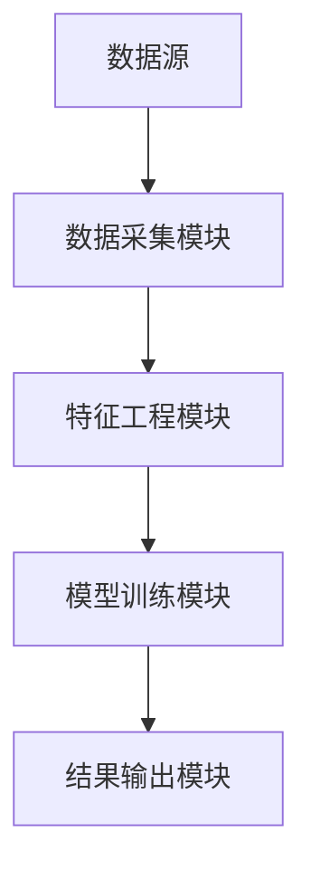

                 


# AI驱动的自适应市场周期识别

> **关键词**：AI，自适应市场周期，时间序列分析，LSTM，注意力机制，机器学习

> **摘要**：本文深入探讨了如何利用人工智能技术实现自适应市场周期识别。通过分析市场周期的基本概念、AI技术基础、核心算法原理、系统架构设计以及实际项目案例，本文为读者提供了一套完整的解决方案。从理论到实践，从算法到系统，文章详细阐述了如何利用深度学习和时间序列分析技术来实现市场周期的自适应识别，并通过具体代码示例展示了实现过程。

---

## 第一部分：自适应市场周期识别概述

### 第1章：自适应市场周期识别概述

#### 1.1 市场周期的基本概念

市场周期是指经济、金融等领域中，随着时间推移表现出的波动性变化。常见的市场周期类型包括经济周期（复苏、繁荣、衰退、萧条）、股市周期（上涨、下跌）、商品周期（供过于求、供不应求）等。市场周期的识别对于投资决策、风险管理等领域具有重要意义。

#### 1.2 问题背景与挑战

传统的市场周期识别方法主要依赖统计分析和经验判断，存在以下挑战：

1. **数据复杂性**：市场数据通常具有非线性、噪声多、波动大的特点，传统方法难以捕捉复杂模式。
2. **实时性要求**：市场环境瞬息万变，需要实时识别和适应。
3. **模型泛化能力**：传统模型在面对市场环境变化时，泛化能力有限，难以适应复杂多变的市场。

#### 1.3 自适应市场周期识别的核心要素

自适应市场周期识别通过AI技术，结合动态模型和实时反馈机制，实现对市场周期的自动识别与调整。其核心要素包括：

- **数据驱动**：基于历史数据和实时数据，构建特征提取和模式识别模型。
- **动态调整**：模型能够根据最新数据实时调整参数，适应市场变化。
- **反馈机制**：通过实时结果反馈，优化模型性能。

---

## 第二部分：AI技术基础

### 第2章：机器学习与深度学习基础

#### 2.1 机器学习基础

机器学习是AI的核心技术之一，主要分为以下三类：

- **监督学习**：基于标记数据，学习输入与输出之间的映射关系。
- **无监督学习**：在无标记数据中发现隐藏结构。
- **强化学习**：通过试错机制，学习最优决策策略。

#### 2.2 深度学习基础

深度学习通过多层神经网络，提取数据的高层次特征。常见模型包括：

- **卷积神经网络（CNN）**：擅长处理图像数据。
- **循环神经网络（RNN）**：适合处理序列数据，如时间序列。

#### 2.3 时间序列分析

时间序列分析是市场周期识别的关键技术。常用方法包括：

- **ARIMA模型**：基于自回归和移动平均的思想，适用于线性时间序列。
- **LSTM**：通过门控机制，捕捉时间序列的长期依赖关系。

#### 2.4 特征工程

特征工程是提升模型性能的关键步骤。常见的特征工程方法包括：

- **特征选择**：筛选重要特征，去除冗余信息。
- **特征变换**：通过标准化、归一化等方法，改善模型性能。

---

## 第三部分：算法原理

### 第3章：自适应市场周期识别的算法原理

#### 3.1 长短期记忆网络（LSTM）

LSTM是一种特殊的RNN，通过三个门控（输入门、遗忘门、输出门）实现对长期依赖关系的捕捉。其结构如下：

1. **输入门**：决定哪些新信息需要存储。
2. **遗忘门**：决定哪些旧信息需要遗忘。
3. **输出门**：决定输出结果。

公式如下：

$$
f_t = \sigma(W_f x_t + U_f h_{t-1} + b_f)
$$

$$
i_t = \sigma(W_i x_t + U_i h_{t-1} + b_i)
$$

$$
o_t = \sigma(W_o x_t + U_o h_{t-1} + b_o)
$$

$$
h_t = f_t \cdot c_{t-1} + i_t \cdot tanh(W_c x_t + U_c h_{t-1} + b_c)
$$

$$
c_t = h_t
$$

（公式解释：f_t为遗忘门输出，i_t为输入门输出，o_t为输出门输出，h_t为隐藏状态，c_t为细胞状态）

#### 3.2 注意力机制

注意力机制通过计算序列中各位置的重要性，聚焦关键信息。其核心公式如下：

$$
\alpha_i = \frac{\exp(s_i)}{\sum_{j=1}^n \exp(s_j)}
$$

其中，s_i是第i个位置的注意力得分。

---

## 第四部分：系统架构设计

### 第4章：自适应市场周期识别系统架构

#### 4.1 系统功能设计

系统功能模块包括：

- 数据采集模块：实时采集市场数据。
- 特征工程模块：提取特征并进行预处理。
- 模型训练模块：训练并优化识别模型。
- 结果输出模块：输出识别结果并提供反馈。

#### 4.2 系统架构设计

系统架构采用模块化设计，各模块之间的关系如下：



---

## 第五部分：项目实战

### 第5章：自适应市场周期识别系统实现

#### 5.1 环境搭建

项目需要以下环境：

- Python 3.7+
- TensorFlow 2.0+
- Pandas、Matplotlib等库。

#### 5.2 核心代码实现

以下是一个基于LSTM的时间序列预测代码示例：

```python
import numpy as np
import pandas as pd
from tensorflow.keras.models import Sequential
from tensorflow.keras.layers import LSTM, Dense, Dropout

# 加载数据
data = pd.read_csv('market_data.csv')
train_data = data.iloc[:1000, 1].values
test_data = data.iloc[1000:, 1].values

# 数据预处理
from sklearn.preprocessing import MinMaxScaler
scaler = MinMaxScaler()
train_scaled = scaler.fit_transform(train_data.reshape(-1, 1))
test_scaled = scaler.transform(test_data.reshape(-1, 1))

# 构建数据集
def create_dataset(data, look_back=1):
    X, Y = [], []
    for i in range(len(data) - look_back):
        X.append(data[i:i+look_back])
        Y.append(data[i+look_back])
    return np.array(X), np.array(Y)

X_train, Y_train = create_dataset(train_scaled, look_back=5)
X_test, Y_test = create_dataset(test_scaled, look_back=5)

# 模型构建
model = Sequential()
model.add(LSTM(50, input_shape=(5, 1)))
model.add(Dropout(0.2))
model.add(Dense(1))
model.compile(loss='mean_squared_error', optimizer='adam')

# 训练模型
model.fit(X_train, Y_train, epochs=50, batch_size=64, verbose=1)

# 预测与评估
train_pred = model.predict(X_train)
test_pred = model.predict(X_test)

# 反转归一化
train_pred = scaler.inverse_transform(train_pred)
Y_train_real = scaler.inverse_transform(Y_train.reshape(-1, 1))
test_pred = scaler.inverse_transform(test_pred)
Y_test_real = scaler.inverse_transform(Y_test.reshape(-1, 1))

# 可视化结果
import matplotlib.pyplot as plt
plt.plot(Y_train_real, label='训练真实值')
plt.plot(train_pred, label='训练预测值')
plt.legend()
plt.show()
```

---

## 第六部分：总结与展望

### 第6章：总结与展望

#### 6.1 总结

本文系统地介绍了AI驱动的自适应市场周期识别技术，从理论到实践，详细阐述了算法原理、系统架构设计和项目实现。通过LSTM和注意力机制的结合，能够有效捕捉市场周期的复杂模式，实现自适应识别。

#### 6.2 展望

未来，随着AI技术的不断发展，自适应市场周期识别将更加智能化和高效化。可能的研究方向包括：

- 更复杂的模型结构，如Transformer和混合模型。
- 结合多模态数据，提升识别精度。
- 实时性优化，提高应用场景的响应速度。

---

**作者：AI天才研究院/AI Genius Institute & 禅与计算机程序设计艺术 /Zen And The Art of Computer Programming**

