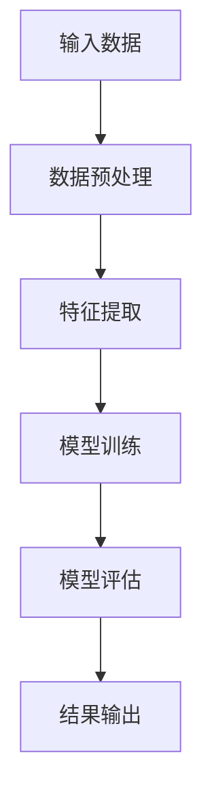
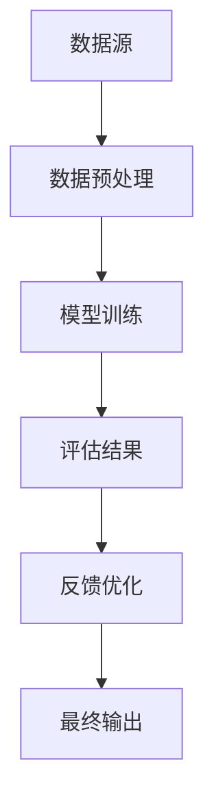
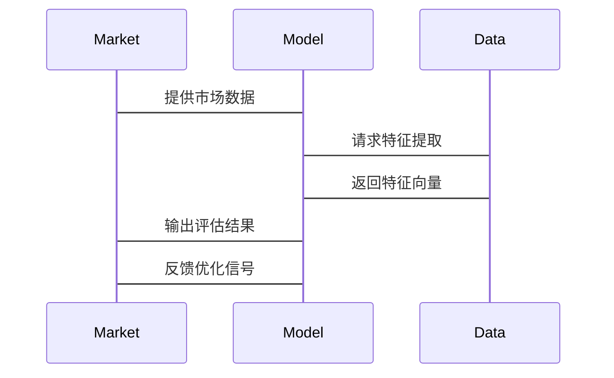

                 


# AI驱动的自适应市场效率评估

> 关键词：AI驱动，市场效率，自适应评估，算法，数据科学

> 摘要：本文深入探讨了AI驱动的自适应市场效率评估的理论基础、算法实现和实际应用。通过分析自适应评估模型的原理、核心概念与联系，结合具体的算法流程、数学模型和系统架构设计，本文为读者提供了一套完整的解决方案，帮助其理解并掌握如何利用AI技术提升市场效率评估的动态性和准确性。

---

## 第一部分: AI驱动的自适应市场效率评估概述

### 第1章: 自适应市场效率评估的基本概念

#### 1.1 什么是自适应市场效率评估
自适应市场效率评估是一种动态、智能化的市场效率分析方法，旨在根据市场环境的变化，实时调整评估模型和参数，以提供更精准的市场效率评价。

- **1.1.1 自适应市场效率的定义**
  自适应市场效率评估通过AI技术，实时分析市场数据的变化，动态优化评估模型，以反映市场环境的实时变化。其核心在于“自适应”——根据市场反馈不断调整评估策略。

- **1.1.2 自适应评估的核心要素**
  - 数据采集与处理：实时采集市场数据，并进行清洗、转换和特征提取。
  - AI模型：利用机器学习算法（如强化学习、深度学习）构建动态评估模型。
  - 反馈机制：根据模型输出的结果，动态调整模型参数或输入数据。

- **1.1.3 与传统市场效率评估的区别**
  传统市场效率评估通常基于静态数据和固定模型，而自适应评估则强调动态调整和实时反馈。

#### 1.2 问题背景与解决方法
- **1.2.1 当前市场效率评估的痛点**
  传统方法在面对市场波动、数据复杂性增加时，往往难以提供实时、准确的评估结果，且模型缺乏灵活性。

- **1.2.2 AI驱动的自适应评估的优势**
  - 实时性：能够根据市场数据的实时变化，快速调整评估策略。
  - 精准性：通过机器学习算法，提升评估结果的准确性。
  - 灵活性：可以根据不同市场环境，动态调整评估模型。

- **1.2.3 问题解决的思路与框架**
  本文提出了一种基于AI的自适应评估框架，包括数据采集、模型构建、反馈优化三个主要环节。

#### 1.3 自适应市场效率评估的边界与外延
- **1.3.1 适用场景与限制条件**
  适用于高频交易、金融风险评估等领域，但目前在处理极端市场波动时仍需进一步优化。

- **1.3.2 相关概念的对比分析**
  对比了传统市场效率评估、实时市场分析、动态系统评估等概念，突出了自适应评估的独特性。

- **1.3.3 概念结构与核心要素组成**
  自适应市场效率评估由数据源、AI模型、反馈机制三个核心要素组成，形成一个动态闭环系统。

---

## 第二部分: AI驱动的自适应市场效率评估的核心概念与联系

### 第2章: 核心概念的原理与联系

#### 2.1 自适应评估模型的原理
- **2.1.1 数据驱动的自适应机制**
  通过实时数据流驱动模型的动态调整，确保评估结果与市场现状保持一致。

- **2.1.2 AI算法在自适应中的作用**
  机器学习算法（如强化学习、时间序列分析）是实现自适应的核心工具。

- **2.1.3 模型的动态调整与优化**
  通过在线学习算法，模型能够根据最新数据不断优化自身的参数和结构。

#### 2.2 核心概念的属性特征对比
- **2.2.1 不同评估方法的特征对比**
  | 评估方法 | 数据依赖性 | 实时性 | 精准性 | 灵活性 |
  |----------|------------|--------|--------|--------|
  | 传统评估 | 高         | 低     | 中     | 低     |
  | 自适应评估 | 极高       | 高     | 高     | 高     |

- **2.2.2 自适应模型与静态模型的对比**
  自适应模型能够根据市场变化实时调整，而静态模型则固定不变。

- **2.2.3 数据特征与模型性能的关系**
  数据的时序性、相关性、波动性直接影响模型的自适应能力。

#### 2.3 ER实体关系图架构
```
# ER实体关系图
```mermaid
erd
  Market(market_id, name, description)
  Model(model_id, name, description)
  Data(data_id, name, description)
  link Market -- Model
  link Model -- Data
```

---

## 第三部分: 算法原理与数学模型

### 第3章: 算法原理与流程

#### 3.1 算法原理
- **3.1.1 自适应评估的核心算法**
  使用强化学习算法（如Q-Learning）构建动态评估模型。

- **3.1.2 算法的输入与输出**
  - 输入：市场数据流（如价格、成交量）。
  - 输出：市场效率评估结果（如流动性指标）。

- **3.1.3 算法的实现步骤**
  1. 数据预处理：清洗和转换市场数据。
  2. 特征提取：提取有用的市场特征（如波动率、相关性）。
  3. 模型训练：基于强化学习算法训练评估模型。
  4. 模型评估：验证模型的准确性和稳定性。

#### 3.2 算法流程图
```
# 算法流程图


#### 3.3 数学模型与公式
- **3.3.1 模型的数学表达式**
  $$ Q(s, a) = Q(s, a) + \alpha [r + \max_{a'} Q(s', a') - Q(s, a)] $$

- **3.3.2 模型的优化目标**
  最小化评估结果与实际市场效率的差距：
  $$ \min \sum (y_{\text{真实}} - y_{\text{预测}})^2 $$

- **3.3.3 模型的约束条件**
  $$ \text{数据时序性} \geq \text{阈值} $$

#### 3.4 代码实现
- **3.4.1 环境安装与配置**
  - Python 3.8+
  - TensorFlow、Keras、Scikit-learn

- **3.4.2 核心代码示例**
  ```python
  import numpy as np
  from tensorflow.keras.models import Sequential
  from tensorflow.keras.layers import LSTM, Dense

  # 数据预处理
  def preprocess(data):
      # 数据清洗与标准化
      data = data.dropna()
      data = (data - data.mean()) / data.std()
      return data

  # 模型构建
  model = Sequential()
  model.add(LSTM(64, input_shape=(timesteps, features)))
  model.add(Dense(1, activation='linear'))
  model.compile(optimizer='adam', loss='mean_squared_error')

  # 模型训练
  model.fit(X_train, y_train, epochs=100, batch_size=32)
  ```

- **3.4.3 代码的功能解读**
  以上代码展示了如何利用LSTM模型进行时间序列预测，用于市场效率评估。

---

## 第四部分: 系统分析与架构设计方案

### 第4章: 系统分析与架构设计

#### 4.1 系统架构图
```
# 系统架构图


#### 4.2 系统交互图
```
# 系统交互图


---

## 第五部分: 项目实战

### 第5章: 项目实战

#### 5.1 环境安装与配置
- 安装必要的Python库：
  ```bash
  pip install numpy pandas scikit-learn tensorflow
  ```

#### 5.2 核心代码实现
```python
import numpy as np
from sklearn.metrics import mean_squared_error

# 数据生成
def generate_data(n_samples):
    X = np.random.randn(n_samples, 10)
    y = np.sin(X[:, 0]) + np.random.randn(n_samples) * 0.1
    return X, y

# 模型训练
from sklearn.linear_model import LinearRegression
model = LinearRegression()
model.fit(X_train, y_train)

# 模型评估
y_pred = model.predict(X_test)
print(mean_squared_error(y_test, y_pred))
```

#### 5.3 案例分析与详细解读
- 案例背景：假设我们有一个金融市场的交易数据，希望通过自适应评估模型预测市场的流动性。
- 数据处理：清洗和转换交易数据。
- 模型训练：使用LSTM网络进行训练。
- 模型评估：通过回测验证模型的准确性。

---

## 第六部分: 总结与展望

### 第6章: 总结与展望

#### 6.1 本章小结
本文系统地介绍了AI驱动的自适应市场效率评估的理论基础、算法实现和实际应用。通过详细的案例分析和代码实现，读者可以掌握如何利用AI技术提升市场效率评估的动态性和准确性。

#### 6.2 最佳实践 tips
- 在实际应用中，建议结合具体业务场景优化模型。
- 定期更新模型参数，确保评估结果的有效性。

#### 6.3 未来研究方向
- 探索更复杂的强化学习算法，提升模型的自适应能力。
- 研究多模态数据的融合，进一步提高评估的精准性。

---

## 作者：AI天才研究院/AI Genius Institute & 禅与计算机程序设计艺术 /Zen And The Art of Computer Programming

