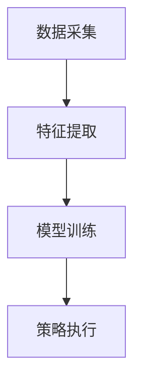

                 


# AI驱动的自适应市场流动性分析

> 关键词：AI驱动，市场流动性，自适应分析，算法交易，金融建模

> 摘要：本文探讨了利用人工智能技术进行市场流动性分析的方法，重点介绍了自适应分析的核心概念、算法实现、系统架构以及实际应用案例。通过对市场流动性的动态调整和实时预测，展示了AI在金融领域的强大潜力。

---

## 第1章 自适应市场流动性分析概述

### 1.1 背景与意义

#### 1.1.1 市场流动性的基本概念
市场流动性是指资产在市场中迅速转化为现金而不影响市场价格的能力。流动性高的资产易于买卖，价格波动较小；流动性低的资产则可能需要较长时间和较大交易成本才能完成交易。

#### 1.1.2 自适应分析的定义与特点
自适应分析是一种动态调整的分析方法，能够根据市场环境的变化实时更新模型参数和策略。其特点是灵活性高、实时性强，能够有效应对市场的不确定性。

#### 1.1.3 AI技术在流动性分析中的作用
AI技术，尤其是机器学习和深度学习，能够通过分析海量数据，发现传统方法难以捕捉的模式和趋势，从而提升流动性分析的准确性和实时性。

---

### 1.2 自适应分析的核心要素

#### 1.2.1 数据来源与特征
- 数据来源：市场交易数据（订单簿、成交记录）、市场情绪数据（新闻、社交媒体）、宏观经济指标等。
- 数据特征：高频性、多样性、时序性。

#### 1.2.2 AI算法的核心作用
- 机器学习：用于模式识别和预测。
- 深度学习：用于捕捉复杂非线性关系。

#### 1.2.3 适应性机制的实现原理
自适应机制通过反馈循环不断优化模型，实时调整参数以应对市场变化。

---

## 第2章 自适应市场流动性分析的核心概念

### 2.1 自适应分析的原理与机制

#### 2.1.1 自适应模型的基本原理
自适应模型通过实时数据输入，不断更新内部状态，输出预测结果并调整策略。

#### 2.1.2 动态调整的实现方式
动态调整包括参数优化、模型切换和策略调整等。

#### 2.1.3 自适应算法的数学模型
自适应模型可以表示为：
$$ f(t) = \theta(t) \cdot x(t) $$
其中，$\theta(t)$是动态调整的参数，$x(t)$是输入数据。

---

### 2.2 AI驱动的核心技术

#### 2.2.1 机器学习在流动性分析中的应用
- 时间序列分析：用于预测未来流动性。
- 集成学习：通过组合多个模型提升性能。

#### 2.2.2 深度学习模型的优势
- LSTM网络：擅长处理时序数据，捕捉长期依赖关系。

#### 2.2.3 自然语言处理在市场情绪分析中的作用
NLP技术用于分析新闻和社交媒体，提取市场情绪指标。

---

## 第3章 自适应市场流动性分析的算法原理

### 3.1 常用算法概述

#### 3.1.1 时间序列分析算法
- ARIMA模型：适用于线性时序数据。
- LSTM网络：适用于非线性时序数据。

#### 3.1.2 机器学习算法
- 随机森林：用于特征重要性分析。
- 神经网络：用于复杂模式识别。

### 3.2 算法实现流程

#### 3.2.1 数据预处理
- 数据清洗：处理缺失值、异常值。
- 特征提取：提取关键特征，如波动率、成交额。

#### 3.2.2 模型训练
- 使用训练数据训练模型。
- 调参：优化模型参数以提升性能。

#### 3.2.3 模型预测与调整
- 实时预测流动性。
- 根据预测结果动态调整交易策略。

---

## 第4章 系统架构设计

### 4.1 问题场景介绍
系统需要实时处理市场数据，预测流动性并调整交易策略。

### 4.2 系统功能设计

#### 4.2.1 数据采集模块
- 采集市场数据，包括订单簿、成交记录等。

#### 4.2.2 特征提取模块
- 提取关键特征，如波动率、市场情绪。

#### 4.2.3 模型训练模块
- 训练自适应模型，优化参数。

#### 4.2.4 策略执行模块
- 根据预测结果执行交易策略。

### 4.3 系统架构图


---

## 第5章 项目实战

### 5.1 环境安装
- 安装Python、TensorFlow、Pandas等工具。

### 5.2 核心实现代码
```python
import pandas as pd
import numpy as np
from tensorflow.keras.models import Sequential
from tensorflow.keras.layers import LSTM, Dense

# 数据预处理
data = pd.read_csv('market_data.csv')
features = data[['volume', 'price', 'time']]
labels = data['liquidity']

# 模型训练
model = Sequential()
model.add(LSTM(64, input_shape=(None, 3)))
model.add(Dense(1))
model.compile(optimizer='adam', loss='mse')

model.fit(features, labels, epochs=100, batch_size=32)
```

### 5.3 实际案例分析
通过实际数据验证模型性能，分析预测结果与实际流动性的一致性。

---

## 第6章 总结与展望

### 6.1 本章小结
本文详细介绍了AI驱动的自适应市场流动性分析的理论与实践，展示了其在金融领域的广泛应用。

### 6.2 注意事项
- 数据质量对模型性能影响重大。
- 模型需定期更新以适应市场变化。

### 6.3 拓展阅读
推荐学习深度学习和时间序列分析的相关书籍。

---

## 作者：AI天才研究院 & 禅与计算机程序设计艺术

---

**摘要**：本文系统地探讨了AI驱动的自适应市场流动性分析，从理论到实践，全面展示了其在金融市场中的应用价值和实现方法。通过结合AI技术与金融市场分析，为投资者和交易员提供了新的工具和思路。

