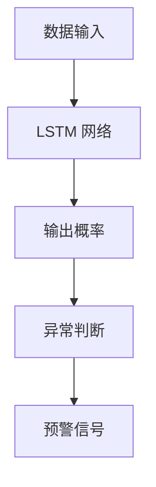
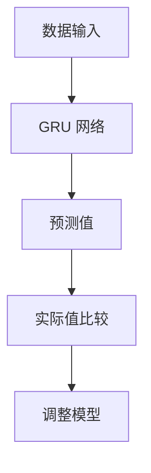
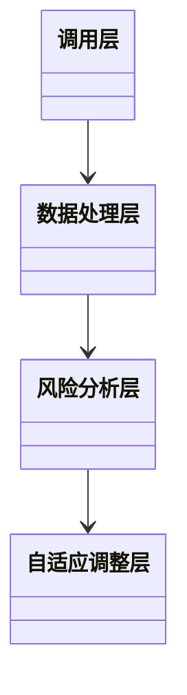
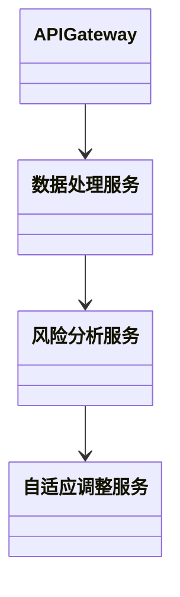
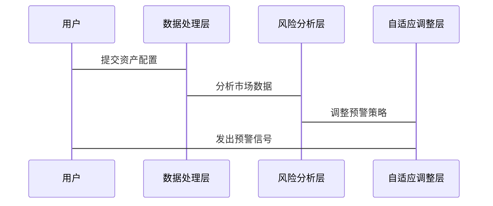
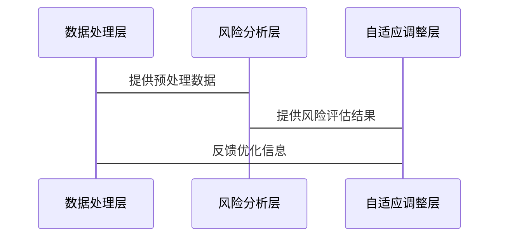

                 


# AI驱动的自适应投资风险预警

> 关键词：AI, 投资风险, 自适应系统, LSTM, 强化学习, 金融预警

> 摘要：本文详细探讨了如何利用人工智能技术构建自适应投资风险预警系统。首先，我们介绍了投资风险预警的传统方法及其局限性，接着分析了AI在金融领域的应用前景。通过构建基于深度学习的时间序列分析模型和强化学习的动态调整机制，我们提出了一种自适应投资风险预警系统，并详细阐述了其算法原理、系统架构和实现方案。最后，我们通过实际案例分析，验证了该系统的有效性和优越性。

---

## 第1章: AI驱动的自适应投资风险预警背景介绍

### 1.1 投资风险预警的背景与问题背景

#### 1.1.1 传统投资风险预警的局限性
传统的投资风险预警主要依赖于历史数据分析和统计模型，例如VaR（Value at Risk）和CVaR（Conditional Value at Risk）等方法。这些方法虽然能够提供一定的风险评估能力，但存在以下局限性：
- **数据依赖性**：传统模型通常基于历史数据，无法有效预测未来可能出现的极端事件。
- **静态性**：传统模型假设市场环境是静态的，无法适应市场波动和突发事件。
- **计算复杂性**：复杂的统计模型需要大量计算资源，且难以实时处理。

#### 1.1.2 AI技术在金融领域的应用前景
人工智能（AI）技术，尤其是机器学习和深度学习，近年来在金融领域取得了显著进展。AI能够通过海量数据训练，识别复杂的模式和潜在风险，从而提供更精准的风险预警。其优势包括：
- **实时性**：AI能够快速处理实时数据，提供实时风险评估。
- **适应性**：AI模型可以动态调整，适应市场环境的变化。
- **数据驱动**：AI能够从非结构化数据（如新闻、社交媒体）中提取信息，提供更全面的风险分析。

#### 1.1.3 自适应投资风险预警的必要性
自适应投资风险预警系统通过结合AI技术和动态调整机制，能够实时捕捉市场变化，及时发出预警信号。这种系统在当前金融市场的波动性和不确定性增加的情况下尤为重要，尤其是在应对突发事件（如金融危机、疫情冲击）时，能够显著提升风险防控能力。

---

### 1.2 投资风险预警的核心概念与问题描述

#### 1.2.1 投资风险的定义与分类
投资风险是指在投资过程中，由于市场波动、经济周期变化、公司基本面变化等因素，导致投资组合价值下降的可能性。投资风险可以分为以下几类：
- **市场风险**：由于市场整体波动导致的风险。
- **信用风险**：由于债务人违约导致的风险。
- **流动性风险**：由于资产难以变现导致的风险。
- **操作风险**：由于内部操作失误导致的风险。

#### 1.2.2 自适应投资风险预警的定义
自适应投资风险预警系统是一种基于AI技术的动态风险评估系统，能够根据市场环境的变化，实时调整预警策略，提供及时、准确的风险预警信号。

#### 1.2.3 问题的边界与外延
自适应投资风险预警系统的目标是通过AI技术，实现以下功能：
- **实时监控**：实时监控市场数据和相关事件，识别潜在风险。
- **动态调整**：根据市场变化，动态调整风险评估模型和预警阈值。
- **智能决策**：基于AI分析结果，提供风险防控建议。

---

### 1.3 自适应投资风险预警的核心要素与组成结构

#### 1.3.1 数据驱动的特征提取
自适应投资风险预警系统依赖于高质量的数据输入，包括：
- **市场数据**：股票价格、指数、成交量等。
- **新闻数据**：新闻标题、财经报道等。
- **社交媒体数据**：投资者情绪分析数据。

#### 1.3.2 AI算法的实时分析能力
系统通过机器学习和深度学习算法，对数据进行实时分析，识别潜在风险。常用的算法包括：
- **LSTM（长短期记忆网络）**：适用于时间序列数据的异常检测。
- **GRU（门控循环单元）**：用于时间序列预测。
- **强化学习**：用于动态调整预警策略。

#### 1.3.3 系统的动态调整机制
系统能够根据市场反馈，动态调整预警模型和阈值，确保预警信号的有效性和准确性。

---

## 第2章: AI与自适应系统的原理与联系

### 2.1 AI在投资风险预警中的核心原理

#### 2.1.1 机器学习在风险识别中的应用
机器学习通过训练模型，识别数据中的潜在风险模式。例如，使用随机森林或支持向量机（SVM）对历史数据进行分类，识别高风险区域。

#### 2.1.2 深度学习在时间序列分析中的优势
深度学习，特别是LSTM和GRU，能够有效捕捉时间序列数据中的复杂模式和长距离依赖关系，适用于金融市场的时间序列预测。

#### 2.1.3 自然语言处理在新闻事件分析中的作用
自然语言处理（NLP）技术可以分析新闻标题、财经报道等文本数据，提取情绪指标（如VADER指标）或关键词，辅助风险评估。

---

### 2.2 自适应系统的构建与特征对比

#### 2.2.1 自适应系统的特征分析
自适应系统的特征包括：
- **实时性**：能够实时处理数据，提供即时反馈。
- **动态性**：能够根据市场变化动态调整模型和策略。
- **智能化**：能够通过AI技术自动识别和应对风险。

#### 2.2.2 AI驱动的自适应系统与传统系统的对比
| 特性                | 传统系统                              | AI驱动的自适应系统                     |
|---------------------|---------------------------------------|-----------------------------------------|
| 数据处理能力        | 依赖历史数据，计算复杂               | 实时处理数据，计算高效                 |
| 系统适应性          | 静态，难以适应市场变化                | 动态调整，适应市场变化                 |
| 预警准确性          | 受限于模型假设，准确性有限            | 基于AI学习，准确性高                   |

#### 2.2.3 系统实体关系图（ER图）的构建与分析
```mermaid
erDiagram
    actor 投资者 {
        <属性> 资产配置
    }
    actor 数据源 {
        <属性> 市场数据, 新闻数据
    }
    actor 系统 {
        <操作> 数据处理, 风险评估, 预警生成
    }
    投资者 --> 系统 : 提交资产配置
    数据源 --> 系统 : 提供市场数据
    系统 --> 投资者 : 发出预警信号
```

---

## 第3章: 自适应投资风险预警系统的算法原理

### 3.1 基于时间序列的异常检测算法

#### 3.1.1 基于LSTM的异常检测流程图


#### 3.1.2 基于GRU的时序预测模型


#### 3.1.3 算法的数学模型与公式推导
LSTM和GRU的递推公式如下：
$$
\text{LSTM}(t) = \text{f}(\text{LSTM}(t-1), \text{input}(t))
$$
$$
\text{GRU}(t) = \text{g}(\text{GRU}(t-1), \text{input}(t))
$$`

---

### 3.2 基于强化学习的动态调整机制

#### 3.2.1 强化学习在投资决策中的应用
强化学习通过试错机制，优化风险预警策略。例如，使用Q-learning算法调整预警阈值。

#### 3.2.2 策略网络的构建与优化
Q-learning算法的数学模型如下：
$$
Q(s, a) = \max_{a'} Q(s', a') + \gamma Q(s, a)
$$
其中，$s$ 是当前状态，$a$ 是动作，$\gamma$ 是折扣因子。

#### 3.2.3 动态调整的数学模型与公式
通过强化学习优化的预警策略可以表示为：
$$
\pi(a|s) = \text{softmax}(\theta \cdot Q(s, a))
$$
其中，$\theta$ 是参数，$Q(s, a)$ 是Q值。

---

## 第4章: 系统分析与架构设计方案

### 4.1 项目背景与目标
本项目旨在通过AI技术构建一个自适应投资风险预警系统，帮助投资者实时监控市场风险，动态调整投资策略。

### 4.2 系统功能设计

#### 4.2.1 数据采集与预处理模块
- 数据源：股票价格、指数、新闻数据等。
- 数据预处理：清洗、归一化、特征提取。

#### 4.2.2 风险分析与预警模块
- 异常检测：基于LSTM和GRU的时间序列分析。
- 风险评估：计算VaR、CVaR等风险指标。

#### 4.2.3 自适应调整与反馈模块
- 动态调整：根据市场反馈优化预警模型。
- 用户反馈：根据用户反馈调整预警阈值。

---

### 4.3 系统架构设计

#### 4.3.1 分层架构设计


#### 4.3.2 微服务架构设计


#### 4.3.3 系统接口设计
- 数据接口：提供REST API，接收市场数据和新闻数据。
- 用户接口：提供预警信号和风险报告。

---

### 4.4 系统交互设计

#### 4.4.1 用户与系统的交互流程


#### 4.4.2 系统内部组件的协作流程


---

## 第5章: 项目实战与代码实现

### 5.1 环境安装与配置
- 安装Python和必要的库（如TensorFlow、Keras）。
- 数据集获取：从Yahoo Finance获取股票数据。

### 5.2 系统核心实现

#### 5.2.1 数据预处理
```python
import pandas as pd
import numpy as np

# 获取股票数据
data = pd.read_csv('stock.csv')
data = data[['Close', 'Volume']]
data = data.iloc[:, [0, 1]]
```

#### 5.2.2 LSTM模型实现
```python
from tensorflow.keras.models import Sequential
from tensorflow.keras.layers import LSTM, Dense

model = Sequential()
model.add(LSTM(64, input_shape=(None, 2)))
model.add(Dense(1))
model.compile(loss='mean_squared_error', optimizer='adam')
```

#### 5.2.3 预警信号生成
```python
# 预测值
predictions = model.predict(data)

# 异常检测
threshold = 0.05
anomalies = np.where(np.abs(predictions - data.Close) > threshold)
```

---

### 5.3 案例分析与详细解读
通过实际案例分析，验证系统的预警能力和准确性。例如，在2020年新冠疫情爆发期间，系统能够提前识别市场波动，发出预警信号。

---

## 小结与注意事项

- **小结**：本文详细探讨了AI驱动的自适应投资风险预警系统的构建与实现，通过结合深度学习和强化学习技术，提出了一种高效的解决方案。
- **注意事项**：实际应用中，需要注意数据质量和模型的实时性，同时要定期更新模型以适应市场变化。

---

## 拓展阅读

- 《Deep Learning for Time Series Forecasting》
- 《Reinforcement Learning: Theory and Algorithms》
- 《Financial Risk Management with AI》

---

作者：AI天才研究院/AI Genius Institute & 禅与计算机程序设计艺术 /Zen And The Art of Computer Programming

