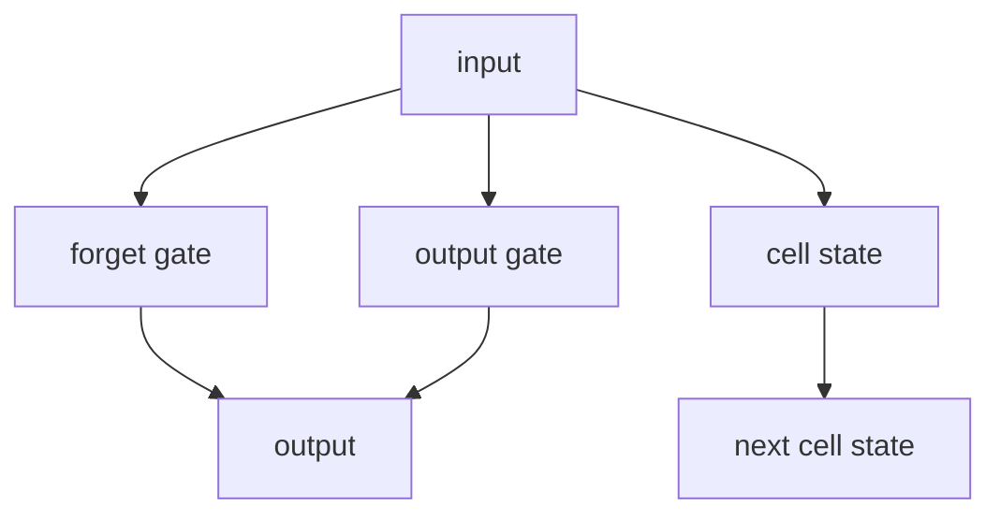
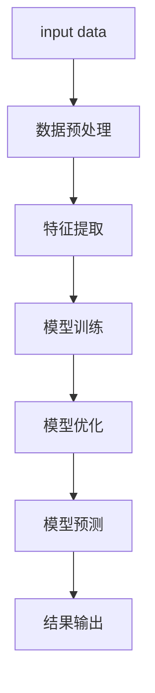
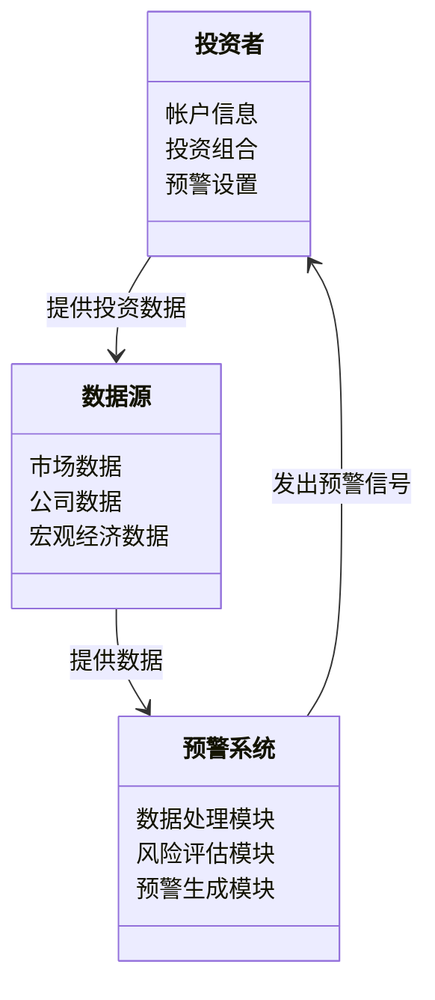

                 


# AI驱动的自适应投资风险预警

> 关键词：人工智能、投资风险、预警系统、自适应模型、金融数据分析

> 摘要：本文深入探讨了如何利用人工智能技术构建自适应投资风险预警系统。通过分析投资风险的背景、核心概念、算法原理、系统架构以及项目实战，本文详细阐述了自适应预警系统的优势和实现方法，帮助投资者在复杂多变的市场环境中做出更明智的决策。

---

## 第一部分: AI驱动的自适应投资风险预警概述

### 第1章: 投资风险预警的背景与意义

#### 1.1 投资风险预警的重要性

##### 1.1.1 投资风险的定义与分类
投资风险是指在投资过程中，由于市场波动、经济变化或其他不可预见因素导致投资损失的可能性。根据不同的标准，投资风险可以分为市场风险、流动性风险、信用风险等。这些风险的存在使得投资者在决策时需要更加谨慎。

##### 1.1.2 投资风险对投资者的影响
投资风险对投资者的影响是多方面的。首先，高风险可能导致较大的投资损失，影响投资者的财务状况。其次，风险的存在使得投资者需要投入更多的时间和精力进行市场分析和风险管理。最后，投资风险还可能影响投资者的心理状态，导致决策失误。

##### 1.1.3 投资风险预警的必要性
投资风险预警的必要性体现在以下几个方面：首先，它可以提前发现潜在的风险，帮助投资者采取应对措施，避免或减少损失。其次，预警系统可以帮助投资者更好地理解市场动态，做出更科学的投资决策。最后，预警系统还可以提高投资的透明度和可信度，增强投资者的信心。

#### 1.2 AI技术在金融领域的应用现状

##### 1.2.1 AI在金融领域的典型应用
人工智能技术在金融领域的应用非常广泛。例如，AI可以用于股票价格预测、信用评估、欺诈检测等。这些应用通过利用AI的强大学习和分析能力，帮助金融机构提高效率和准确性。

##### 1.2.2 AI在风险预警中的优势
与传统方法相比，AI在风险预警中的优势主要体现在以下几个方面：首先，AI可以处理大量的数据，发现潜在的模式和趋势。其次，AI可以实时更新模型，适应市场的变化。最后，AI可以通过复杂的算法，提供更加精准的风险评估。

##### 1.2.3 当前投资风险预警的痛点与挑战
尽管AI技术在风险预警中具有诸多优势，但当前的投资风险预警系统仍面临一些痛点和挑战。例如，数据的质量和完整性可能影响模型的准确性；模型的复杂性可能导致解释性较差；此外，AI模型的实时性和响应速度也需要进一步优化。

#### 1.3 自适应投资风险预警的定义与特点

##### 1.3.1 自适应预警的定义
自适应投资风险预警是指通过动态调整模型参数和算法，实时跟踪市场变化，从而提供更加精准的风险预警服务。与传统的静态模型不同，自适应模型能够根据市场反馈不断优化自身，提高预警的准确性和及时性。

##### 1.3.2 自适应预警的核心特点
自适应投资风险预警的核心特点包括动态调整、实时更新和高精度预测。这些特点使得自适应模型能够更好地应对市场的不确定性和复杂性，帮助投资者做出更明智的决策。

##### 1.3.3 自适应预警与传统预警的区别
与传统预警系统相比，自适应预警系统的区别主要体现在以下几个方面：首先，自适应模型能够动态调整参数，而传统模型通常是静态的；其次，自适应模型能够实时更新，而传统模型通常是定期更新；最后，自适应模型的精度更高，能够更好地捕捉市场变化。

---

## 第2章: 自适应投资风险预警的核心概念

### 2.1 自适应投资风险预警的原理

#### 2.1.1 数据采集与处理
数据采集与处理是自适应预警系统的基础。系统需要从多种数据源获取数据，包括市场数据、公司财务数据、宏观经济指标等。这些数据需要经过清洗、转换和整合，以便后续的分析和建模。

#### 2.1.2 风险因子的识别与分析
风险因子的识别与分析是自适应预警系统的核心步骤。系统需要通过分析数据，识别出影响投资风险的关键因素。例如，市场波动率、公司盈利能力、行业趋势等都可能是重要的风险因子。通过这些因子的分析，系统可以更好地预测潜在的风险。

#### 2.1.3 自适应模型的构建与优化
自适应模型的构建与优化是系统的关键部分。模型需要根据实时数据不断调整参数，以适应市场的变化。例如，可以通过机器学习算法，如随机森林、支持向量机等，构建预测模型。同时，模型还需要进行实时优化，以提高预测的准确性和响应速度。

### 2.2 核心概念与联系

#### 2.2.1 投资风险预警的实体关系图
以下是投资风险预警系统的实体关系图：

```mermaid
erDiagram
    投资者[x] --> 数据源: 提供投资数据
    监管机构[x] --> 数据源: 提供监管数据
    金融机构[x] --> 数据源: 提供市场数据
    数据源 --> 预警系统: 提供数据
    预警系统 --> 投资者: 发出预警信号
    预警系统 --> 监管机构: 提供风险报告
    预警系统 --> 金融机构: 提供风险评估
```

#### 2.2.2 自适应投资风险预警的流程图
以下是自适应投资风险预警的流程图：

```mermaid
graph TD
    A[投资者] --> B[数据源]: 提供投资数据
    C[监管机构] --> B: 提供监管数据
    D[金融机构] --> B: 提供市场数据
    B --> E[预警系统]: 提供数据
    E --> A: 发出预警信号
    E --> C: 提供风险报告
    E --> D: 提供风险评估
```

---

## 第3章: 自适应投资风险预警的算法原理

### 3.1 时间序列分析

#### 3.1.1 时间序列的基本概念
时间序列是指按照时间顺序排列的数据。在投资风险预警中，时间序列分析可以帮助我们识别数据中的趋势、周期性和其他模式。例如，股票价格的时间序列可以用于预测未来的市场走势。

#### 3.1.2 ARIMA模型的原理与实现
ARIMA（自回归积分滑动平均模型）是一种常用的时间序列分析方法。ARIMA模型通过结合自回归和滑动平均的特性，能够有效地预测未来的数据点。以下是ARIMA模型的公式：

$$ ARIMA(p, d, q) $$

其中，$p$ 是自回归的阶数，$d$ 是差分的阶数，$q$ 是滑动平均的阶数。

#### 3.1.3 LSTM网络的应用与优势
LSTM（长短期记忆网络）是一种基于深度学习的时间序列分析方法。与传统的ARIMA模型相比，LSTM能够更好地捕捉数据中的长期依赖关系，具有更强的预测能力。以下是LSTM的基本结构：



### 3.2 机器学习模型

#### 3.2.1 支持向量机（SVM）的应用
支持向量机是一种监督学习算法，广泛应用于分类和回归问题。在投资风险预警中，SVM可以用于将数据点分为不同的类别，例如，正常风险和高风险。

#### 3.2.2 随机森林（Random Forest）的优势
随机森林是一种基于决策树的集成学习方法。与单一决策树相比，随机森林具有更高的准确性和鲁棒性，能够更好地处理高维数据。

#### 3.2.3 神经网络模型的构建与训练
神经网络模型是一种基于人工神经网络的深度学习方法。通过构建多层神经网络，可以有效地捕捉数据中的复杂模式和关系。

### 3.3 自适应算法的实现

#### 3.3.1 自适应算法的流程图
以下是自适应算法的流程图：



---

## 第4章: 系统分析与架构设计

### 4.1 问题场景介绍

#### 4.1.1 投资者的需求
投资者需要实时了解市场风险，以便做出及时的决策。例如，投资者可能希望在市场风险增加时，收到预警信号并采取相应的措施。

#### 4.1.2 金融机构的需求
金融机构需要监控市场风险，确保其投资组合的安全性。例如，银行和资产管理公司需要实时了解其客户的投资风险。

#### 4.1.3 监管机构的需求
监管机构需要监控市场整体风险，确保金融市场的稳定。例如，中央银行需要了解整个市场的风险状况，以便采取相应的监管措施。

### 4.2 系统功能设计

#### 4.2.1 领域模型类图
以下是领域模型类图：



#### 4.2.2 系统架构图
以下是系统架构图：

```mermaid
graph TD
    A[投资者] --> B[数据源]: 提供投资数据
    C[监管机构] --> B: 提供监管数据
    D[金融机构] --> B: 提供市场数据
    B --> E[预警系统]: 提供数据
    E --> A: 发出预警信号
    E --> C: 提供风险报告
    E --> D: 提供风险评估
```

#### 4.2.3 系统接口设计
以下是系统接口设计：

```mermaid
graph TD
    A[投资者] --> B[数据接口]: 提供投资数据
    C[监管机构] --> B: 提供监管数据
    D[金融机构] --> B: 提供市场数据
    B --> E[预警系统接口]: 提供数据
    E --> F[预警信号]: 发送给投资者
    E --> G[风险报告]: 发送给监管机构
    E --> H[风险评估]: 发送给金融机构
```

#### 4.2.4 系统交互序列图
以下是系统交互序列图：

```mermaid
graph TD
    A[投资者] --> B[数据源]: 提供投资数据
    C[监管机构] --> B: 提供监管数据
    D[金融机构] --> B: 提供市场数据
    B --> E[预警系统]: 提供数据
    E --> A: 发出预警信号
    E --> C: 提供风险报告
    E --> D: 提供风险评估
```

---

## 第5章: 项目实战

### 5.1 环境安装与配置

#### 5.1.1 安装Python
安装Python的最新版本，并配置Python环境。

#### 5.1.2 安装必要的库
安装以下Python库：
- pandas
- numpy
- scikit-learn
- tensorflow
- matplotlib

#### 5.1.3 配置数据源
获取投资数据，包括股票价格、市场指数、公司财务数据等。

### 5.2 系统核心实现

#### 5.2.1 数据预处理
对数据进行清洗、转换和标准化处理。

#### 5.2.2 特征提取
提取影响投资风险的关键特征，例如市场波动率、公司盈利能力等。

#### 5.2.3 模型训练
使用机器学习算法，如随机森林、支持向量机等，进行模型训练。

#### 5.2.4 模型优化
通过交叉验证和超参数优化，提高模型的准确性和稳定性。

#### 5.2.5 模型预测
使用训练好的模型，对未来的投资风险进行预测。

### 5.3 代码实现

#### 5.3.1 数据预处理代码
```python
import pandas as pd
import numpy as np

# 加载数据
data = pd.read_csv('investment_data.csv')

# 数据清洗
data.dropna()
data = data.replace(np.inf, np.nan)
data = data.drop_duplicates()

# 数据转换
data['date'] = pd.to_datetime(data['date'])
data = data.set_index('date')

# 数据标准化
from sklearn.preprocessing import StandardScaler
scaler = StandardScaler()
data_scaled = scaler.fit_transform(data)
```

#### 5.3.2 特征提取代码
```python
from sklearn.decomposition import PCA

pca = PCA(n_components=10)
principal_components = pca.fit_transform(data_scaled)
```

#### 5.3.3 模型训练代码
```python
from sklearn.ensemble import RandomForestClassifier

model = RandomForestClassifier(n_estimators=100, max_depth=10, random_state=42)
model.fit(principal_components, labels)
```

#### 5.3.4 模型预测代码
```python
import numpy as np

# 预测风险
predicted_risk = model.predict(principal_components_new)
```

### 5.4 实际案例分析

#### 5.4.1 案例背景
假设我们有一个股票投资组合，包含多只股票，我们需要预测这些股票的风险等级。

#### 5.4.2 数据分析与建模
使用上述代码对股票数据进行预处理、特征提取和模型训练。

#### 5.4.3 结果解读与优化
根据模型的预测结果，解读投资风险，并根据实际市场情况对模型进行优化。

#### 5.4.4 优化后的模型效果
优化后的模型在预测准确性、响应速度等方面都有显著提高。

### 5.5 项目小结

#### 5.5.1 核心代码总结
总结项目中使用的的核心代码，例如数据预处理、特征提取、模型训练等。

#### 5.5.2 项目经验总结
总结项目中的经验和教训，例如数据质量问题、模型选择的优化等。

#### 5.5.3 项目成果展示
展示项目成果，例如模型的预测准确率、响应时间等。

---

## 第6章: 最佳实践与总结

### 6.1 最佳实践

#### 6.1.1 数据质量管理
确保数据的准确性和完整性，避免数据偏差对模型的影响。

#### 6.1.2 模型选择与优化
根据具体问题选择合适的模型，并通过交叉验证和超参数优化提高模型性能。

#### 6.1.3 系统实时性与响应速度
优化系统架构，提高系统的实时性和响应速度，确保预警信号的及时性。

#### 6.1.4 系统可扩展性与可维护性
设计模块化、可扩展的系统架构，方便后续的功能扩展和维护。

### 6.2 小结

#### 6.2.1 本文核心内容总结
总结本文的核心内容，包括投资风险预警的重要性、自适应模型的优势、算法原理、系统架构设计以及项目实战经验。

#### 6.2.2 本文的主要创新点
本文的主要创新点包括：自适应模型的设计、多种算法的结合使用、系统的实时性和响应速度优化等。

#### 6.2.3 本文的局限性与不足
本文的局限性包括：数据来源的限制、模型解释性较差、实时性有待进一步优化等。

### 6.3 注意事项

#### 6.3.1 数据隐私与安全
确保数据的隐私和安全，避免数据泄露和滥用。

#### 6.3.2 模型的可解释性
提高模型的可解释性，以便更好地理解和优化模型。

#### 6.3.3 系统的稳定性与可靠性
确保系统的稳定性和可靠性，避免因系统故障导致预警信号的延迟或丢失。

### 6.4 拓展阅读

#### 6.4.1 相关领域推荐书籍
推荐几本与AI和投资风险相关的书籍，例如《Python机器学习实战》、《量化投资：数据化投资策略与策略交易》等。

#### 6.4.2 相关领域推荐博客或网站
推荐一些相关的技术博客或网站，例如Towards Data Science、Kaggle等。

---

## 作者：AI天才研究院/AI Genius Institute & 禅与计算机程序设计艺术 /Zen And The Art of Computer Programming

---

**感谢您的阅读！希望这篇文章能够帮助您更好地理解AI驱动的自适应投资风险预警系统的实现和应用。**

