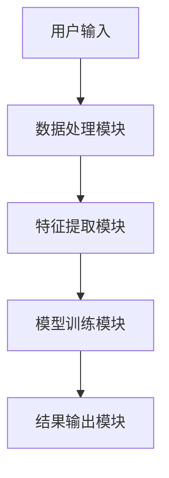
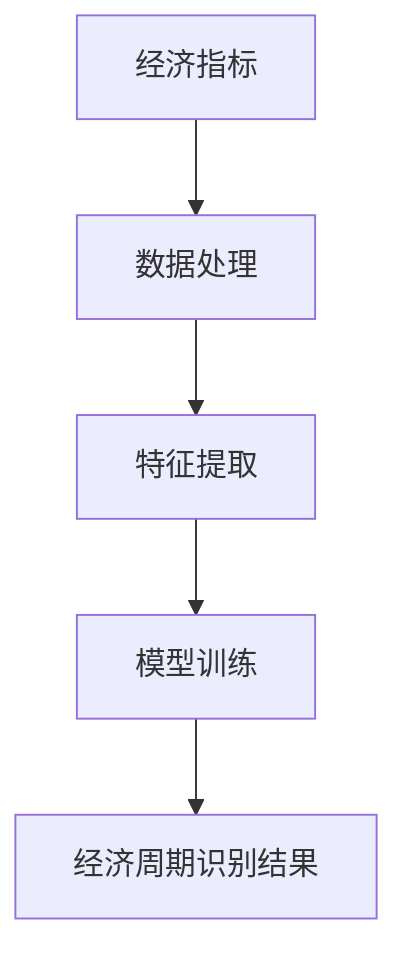

                 


# AI驱动的自适应经济周期识别器

## 关键词：AI，经济周期，自适应识别，深度学习，时间序列分析

## 摘要：  
本文探讨了利用人工智能技术构建自适应经济周期识别器的原理与实现。通过结合时间序列分析、深度学习和自适应算法，提出了一种创新的经济周期识别方法，能够实时捕捉经济数据中的潜在模式，准确识别经济周期的变化。文章详细分析了自适应经济周期识别器的核心概念、算法原理、系统架构，并通过实际案例展示了其在经济分析中的应用价值。

---

# 第1章: 经济周期识别的背景与意义

## 1.1 经济周期识别的背景与意义

### 1.1.1 经济周期的基本概念  
经济周期是指经济活动在一定时间内呈现出的扩张与衰退交替的周期性波动。常见的经济周期阶段包括繁荣期、衰退期、萧条期和复苏期。准确识别经济周期对于政策制定者、企业和个人投资者具有重要意义。

### 1.1.2 传统经济周期识别的挑战  
传统的经济周期识别方法依赖于统计分析和专家经验，存在以下问题：  
1. **数据复杂性**：经济数据涉及多个指标（如GDP、失业率、通胀率等），且受多种因素影响。  
2. **滞后性**：传统方法通常需要收集大量历史数据后才能进行分析，难以实现实时识别。  
3. **主观性**：依赖专家经验的识别方法主观性强，结果可能受个人判断影响。  

### 1.1.3 AI技术在经济周期识别中的优势  
人工智能技术的引入为经济周期识别带来了革命性的变化：  
1. **自动化与高效性**：AI能够实时处理海量数据，快速生成识别结果。  
2. **准确性与可靠性**：通过深度学习模型，AI能够捕捉复杂的经济模式，提高识别精度。  
3. **自适应性**：AI模型能够根据新的数据动态调整，适应经济环境的变化。  

### 1.1.4 自适应经济周期识别器的核心概念  
自适应经济周期识别器是一种基于AI的系统，能够实时分析经济数据，自动识别经济周期的变化，并根据新的数据不断优化识别模型。其核心要素包括：  
1. **数据输入**：获取实时经济指标数据。  
2. **特征提取**：从原始数据中提取有用的特征。  
3. **模型训练**：利用深度学习模型进行训练，生成经济周期预测结果。  
4. **自适应调整**：根据新数据动态优化模型参数。  

## 1.2 本章小结  
本章介绍了经济周期识别的背景、传统方法的挑战以及AI技术的应用优势。通过分析自适应经济周期识别器的核心概念，为后续章节的深入探讨奠定了基础。

---

# 第2章: 经济周期识别的核心概念与联系

## 2.1 经济周期识别的原理

### 2.1.1 时间序列分析的基本原理  
时间序列分析是一种通过分析数据随时间的变化规律来预测未来趋势的方法。其核心在于识别数据中的趋势、周期性和随机性成分。  

### 2.1.2 AI模型在时间序列分析中的应用  
AI模型（如LSTM和ARIMA）能够捕捉时间序列中的复杂模式，适用于经济周期识别。  

### 2.1.3 经济指标的选择与处理  
选择合适的经济指标（如GDP、失业率、通胀率等）是经济周期识别的关键。需要对数据进行清洗、标准化和特征提取。  

## 2.2 核心概念对比分析

### 2.2.1 经济周期与经济指标的对比  
| 经济周期阶段 | 经济指标表现 |  
|--------------|--------------|  
| 繁荣期       | 高增长、低失业率 |  
| 衰退期       | 增速放缓、失业率上升 |  
| 萧条期       | 经济低迷、高失业率 |  
| 复苏期       | 经济逐步恢复 |  

### 2.2.2 不同经济周期阶段的特征对比  
| 阶段          | 经济表现特征 |  
|---------------|--------------|  
| 繁荣期        | 高增长、低通胀 |  
| 衰退期        | 增速放缓、企业利润下降 |  
| 萧条期        | 经济低迷、高失业率 |  
| 复苏期        | 经济逐步恢复、就业率上升 |  

### 2.2.3 AI模型在经济周期识别中的表现对比  
| 模型          | 优点                     | 缺点                       |  
|---------------|--------------------------|---------------------------|  
| ARIMA         | 简单易用、适合线性数据     | 不擅长捕捉复杂非线性模式   |  
| LSTM          | 能够捕捉长期依赖关系       | 对数据需求量较大           |  
| 支持向量机     | 高精度分类               | 不适合时间序列预测         |  

## 2.3 系统架构与ER实体关系图

### 2.3.1 系统架构图  


### 2.3.2 实体关系图  


## 2.4 本章小结  
本章通过对比分析和系统架构图，详细阐述了经济周期识别的核心概念及其与AI模型的关系，为后续算法实现提供了理论基础。

---

# 第3章: 经济周期识别的算法原理

## 3.1 时间序列分析算法

### 3.1.1 ARIMA模型原理  
ARIMA（自回归积分滑动平均模型）是一种广泛应用于时间序列预测的模型。其基本假设是数据经过差分后是平稳的。  

#### ARIMA模型的数学公式  
$$ ARIMA(p, d, q) = y_t = \phi_1 y_{t-1} + \dots + \phi_p y_{t-p} + \theta_1 \epsilon_{t-1} + \dots + \theta_q \epsilon_{t-q} + \epsilon_t $$  

### 3.1.2 ARIMA模型实现  
```python
from statsmodels.tsa.arima.model import ARIMA

# 数据准备
data = [...]  # 经济指标数据

# 模型训练
model = ARIMA(data, order=(5, 1, 2))
model_fit = model.fit()

# 预测
forecast = model_fit.forecast(steps=5)
print(forecast)
```

## 3.2 基于深度学习的经济周期识别

### 3.2.1 LSTM网络原理  
LSTM（长短期记忆网络）是一种特殊的RNN，能够有效捕捉时间序列中的长距离依赖关系。  

#### LSTM单元结构  
$$ f_t = \sigma(W_f x_t + U_f h_{t-1} + b_f) $$  
$$ i_t = \sigma(W_i x_t + U_i h_{t-1} + b_i) $$  
$$ o_t = \sigma(W_o x_t + U_o h_{t-1} + b_o) $$  
$$ c_t = f_t \cdot c_{t-1} + i_t \cdot tanh(W_c x_t + U_c h_{t-1} + b_c) $$  
$$ h_t = o_t \cdot tanh(c_t) $$  

### 3.2.2 LSTM模型实现  
```python
import tensorflow as tf
from tensorflow.keras.layers import LSTM, Dense

# 数据准备
X_train = [...]  # 输入特征
y_train = [...]  # 经济周期标签

# 模型构建
model = tf.keras.Sequential([
    LSTM(64, input_shape=(timesteps, features)),
    Dense(4, activation='softmax')
])
model.compile(optimizer='adam', loss='sparse_categorical_crossentropy', metrics=['accuracy'])

# 训练
model.fit(X_train, y_train, epochs=10, batch_size=32)
```

## 3.3 支持向量机在经济周期识别中的应用

### 3.3.1 SVM算法原理  
SVM（支持向量机）是一种监督学习算法，适用于分类和回归任务。其核心思想是通过构建超平面将数据分为不同类别。  

#### 线性SVM的数学公式  
$$ y = sign(w \cdot x + b) $$  

### 3.3.2 SVM模型实现  
```python
from sklearn.svm import SVC

# 数据准备
X_train = [...]  # 特征向量
y_train = [...]  # 经济周期标签

# 模型训练
model = SVC(kernel='rb

