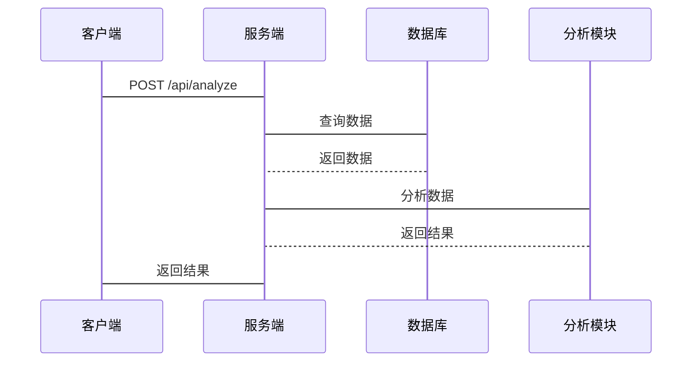
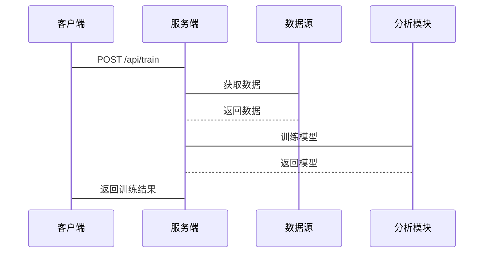

                 


# AI驱动的行为金融学分析：理解市场非理性

> 关键词：行为金融学，人工智能，市场非理性，机器学习，自然语言处理，情绪分析

> 摘要：本文探讨了AI技术如何应用于行为金融学，特别是如何通过机器学习和自然语言处理来分析和预测市场非理性行为。通过理论与实践相结合，本文深入分析了投资者行为、认知偏差、群体行为等关键问题，并展示了如何利用AI技术进行市场情绪分析、羊群效应研究和非理性决策建模。文章结构清晰，内容详实，旨在为金融从业者和技术爱好者提供深入的技术洞见。

---

## 第一部分: 引言

### 第1章: 问题背景与研究意义

#### 1.1 行为金融学的背景与核心问题

##### 1.1.1 传统金融学的局限性
传统金融学假设市场参与者是理性的，且市场是有效的。然而，2008年的金融危机证明了这一假设的局限性。行为金融学通过研究投资者的心理和行为，揭示了市场中的非理性现象。

##### 1.1.2 行为金融学的基本概念
行为金融学研究投资者的决策过程及其对市场价格和波动的影响。它结合了心理学、经济学和社会学等多学科知识，强调认知偏差和情绪在市场中的作用。

##### 1.1.3 市场非理性的表现形式
市场非理性主要表现在投资者情绪波动、羊群效应、过度交易和非理性定价等方面。这些现象往往导致市场的过度波动和金融危机。

#### 1.2 AI技术在金融领域的应用前景

##### 1.2.1 AI技术的基本概念
人工智能（AI）是指计算机系统执行人类智能任务的能力，如视觉识别、语音识别和决策-making。机器学习是AI的核心技术，通过数据训练模型来预测和分析。

##### 1.2.2 AI在金融分析中的优势
AI能够处理海量数据，发现复杂模式，并实时做出决策。在金融领域，AI被广泛应用于风险评估、价格预测和交易策略制定。

##### 1.2.3 行为金融学与AI结合的必要性
AI技术可以量化和分析人类行为，帮助识别市场非理性行为的模式，从而为金融决策提供更精准的依据。

#### 1.3 本章小结
本章介绍了行为金融学的基本概念和市场非理性的表现形式，同时探讨了AI技术在金融领域的应用前景。通过结合AI和行为金融学，我们可以更好地理解市场中的非理性现象。

---

## 第二部分: 行为金融学基础

### 第2章: 行为金融学的核心概念

#### 2.1 投资者行为分析

##### 2.1.1 个体投资者行为特征
个体投资者通常表现出过度自信、从众心理和损失厌恶等行为特征。这些特征会影响他们的投资决策。

##### 2.1.2 机构投资者行为特征
机构投资者通常更加理性，但也会受到市场情绪和认知偏差的影响。例如，机构投资者可能在市场恐慌时跟随卖出，加剧市场波动。

##### 2.1.3 不同市场环境下的行为差异
市场环境如牛市和熊市会影响投资者行为。牛市中，投资者更倾向于冒险；熊市中，投资者更倾向于保守。

#### 2.2 认知偏差与决策错误

##### 2.2.1 常见的认知偏差类型
常见的认知偏差包括确认偏差、锚定效应和从众心理。这些偏差会影响投资者的决策，导致非理性行为。

##### 2.2.2 认知偏差对投资决策的影响
认知偏差可能导致投资者做出错误的决策，如高估自己的判断能力或忽视风险。

##### 2.2.3 认知偏差的量化分析
通过统计学方法和机器学习模型，可以量化认知偏差对市场行为的影响。

#### 2.3 群体行为与市场情绪

##### 2.3.1 群体行为的基本特征
群体行为表现出一致性、传染性和情绪化的特点。投资者在群体影响下，可能做出集体性的非理性决策。

##### 2.3.2 市场情绪的传播机制
市场情绪可以通过新闻、社交媒体和人际传播快速扩散，影响整个市场的行为。

##### 2.3.3 群体行为对市场波动的影响
群体行为可能导致市场的过度波动，如泡沫和崩盘。

#### 2.4 本章小结
本章详细介绍了投资者行为、认知偏差和群体行为的核心概念。这些概念为后续利用AI技术分析市场非理性奠定了基础。

---

## 第三部分: AI技术与行为金融学的结合

### 第3章: 机器学习在行为金融学中的应用

#### 3.1 机器学习的基本概念

##### 3.1.1 机器学习的定义与分类
机器学习是一种通过数据训练模型，使其能够进行预测或决策的技术。主要分为监督学习、无监督学习和强化学习。

##### 3.1.2 机器学习在金融中的应用案例
例如，利用机器学习预测股票价格、识别市场趋势和评估信用风险。

##### 3.1.3 机器学习在行为金融学中的优势
机器学习能够处理复杂数据，发现人类难以察觉的模式，适用于分析市场非理性行为。

#### 3.2 自然语言处理在市场情绪分析中的应用

##### 3.2.1 NLP的基本概念
自然语言处理（NLP）是AI技术的重要组成部分，用于理解和处理人类语言。

##### 3.2.2 基于NLP的市场情绪分析方法
通过分析新闻标题、社交媒体帖子和评论，提取市场情绪指标。

##### 3.2.3 实例分析：新闻文本情绪分类
使用文本分类算法，将新闻文本分为积极、消极和中性三类，评估市场情绪。

#### 3.3 情感分析与市场预测

##### 3.3.1 情感分析的基本原理
情感分析通过识别文本中的情感倾向，评估市场情绪。

##### 3.3.2 基于情感分析的市场预测模型
结合情感分析和时间序列分析，构建市场预测模型。

##### 3.3.3 案例分析：社交媒体数据与股价预测
利用社交媒体数据，分析市场情绪，预测股票价格波动。

#### 3.4 本章小结
本章介绍了机器学习和自然语言处理在行为金融学中的应用，特别是情感分析和市场情绪预测。

---

## 第四部分: 行为金融学中的具体问题分析

### 第4章: 市场情绪与投资者决策

#### 4.1 市场情绪的定义与测量

##### 4.1.1 市场情绪的多维度测量
市场情绪可以从投资者行为、媒体情绪和市场指标等多个维度进行测量。

##### 4.1.2 基于数据的情绪指标构建
通过分析新闻、社交媒体和交易数据，构建市场情绪指标。

##### 4.1.3 情绪指标的时间序列分析
利用时间序列分析方法，研究市场情绪的变化趋势和周期性。

#### 4.2 羊群效应与市场波动

##### 4.2.1 羊群效应的定义与表现
羊群效应指投资者盲目跟随市场趋势，导致市场波动加剧。

##### 4.2.2 羊群效应的量化分析
通过统计方法和机器学习模型，量化羊群效应的强度和影响。

##### 4.2.3 羊群效应与市场崩盘的关系
羊群效应可能导致市场的过度波动，进而引发崩盘。

#### 4.3 非理性决策的建模与分析

##### 4.3.1 非理性决策的特征
非理性决策通常表现为过度自信、从众心理和损失厌恶。

##### 4.3.2 基于AI的非理性决策建模方法
使用机器学习模型，识别和预测非理性决策行为。

##### 4.3.3 实例分析：恐慌性抛售的触发机制
分析市场恐慌性抛售的触发机制，提出相应的风险管理策略。

#### 4.4 本章小结
本章分析了市场情绪、羊群效应和非理性决策的具体问题，探讨了AI技术在解决这些问题中的应用。

---

## 第五部分: 系统设计与实现

### 第5章: 系统设计与实现

#### 5.1 问题场景介绍
本文将设计一个基于AI的行为金融学分析系统，用于预测和分析市场非理性行为。

#### 5.2 系统功能设计

##### 5.2.1 领域模型（Mermaid 类图）
```mermaid
classDiagram
    class 投资者行为 {
        +投资者ID: integer
        +行为数据: string
        +决策模型: string
    }
    class 认知偏差 {
        +偏差类型: string
        +影响程度: integer
    }
    class 市场情绪 {
        +情绪指标: float
        +时间戳: datetime
    }
    class 系统架构 {
        +数据源: string
        +算法模块: string
        +结果输出: string
    }
   抽像类 行为金融系统 {
        +数据采集: function
        +模型训练: function
        +结果分析: function
    }
    投资者行为 --> 认知偏差
    认知偏差 --> 市场情绪
    系统架构 --> 行为金融系统
```

##### 5.2.2 系统架构设计（Mermaid 架构图）


#### 5.3 系统接口设计

##### 5.3.1 API 接口设计


#### 5.4 系统交互设计（Mermaid 序列图）


#### 5.5 本章小结
本章详细介绍了系统设计与实现，包括领域模型、系统架构、接口设计和交互流程。

---

## 第六部分: 项目实战

### 第6章: 项目实战

#### 6.1 环境安装

##### 6.1.1 安装 Python 和必要的库
```bash
pip install numpy pandas scikit-learn tensorflow
```

#### 6.2 系统核心实现源代码

##### 6.2.1 情感分析模型实现
```python
import numpy as np
from sklearn.model_selection import train_test_split
from sklearn.linear_model import LogisticRegression
from sklearn.feature_extraction.text import TfidfVectorizer

# 数据预处理
X = [...]  # 文本数据
y = [...]  # 标签（积极/消极）

# 特征提取
vectorizer = TfidfVectorizer()
X_features = vectorizer.fit_transform(X)

# 模型训练
X_train, X_test, y_train, y_test = train_test_split(X_features, y, test_size=0.2)
model = LogisticRegression()
model.fit(X_train, y_train)

# 模型预测
y_pred = model.predict(X_test)
```

##### 6.2.2 市场情绪预测模型实现
```python
import tensorflow as tf
from tensorflow.keras import layers

# 数据预处理
X = [...]  # 输入特征
y = [...]  # 输出标签

# 模型构建
model = tf.keras.Sequential([
    layers.Dense(64, activation='relu'),
    layers.Dropout(0.5),
    layers.Dense(1, activation='sigmoid')
])

model.compile(optimizer='adam', loss='binary_crossentropy', metrics=['accuracy'])

# 模型训练
model.fit(X, y, epochs=10, batch_size=32)
```

#### 6.3 代码应用解读与分析
详细解读上述代码，说明每一步的功能和作用。

#### 6.4 实际案例分析和详细讲解剖析
通过具体案例，分析如何利用上述模型进行市场情绪预测和非理性行为识别。

#### 6.5 项目小结
总结项目实现的过程和成果，提出改进建议和未来研究方向。

---

## 第七部分: 总结与展望

### 第7章: 总结与展望

#### 7.1 本章内容总结
本文详细探讨了AI技术在行为金融学中的应用，特别是如何通过机器学习和自然语言处理分析市场非理性行为。

#### 7.2 未来研究方向
未来研究可以进一步探索更复杂的模型和更多的数据源，如高频交易数据和多语言文本分析，以提高预测的准确性和鲁棒性。

#### 7.3 本章小结
本章总结了本文的主要内容，并展望了未来的研究方向，为读者提供了进一步的学习和研究方向。

---

## 附录

### 附录1: 数据来源与处理方法

#### 1.1 数据来源
数据来源包括新闻网站、社交媒体平台和金融数据提供商。

#### 1.2 数据处理流程
数据预处理包括清洗、特征提取和数据增强。

### 附录2: 工具包与库

#### 2.1 Python工具包
主要使用的Python工具包包括numpy、pandas、scikit-learn和tensorflow。

#### 2.2 其他工具与平台
使用的其他工具包括Jupyter Notebook和云服务平台。

### 附录3: 参考文献

#### 3.1 行为金融学相关文献
1. Kahneman, D. (2011). *Thinking, Fast and Slow*.
2. Shiller, R. J. (2005). Irrational Exuberance.

#### 3.2 AI与金融相关文献
1. Banerjee, S. et al. (2017). *Financial Text Classification Using LSTM*.
2. Bai, T. et al. (2018). *Stock Market Prediction Using Machine Learning*.

---

## 作者

作者：AI天才研究院/AI Genius Institute & 禅与计算机程序设计艺术 /Zen And The Art of Computer Programming

---

**本文旨在通过结合AI技术和行为金融学，深入分析市场非理性行为，为金融从业者和技术爱好者提供有价值的洞见。如果需要进一步探讨或获取代码示例，请随时联系作者。**

