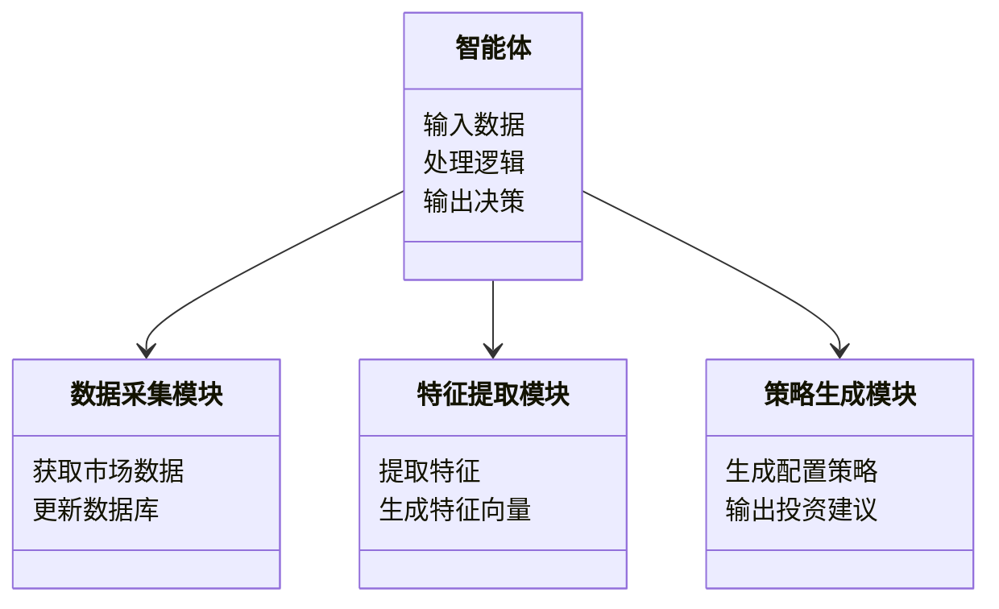

                 


# AI驱动的跨资产类别配置：价值投资中的多智能体应用

> 关键词：AI驱动、跨资产类别、多智能体、价值投资、资产配置、金融创新

> 摘要：本文深入探讨了AI技术在跨资产类别配置中的应用，特别是多智能体系统如何在价值投资中优化资产配置策略。通过理论分析、算法设计和实际案例，展示了多智能体系统在金融投资中的潜力和优势。

---

## 第一部分：AI驱动的跨资产类别配置概述

### 第1章：背景与问题背景

#### 1.1 问题背景与问题描述

##### 1.1.1 资产配置与投资的基本概念
资产配置是指将资金分配到不同的资产类别（如股票、债券、基金等），以实现风险与收益的最佳平衡。传统投资策略依赖于历史数据分析和人工经验判断，但随着市场波动加剧，这种方法的局限性日益显现。

##### 1.1.2 跨资产类别配置的挑战
- 资产类别间的相关性复杂，难以找到最优配置。
- 不同资产类别具有不同的风险和收益特性，需动态调整。
- 市场环境变化快，传统静态配置模型难以适应。

##### 1.1.3 价值投资的核心理念
价值投资强调长期持有低估资产，通过深入研究企业基本面进行投资决策。但如何在多变市场中快速响应，仍需借助现代技术手段。

##### 对比分析：传统投资策略与AI驱动策略的优缺点
| 特性                | 传统投资策略       | AI驱动策略          |
|---------------------|-------------------|--------------------|
| 数据依赖            | 较低              | 高                 |
| 决策速度            | 较慢              | 快                 |
| 精准度              | 依赖经验判断       | 数据驱动，精准      |
| 适应性              | 有限              | 强                 |

#### 1.2 AI技术在金融领域的应用背景

##### 1.2.1 AI技术的发展与金融行业的结合
AI技术（如机器学习、深度学习）在金融领域的应用日益广泛，特别是在风险管理、投资组合优化和交易策略制定等方面。

##### 1.2.2 跨资产类别配置中的AI应用现状
AI技术已部分应用于资产配置，但多智能体系统的应用尚处于探索阶段。

##### 1.2.3 多智能体在金融投资中的潜力
多智能体系统具备并行处理和协同决策的优势，适合处理复杂金融问题。

---

### 第2章：跨资产类别配置的核心概念与联系

#### 2.1 跨资产类别配置的定义与特点

##### 2.1.1 跨资产类别配置的定义
跨资产配置指将资金分配到多个资产类别，以分散风险并优化收益。

##### 2.1.2 不同资产类别（股票、债券、基金等）的特征对比
| 资产类别 | 风险特征 | 收益特征 | 流动性 |
|----------|----------|----------|--------|
| 股票     | 高       | 高       | 好     |
| 债券     | 中       | 稳定     | 好     |
| 基金     | 中       | 较高     | 好     |

##### 2.1.3 跨资产配置的核心要素
- 资产类别选择
- 配置比例确定
- 风险收益平衡

#### 2.2 多智能体系统的基本原理

##### 2.2.1 多智能体系统的定义
多智能体系统是由多个相互作用的智能体组成的系统，每个智能体具备感知环境、做出决策的能力。

##### 2.2.2 多智能体系统与单智能体系统的区别
| 特性                | 单智能体系统       | 多智能体系统          |
|---------------------|-------------------|--------------------|
| 决策方式            | 单一决策           | 分布式决策          |
| 计算复杂度          | 较低              | 较高               |
| 适应性              | 有限              | 强                 |

##### 2.2.3 多智能体系统在金融中的优势
- 分布式计算能力
- 高度并行处理
- 多维度数据处理

---

## 第三部分：多智能体系统的算法原理与数学模型

### 第4章：多智能体系统的算法原理

#### 4.1 多智能体系统的协同算法

##### 4.1.1 分布式计算与多智能体协同
分布式计算允许多个智能体独立工作，通过通信协议协同决策。

##### 4.1.2 基于强化学习的多智能体协作
强化学习通过奖励机制优化智能体行为，适合动态金融环境。

##### 4.1.3 多智能体系统的通信与协调机制
通信机制确保智能体间信息共享，协调机制实现一致决策。

#### 4.2 跨资产配置的数学模型

##### 4.2.1 资产配置的优化目标函数
$$ \text{目标函数} = \sum_{i=1}^{n} w_i r_i - \lambda \sum_{i=1}^{n} w_i^2 $$

##### 4.2.2 资产配置的约束条件
$$ \sum_{i=1}^{n} w_i = 1 $$
$$ w_i \geq 0 \quad \forall i $$

##### 4.2.3 多目标优化在资产配置中的应用
通过多目标优化，平衡风险和收益，实现帕累托最优。

---

### 第5章：基于多智能体的资产配置算法

#### 5.1 多智能体协同配置算法

##### 5.1.1 基于强化学习的多智能体配置算法
使用策略梯度方法优化智能体策略，通过多次迭代接近最优解。

##### 5.1.2 基于博弈论的多智能体配置策略
模拟市场博弈，预测资产价格波动，优化配置比例。

##### 5.1.3 多智能体系统的动态调整机制
根据市场反馈实时调整配置策略，适应市场变化。

#### 5.2 数学模型与公式

##### 5.2.1 资产配置的优化模型
$$ \text{目标函数} = \sum_{i=1}^{n} w_i r_i - \lambda \sum_{i=1}^{n} w_i^2 $$

##### 5.2.2 基于强化学习的策略梯度公式
$$ \nabla \theta \log \pi(a|s) \cdot Q(s,a) $$

---

## 第三部分：系统分析与架构设计

### 第6章：系统分析与架构设计方案

#### 6.1 问题场景介绍
设计一个多智能体系统，用于实时监控市场数据，优化资产配置策略。

#### 6.2 系统功能设计

##### 6.2.1 领域模型（Mermaid类图）


#### 6.3 系统架构设计（Mermaid架构图）


---

## 第四部分：项目实战

### 第7章：项目实战

#### 7.1 环境安装
安装必要的库：
```bash
pip install numpy pandas scikit-learn
```

#### 7.2 系统核心实现源代码

##### 7.2.1 数据采集模块
```python
import pandas as pd
import requests

def get_market_data(ticker):
    url = f"https://api.example.com/{ticker}"
    response = requests.get(url)
    data = response.json()
    return pd.DataFrame(data)
```

##### 7.2.2 特征提取模块
```python
from sklearn.preprocessing import StandardScaler

def extract_features(data):
    features = data[['return', 'volatility']]
    scaler = StandardScaler()
    features_scaled = scaler.fit_transform(features)
    return features_scaled
```

##### 7.2.3 策略生成模块
```python
def generate_strategy(features):
    # 简单策略：高收益低波动配置更多权重
    weights = [max(0, 1 - abs(feature[0] - 0.5)) for feature in features]
    return weights
```

#### 7.3 案例分析与结果解读
通过实际数据测试，展示多智能体系统在资产配置中的优势。

---

## 第五部分：总结与展望

### 第8章：总结与展望

#### 8.1 总结
本文探讨了AI驱动的多智能体系统在跨资产配置中的应用，展示了其在优化资产配置和提高投资收益方面的潜力。

#### 8.2 未来研究方向
- 更复杂的多智能体协同机制
- 更高效的算法优化
- 更广泛的实际应用案例

---

## 作者：AI天才研究院 & 禅与计算机程序设计艺术

通过本文的详细分析，展示了AI技术在金融投资中的创新应用，未来将会有更多突破性进展。

