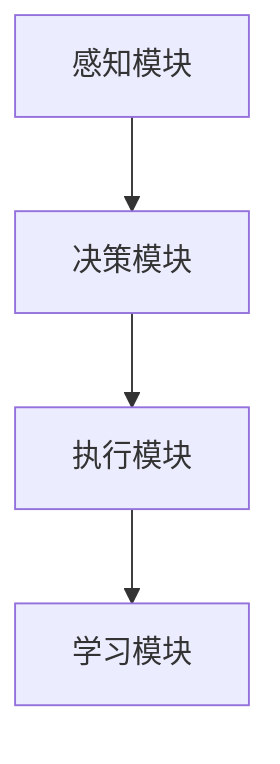

                 


# A/B测试框架：持续优化AI Agent性能

> **关键词**：A/B测试，AI Agent，系统架构，算法优化，持续性能优化  
> **摘要**：本文将详细介绍A/B测试框架在优化AI Agent性能中的应用。通过分析A/B测试的基本原理、系统架构设计、算法实现以及实际案例，帮助读者全面理解如何利用A/B测试框架来提升AI Agent的性能和效果。

---

## 第1章: A/B测试框架与AI Agent优化基础

### 1.1 A/B测试的基本概念
A/B测试是一种通过比较两个或多个版本（A和B）来评估哪个版本表现更好的方法。在AI Agent领域，A/B测试被广泛应用于优化算法性能、用户体验和系统效率。通过A/B测试，我们可以快速识别最优方案，减少试错成本。

### 1.2 AI Agent的定义与特点
AI Agent是一种能够感知环境、自主决策并执行任务的智能体。它具有以下特点：
- **自主性**：能够在没有外部干预的情况下独立运行。
- **反应性**：能够根据环境变化调整行为。
- **目标导向**：通过优化目标函数来实现特定任务。

### 1.3 A/B测试与AI Agent的结合
A/B测试在AI Agent中的应用主要体现在以下方面：
- **算法优化**：通过比较不同算法的效果，选择最优算法。
- **参数调优**：通过实验确定最佳参数组合。
- **性能监控**：实时监控系统性能，快速发现并修复问题。

---

## 第2章: A/B测试的核心概念与原理

### 2.1 A/B测试的基本流程
A/B测试的实施通常包括以下步骤：
1. **实验设计**：明确目标，设计实验方案。
2. **用户分组**：将用户随机分为对照组和实验组。
3. **数据收集**：收集实验数据，分析结果。
4. **结果评估**：根据统计结果决定是否采用实验组方案。

### 2.2 A/B测试的统计学基础
A/B测试的核心是统计学原理，常用的统计方法包括：
- **t检验**：用于比较两组数据的均值差异。
- **方差分析**：用于比较多组数据的均值差异。
- **贝叶斯方法**：基于概率的统计方法，用于估计参数。

### 2.3 A/B测试的实施步骤
1. **确定目标**：明确实验的目标，例如提高点击率。
2. **设计实验方案**：设计实验组和对照组的方案。
3. **执行实验**：将用户随机分配到实验组或对照组，收集数据。
4. **分析结果**：通过统计方法分析数据，得出结论。

### 2.4 A/B测试的优缺点
- **优点**：
  - 快速验证假设。
  - 减少试错成本。
  - 提高决策的科学性。
- **缺点**：
  - 实验设计复杂。
  - 数据收集时间较长。
  - 可能存在样本偏差。

---

## 第3章: A/B测试框架的算法原理

### 3.1 A/B测试的统计方法
- **t检验**：用于比较两组数据的均值差异。公式如下：
  $$ t = \frac{\bar{x}_1 - \bar{x}_2}{\sqrt{\frac{s_1^2}{n_1} + \frac{s_2^2}{n_2}}} $$
- **方差分析**：用于比较多组数据的均值差异。
- **贝叶斯方法**：基于概率的统计方法，公式如下：
  $$ P(A|B) = \frac{P(B|A)P(A)}{P(B)} $$

### 3.2 A/B测试的算法实现
- **基于t检验的实现**：
  ```python
  import numpy as np
  from scipy import stats

  def t_test(A, B):
      t, p = stats.ttest_ind(A, B)
      return t, p
  ```
- **基于贝叶斯的实现**：
  ```python
  import pymc as pm

  def bayesian_test(A, B):
      with pm.Model() as model:
          a = pm.Normal('a', mu=0, sigma=1)
          b = pm.Normal('b', mu=0, sigma=1)
          pm.Deterministic('diff', a - b)
          pm.Normal('obs_A', mu=a, sigma=1, observed=A)
          pm.Normal('obs_B', mu=b, sigma=1, observed=B)
          step = pm.NUTS()
          trace = pm.sample(1000, step)
      return trace['diff']
  ```

### 3.3 A/B测试的数学模型
- **t检验模型**：
  $$ t = \frac{\bar{x}_1 - \bar{x}_2}{\sqrt{\frac{s_1^2}{n_1} + \frac{s_2^2}{n_2}}} $$
- **贝叶斯模型**：
  $$ P(A|B) = \frac{P(B|A)P(A)}{P(B)} $$

---

## 第4章: AI Agent的系统架构与设计

### 4.1 AI Agent的系统架构
AI Agent的系统架构通常包括以下几个模块：
- **感知模块**：负责接收外部输入，如传感器数据。
- **决策模块**：负责根据感知数据做出决策。
- **执行模块**：负责执行决策结果。
- **学习模块**：负责优化模型参数。

### 4.2 系统架构的Mermaid图


### 4.3 系统功能设计
- **领域模型设计**：
  - 用户行为分析
  - 系统性能监控
- **功能模块划分**：
  - 数据采集模块
  - 数据处理模块
  - 数据分析模块
- **功能流程设计**：
  1. 感知模块接收输入数据。
  2. 决策模块根据数据做出决策。
  3. 执行模块执行决策。
  4. 学习模块优化模型参数。

---

## 第5章: A/B测试框架的项目实战

### 5.1 项目环境搭建
- **开发工具安装**：
  - Python 3.x
  - NumPy、Pymc等库
- **数据集准备**：
  - 模拟用户行为数据
  - 系统性能数据
- **环境配置**：
  - 配置虚拟环境
  - 安装依赖库

### 5.2 项目核心实现
- **实验设计**：
  - 对比两种算法的性能
  - 确定最佳参数组合
- **用户分组**：
  - 随机分配用户到实验组和对照组
  - 收集实验数据

### 5.3 代码实现
- **数据预处理**：
  ```python
  import pandas as pd

  data = pd.read_csv('data.csv')
  data = data.dropna()
  ```

- **数据分析与可视化**：
  ```python
  import matplotlib.pyplot as plt

  plt.hist(data['performance'], bins=10)
  plt.show()
  ```

### 5.4 实验结果分析
- **统计分析**：
  - 使用t检验分析实验结果
  - 使用贝叶斯方法估计参数
- **结果解读**：
  - 确定最优算法
  - 调整参数组合

### 5.5 项目小结
通过实际案例，我们展示了如何利用A/B测试框架优化AI Agent的性能。从实验设计到数据收集，再到结果分析，整个过程展示了A/B测试在实际应用中的价值。

---

## 第6章: 最佳实践与注意事项

### 6.1 最佳实践
- **实验设计**：
  - 明确目标
  - 设计合理的对照组和实验组
- **数据收集**：
  - 确保数据质量
  - 避免样本偏差

### 6.2 小结
A/B测试框架是优化AI Agent性能的重要工具。通过科学的设计和分析，我们可以快速找到最优方案，提升系统性能。

### 6.3 注意事项
- **样本量**：确保样本量足够大，以提高统计结果的准确性。
- **实验干扰**：避免实验过程中其他因素的干扰。
- **结果解释**：正确解释实验结果，避免误判。

### 6.4 拓展阅读
- 推荐书籍：《A/B Testing: The Methodology Behind the Madness》
- 推荐博客：[A/B Testing Best Practices](https://abtestguide.com)

---

## 作者：AI天才研究院 & 禅与计算机程序设计艺术

---

通过本文的详细讲解，读者可以全面理解A/B测试框架在优化AI Agent性能中的应用，并掌握实际操作的技巧。希望本文能为相关领域的从业者提供有价值的参考。

