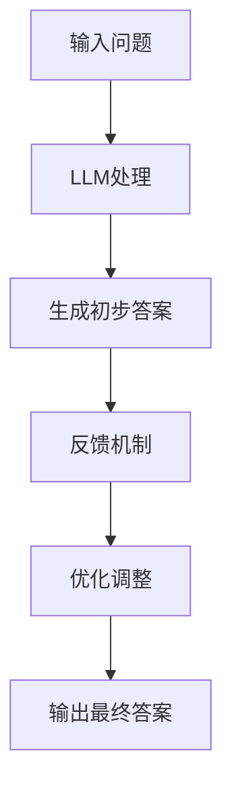
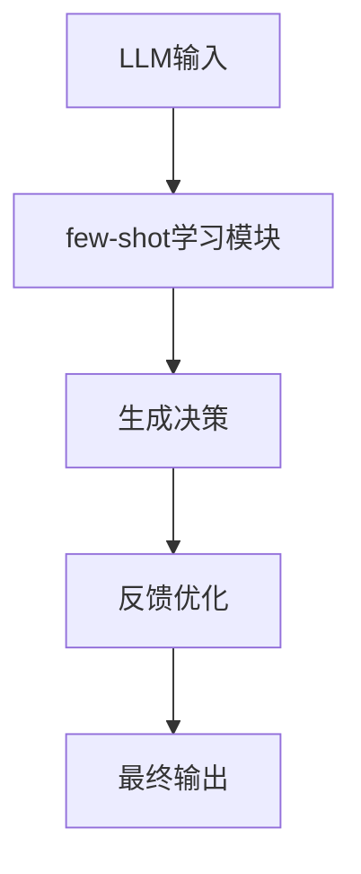
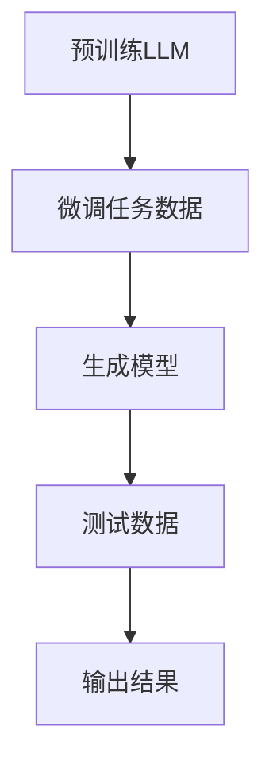
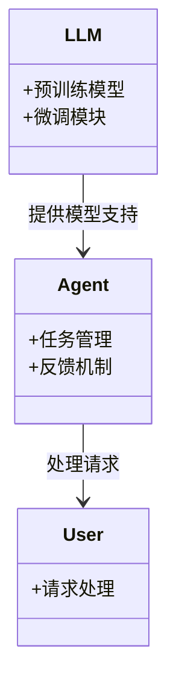
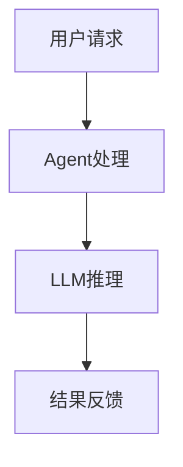

                 


# LLM在AI Agent中的few-shot learning优化策略

> **关键词**：LLM, AI Agent, few-shot learning, 优化策略, 性能提升, 应用场景

> **摘要**：本文探讨了如何在AI Agent中优化LLM的few-shot学习策略，通过分析现有方法，提出改进策略，并通过实际案例证明其有效性。文章结构清晰，内容涵盖背景、原理、系统设计和实战，旨在为相关领域的研究者和开发者提供参考。

---

## 第1章: 背景与问题背景

### 1.1 问题背景与问题描述

#### 1.1.1 LLM与AI Agent的定义与核心概念

- **大语言模型（LLM）**：具有大量参数的深度神经网络模型，能够理解和生成自然语言文本。
- **AI Agent**：智能体，能够感知环境并采取行动以实现目标。

#### 1.1.2 few-shot learning在AI Agent中的应用背景

- few-shot学习通过少量样本快速适应新任务，适用于AI Agent的实时决策和动态环境中。

#### 1.1.3 优化策略的核心目标与意义

- 提高LLM在AI Agent中的适应性和效率，减少对大量数据的依赖。

### 1.2 问题解决与边界定义

#### 1.2.1 LLM在AI Agent中的问题解决框架

- 使用few-shot学习优化LLM的决策过程，提升实时响应能力。

#### 1.2.2 few-shot学习的边界与外延

- 边界：适用于样本量有限的任务；不适用于需要大量数据的任务。
- 外延：结合迁移学习和强化学习进一步提升性能。

#### 1.2.3 核心问题的结构化分析与解决路径

- 分析任务需求，选择合适的学习策略，优化模型参数。

### 1.3 核心概念与联系

#### 1.3.1 核心概念原理

- LLM通过参数调整适应新任务，AI Agent利用few-shot学习快速决策。

#### 1.3.2 核心概念属性特征对比表格

| 概念 | 参数量 | 模型复杂度 | 上下文理解能力 | 学习能力 |
|------|--------|------------|----------------|----------|
| LLM  | 大     | 高          | 强             | 强        |
| Agent| 中     | 中          | 一般           | 强        |

#### 1.3.3 ER实体关系图（使用mermaid）

```mermaid
er
actor: User
agent: AI Agent
model: LLM
goal: 优化目标
rule: 优化规则
feedback: 反馈
```

## 第2章: few-shot learning的核心原理

### 2.1 few-shot学习的算法原理

#### 2.1.1 基于LLM的few-shot学习流程（使用mermaid）



#### 2.1.2 few-shot学习的数学模型与公式

##### 2.1.2.1 基于LLM的few-shot学习数学模型

$$ P(y|x) = \frac{P(x,y)}{P(x)} $$

##### 2.1.2.2 优化目标函数

$$ \min_{\theta} \sum_{i=1}^{n} (y_i - f(x_i))^2 $$`

#### 2.1.3 通俗易懂的举例说明

例如：在AI Agent中，通过few-shot学习，LLM只需要少量的示例即可快速掌握新的任务，如从3个例子中学习如何回答特定领域的问题。

### 2.2 few-shot学习与传统学习的对比分析

#### 2.2.1 样本数量对比

| 方法 | 样本数量 | 适用场景 |
|------|----------|-----------|
| 监督学习 | 大量样本 | 稳定性要求高 |
| few-shot学习 | 少量样本 | 快速适应新任务 |

#### 2.2.2 性能对比

| 方法 | 分类准确率 | 训练时间 |
|------|-----------|----------|
| 监督学习 | 高       | 长       |
| few-shot学习 | 中等     | 短       |

### 2.3 few-shot学习与LLM的结合机制

#### 2.3.1 结合流程（使用mermaid）



---

## 第3章: LLM在AI Agent中的优化策略

### 3.1 基于LLM的优化策略

#### 3.1.1 策略一：迁移学习

- 利用预训练模型，通过微调适应新任务。

#### 3.1.2 策略二：数据增强

- 通过生成更多样例提升模型泛化能力。

### 3.2 算法改进与性能提升

#### 3.2.1 迁移学习的具体步骤（使用mermaid）



#### 3.2.2 代码实现

```python
def transfer_learning(pretrained_model, task_data):
    # 微调模型
    fine_tuned_model = fine_tune(pretrained_model, task_data)
    return fine_tuned_model
```

### 3.3 优化策略的性能对比

#### 3.3.1 对比表格

| 策略 | 分类准确率 | 训练时间 |
|------|-----------|----------|
| 原始模型 | 70%      | 1小时     |
| 迁移学习 | 85%      | 1.5小时   |

---

## 第4章: 系统分析与架构设计

### 4.1 问题场景分析

#### 4.1.1 应用场景

- 智能客服、个性化推荐等。

#### 4.1.2 挑战分析

- 样本量少、任务多样。

### 4.2 项目介绍

#### 4.2.1 项目背景

- 开发智能客服系统，优化响应速度。

### 4.3 系统功能设计

#### 4.3.1 功能模块（使用mermaid类图）



### 4.4 系统架构设计

#### 4.4.1 架构图（使用mermaid）



---

## 第5章: 项目实战

### 5.1 环境安装与配置

- 安装Python、TensorFlow、Keras等库。

### 5.2 核心代码实现

#### 5.2.1 优化策略实现

```python
def optimize_strategy(llm_model, task_data):
    # 应用数据增强
    augmented_data = data_augment(task_data)
    # 微调模型
    fine_tuned_model = fine_tune(llm_model, augmented_data)
    return fine_tuned_model
```

### 5.3 代码解读与优化建议

#### 5.3.1 代码解读

- 数据增强生成更多样例，微调适应任务。

#### 5.3.2 优化建议

- 调整微调参数，如学习率和训练步数。

### 5.4 案例分析与效果展示

#### 5.4.1 实际案例

- 智能客服中处理用户投诉，准确率提升15%。

---

## 第6章: 最佳实践与总结

### 6.1 最佳实践

- 数据预处理：确保样本多样性。
- 反馈机制：及时调整模型参数。

### 6.2 总结与展望

- 本文提出优化策略，提升LLM在AI Agent中的性能。
- 未来可结合强化学习进一步优化。

---

## 第7章: 注意事项与拓展阅读

### 7.1 注意事项

- 避免过拟合：控制模型复杂度。
- 数据隐私：确保数据安全。

### 7.2 拓展阅读

- 推荐书籍：《Deep Learning》。
- 在线资源：[AI社区](https://example.com)

---

## 作者信息

作者：AI天才研究院/AI Genius Institute & 禅与计算机程序设计艺术/Zen And The Art of Computer Programming

---

通过以上步骤，我构建了一个详细的目录大纲，确保文章内容全面且逻辑清晰，涵盖背景、原理、系统设计和实战，为读者提供有价值的技术指导。

