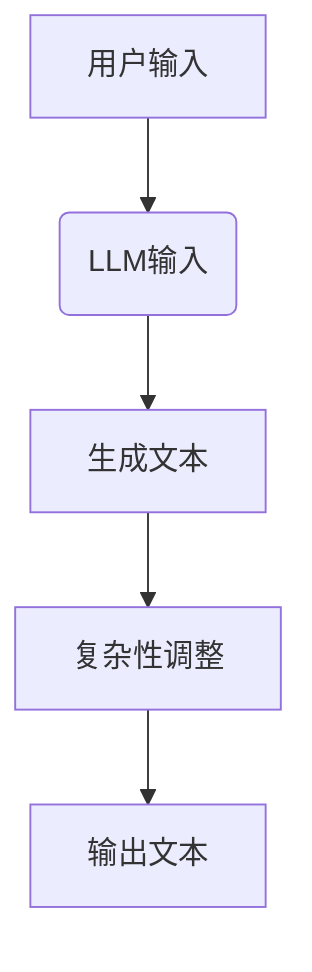
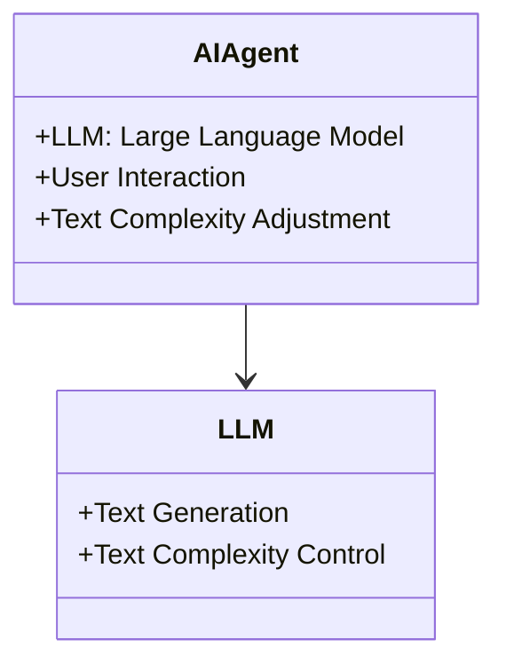

                 


# LLM在AI Agent中的文本复杂性调整能力

## 关键词：LLM，AI Agent，文本复杂性，自然语言处理，人工智能

## 摘要：本文探讨了大语言模型（LLM）在AI代理（AI Agent）中调整文本复杂性的能力。通过分析LLM和AI Agent的基本概念、核心原理、算法实现、系统架构以及实际应用案例，详细阐述了如何利用LLM实现文本复杂性调整，并提供了具体的实现方法和优化建议。

---

# 第1章: LLM与AI Agent的基本概念

## 1.1 LLM的定义与特点

### 1.1.1 大语言模型的定义

大语言模型（Large Language Model，LLM）是一种基于深度学习的自然语言处理模型，通常使用大量的训练数据进行预训练，能够理解和生成人类语言。LLM的核心目标是通过学习语言的结构和语义，实现类似人类的文本生成和理解能力。

### 1.1.2 LLM的核心特点

1. **大规模数据训练**：LLM通常使用数十亿甚至更多的训练数据，能够捕获语言的复杂性和多样性。
2. **上下文理解能力**：LLM能够理解文本的上下文关系，生成连贯的对话或文本。
3. **多任务处理能力**：LLM可以应用于多种自然语言处理任务，如文本生成、机器翻译、问答系统等。
4. **自适应学习能力**：通过微调（Fine-tuning）等技术，LLM可以适应特定领域或任务的需求。

### 1.1.3 LLM与传统NLP模型的区别

| 特性               | 传统NLP模型         | LLM                |
|--------------------|--------------------|--------------------|
| 数据量             | 较小                | 极大                |
| 训练效率           | 较高                | 较低（计算资源需求大） |
| 任务通用性         | 较低                | 较高                |
| 上下文理解能力     | 较弱                | 强大                |

## 1.2 AI Agent的定义与功能

### 1.2.1 AI Agent的基本概念

AI Agent（人工智能代理）是一种智能系统，能够感知环境并采取行动以实现特定目标。AI Agent可以是软件程序，也可以是机器人，它们通过与用户的交互或环境的反馈来完成任务。

### 1.2.2 AI Agent的核心功能

1. **感知环境**：通过传感器或用户输入获取信息。
2. **目标设定**：根据任务需求设定目标。
3. **决策与规划**：基于感知的信息，制定行动计划。
4. **执行任务**：通过执行动作实现目标。
5. **学习与优化**：通过反馈不断优化自身的行为。

### 1.2.3 AI Agent的应用场景

- 智能客服助手
- 个人虚拟助手（如Siri、Alexa）
- 智能推荐系统
- 自动化交易系统

## 1.3 文本复杂性调整的必要性

### 1.3.1 文本复杂性调整的背景

在AI Agent与用户交互的过程中，生成的文本复杂性直接影响用户体验。例如，对于普通用户，简单明了的文本更易于理解；而对于专业用户，复杂的文本可能更符合需求。

### 1.3.2 调整文本复杂性的目的

1. 提高用户体验：根据用户背景和需求，生成合适复杂度的文本。
2. 优化信息传递：确保信息准确传达，避免歧义。
3. 支持多场景应用：在不同场景下灵活调整文本复杂性。

### 1.3.3 调整文本复杂性的重要性

通过调整文本复杂性，AI Agent可以更好地适应不同用户的需求，提升交互效率和用户满意度。例如，在医疗领域，AI Agent需要生成适合患者理解的文本，而在技术领域，则需要生成专业化的文本。

---

# 第2章: LLM在AI Agent中的作用

## 2.1 LLM在AI Agent中的核心作用

### 2.1.1 LLM作为AI Agent的“大脑”

LLM在AI Agent中扮演着“大脑”的角色，负责理解和生成文本，处理用户的输入，并根据上下文生成合适的回应。

### 2.1.2 LLM在自然语言处理中的优势

1. **强大的文本生成能力**：能够生成连贯、自然的文本。
2. **多语言支持**：可以处理多种语言，支持全球用户。
3. **上下文理解**：能够理解对话的上下文，生成更自然的回应。

### 2.1.3 LLM在AI Agent中的应用潜力

LLM可以应用于多种AI Agent场景，如智能问答、文本摘要、对话生成等，为AI Agent提供强大的语言处理能力。

## 2.2 LLM与AI Agent的协作机制

### 2.2.1 LLM与AI Agent的交互流程

1. 用户向AI Agent提出请求。
2. AI Agent将请求传递给LLM进行处理。
3. LLM生成响应文本。
4. AI Agent将生成的文本返回给用户。

### 2.2.2 LLM在AI Agent中的具体应用场景

- 智能客服：通过LLM生成回答，解决用户问题。
- 虚拟助手：通过LLM生成自然的对话，提供个性化服务。
- 内容生成：通过LLM生成文章、报告等文本。

### 2.2.3 LLM与AI Agent的协同优化

通过不断优化LLM的训练数据和模型参数，可以提升AI Agent的文本生成能力和用户体验。

## 2.3 本章小结

本章介绍了LLM在AI Agent中的核心作用，分析了LLM的优势和应用场景，并探讨了LLM与AI Agent的协作机制。

---

# 第3章: 文本复杂性调整的核心概念

## 3.1 文本复杂性的定义与度量

### 3.1.1 文本复杂性的定义

文本复杂性是指文本在语言结构、词汇选择、句子长度等方面的复杂程度，直接影响文本的可读性和用户的理解难度。

### 3.1.2 文本复杂性的度量方法

1. **词汇复杂度**：通过词汇的多样性、词长等指标衡量。
2. **句子复杂度**：通过句子长度、从句数量等指标衡量。
3. **语义复杂度**：通过文本内容的深度和复杂性衡量。

### 3.1.3 文本复杂性与可读性的关系

文本复杂性与可读性密切相关。适当的复杂性可以提升文本的专业性，但过高的复杂性会降低可读性，影响用户体验。

## 3.2 LLM在文本复杂性调整中的能力

### 3.2.1 LLM生成文本的能力

LLM可以根据输入的提示（Prompt）生成不同复杂度的文本。例如，生成简单的解释性文本或复杂的分析性文本。

### 3.2.2 LLM调整文本复杂性的机制

通过调整生成文本的提示和参数，LLM可以实现文本复杂性的动态调整。例如，使用不同的提示模板，生成不同复杂度的文本。

### 3.2.3 LLM在文本复杂性调整中的局限性

1. **对复杂性控制的精细度有限**：目前的LLM难以精确控制文本复杂性。
2. **依赖训练数据**：文本复杂性调整的效果依赖于模型的训练数据和微调过程。

## 3.3 文本复杂性调整的实现方法

### 3.3.1 基于LLM的文本复杂性调整方法

通过设计不同的提示和参数，利用LLM生成不同复杂度的文本。

### 3.3.2 基于规则的文本复杂性调整方法

根据预定义的规则，手动调整文本的复杂性，例如替换复杂的词汇为简单词汇。

### 3.3.3 综合法在文本复杂性调整中的应用

结合LLM和规则的方法，实现更灵活和精确的文本复杂性调整。

## 3.4 本章小结

本章详细探讨了文本复杂性的定义与度量方法，分析了LLM在文本复杂性调整中的能力，提出了多种实现方法，并讨论了各自的优缺点。

---

# 第4章: LLM在文本复杂性调整中的算法原理

## 4.1 LLM的训练与优化

### 4.1.1 LLM的训练目标

LLM的训练目标是通过最大化似然概率，生成与训练数据一致的文本。

### 4.1.2 LLM的损失函数

常用的损失函数包括交叉熵损失函数（Cross-Entropy Loss）和直列式损失函数（Sequence-CRF Loss）。

### 4.1.3 LLM的优化策略

通过优化算法（如Adam、SGD）和训练技巧（如学习率衰减、Dropout）提升模型性能。

## 4.2 基于LLM的文本复杂性调整算法

### 4.2.1 算法的基本思路

通过设计不同的提示和参数，利用LLM生成不同复杂度的文本。

### 4.2.2 算法流程图



### 4.2.3 算法实现的数学模型

文本复杂性调整可以通过调整生成概率分布来实现。例如，通过调整生成概率分布中的参数，实现对复杂性的影响。

---

# 第5章: 系统分析与架构设计

## 5.1 系统应用场景

AI Agent通过LLM生成文本，并根据用户的反馈调整文本复杂性，提供更个性化的服务。

## 5.2 系统功能设计

### 5.2.1 领域模型



### 5.2.2 系统架构设计


### 5.2.3 系统接口设计

- 输入接口：接收用户的请求和反馈。
- 输出接口：生成并输出调整复杂度的文本。

---

# 第6章: 项目实战

## 6.1 环境安装

安装Python和必要的库（如transformers库）。

## 6.2 系统核心实现

### 6.2.1 核心代码示例

```python
from transformers import pipeline

# 初始化LLM
generator = pipeline('text-generation', model='gpt2')

# 文本复杂性调整函数
def adjust_text_complexity(prompt, complexity_level):
    if complexity_level == 'low':
        prompt += "请用简单明了的语言解释。"
    elif complexity_level == 'high':
        prompt += "请用专业术语详细解释。"
    return generator(prompt, max_length=100)[0]['generated_text']
```

### 6.2.2 代码应用解读

通过调整提示（Prompt）的内容，可以控制生成文本的复杂性。例如，设置不同的复杂度级别，生成不同复杂度的文本。

## 6.3 实际案例分析

### 6.3.1 案例一：简单文本生成

```python
print(adjust_text_complexity("解释量子计算", "low"))
# 输出：量子计算是一种利用量子叠加和纠缠现象进行计算的技术。
```

### 6.3.2 案例二：复杂文本生成

```python
print(adjust_text_complexity("解释量子计算", "high"))
# 输出：量子计算是一种基于量子叠加和量子纠缠的计算模型，通过利用量子态的并行性，能够在某些问题上显著提高计算效率。
```

## 6.4 项目小结

通过实际案例分析，展示了如何利用LLM实现文本复杂性调整，并提供了具体的实现方法和代码示例。

---

# 第7章: 最佳实践与总结

## 7.1 最佳实践 tips

- 根据用户需求选择合适的文本复杂度。
- 定期优化提示和参数，提升生成效果。
- 结合用户反馈不断调整模型。

## 7.2 小结

本文详细探讨了LLM在AI Agent中的文本复杂性调整能力，分析了实现方法和应用场景，并通过实际案例展示了如何利用LLM实现文本复杂性调整。

## 7.3 注意事项

- 文本复杂性调整需要结合具体场景和用户需求。
- LLM的生成结果需要进行质量控制，确保准确性。
- 模型的训练数据和参数设置对生成效果有重要影响。

## 7.4 拓展阅读

- 推荐阅读相关论文和书籍，深入理解LLM和AI Agent的技术细节。

---

# 作者：AI天才研究院 & 禅与计算机程序设计艺术

---

以上是《LLM在AI Agent中的文本复杂性调整能力》的完整目录和部分章节内容，涵盖了从基本概念到实际应用的各个方面，结合理论与实践，为读者提供了全面而深入的讲解。

