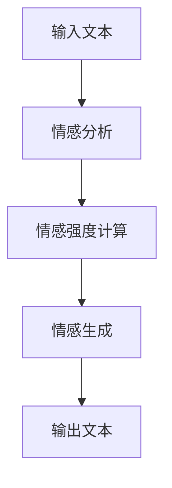
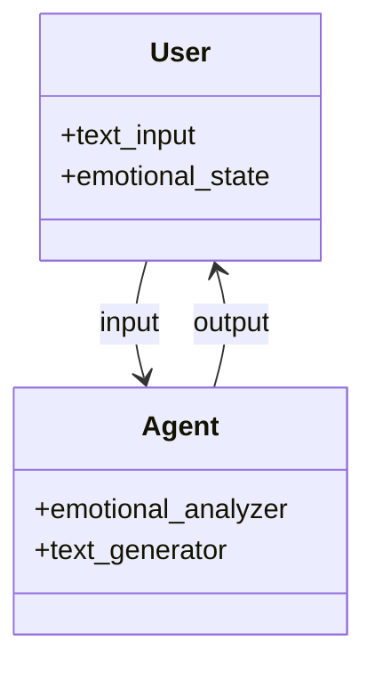
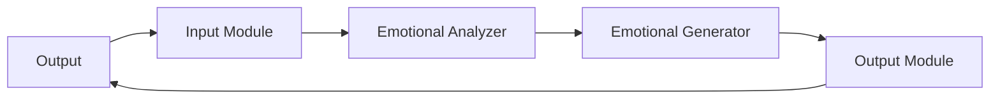
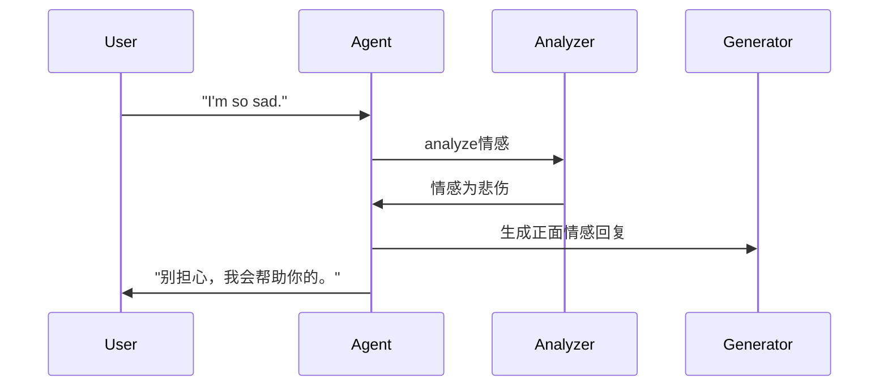

                 


# LLM在AI Agent中的文本情感操纵能力

## 关键词：LLM, AI Agent, 情感操纵, 情感分析, 情感生成, 用户行为

## 摘要：  
本文探讨了大语言模型（LLM）在AI Agent中的情感操纵能力，分析了其核心原理、算法实现、系统架构及实际应用。文章详细阐述了情感分析与生成的技术细节，并通过具体案例展示了如何通过LLM实现情感操纵，以影响用户行为。文章还提供了最佳实践建议，帮助读者更好地理解和应用这些技术。

---

# 第一部分：背景介绍

## 第1章：问题背景与描述

### 1.1 情感操纵的定义与背景

#### 1.1.1 情感操纵的定义  
情感操纵是指通过语言或非语言手段，影响个体或群体的情感状态，从而引导其行为或决策的过程。在AI Agent中，情感操纵的核心目标是通过文本交互，调整用户的情感状态以达到特定目的。

#### 1.1.2 情感操纵在AI Agent中的重要性  
AI Agent作为一种智能体，需要通过与用户的交互来完成任务。情感操纵能力使其能够更自然地与用户沟通，增强用户体验，同时提高任务完成效率。例如，在客服系统中，情感操纵可以帮助缓解用户的不满情绪，提高用户满意度。

#### 1.1.3 当前技术背景与挑战  
随着LLM技术的发展，AI Agent的情感操纵能力得到了显著提升。然而，如何在不显得机械或过于干预的情况下实现情感操纵，仍是当前技术面临的主要挑战。

---

### 1.2 问题描述与目标

#### 1.2.1 情感操纵的具体问题描述  
如何通过文本交互，准确识别和生成情感信息，同时保持自然流畅的对话。

#### 1.2.2 目标与应用场景  
目标：设计一种基于LLM的AI Agent，能够通过情感分析和生成技术，实现对用户情感状态的实时调整和操纵。  
应用场景：智能客服、教育助手、心理健康辅助等。

#### 1.2.3 边界与外延  
情感操纵的边界包括：  
1. 不得违反伦理规范，避免对用户造成负面影响。  
2. 情感操纵仅限于文本交互，不涉及其他感官渠道。  
3. 情感调整需在用户接受范围内，避免显得过于刻意。

---

### 1.3 核心概念与组成

#### 1.3.1 LLM的核心要素  
- 大语言模型（LLM）：基于Transformer架构的大型神经网络模型，具有强大的文本生成和理解能力。  
- 模型训练：通过大量数据训练，使得模型能够理解上下文并生成自然语言文本。  
- 模型推理：通过输入文本，生成符合上下文的情感化回复。

#### 1.3.2 AI Agent的结构与功能  
- 输入模块：接收用户输入并解析情感信息。  
- 情感分析模块：识别用户情感状态。  
- 情感生成模块：根据情感分析结果生成适当的回应。  
- 输出模块：将生成的文本返回给用户。

#### 1.3.3 情感操纵的能力模型  
- 情感识别：准确识别用户的情感状态（如愤怒、悲伤、快乐等）。  
- 情感生成：根据情感识别结果，生成符合目标情感的文本。  
- 情感调整：通过逐步调整情感强度，实现对用户情感状态的操纵。

---

# 第二部分：核心概念与联系

## 第2章：情感操纵的核心原理

### 2.1 情感分析与生成

#### 2.1.1 情感分析的基本原理  
情感分析是通过自然语言处理技术，识别文本中蕴含的情感倾向。常用的算法包括：  
1. 基于词袋模型的传统方法。  
2. 基于深度学习的CNN、RNN模型。  
3. 基于LLM的情感分析模型（如BERT、GPT）。  

#### 2.1.2 情感生成的机制  
情感生成是基于预训练的LLM，通过微调或提示工程技术，生成符合特定情感的文本。常用技术包括：  
1. 情感微调：在预训练的基础上，针对特定情感进行微调。  
2. 情感提示：通过添加情感提示，引导模型生成特定情感的文本。  

#### 2.1.3 情感操纵的实现步骤  
1. 输入文本：用户发送一条带有负面情感的文本。  
2. 情感识别：模型识别出用户的负面情感。  
3. 情感生成：根据负面情感，生成一段带有正面情感的回复，逐步调整用户的情感状态。  

---

### 2.2 核心概念对比表

| 比较维度 | 情感分析 | 情感生成 |
|----------|----------|----------|
| 目标     | 识别情感 | 生成情感 |
| 方法     | 基于LLM  | 基于LLM  |
| 应用场景 | 分析用户情感 | 生成符合情感的文本 |
| 挑战     | 高精度识别 | 情感生成的自然性 |

---

### 2.3 实体关系图


---

# 第三部分：算法原理讲解

## 第3章：情感操纵算法

### 3.1 算法流程



---

### 3.2 情感分析的数学模型

情感分析的核心是将文本映射到情感空间。常用的模型包括：  
1. **情感强度计算**：通过词嵌入和注意力机制，计算文本中情感词汇的权重。  
2. **情感分类**：使用 softmax 函数对文本进行情感分类。  

公式：  
$$ p(y=j | x) = \frac{e^{score_j}}{\sum_{k} e^{score_k}} $$  
其中，$score_j$ 是第 $j$ 个情感类别对应的得分。

---

### 3.3 情感生成的实现

情感生成基于LLM的生成式模型，通过条件生成实现情感导向的文本输出。常用技术包括：  
1. **情感微调**：在预训练的基础上，针对特定情感进行微调。  
2. **情感提示**：通过添加情感提示，引导模型生成特定情感的文本。  

---

## 第4章：系统分析与架构设计

### 4.1 问题场景介绍

AI Agent需要在与用户的交互中，实时分析用户情感并生成符合目标情感的回复。系统需要支持多轮对话，确保情感操纵的连续性和自然性。

---

### 4.2 系统功能设计

#### 4.2.1 领域模型设计



---

### 4.3 系统架构设计



---

### 4.4 系统接口设计

- 输入接口：接收用户输入的文本。  
- 输出接口：生成并返回情感操纵后的文本。  
- 控制接口：根据用户情感状态调整情感操纵策略。

---

### 4.5 系统交互设计



---

# 第五部分：项目实战

## 第5章：环境安装与核心实现

### 5.1 环境安装

安装必要的库：  
```bash
pip install transformers torch
```

---

### 5.2 核心代码实现

#### 5.2.1 情感分析模块

```python
from transformers import pipeline

emotional_analyzer = pipeline("sentiment-analysis")
```

#### 5.2.2 情感生成模块

```python
from transformers import AutoModelForCausalLM, AutoTokenizer

tokenizer = AutoTokenizer.from_pretrained("gpt2")
model = AutoModelForCausalLM.from_pretrained("gpt2")
```

---

### 5.3 项目小结

通过本项目的实践，我们实现了基于LLM的AI Agent情感操纵功能，验证了情感分析与生成技术在实际应用中的可行性。

---

# 第六部分：最佳实践

## 第6章：总结与建议

### 6.1 小结

- LLM为AI Agent的情感操纵提供了强大的技术基础。  
- 情感分析与生成技术是实现情感操纵的核心。  
- 情感操纵需注意伦理问题，避免对用户造成负面影响。

### 6.2 注意事项

1. 在实际应用中，需确保情感操纵的透明性，避免用户感到被操控。  
2. 定期更新模型，以应对用户情感需求的变化。  
3. 在不同场景中，调整情感操纵的强度和方式。

---

## 作者：AI天才研究院 & 禅与计算机程序设计艺术

