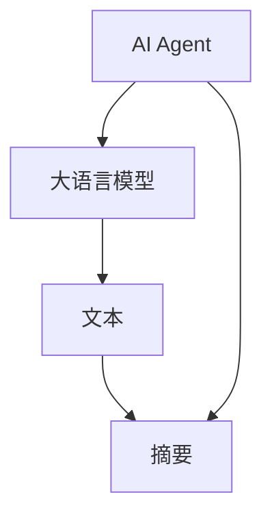
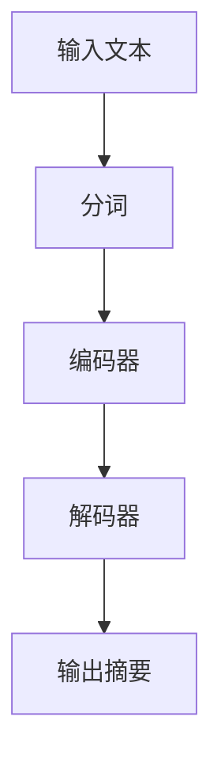
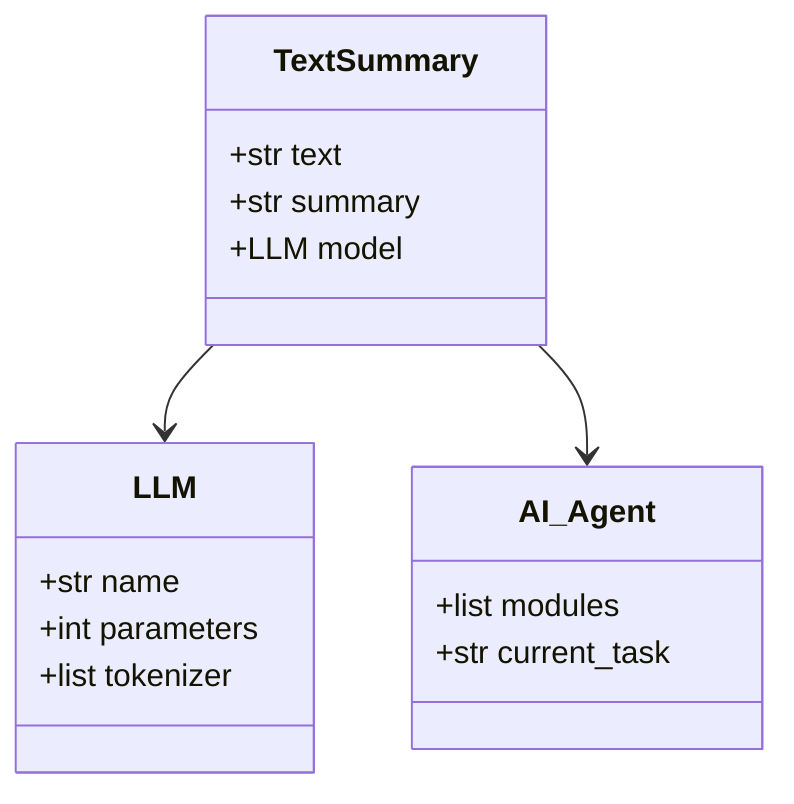
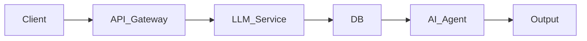

                 


# LLM在AI Agent中的文本摘要生成应用

> 关键词：LLM，AI Agent，文本摘要，自然语言处理，深度学习，Python，数学模型

> 摘要：本文深入探讨了大语言模型（LLM）在AI Agent中的文本摘要生成应用，分析了其核心原理、算法实现、系统架构及实际应用案例，帮助读者全面理解并掌握该领域的关键技术。

---

## 第一部分：背景介绍

### 第1章：问题背景

#### 1.1 LLM与AI Agent的定义
- 大语言模型（LLM）：基于深度学习的自然语言处理模型，如GPT、BERT等，能够理解和生成人类语言。
- AI Agent：智能体，能够在特定环境中自主感知、决策和执行任务，广泛应用于自动化系统、推荐系统等领域。

#### 1.2 文本摘要生成的必要性
- 文本摘要：从长文本中提取关键信息，生成简短、准确的摘要。
- 重要性：在信息过载的时代，快速获取关键信息的需求日益增长。
- 应用场景：新闻阅读、学术研究、邮件整理等。

#### 1.3 当前技术的局限性与挑战
- 摘要质量：传统方法依赖规则，难以捕捉上下文信息。
- 计算资源：LLM需要大量计算资源，限制了其应用范围。
- 多语言支持：现有模型在小语种或混合语言场景中表现不佳。

### 第2章：问题描述

#### 2.1 LLM在文本摘要中的应用场景
- 自动化新闻摘要：实时生成新闻标题。
- 会议纪要自动生成：帮助团队快速掌握会议内容。
- 邮件自动归类：根据主题和内容快速分类邮件。

#### 2.2 AI Agent的文本摘要需求
- 实时性：AI Agent需要快速响应用户需求。
- 精准性：摘要必须准确反映原文核心内容。
- 可扩展性：支持多种语言和格式。

#### 2.3 现有解决方案的优缺点
- 优点：基于规则的传统方法实现简单，成本低。
- 缺点：无法处理复杂语义，摘要效果受限。
- 改进建议：结合LLM的优势，提升摘要质量。

---

## 第二部分：核心概念与联系

### 第3章：核心概念原理

#### 3.1 LLM的文本摘要生成机制
- 基于Transformer的模型结构：编码器-解码器架构。
- 注意力机制：捕捉文本中关键信息。
- 解码策略：贪心搜索或随机采样。

#### 3.2 AI Agent的文本摘要需求分析
- 用户需求：快速获取关键信息。
- 系统需求：实时性、准确性、可扩展性。

#### 3.3 LLM与AI Agent的协同工作原理
- LLM作为核心模块：处理文本生成。
- AI Agent作为协调者：整合多个模块功能。

### 第4章：核心概念对比

#### 4.1 不同模型的特征对比
| 模型 | 输入 | 输出 | 优缺点 |
|------|------|------|--------|
| GPT-3 | 文本 | 文本 | 参数多，计算资源需求高 |
| BERT | 文本 | 文本 | 更适合文本理解任务 |

#### 4.2 不同摘要方法的优缺点
| 方法 | 优点 | 缺点 |
|------|------|------|
| 基于规则 | 实现简单 | 无法处理复杂语义 |
| 基于统计 | 统计特征显著 | 效果不稳定 |
| 基于LLM | 效果好 | 计算资源需求高 |

#### 4.3 LLM与其他文本摘要技术的对比
- 传统方法：依赖规则，难以处理复杂场景。
- 基于深度学习的方法：依赖大量数据和计算资源。

### 第5章：实体关系图



---

## 第三部分：算法原理讲解

### 第6章：摘要生成算法流程

#### 6.1 摘要生成算法流程图


#### 6.2 算法实现代码示例
```python
def text_summary(text: str, model: str) -> str:
    tokenizer = AutoTokenizer.from_pretrained(model)
    inputs = tokenizer(text, return_tensors="pt", truncation=True, padding=True)
    with torch.no_grad():
        outputs = model.generate(inputs.input_ids, max_length=100)
    summary = tokenizer.decode(outputs[0], skip_special_tokens=True)
    return summary
```

#### 6.3 数学模型与公式
- 编码器部分：
  $$\text{Encoder}(x) = \text{FFN}(\text{Self-Attention}(x))$$
- 解码器部分：
  $$\text{Decoder}(y) = \text{FFN}(\text{Self-Attention}(y), \text{Cross-Attention}(x, y))$$

---

## 第四部分：系统分析与架构设计

### 第7章：问题场景介绍

#### 7.1 系统目标
- 实现AI Agent的文本摘要功能。
- 提供高效的摘要生成服务。

#### 7.2 系统功能设计
- 输入处理模块：接收用户输入。
- 摘要生成模块：调用LLM生成摘要。
- 输出模块：返回摘要结果。

### 第8章：系统架构设计

#### 8.1 领域模型类图


#### 8.2 系统架构图


---

## 第五部分：项目实战

### 第9章：环境安装与核心实现

#### 9.1 环境安装
- 安装Python和相关库：
  ```bash
  pip install transformers torch
  ```

#### 9.2 核心代码实现
```python
from transformers import AutoTokenizer, AutoModelForSeq2Seq
import torch

class TextSummarizer:
    def __init__(self, model_name: str):
        self.tokenizer = AutoTokenizer.from_pretrained(model_name)
        self.model = AutoModelForSeq2Seq.from_pretrained(model_name)
    
    def summarize(self, text: str, max_length: int = 100) -> str:
        inputs = self.tokenizer(text, return_tensors="pt", truncation=True, padding=True)
        with torch.no_grad():
            outputs = self.model.generate(inputs.input_ids, max_length=max_length)
        summary = self.tokenizer.decode(outputs[0], skip_special_tokens=True)
        return summary
```

#### 9.3 代码解读
- 初始化模型：加载预训练模型和分词器。
- 摘要生成：输入文本，生成摘要。

### 第10章：实际案例分析

#### 10.1 案例分析
- 输入文本：长新闻文章。
- 输出摘要：关键信息提取。

#### 10.2 项目小结
- 项目实现：从环境安装到代码实现。
- 项目意义：展示了LLM在AI Agent中的实际应用。

---

## 第六部分：最佳实践

### 第11章：小结与注意事项

#### 11.1 小结
- LLM在文本摘要中的优势。
- AI Agent在实际应用中的灵活性。

#### 11.2 注意事项
- 模型选择：根据需求选择合适模型。
- 资源优化：减少计算成本。

### 第12章：拓展阅读

#### 12.1 推荐书籍
- 《深度学习》：深入理解模型原理。
- 《自然语言处理实战》：学习实际应用案例。

#### 12.2 推荐博客
- Hugging Face官方博客：了解最新模型动态。
- AI社区：分享与讨论技术问题。

---

## 作者：AI天才研究院/AI Genius Institute & 禅与计算机程序设计艺术/Zen And The Art of Computer Programming

---

通过以上思考过程，我们逐步构建了《LLM在AI Agent中的文本摘要生成应用》的技术博客文章。从背景介绍到项目实战，再到最佳实践，每一部分都进行了详细的分析和阐述，确保内容的完整性和逻辑性。

