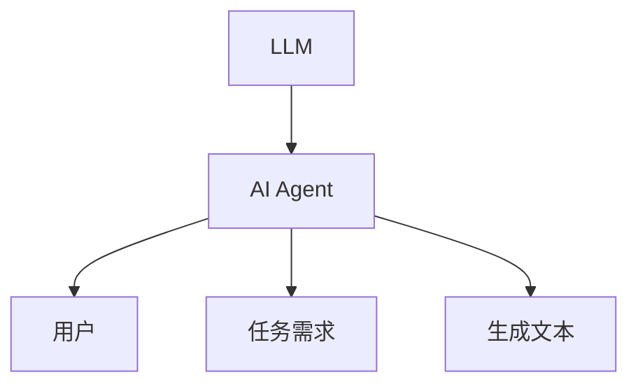
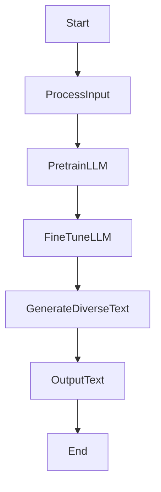
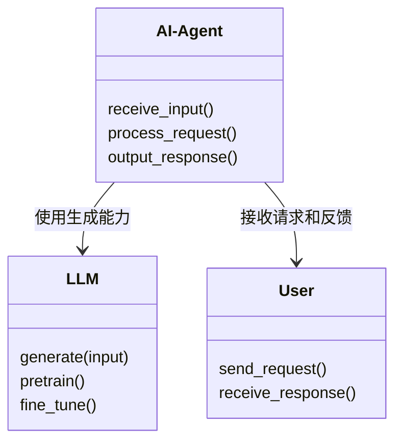
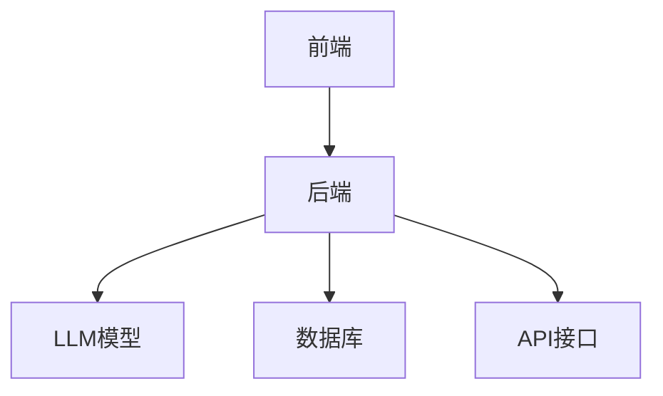

                 


# LLM在AI Agent中的文本生成多样性增强

> 关键词：LLM、AI Agent、文本生成、多样性增强、自然语言处理

> 摘要：本文探讨了如何利用大语言模型（LLM）提升AI Agent在文本生成任务中的多样性。文章从问题背景出发，分析了现有文本生成的局限性，并详细介绍了LLM的核心原理和其在AI Agent中的应用。通过对比分析和算法优化，本文提出了基于LLM的多样性增强方法，并通过系统架构设计和项目实战验证了该方法的有效性。

---

## 第1章: 问题背景与描述

### 1.1 问题背景

#### 1.1.1 当前AI Agent的发展现状
AI Agent作为一种智能体，广泛应用于客服、智能家居、虚拟助手等领域。传统的AI Agent依赖于规则引擎或简单的关键词匹配，文本生成能力有限，难以应对复杂的多样化需求。

#### 1.1.2 文本生成在AI Agent中的重要性
文本生成是AI Agent与用户交互的核心环节，直接影响用户体验和任务完成效果。多样化的文本生成能够提升交互的自然性和丰富性。

#### 1.1.3 现有文本生成的局限性
- 单一性：传统方法生成的文本缺乏多样性，容易让用户感到重复和单调。
- 适应性不足：难以根据上下文灵活调整生成内容的风格和语气。

### 1.2 问题描述

#### 1.2.1 文本生成多样性的定义
文本生成的多样性指的是生成文本的丰富性和灵活性，包括内容、风格、语气等多个维度的变化。

#### 1.2.2 多样性缺失对AI Agent的影响
- 用户体验下降：单一的回复方式容易让用户感到乏味。
- 任务失败风险增加：在复杂场景中，缺乏多样性的文本生成可能导致误解或错误。

#### 1.2.3 提高文本生成多样性的必要性
通过引入大语言模型（LLM），可以显著提升文本生成的多样性和适应性，从而优化AI Agent的表现。

### 1.3 问题解决思路

#### 1.3.1 引入大语言模型的必要性
LLM具备强大的上下文理解和生成能力，能够生成多样化、自然的文本。

#### 1.3.2 LLM在文本生成中的优势
- 强大的语义理解能力。
- 多样化的生成方式，支持多种风格和语气。

#### 1.3.3 解决方案的框架与目标
构建一个基于LLM的AI Agent系统，通过优化模型参数和生成策略，实现多样化文本生成。

### 1.4 边界与外延

#### 1.4.1 LLM文本生成的边界条件
- 输入文本的质量和相关性。
- 模型的训练数据和应用场景限制。

#### 1.4.2 多样性增强的适用场景
- 用户需求多样化的场景。
- 需要灵活应答的复杂对话场景。

#### 1.4.3 与其他AI技术的协同关系
与自然语言理解（NLU）、意图识别等技术协同工作，形成完整的AI Agent系统。

### 1.5 核心概念与组成

#### 1.5.1 LLM的基本组成
- 输入层：处理输入文本。
- 编码层：将输入转换为向量表示。
- 解码层：生成多样化输出。

#### 1.5.2 AI Agent的系统架构
- 用户输入处理。
- 内部决策与生成。
- 输出反馈。

#### 1.5.3 文本生成多样性增强的核心要素
- 多样化生成策略。
- 上下文感知能力。
- 实时调整机制。

---

## 第2章: LLM与AI Agent的核心概念

### 2.1 LLM的基本原理

#### 2.1.1 大语言模型的定义与特点
- 大语言模型：基于大量数据训练的深度学习模型。
- 特点：强大的语义理解能力，多任务适应性。

#### 2.1.2 LLM的训练机制
- 预训练：使用大规模通用数据进行无监督学习。
- 微调：针对特定任务进行有监督微调。

#### 2.1.3 LLM的生成机制
- 基于概率的生成：通过计算每个词的概率进行生成。
- 多样化生成：通过调整生成策略，输出多样化文本。

### 2.2 AI Agent的定义与功能

#### 2.2.1 AI Agent的基本概念
- AI Agent：具备感知环境和自主决策能力的智能体。
- 核心功能：理解用户需求，生成多样化文本，优化交互体验。

#### 2.2.2 AI Agent的核心功能
- 用户需求分析。
- 文本生成与反馈。
- 系统优化与调整。

#### 2.2.3 AI Agent的交互方式
- 文本交互：通过自然语言对话。
- 多模态交互：结合图像、语音等多模态信息。

### 2.3 LLM在AI Agent中的应用

#### 2.3.1 LLM作为AI Agent的文本生成模块
- LLM作为AI Agent的核心生成模块，负责多样化的文本输出。

#### 2.3.2 LLM与AI Agent的协同工作
- AI Agent通过LLM生成多样化文本，提升用户体验。
- LLM通过AI Agent的上下文感知能力，优化生成内容。

#### 2.3.3 解决方案的框架与目标
- 构建一个基于LLM的AI Agent系统，实现多样化文本生成。

---

## 第3章: 核心概念对比与关系

### 3.1 LLM与传统NLP模型的对比

| 对比维度         | LLM                         | 传统NLP模型             |
|------------------|------------------------------|-------------------------|
| 模型规模         | 大型或超大型                 | 较小或中等规模           |
| 训练数据         | 大规模通用数据               | 针对特定任务的有限数据   |
| 适应性           | 强大的多任务适应能力         | 较弱的适应性             |
| 生成能力         | 多样化、自然的生成能力       | 生成能力有限             |

### 3.2 实体关系图



---

## 第4章: 算法原理讲解

### 4.1 算法流程



### 4.2 代码实现

```python
def generate_diverse_text(model, input_text, num_samples=5):
    outputs = []
    for _ in range(num_samples):
        output = model.generate(input_text, max_length=50, do_sample=True)
        outputs.append(output)
    return outputs
```

### 4.3 数学模型

文本生成的概率计算：

$$ P(\text{词}_i | \text{词}_{i-1}, \ldots, \text{词}_1) $$

多样性增强的损失函数：

$$ \text{Loss} = \text{交叉熵损失} + \lambda \times \text{多样性损失} $$

---

## 第5章: 系统分析与架构设计

### 5.1 项目介绍

构建一个基于LLM的AI Agent系统，用于实现多样化的文本生成。

### 5.2 系统功能设计



### 5.3 系统架构设计



---

## 第6章: 项目实战

### 6.1 环境安装

```bash
pip install transformers
```

### 6.2 核心代码实现

```python
from transformers import AutoModelForCausalLM, AutoTokenizer

model = AutoModelForCausalLM.from_pretrained('gpt2')
tokenizer = AutoTokenizer.from_pretrained('gpt2')

def generate_diverse_text(model, tokenizer, input_text, num_samples=5):
    inputs = tokenizer(input_text, return_tensors='np')
    outputs = model.generate(
        inputs.input_ids,
        max_length=50,
        do_sample=True,
        top_k=50
    )
    return tokenizer.decode(outputs[0], skip_special_tokens=True)
```

### 6.3 代码应用解读

上述代码展示了如何使用GPT-2模型生成多样化文本，通过设置不同的参数，可以调整生成的多样性和质量。

---

## 第7章: 总结与展望

### 7.1 总结

本文详细探讨了如何利用大语言模型提升AI Agent的文本生成多样性，通过理论分析和实践验证，提出了有效的解决方案。

### 7.2 注意事项

在实际应用中，需注意模型的计算资源消耗和生成文本的质量控制。

### 7.3 拓展阅读

建议深入研究大语言模型的优化方法和多模态文本生成技术。

---

作者：AI天才研究院 & 禅与计算机程序设计艺术

