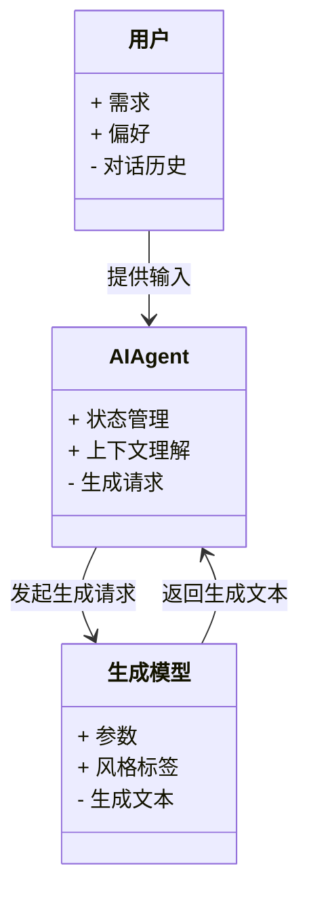
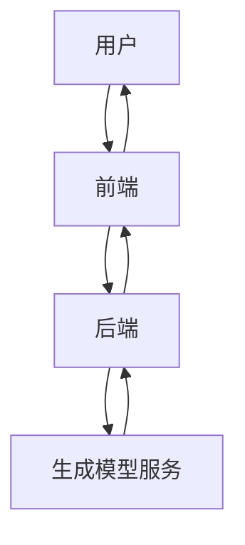
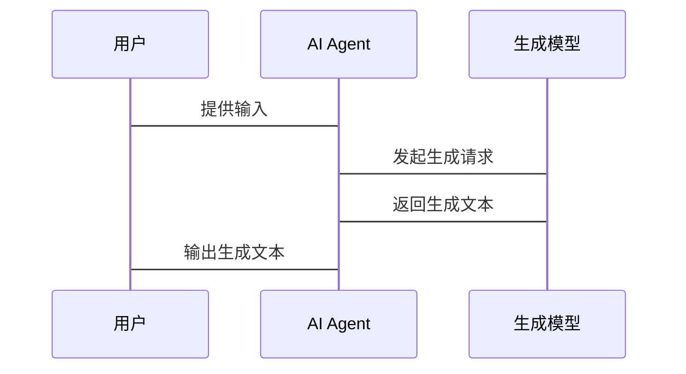

                 


# LLM在AI Agent中的文本风格个性化定制

> 关键词：LLM, AI Agent, 文本风格个性化, 自然语言处理, 人工智能, 定制化生成

> 摘要：本文详细探讨了如何在AI Agent中利用大型语言模型（LLM）实现文本风格的个性化定制。通过分析背景、核心概念、算法原理、系统设计、项目实战等多方面内容，本文为读者提供了一套完整的解决方案，帮助AI Agent更好地满足用户的个性化需求。文章还提供了具体的实现代码和案例分析，帮助读者深入理解技术细节。

---

## 第1章: 背景介绍

### 1.1 问题背景

#### 1.1.1 当前AI Agent的发展现状
AI Agent（人工智能代理）是一种能够自主感知环境、执行任务并与用户交互的智能系统。随着自然语言处理技术的快速发展，AI Agent在各个领域得到了广泛应用，例如智能客服、虚拟助手和内容生成工具。

#### 1.1.2 LLM在AI Agent中的应用痛点
尽管LLM（大型语言模型）在文本生成方面表现出色，但在AI Agent中的应用还存在一些问题。例如，模型生成的文本风格单一，无法满足用户的个性化需求。此外，如何根据上下文调整生成的文本风格也是一个技术难点。

#### 1.1.3 文本风格个性化的重要性
文本风格个性化是提升AI Agent用户体验的关键。通过定制化生成不同风格的文本，AI Agent可以更好地适应不同用户的需求，例如正式的商务沟通、轻松的朋友聊天或专业的技术文档撰写。

### 1.2 问题描述

#### 1.2.1 LLM与AI Agent的结合方式
LLM可以作为AI Agent的核心组件，负责生成文本内容。AI Agent通过理解用户需求和上下文，调用LLM生成符合要求的文本。

#### 1.2.2 文本风格个性化的核心问题
文本风格个性化的核心问题在于如何根据用户偏好和上下文动态调整生成文本的风格。这需要结合用户输入、历史对话记录和模型参数进行综合调整。

#### 1.2.3 个性化定制的实现挑战
实现文本风格个性化需要解决以下问题：如何训练模型支持多种风格生成、如何根据用户输入动态调整风格、如何评估生成文本的风格匹配度。

### 1.3 问题解决

#### 1.3.1 LLM的文本生成能力
LLM通过预训练掌握了大量文本数据，能够生成高质量的文本内容。通过微调和参数调整，可以使其生成特定风格的文本。

#### 1.3.2 AI Agent的交互需求
AI Agent需要根据用户输入生成多样化的文本，同时保持对话的连贯性和一致性。文本风格个性化是实现这一目标的关键。

#### 1.3.3 文本风格个性化的方法论
文本风格个性化可以通过以下步骤实现：首先分析用户需求和上下文，然后选择合适的生成模型或参数，最后生成并输出文本。

### 1.4 边界与外延

#### 1.4.1 LLM在AI Agent中的应用边界
LLM在AI Agent中的应用主要集中在文本生成和交互设计方面。目前还无法完全替代人类在复杂决策和创造性思维中的作用。

#### 1.4.2 文本风格个性化定制的适用场景
文本风格个性化适用于多种场景，例如客服沟通、内容创作、教育辅助等。不同场景需要生成不同风格的文本。

#### 1.4.3 相关技术的对比与区分
与文本风格个性化相关的技术包括文本分类、文本摘要、文本生成等。本文主要关注生成过程中的风格控制。

### 1.5 概念结构与核心要素组成

#### 1.5.1 核心概念的层次结构
文本风格个性化的核心概念包括用户需求、文本风格、生成模型、上下文理解等。

#### 1.5.2 核心要素的详细说明
- 用户需求：用户的意图和偏好。
- 文本风格：生成文本的语气、用词习惯等。
- 生成模型：负责生成文本的模型。
- 上下文理解：模型对对话历史的理解能力。

#### 1.5.3 概念之间的关系与依赖
用户需求和上下文理解是生成文本风格的基础，生成模型是实现个性化的核心工具。

---

## 第2章: 核心概念与联系

### 2.1 LLM的核心原理

#### 2.1.1 大型语言模型的基本原理
LLM通过预训练掌握了大量语言数据，能够生成连贯的文本内容。其核心是基于Transformer的架构，包括编码器和解码器。

#### 2.1.2 LLM的训练机制
LLM的训练过程包括数据预处理、模型初始化、正向传播、反向传播和参数优化等步骤。

#### 2.1.3 LLM的文本生成过程
文本生成过程包括输入处理、编码、解码和输出生成。生成时可以根据不同风格调整模型参数。

### 2.2 AI Agent的定义与功能

#### 2.2.1 AI Agent的基本概念
AI Agent是一种智能代理，能够自主感知环境、执行任务并与用户交互。

#### 2.2.2 AI Agent的核心功能
AI Agent的核心功能包括信息获取、决策制定和任务执行。文本生成是其重要的功能之一。

#### 2.2.3 AI Agent的交互方式
AI Agent可以通过自然语言理解（NLU）和自然语言生成（NLG）实现与用户的交互。文本风格个性化是NLG的重要组成部分。

### 2.3 文本风格个性化的核心要素

#### 2.3.1 文本风格的分类与特点
文本风格可以分为正式、口语化、专业、幽默等多种类型，每种风格都有其独特的语言特征。

#### 2.3.2 个性化定制的关键因素
个性化定制的关键因素包括用户偏好、对话历史和生成模型的参数设置。

#### 2.3.3 文本风格与用户需求的关系
文本风格与用户需求密切相关。例如，商务沟通需要正式风格，朋友聊天需要口语化风格。

---

## 第3章: 核心概念原理

### 3.1 LLM的核心算法原理

#### 3.1.1 变压器模型的结构
LLM基于Transformer架构，包括编码器和解码器。编码器负责理解输入，解码器负责生成输出。

#### 3.1.2 注意力机制的作用
注意力机制帮助模型关注输入中的重要部分，提高生成文本的相关性。

#### 3.1.3 梯度下降优化过程
通过梯度下降优化算法，模型不断调整参数以最小化生成文本的损失。

### 3.2 AI Agent的交互流程

#### 3.2.1 用户输入的处理
AI Agent首先接收用户的输入，通过NLU技术理解用户的需求。

#### 3.2.2 状态管理与上下文理解
AI Agent需要管理对话状态，理解上下文信息，以保持对话的连贯性。

#### 3.2.3 行为决策与输出生成
根据理解的需求，AI Agent决策生成文本的内容和风格，并调用LLM生成文本。

### 3.3 文本风格个性化的核心算法

#### 3.3.1 风格分类模型的构建
通过训练数据，构建风格分类模型，识别文本的风格特征。

#### 3.3.2 风格迁移的实现方法
风格迁移可以通过调整生成模型的参数或使用风格标签来实现。

#### 3.3.3 风格匹配的优化策略
通过不断优化模型参数，提高生成文本与目标风格的匹配度。

---

## 第4章: 算法原理讲解

### 4.1 LLM的训练过程

#### 4.1.1 数据预处理与特征提取
对训练数据进行清洗、分词和特征提取，为模型训练做好准备。

#### 4.1.2 模型训练的数学公式
模型训练的目标是最小化生成文本的损失，数学公式为：
$$ \text{Loss} = -\sum_{i=1}^{n} \log p(y_i|x_i) $$

#### 4.1.3 优化算法的实现细节
使用Adam优化算法，调整学习率和动量参数，优化模型参数。

### 4.2 AI Agent的交互流程

#### 4.2.1 用户输入的处理
AI Agent接收用户的输入，通过分词和词性标注进行预处理。

#### 4.2.2 状态管理与上下文理解
通过维护对话历史和状态变量，AI Agent理解上下文信息。

#### 4.2.3 行为决策与输出生成
根据理解的需求，AI Agent调用LLM生成符合风格的文本。

### 4.3 文本风格个性化的核心算法

#### 4.3.1 风格分类模型的构建
通过训练风格分类模型，识别文本的风格特征。

#### 4.3.2 风格迁移的实现方法
通过调整生成模型的参数或使用风格标签，实现风格迁移。

#### 4.3.3 风格匹配的优化策略
通过不断优化模型参数，提高生成文本与目标风格的匹配度。

---

## 第5章: 系统分析与架构设计

### 5.1 问题场景介绍

#### 5.1.1 问题场景描述
本文针对AI Agent中的文本风格个性化问题，提出了一种基于LLM的解决方案。

#### 5.1.2 项目介绍
本项目旨在实现AI Agent中文本风格的个性化定制，提升用户体验。

### 5.2 系统功能设计

#### 5.2.1 领域模型设计
通过Mermaid类图展示系统的领域模型，包括用户、AI Agent、生成模型等实体及其关系。



#### 5.2.2 系统架构设计
通过Mermaid架构图展示系统的整体架构，包括前端、后端和模型服务。



### 5.3 系统接口设计

#### 5.3.1 系统接口设计
系统主要接口包括用户输入接口、生成模型调用接口和文本输出接口。

#### 5.3.2 系统交互流程
通过Mermaid序列图展示系统的交互流程。



---

## 第6章: 项目实战

### 6.1 环境安装

#### 6.1.1 安装Python
安装Python 3.8或更高版本。

#### 6.1.2 安装依赖
安装必要的Python库，例如`transformers`和`torch`。

#### 6.1.3 安装工具
安装Jupyter Notebook或其他开发工具。

### 6.2 系统核心实现

#### 6.2.1 生成模型的实现
使用预训练的LLM模型，例如GPT-3，进行文本生成。

#### 6.2.2 文本风格个性化的实现
通过调整模型参数或使用风格标签，实现文本风格个性化。

#### 6.2.3 交互系统的实现
实现AI Agent的交互功能，包括接收用户输入、调用生成模型和输出生成文本。

### 6.3 代码实现

#### 6.3.1 安装依赖
运行以下命令安装依赖：
```bash
pip install transformers torch
```

#### 6.3.2 实现生成模型
代码示例：
```python
from transformers import GPT2LMHeadModel, GPT2Tokenizer

tokenizer = GPT2Tokenizer.from_pretrained('gpt2')
model = GPT2LMHeadModel.from_pretrained('gpt2')
```

#### 6.3.3 实现文本风格个性化
通过调整生成参数实现不同风格的文本生成：
```python
def generate_text(prompt, temperature=1.0, top_k=50):
    inputs = tokenizer.encode(prompt, return_tensors='pt')
    outputs = model.generate(inputs, temperature=temperature, top_k=top_k)
    return tokenizer.decode(outputs[0], skip_special_tokens=True)
```

### 6.4 案例分析与详细讲解

#### 6.4.1 案例分析
通过具体案例分析，展示如何实现文本风格个性化。

#### 6.4.2 代码应用解读
解读代码实现，说明每一步的作用和原理。

---

## 第7章: 最佳实践、小结与扩展阅读

### 7.1 最佳实践

#### 7.1.1 实践建议
- 定期更新模型参数，保持生成文本的风格多样性。
- 根据用户反馈调整生成策略，提升用户体验。

#### 7.1.2 注意事项
- 注意模型的计算资源消耗，优化生成效率。
- 保护用户隐私，避免数据泄露。

### 7.2 小结

本文详细探讨了如何在AI Agent中实现文本风格个性化定制。通过分析背景、核心概念、算法原理、系统设计和项目实战，本文为读者提供了一套完整的解决方案。未来，随着技术的发展，文本风格个性化将在更多领域得到应用。

### 7.3 扩展阅读

#### 7.3.1 相关论文
- [文本风格迁移的最新研究](https://arxiv.org/abs/1912.04949)
- [LLM在个性化生成中的应用](https://arxiv.org/abs/2003.02405)

#### 7.3.2 技术博客
- [AI Agent中的文本生成](https://towardsdatascience.com/text-generation-in-ai-agents)
- [个性化生成的技术实现](https://medium.com/...)

---

## 作者

作者：AI天才研究院/AI Genius Institute & 禅与计算机程序设计艺术/Zen And The Art of Computer Programming

