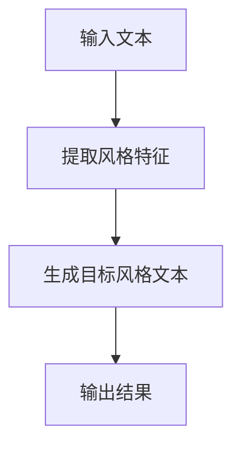

                 


# LLM在AI Agent中的文本风格保持与转换

> 关键词：LLM，AI Agent，文本风格保持，文本风格转换，自然语言处理，大语言模型

> 摘要：本文深入探讨了在AI Agent中利用LLM（大语言模型）进行文本风格保持与转换的技术细节。文章从问题背景、核心概念、算法原理、系统架构设计到项目实战，全面分析了如何在AI Agent中实现文本风格的智能化保持与转换。通过详细的技术分析和实际案例，本文为读者提供了理论与实践相结合的深度解析。

---

# 第一部分: LLM在AI Agent中的文本风格保持与转换概述

## 第1章: 问题背景与核心概念

### 1.1 问题背景

#### 1.1.1 文本风格保持与转换的定义
文本风格保持是指在AI Agent与用户交互过程中，保持生成文本的语气、风格和语境与输入文本一致的过程。文本风格转换则是指将输入文本的风格从一种形式转换为另一种形式（如从正式到口语化）。

#### 1.1.2 AI Agent中的文本交互需求
AI Agent需要与用户进行自然的对话交互，生成符合用户期望的文本。为了提高用户体验，AI Agent需要能够根据上下文和用户偏好，动态调整生成文本的风格。

#### 1.1.3 当前存在的主要问题与挑战
- 文本风格保持的准确性问题。
- 文本风格转换的可控制性问题。
- 如何在不同场景中灵活切换风格。
- 如何平衡生成文本的多样性和风格一致性。

### 1.2 核心概念与联系

#### 1.2.1 LLM与文本风格的关系
LLM（大语言模型）通过其强大的语言建模能力，可以学习和模仿不同风格的文本，从而实现风格保持与转换。

#### 1.2.2 文本风格保持与转换的核心要素
- **输入文本**：用户输入的原始文本或风格描述。
- **风格特征提取**：从输入文本中提取风格特征。
- **风格转换模型**：将输入文本的风格特征转换为目标风格特征。
- **文本生成**：基于目标风格特征生成新的文本。

#### 1.2.3 概念属性特征对比表
| 概念      | 特征                 |
|-----------|----------------------|
| 输入文本  | 文本内容、语气、风格   |
| 风格特征   | 语气、用词习惯、句式结构 |
| 转换目标  | 目标风格特征          |

#### 1.2.4 ER实体关系图
```mermaid
er
actor: 用户
agent: AI Agent
text_style: 文本风格
conversion_rule: 转换规则
```

---

## 第2章: LLM与文本风格保持的原理

### 2.1 LLM的基本原理

#### 2.1.1 大语言模型的训练机制
大语言模型通过监督学习和无监督学习相结合的方式，从海量文本数据中学习语言模式和语义信息。

#### 2.1.2 模型的文本生成能力
基于Transformer架构的LLM（如GPT系列）可以通过条件生成的方式，根据输入文本生成符合上下文的后续文本。

#### 2.1.3 模型的风格适应能力
模型通过微调或提示工程技术，可以适应不同的文本风格和语境。

### 2.2 文本风格保持的算法原理

#### 2.2.1 风格保持的数学模型
文本风格保持可以通过条件生成模型来实现，其数学模型如下：
$$ P(y|x) = \text{模型在给定输入x的条件下生成y的概率} $$

#### 2.2.2 风格保持的实现流程


#### 2.2.3 风格保持的算法优化
通过引入风格向量或风格标记，可以对模型进行优化，使其更专注于特定风格的生成。

---

## 第3章: 文本风格转换的算法原理

### 3.1 文本风格转换的定义

#### 3.1.1 风格转换的实现目标
将输入文本的风格转换为目标风格，例如将正式风格的文本转换为口语化的文本。

#### 3.1.2 风格转换的关键技术
- 基于LLM的风格转换
- 风格标记与分类
- 文本生成控制技术

#### 3.1.3 风格转换的实现步骤


### 3.2 文本风格转换的数学模型

#### 3.2.1 风格转换的数学公式
$$ y = f(x, s) $$
其中，x是输入文本，s是目标风格，f是风格转换函数。

#### 3.2.2 风格转换的优化方法
通过引入风格向量或注意力机制，可以优化风格转换的效果。

#### 3.2.3 风格转换的实现代码
```python
def style_transfer(input_text, target_style):
    # 提取输入文本的风格特征
    input_features = extract_style_features(input_text)
    # 生成目标风格的文本
    output_text = generate_text(input_features, target_style)
    return output_text
```

---

# 第四部分: 项目实战与实现

## 第7章: 项目实战

### 7.1 环境安装与配置

#### 7.1.1 开发环境搭建
安装Python、TensorFlow、Keras等必要的开发工具和库。

#### 7.1.2 环境配置
设置虚拟环境，并安装项目所需的依赖包。

---

## 第8章: 项目实现

### 8.1 核心代码实现

#### 8.1.1 风格特征提取
```python
def extract_style_features(text):
    # 使用预训练模型提取风格特征
    model = load_model('style_model.h5')
    features = model.predict(text)
    return features
```

#### 8.1.2 风格保持与转换
```python
def keep_style(text):
    # 保持输入文本的风格
    features = extract_style_features(text)
    output = generate_text(features)
    return output

def convert_style(text, target_style):
    # 将输入文本转换为目标风格
    features = extract_style_features(text)
    output = generate_text(features, target_style)
    return output
```

---

## 第9章: 案例分析

### 9.1 实际案例分析

#### 9.1.1 案例一：风格保持
输入文本：正式风格的商务邮件。
输出文本：保持正式风格，但内容更简洁。

#### 9.1.2 案例二：风格转换
输入文本：口语化的对话。
输出文本：转换为正式的书面语。

---

## 第10章: 项目小结

### 10.1 最佳实践
- 在实际应用中，需要根据具体需求选择合适的风格转换策略。
- 定期更新模型以适应新的文本风格和语言变化。

### 10.2 小结
通过本文的分析与实践，我们可以看到，LLM在AI Agent中的文本风格保持与转换具有广阔的应用前景。结合先进的算法和技术，可以实现高效、智能的文本风格管理。

### 10.3 注意事项
- 避免过度依赖单一算法，建议结合多种技术手段。
- 在实际应用中，需注意数据隐私和模型的泛化能力。

### 10.4 拓展阅读
建议读者进一步阅读以下内容：
- 基于Transformer的文本生成模型
- 风格转换的前沿研究
- 多模态AI Agent的设计与实现

---

# 作者：AI天才研究院/AI Genius Institute & 禅与计算机程序设计艺术 /Zen And The Art of Computer Programming

