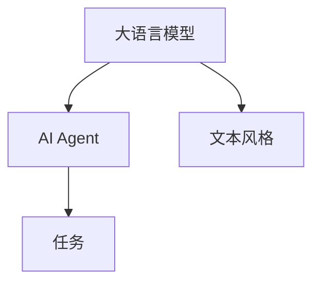
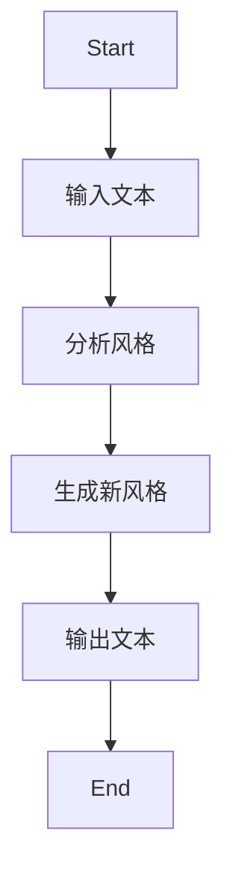
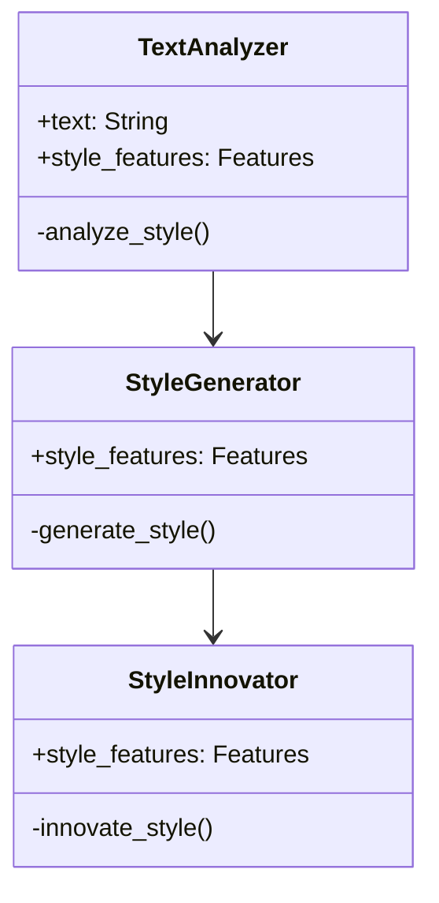
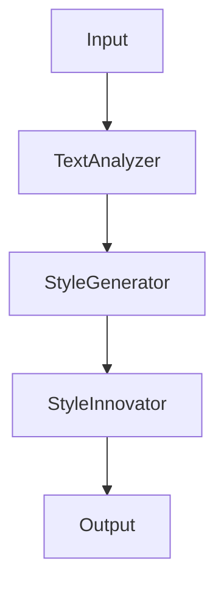

                 


# LLM在AI Agent中的文本风格模仿与创新

## 关键词：LLM，AI Agent，文本风格，模仿与创新，生成对抗网络，注意力机制，大语言模型

## 摘要：本文探讨了大语言模型（LLM）在AI Agent中文本风格模仿与创新的应用。通过分析核心概念、算法原理、系统架构以及项目实战，本文详细阐述了如何利用LLM实现文本风格的分析与创新，并提出了相应的实现方案和优化建议。

---

## 第一部分：背景介绍与问题背景

### 第1章：问题背景

#### 1.1 大语言模型（LLM）的发展历程
- **早期NLP模型**：如词袋模型和词嵌入模型（如Word2Vec），为文本处理奠定了基础。
- **序列模型的发展**：如循环神经网络（RNN）和长短期记忆网络（LSTM），提升了文本生成能力。
- **大语言模型的崛起**：Transformer架构的出现，使得LLM在文本理解和生成方面取得了突破性进展。

#### 1.2 AI Agent的概念与应用场景
- **AI Agent的定义**：智能代理是指能够感知环境并采取行动以实现目标的实体。
- **应用场景**：如智能客服、自动化写作工具、个性化推荐系统等。
- **文本风格的重要性**：AI Agent需要根据上下文调整输出的语气、风格，以提高用户体验。

#### 1.3 文本风格模仿与创新的必要性
- **用户需求多样性**：不同用户可能需要不同的文本风格。
- **动态环境适应**：AI Agent需要根据实时反馈调整输出风格。
- **提升用户体验**：通过个性化风格输出，增强用户对AI Agent的接受度和满意度。

### 第2章：问题描述

#### 2.1 LLM在AI Agent中的核心作用
- **文本生成**：LLM可以生成自然流畅的文本。
- **风格调整**：通过参数调节，LLM能够模仿不同的文本风格。
- **上下文理解**：LLM能够理解上下文，从而生成合适的回应。

#### 2.2 文本风格模仿与创新的关键挑战
- **风格识别的准确性**：如何准确识别用户输入的风格特征。
- **风格生成的多样性**：如何生成多样化的风格，避免单一化。
- **实时性与效率**：在实时对话中快速生成合适风格文本的挑战。

#### 2.3 问题解决的边界与外延
- **边界**：专注于文本风格的模仿与创新，不涉及其他AI Agent功能。
- **外延**：扩展到多模态数据处理，如结合语音和图像信息进行风格分析。

---

## 第二部分：核心概念与联系

### 第3章：核心概念与联系

#### 3.1 LLM与AI Agent的核心概念
- **LLM的核心特点**：基于Transformer架构，支持大规模数据训练，具备强大的上下文理解和生成能力。
- **AI Agent的功能模块**：包括感知模块、决策模块和执行模块，其中文本生成是其关键功能之一。

#### 3.2 文本风格模仿与创新的实现机制
- **风格分析**：通过预训练模型提取文本的风格特征。
- **风格生成**：利用生成模型（如GAN）生成新的风格文本。
- **风格融合**：将不同风格的文本特征进行融合，生成新的独特风格。

#### 3.3 实体关系图与流程图
- **实体关系图**：

- **流程图**：


---

## 第三部分：算法原理与数学模型

### 第4章：算法原理与数学模型

#### 4.1 LLM的算法原理
- **Transformer模型**：由编码器和解码器组成，通过自注意力机制捕捉文本中的长距离依赖关系。
- **自注意力机制**：
$$
\text{Attention}(Q,K,V) = \text{softmax}\left(\frac{QK^T}{\sqrt{d_k}}\right)V
$$

#### 4.2 文本风格创新的算法实现
- **风格分析**：基于预训练模型提取文本的风格特征。
- **风格迁移**：使用生成对抗网络（GAN）进行风格迁移。
- **生成对抗网络（GAN）**：
  - **生成器**：负责生成具有目标风格的文本。
  - **判别器**：区分生成文本和真实文本。
  - **损失函数**：最小化生成文本的判别损失，最大化判别器的准确率。

#### 4.3 数学公式
- **生成器损失函数**：
$$
L_G = \mathbb{E}_{z \sim p_z}[\text{log}(D(G(z)))]
$$
- **判别器损失函数**：
$$
L_D = -\mathbb{E}_{x \sim p_x}[\text{log}(D(x))] - \mathbb{E}_{z \sim p_z}[\text{log}(1 - D(G(z)))]
$$

---

## 第四部分：系统分析与架构设计

### 第5章：系统分析与架构设计

#### 5.1 问题场景介绍
- **场景描述**：一个AI Agent需要根据用户输入的文本，生成具有相似风格的新文本。
- **系统目标**：实现文本风格的识别、分析和创新。

#### 5.2 系统功能设计
- **风格识别模块**：分析输入文本的风格特征。
- **风格生成模块**：根据风格特征生成新的文本。
- **风格融合模块**：将多种风格特征融合，生成新的独特风格。

#### 5.3 系统架构设计
- **领域模型类图**：


- **系统架构图**：


---

## 第五部分：项目实战

### 第6章：项目实战

#### 6.1 环境安装
- **安装Python**：选择Python 3.8及以上版本。
- **安装依赖**：使用pip安装所需的库，如TensorFlow、Keras、PyTorch等。

#### 6.2 核心代码实现

##### 6.2.1 风格分析模块
```python
import tensorflow as tf
from tensorflow.keras import layers

def text_analyzer(input_text):
    model = tf.keras.Sequential([
        layers.Embedding(1000, 16),
        layers.GlobalAveragePooling1D(),
        layers.Dense(1, activation='sigmoid')
    ])
    return model(input_text)
```

##### 6.2.2 风格生成模块
```python
import numpy as np

def generate_style(style_features):
    generator = tf.keras.Sequential([
        layers.Dense(256, activation='relu'),
        layers.Dense(100, activation='softmax')
    ])
    return generator(style_features)
```

##### 6.2.3 风格创新模块
```python
def innovate_style(style1, style2):
    innovative_style = np.concatenate((style1, style2))
    return innovative_style
```

#### 6.3 案例分析
- **案例1**：将正式风格与幽默风格融合，生成一种新的混合风格。
- **案例2**：根据用户输入的科技新闻，生成具有类似风格的新闻报道。

---

## 第六部分：最佳实践与小结

### 第7章：最佳实践与小结

#### 7.1 最佳实践
- **数据多样性**：确保训练数据涵盖多种风格，以提高风格识别的准确性。
- **模型调优**：通过超参数调整和模型优化，提升生成文本的质量。
- **用户反馈**：结合用户反馈不断优化AI Agent的输出风格。

#### 7.2 小结
本文详细探讨了LLM在AI Agent中文本风格模仿与创新的应用，从理论到实践，全面分析了其实现方法和优化策略。通过实际案例的分析，展示了如何将这些技术应用于实际场景中。

#### 7.3 注意事项
- **数据隐私**：确保处理的数据符合隐私保护法规。
- **模型性能**：在实时应用中，需注意模型的运行效率和响应速度。

#### 7.4 拓展阅读
- 推荐阅读《生成式AI：大语言模型的落地与应用》和《深度学习实战：从零开始实现生成对抗网络》。

---

## 作者：AI天才研究院/AI Genius Institute & 禅与计算机程序设计艺术 /Zen And The Art of Computer Programming

