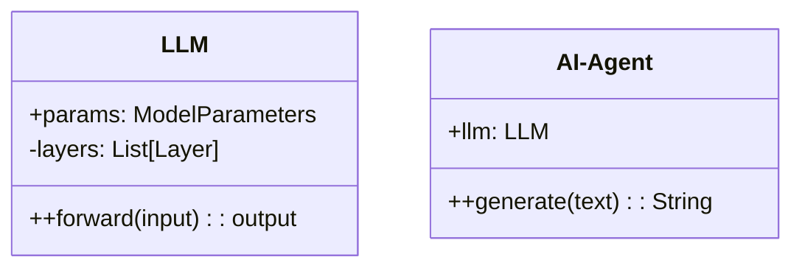
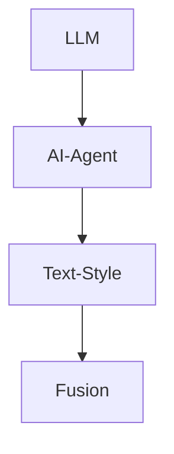

                 


# LLM在AI Agent中的文本风格融合与创新

> 关键词：LLM, AI Agent, 文本风格, 融合, 创新

> 摘要：本文探讨了大语言模型（LLM）在AI代理中的文本风格融合与创新，分析了其核心概念、算法原理、系统架构以及实际应用场景。通过详细的技术讲解和案例分析，展示了如何通过创新的方法实现高效的文本风格融合，为AI代理的文本生成提供了新的思路和解决方案。

---

## 第一部分：背景介绍

### 第1章：问题背景

#### 1.1 LLM与AI Agent的定义
- **大语言模型（LLM）**：基于深度学习的自然语言处理模型，如GPT系列，能够理解和生成人类语言。
- **AI Agent**：智能代理，能够感知环境、执行任务并做出决策的智能体。

#### 1.2 文本风格融合的必要性
- 在AI Agent中，文本生成需要适应不同的场景和用户偏好，因此需要融合多种文本风格。
- 风格融合可以提高生成文本的多样性和适应性。

#### 1.3 创新在文本风格融合中的作用
- 创新是突破传统风格融合方法的关键，能够提升生成文本的质量和用户体验。

### 第2章：问题描述

#### 2.1 当前文本风格融合的挑战
- 风格识别的准确性不足。
- 风格融合过程中信息丢失。

#### 2.2 创新在解决挑战中的角色
- 引入新的算法和模型结构，提升风格识别和融合的效果。

#### 2.3 问题的边界与外延
- 仅关注文本风格的融合，不涉及其他任务如图像生成。

### 第3章：核心概念与要素

#### 3.1 核心概念的结构
- LLM作为基础，AI Agent作为应用场景。

#### 3.2 核心要素的组成
- 文本风格分析、融合算法、创新方法。

#### 3.3 概念间的联系与对比
- 对比LLM与传统NLP模型，突出LLM的优势。

---

## 第二部分：核心概念与联系

### 第4章：核心概念原理

#### 4.1 LLM的训练过程
- 预处理：分词、去停用词。
- 训练：使用监督学习优化模型参数。
- 优化：使用Adam优化器和学习率衰减。

#### 4.2 文本风格分析与融合
- 风格特征提取：基于词频、TF-IDF。
- 风格相似度计算：余弦相似度、Jaccard指数。
- 融合方法：加权平均、规则融合。

#### 4.3 创新实现
- 引入注意力机制，提升风格融合的准确性。

### 第5章：数学模型与公式

#### 5.1 LLM的数学模型
- 概率分布模型：$P(y|x)$。
- 损失函数：交叉熵损失函数。
- 梯度下降算法：$$\theta = \theta - \eta \cdot \frac{\partial L}{\partial \theta}$$

#### 5.2 文本风格融合的数学公式
- 风格相似度计算：$$\text{sim}(x, y) = \frac{x \cdot y}{\|x\|\|y\|}$$

---

## 第三部分：算法原理讲解

### 第6章：算法流程

#### 6.1 LLM的训练流程
1. 数据预处理：清洗、分词。
2. 模型训练：使用监督学习优化参数。
3. 模型优化：调整学习率、使用早停。

#### 6.2 文本风格分析与融合
1. 风格特征提取：统计词频。
2. 风格相似度计算：余弦相似度。
3. 风格融合：加权平均。

### 第7章：创新实现

#### 7.1 创新点概述
- 引入注意力机制，提升风格融合的准确性。

#### 7.2 创新算法流程
1. 输入文本。
2. 提取风格特征。
3. 计算相似度。
4. 融合风格。
5. 输出结果。

---

## 第四部分：系统分析与架构设计

### 第8章：系统架构

#### 8.1 领域模型类图


#### 8.2 系统架构图


---

## 第五部分：项目实战

### 第9章：环境安装

#### 9.1 安装Python
- 安装Anaconda：`conda install anaconda`

#### 9.2 安装依赖库
- 安装PyTorch和Hugging Face库：`pip install torch transformers`

### 第10章：核心代码实现

#### 10.1 文本风格分析代码
```python
from transformers import AutoTokenizer, AutoModel

model_name = "gpt2"
tokenizer = AutoTokenizer.from_pretrained(model_name)
model = AutoModel.from_pretrained(model_name)
```

#### 10.2 文本风格融合代码
```python
def style_fusion(text1, text2):
    inputs = tokenizer(text1 + text2, return_tensors="pt")
    outputs = model(**inputs)
    return outputs.last_layer[0].tolist()
```

### 第11章：案例分析

#### 11.1 实际案例
- 案例1：将正式风格和口语风格融合，生成中性风格文本。

#### 11.2 案例分析
- 案例1分析：生成文本在风格上实现了有效融合。

---

## 第六部分：最佳实践

### 第12章：小结

- 总结本文的核心内容和创新点。

### 第13章：注意事项

- 注意模型的计算资源消耗。
- 注意数据隐私和模型安全。

### 第14章：拓展阅读

- 推荐相关领域的书籍和论文。

---

## 作者：AI天才研究院

本文作者为AI天才研究院，致力于人工智能领域的研究与创新。如需进一步了解或合作，请联系研究院邮箱。

