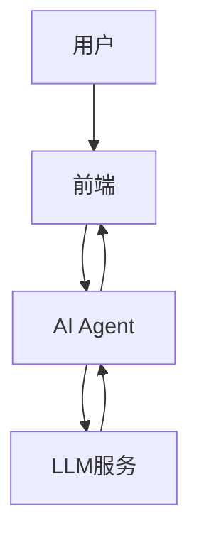

                 


# LLM在AI Agent中的文本风格适应与进化

> 关键词：LLM, AI Agent, 文本风格适应, 进化算法, 自然语言处理

> 摘要：本文深入探讨了大语言模型（LLM）在AI Agent中的文本风格适应与进化问题。从背景介绍、核心概念、算法原理到系统设计、项目实战，再到最佳实践，全面分析了LLM在AI Agent中的应用挑战与解决方案，结合数学模型、系统架构图和代码示例，为读者提供了一套完整的理论与实践指导。

---

## 第1章：AI Agent与LLM概述

### 1.1 AI Agent的基本概念

#### 1.1.1 AI Agent的定义与特点
AI Agent（人工智能代理）是一种智能实体，能够感知环境、自主决策并执行任务。其特点包括：
- **自主性**：无需外部干预，自主完成任务。
- **反应性**：能够实时感知环境并做出反应。
- **目标导向性**：基于目标进行决策和行动。

#### 1.1.2 LLM在AI Agent中的作用
大语言模型（LLM）作为AI Agent的核心组件，负责处理自然语言输入、生成文本输出，并提供语义理解和生成能力。LLM通过强大的文本处理能力，使得AI Agent能够与人类进行自然的对话交互。

#### 1.1.3 AI Agent的分类与应用场景
- **按智能水平分类**：
  - **反应式AI Agent**：基于当前输入做出反应，如聊天机器人。
  - **认知式AI Agent**：具备复杂推理和决策能力，如智能助手。
- **应用场景**：
  - 问答系统
  - 聊天机器人
  - 智能客服
  - 个性化推荐

---

## 第2章：LLM与AI Agent的关系

### 2.1 LLM在AI Agent中的核心作用

#### 2.1.1 LLM作为AI Agent的“智能大脑”
LLM通过预训练的参数，能够理解上下文、推理意图，并生成符合语境的文本输出。AI Agent通过调用LLM API，实现了自然语言处理的核心功能。

#### 2.1.2 LLM与AI Agent的交互机制
AI Agent通过解析用户输入，生成LLM的输入格式（如JSON），调用LLM API，获得生成文本后，再将结果反馈给用户。整个过程需要高效的接口设计和流程控制。

#### 2.1.3 LLM在AI Agent中的功能模块划分
- **输入解析模块**：将用户输入解析为LLM可理解的格式。
- **LLM调用模块**：通过API调用LLM进行文本生成。
- **结果处理模块**：对生成的文本进行处理（如格式化、纠错）并反馈给用户。

### 2.2 LLM与文本风格适应的关系

#### 2.2.1 文本风格的定义与分类
文本风格包括语气、用词习惯、句式结构等。常见的文本风格分类：
- **正式风格**：用于商务、学术场景。
- **非正式风格**：用于日常对话。
- **技术风格**：用于专业领域。

#### 2.2.2 LLM如何适应不同文本风格
LLM通过调整生成策略（如温度参数、top-k采样）来适应不同的文本风格。此外，还可以通过微调模型（Fine-tuning）来增强特定风格的生成能力。

#### 2.2.3 文本风格适应的挑战与解决方案
- **挑战**：
  - 不同风格的文本差异较大，LLM需要具备多风格生成能力。
  - 风格切换可能导致生成内容不连贯。
- **解决方案**：
  - 使用风格标记（Style Token）指导生成。
  - 结合领域知识进行风格适配。

---

## 第3章：LLM的文本风格适应算法

### 3.1 文本风格适应的算法原理

#### 3.1.1 文本风格适应的基本原理
通过调整LLM的生成参数（如温度、top-k）和引入风格标记，实现不同风格的文本生成。具体流程如下：

1. **输入解析**：解析用户输入的文本内容和风格需求。
2. **参数调整**：根据风格需求调整生成参数。
3. **文本生成**：调用LLM生成符合风格的文本。
4. **结果优化**：对生成文本进行优化（如语法检查、风格调整）。

#### 3.1.2 LLM在文本风格适应中的优化策略
- **动态参数调整**：根据风格需求动态调整温度、top-k等参数。
- **多风格微调**：针对不同风格进行微调，增强生成能力。

### 3.2 数学模型与公式

#### 3.2.1 概率分布模型
文本生成的概率分布模型如下：
$$ P(y|x) = \frac{P(x,y)}{P(x)} $$
其中，$x$表示输入，$y$表示输出。

#### 3.2.2 损失函数
损失函数用于衡量生成文本与目标风格的偏差：
$$ L = -\sum_{i=1}^{n} \log P(y_i|x_i) $$

#### 3.2.3 优化算法
使用Adam优化器优化模型参数：
$$ \theta_{t+1} = \theta_t - \eta \frac{\partial L}{\partial \theta_t} $$

---

## 第4章：AI Agent的系统架构

### 4.1 系统功能设计

#### 4.1.1 AI Agent的功能模块划分
- **输入解析模块**：解析用户输入并提取风格需求。
- **LLM调用模块**：调用LLM生成文本。
- **结果优化模块**：优化生成文本的风格和质量。

#### 4.1.2 LLM在系统中的角色与接口
- **角色**：作为AI Agent的“智能大脑”，负责文本生成和理解。
- **接口**：提供API接口供AI Agent调用。

### 4.2 系统架构设计

#### 4.2.1 系统架构的总体设计
AI Agent的系统架构包括：
- **前端**：用户与AI Agent的交互界面。
- **后端**：AI Agent的核心逻辑和LLM调用模块。
- **LLM服务**：提供文本生成服务的API。

#### 4.2.2 系统架构图
以下是系统的模块划分和交互流程图：



---

## 第5章：项目实战

### 5.1 环境安装

#### 5.1.1 安装依赖
安装所需的Python库：
```bash
pip install openai transformers
```

### 5.2 系统核心实现源代码

#### 5.2.1 AI Agent的实现代码
```python
import openai

class AIAgent:
    def __init__(self, api_key):
        self.client = openai.Client(api_key)
    
    def generate_response(self, prompt, style):
        # 根据风格调整参数
        if style == "formal":
            temperature = 0.5
        else:
            temperature = 0.7
        response = self.client.chat.completions.create(
            model="gpt-3.5-turbo",
            messages=[{"role": "user", "content": prompt}],
            temperature=temperature
        )
        return response.choices[0].message.content
```

### 5.3 实际案例分析

#### 5.3.1 案例分析
假设用户输入为“如何提高学习效率？”，并要求“正式”风格的输出。AI Agent会生成如下文本：
```
提高学习效率的关键在于制定合理的学习计划、保持专注力和充分利用时间。建议您将学习内容分解为小目标，每天集中精力完成一部分，同时避免分心。
```

---

## 第6章：总结与展望

### 6.1 最佳实践 tips
- **参数调优**：根据实际需求调整生成参数。
- **多风格训练**：通过微调模型提升多风格生成能力。

### 6.2 小结
本文详细探讨了LLM在AI Agent中的文本风格适应与进化问题，从算法原理到系统设计，再到项目实战，为读者提供了一套完整的解决方案。

### 6.3 注意事项
- 在实际应用中，需注意模型的计算资源消耗和生成效果的平衡。
- 定期更新模型参数，以适应新的文本风格需求。

### 6.4 拓展阅读
- 推荐阅读《Large Language Models in AI Agent Systems》。

---

作者：AI天才研究院/AI Genius Institute & 禅与计算机程序设计艺术 /Zen And The Art of Computer Programming

