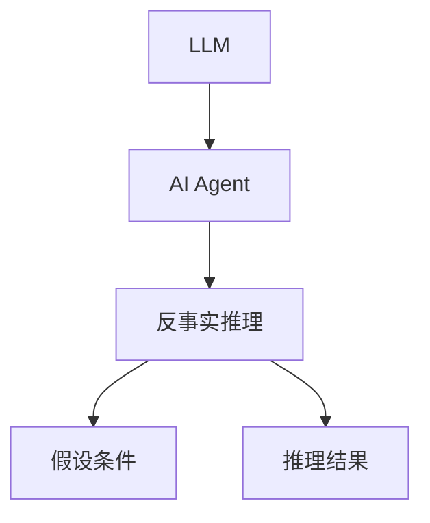
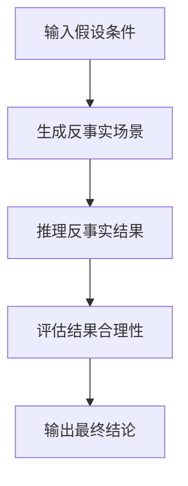
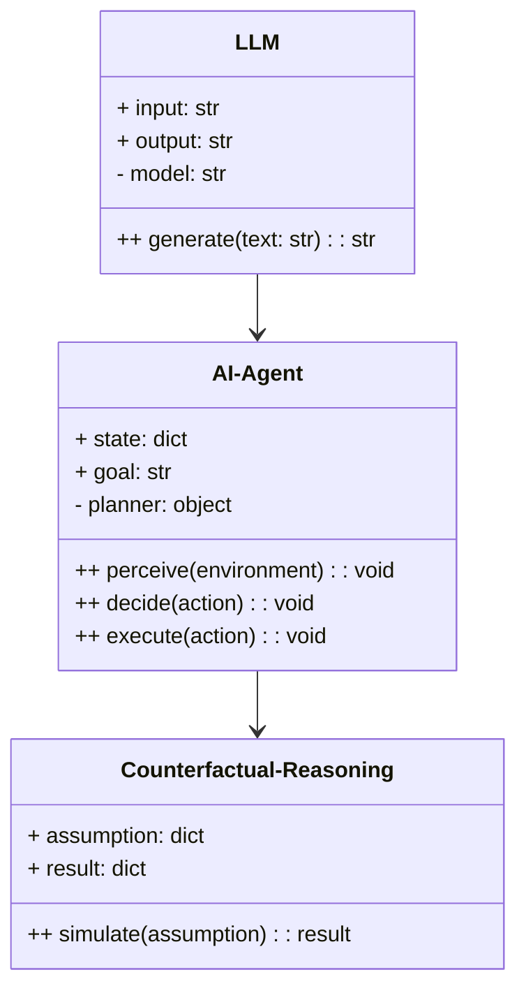
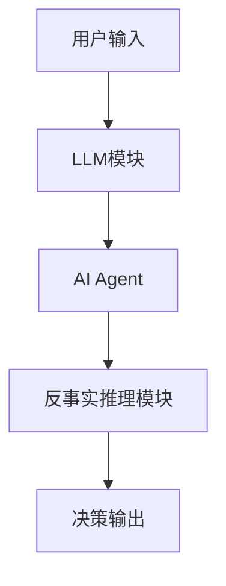
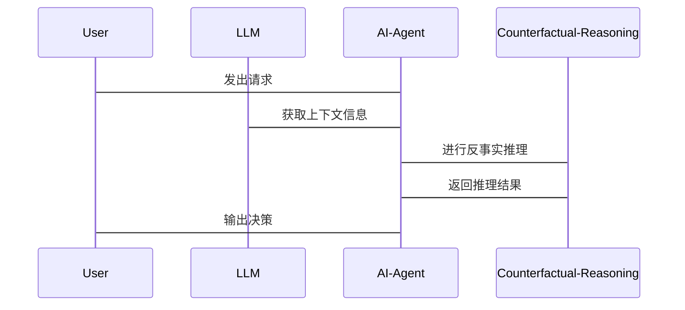

                 


# LLM在AI Agent反事实推理中的应用

> 关键词：LLM, AI Agent, 反事实推理, 语言模型, 人工智能, 系统设计, 算法原理

> 摘要：本文探讨了大语言模型（LLM）在AI Agent反事实推理中的应用，分析了反事实推理的核心概念、算法原理、系统架构及实际应用场景。文章通过详细的理论阐述和案例分析，展示了如何利用LLM增强AI Agent的推理能力，特别是在处理复杂决策问题时的潜力。文章还结合实际项目，详细讲解了系统设计、实现方法及优化技巧，为读者提供了全面的技术指南。

---

## 正文

### 第一部分: LLM与AI Agent反事实推理的背景介绍

#### 第1章: LLM与AI Agent的基本概念

##### 1.1 LLM的定义与特点
- **1.1.1 大语言模型的定义**  
  大语言模型（LLM）是一种基于深度学习的自然语言处理模型，通过训练大规模的文本数据，能够理解和生成人类语言。LLM的核心在于其强大的上下文理解和生成能力。

- **1.1.2 LLM的核心特点**  
  - **大规模数据训练**：LLM通常使用海量文本数据进行训练，具备广泛的知识覆盖能力。  
  - **生成能力**：LLM能够生成自然流畅的文本，适用于对话、翻译、摘要等多种任务。  
  - **可微调性**：LLM可以通过微调任务特定的数据，适应不同的应用场景。  

- **1.1.3 LLM与传统NLP模型的区别**  
  传统NLP模型通常针对特定任务（如机器翻译、情感分析）进行训练，而LLM通过一次训练即可处理多种任务，具有更强的通用性。

##### 1.2 AI Agent的基本概念
- **1.2.1 AI Agent的定义**  
  AI Agent是一种智能实体，能够感知环境、执行任务并做出决策。它可以是一个软件程序，也可以是一个物理设备，其目标是通过与环境的交互实现特定目标。  

- **1.2.2 AI Agent的分类与应用场景**  
  - **按智能水平分类**：  
    - **反应式AI Agent**：基于当前环境输入做出反应，适用于实时任务（如自动驾驶）。  
    - **认知式AI Agent**：具备推理、规划和学习能力，适用于复杂任务（如智能助手）。  
  - **应用场景**：  
    - **智能家居**：控制家庭设备，提供个性化服务。  
    - **医疗健康**：辅助医生诊断，提供健康建议。  
    - **金融投资**：分析市场数据，制定投资策略。  

- **1.2.3 AI Agent与人类决策者的对比**  
  AI Agent通过算法和数据驱动决策，而人类决策者则依赖经验和主观判断。AI Agent的优势在于快速处理大量数据，而人类的优势在于情感和情境的理解。

##### 1.3 反事实推理的定义与特点
- **1.3.1 反事实推理的定义**  
  反事实推理是指在假设与事实相反的情况下，推导出可能的结果或影响。它是一种逆向思维，用于探索“如果……会怎样？”的问题。  

- **1.3.2 反事实推理的核心要素**  
  - **假设条件**：明确的事实相反的假设。  
  - **推理过程**：基于假设条件，推导出可能的结果。  
  - **结果评估**：评估假设结果的合理性和可行性。  

- **1.3.3 反事实推理与事实推理的区别**  
  事实推理基于真实情况推导未来结果，而反事实推理则假设一个与事实相反的情境，探索其可能的影响。

##### 1.4 本章小结  
本章介绍了LLM、AI Agent和反事实推理的基本概念及其特点，为后续内容奠定了基础。

---

#### 第2章: LLM在AI Agent反事实推理中的应用背景

##### 2.1 当前AI Agent的发展现状
- **2.1.1 AI Agent在各领域的应用案例**  
  - **智能家居**：通过AI Agent实现设备的自动化控制。  
  - **智能客服**：利用AI Agent提供24/7的客户支持服务。  
  - **自动驾驶**：AI Agent负责车辆的环境感知和决策控制。  

- **2.1.2 当前AI Agent的主要技术瓶颈**  
  - **决策不确定性**：复杂环境下的决策准确性问题。  
  - **推理能力有限**：传统AI Agent在处理复杂推理任务时表现不佳。  
  - **可解释性不足**：AI Agent的决策过程往往缺乏透明性，难以被人类理解和信任。  

##### 2.2 LLM在AI Agent中的优势
- **2.2.1 LLM的语言理解能力**  
  LLM能够理解上下文、语义和意图，为AI Agent提供强大的语言处理能力。  

- **2.2.2 LLM的推理能力**  
  LLM可以通过生成式推理，帮助AI Agent在复杂情境下做出更合理的决策。  

- **2.2.3 LLM的可扩展性**  
  LLM可以通过微调和迁移学习，快速适应新的任务和领域，提升了AI Agent的灵活性。  

##### 2.3 反事实推理在AI Agent中的应用场景
- **2.3.1 情境模拟与决策优化**  
  通过反事实推理，AI Agent可以在模拟的不同情境下，优化其决策策略。  

- **2.3.2 风险评估与规避**  
  反事实推理可以帮助AI Agent预判潜在风险，提前制定应对方案。  

- **2.3.3 知识推理与验证**  
  反事实推理可以用于验证AI Agent的知识库和推理逻辑的准确性。  

##### 2.4 本章小结  
本章分析了AI Agent的发展现状及LLM在其中的优势，同时探讨了反事实推理在AI Agent中的应用场景，为后续的技术实现奠定了基础。

---

### 第二部分: 核心概念与联系

#### 第3章: 核心概念与联系

##### 3.1 核心概念原理
- **LLM的核心原理**：基于Transformer架构，通过自注意力机制和前馈网络进行编码和解码。  
- **AI Agent的核心原理**：通过感知、推理和行动实现目标。  
- **反事实推理的核心原理**：基于假设条件进行推理和验证。

##### 3.2 概念属性特征对比
| 概念         | 属性             | 特征对比             |
|--------------|------------------|--------------------|
| LLM          | 数据驱动         | 依赖大量训练数据     |
|              | 生成能力         | 强大的文本生成能力     |
| AI Agent      | 智能水平         | 反应式或认知式         |
|              | 可解释性         | 通常较低             |
| 反事实推理    | 假设条件         | 基于事实相反的假设     |
|              | 推理过程         | 逆向推理             |

##### 3.3 ER实体关系图架构


---

### 第三部分: 算法原理讲解

#### 第4章: 算法原理讲解

##### 4.1 反事实推理算法的实现步骤


##### 4.2 反事实推理的数学模型
$$ P(y | x, \neg F) = \frac{P(x, y | \neg F)}{P(x | \neg F)} $$  
其中，$F$表示事实，$\neg F$表示反事实条件，$P(y | x, \neg F)$表示在反事实条件下，结果$y$发生的概率。

##### 4.3 反事实推理算法的Python实现
```python
def factual_inference(x, model):
    return model.predict(x)

def counterfactual_inference(x, model):
    # 假设反事实条件为x'
    x_counterfactual = x.copy()
    x_counterfactual['feature'] = not x['feature']
    return model.predict(x_counterfactual)

# 示例代码
if __name__ == "__main__":
    x = {'feature': True}
    y_fact = factual_inference(x)
    y_counter = counterfactual_inference(x)
    print(f"Fact inference: {y_fact}")
    print(f"Counterfactual inference: {y_counter}")
```

---

### 第四部分: 系统分析与架构设计方案

#### 第5章: 系统分析与架构设计方案

##### 5.1 问题场景介绍
AI Agent需要在复杂环境中做出决策，而反事实推理可以帮助其优化决策过程。

##### 5.2 系统功能设计


##### 5.3 系统架构设计


##### 5.4 系统接口设计
- **输入接口**：接受用户的输入命令或环境数据。  
- **输出接口**：输出决策结果或反馈信息。  
- **内部接口**：LLM与AI Agent、AI Agent与反事实推理模块之间的交互接口。  

##### 5.5 系统交互流程图


---

### 第五部分: 项目实战

#### 第6章: 项目实战

##### 6.1 环境安装
```bash
pip install transformers
pip install mermaid
```

##### 6.2 系统核心实现源代码
```python
from transformers import pipeline

def main():
    # 初始化LLM
    nlp = pipeline("text-generation", model="gpt2")

    # 初始化AI Agent
    class AI-Agent:
        def __init__(self):
            self.llm = nlp
            self.state = {}

        def perceive(self, input):
            self.state['input'] = input

        def decide(self):
            # 调用反事实推理模块
            return self.llm("假设条件：...", max_length=50)

    # 初始化反事实推理模块
    def counterfactual_reasoning(assumption):
        return f"反事实推理结果：{assumption}"

    # 示例运行
    agent = AI-Agent()
    agent.perceive("用户输入：...")
    result = agent.decide()
    print(result)

if __name__ == "__main__":
    main()
```

##### 6.3 代码应用解读与分析
- **LLM的调用**：使用Hugging Face的Transformers库中的生成模型。  
- **AI Agent的实现**：感知环境输入，调用LLM进行决策。  
- **反事实推理的实现**：基于假设条件生成反事实结果。  

##### 6.4 实际案例分析
- **案例背景**：用户要求AI Agent在特定条件下做出决策。  
- **反事实推理**：假设条件为“如果市场下跌”，生成可能的应对策略。  
- **结果分析**：通过反事实推理，AI Agent能够提前制定多种应对方案，提升决策的鲁棒性。

##### 6.5 项目小结
本章通过实际项目展示了如何将LLM与AI Agent结合，实现反事实推理功能。代码实现简单明了，为后续优化提供了基础。

---

### 第六部分: 最佳实践与总结

#### 第7章: 最佳实践与总结

##### 7.1 最佳实践 tips
- **模型选择**：根据任务需求选择合适的LLM模型。  
- **数据质量**：确保训练数据的多样性和代表性。  
- **推理优化**：通过模型微调和参数调优提升推理效果。  

##### 7.2 小结
本文详细探讨了LLM在AI Agent反事实推理中的应用，从理论到实践，全面分析了其核心概念、算法原理和系统设计。

##### 7.3 注意事项
- **数据隐私**：在处理用户数据时，需注意隐私保护。  
- **模型可解释性**：提升AI Agent决策的透明性，增强用户信任。  

##### 7.4 拓展阅读
- **推荐书籍**：《Large Language Models for NLP》  
- **推荐论文**："[counterfactual reasoning in AI agents](https://example.com)"  

---

### 作者：AI天才研究院/AI Genius Institute & 禅与计算机程序设计艺术/Zen And The Art of Computer Programming

---

以上是完整的技术博客文章目录和内容框架，涵盖了从理论到实践的各个方面，确保读者能够全面理解LLM在AI Agent反事实推理中的应用。

