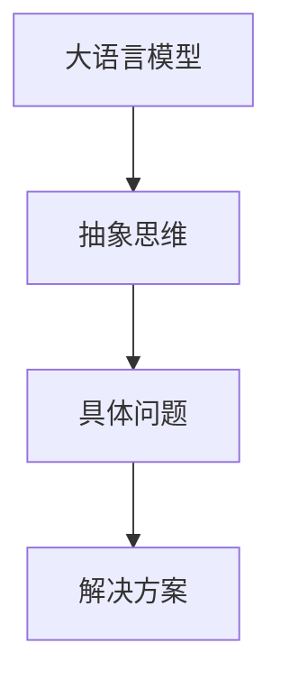
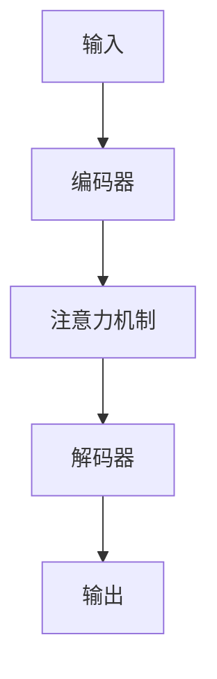

                 


# LLM在AI Agent抽象思维培养中的应用

---

## 关键词：
LLM, AI Agent, 抽象思维, 大语言模型, 人工智能, 系统架构设计

---

## 摘要：
本文探讨了大语言模型（LLM）在AI Agent抽象思维培养中的应用，分析了LLM如何通过其强大的语言理解和生成能力，助力AI Agent实现更高层次的抽象思维。文章从背景介绍、核心概念、算法原理、系统架构设计、项目实战等多方面展开，深入剖析了LLM与抽象思维的关系，展示了如何通过系统化的方法，将LLM的能力应用于AI Agent的开发中，从而提升其抽象思维能力。本文适合AI领域研究人员、开发者以及对AI Agent和LLM感兴趣的读者阅读。

---

## 第一部分：背景介绍

### 第1章：LLM与AI Agent概述

#### 1.1 LLM的基本概念
- **1.1.1 大语言模型的定义与特点**
  大语言模型（LLM）是一种基于深度学习的自然语言处理模型，通过大量数据的训练，能够理解和生成人类语言。其特点是：
  - **大规模训练数据**：通常使用 billions级别的文本数据进行训练。
  - **深度神经网络结构**：基于Transformer架构，支持长距离依赖关系的捕捉。
  - **多任务通用性**：能够适应多种NLP任务，如文本生成、问答系统、机器翻译等。

- **1.1.2 LLM与传统NLP模型的区别**
  传统NLP模型（如SVM、CRF等）依赖于特征工程，而LLM通过端到端的深度学习，能够自动提取特征，减少对领域知识的依赖，具有更强的泛化能力。

- **1.1.3 LLM与AI Agent的关系**
  AI Agent需要与人类进行自然语言交互，LLM为其提供了强大的语言理解和生成能力，使其能够更好地完成任务。

#### 1.2 AI Agent的基本概念
- **1.2.1 AI Agent的定义与分类**
  AI Agent是一种智能实体，能够感知环境、自主决策并执行任务。根据智能水平，AI Agent可以分为：
  - **反应式Agent**：基于当前感知做出反应。
  - **认知式Agent**：具备复杂推理和规划能力。

- **1.2.2 AI Agent的核心功能与应用场景**
  AI Agent的核心功能包括：
  - **感知环境**：通过传感器或API获取信息。
  - **理解需求**：通过NLP技术解析用户意图。
  - **推理决策**：基于知识库和推理引擎做出决策。
  - **执行任务**：通过API或动作库执行操作。
  - **学习优化**：通过反馈机制不断优化性能。

  AI Agent的应用场景包括：
  - 智能助手（如 Siri、Alexa）
  - 联网游戏AI
  - 智慧城市中的自动化系统

- **1.2.3 AI Agent与人类交互的模式**
  AI Agent与人类的交互模式可以是：
  - **文本交互**：通过自然语言对话进行交流。
  - **语音交互**：通过语音识别和合成实现交互。
  - **视觉交互**：通过计算机视觉技术辅助交互。

#### 1.3 抽象思维的定义与重要性
- **1.3.1 抽象思维的定义与特点**
  抽象思维是指从具体事物中抽取共同特征，形成一般性概念的能力。其特点包括：
  - **去具体化**：忽略非本质特征，抓住问题核心。
  - **层次性**：从具体到抽象，形成多级概念体系。
  - **可操作性**：抽象概念可以作为推理和决策的基础。

- **1.3.2 抽象思维在AI Agent中的应用价值**
  在AI Agent中，抽象思维能力使其能够：
  - **快速理解问题**：提取问题的核心特征，忽略无关信息。
  - **制定通用策略**：基于抽象概念制定适用于多种场景的解决方案。
  - **提升决策效率**：通过抽象模型减少计算复杂度。

- **1.3.3 LLM如何支持抽象思维的培养**
  LLM通过其强大的语言理解和生成能力，能够帮助AI Agent：
  - **提取抽象概念**：从大量文本中归纳出核心概念。
  - **生成抽象表达**：将具体信息转化为抽象描述。
  - **推理与关联**：建立抽象概念之间的关联，支持更高级的推理。

---

## 第二部分：核心概念与联系

### 第2章：LLM与抽象思维的关系

#### 2.1 LLM的核心原理
- **2.1.1 基于Transformer的模型结构**
  Transformer模型由编码器和解码器组成，编码器负责将输入文本转化为上下文向量，解码器基于这些向量生成输出文本。

  ```mermaid
  graph TD
    Encoder[编码器] --> Attention[注意力机制]
    Attention --> Output_Vector[输出向量]
    Output_Vector --> Decoder[解码器]
    Decoder --> Output[输出文本]
  ```

  - **注意力机制的作用**：注意力机制通过计算输入序列中每个词的重要性，帮助模型关注关键信息。

- **2.1.2 LLM与抽象思维的联系**
  LLM通过注意力机制和自适应的模型结构，能够捕捉文本中的抽象概念，帮助AI Agent理解用户意图并生成合适的回应。

#### 2.2 抽象思维的培养机制
- **2.2.1 抽象思维的层次模型**
  抽象思维的层次模型包括：
  - **具体层次**：处理具体事实和数据。
  - **表象层次**：形成事物的表象。
  - **概念层次**：提取核心概念。
  - **命题层次**：建立概念之间的逻辑关系。

  ```mermaid
  graph TD
    Fact[具体事实] --> Representation[表象]
    Representation --> Concept[概念]
    Concept --> Proposition[命题]
  ```

- **2.2.2 LLM如何提取与生成抽象概念**
  LLM通过编码器提取文本中的抽象概念，并通过解码器生成符合抽象概念的输出。

  ```mermaid
  graph TD
    Input_Text[输入文本] --> Encoder[编码器]
    Encoder --> Abstract_Concept[抽象概念]
    Abstract_Concept --> Decoder[解码器]
    Decoder --> Output_Text[输出文本]
  ```

- **2.2.3 抽象思维与具体问题解决的结合**
  抽象思维能够帮助AI Agent快速定位问题核心，减少计算量，提高决策效率。

#### 2.3 LLM与抽象思维的实体关系图



---

## 第三部分：算法原理讲解

### 第3章：LLM的算法原理

#### 3.1 Transformer模型的结构
- **3.1.1 编码器与解码器的结构**
  Transformer模型由编码器和解码器组成，编码器负责将输入文本转化为上下文向量，解码器基于这些向量生成输出文本。

  ```mermaid
  graph TD
    Encoder[编码器] --> Attention[注意力机制]
    Attention --> Output_Vector[输出向量]
    Output_Vector --> Decoder[解码器]
    Decoder --> Output[输出文本]
  ```

- **3.1.2 注意力机制的计算公式**
  注意力机制的计算公式如下：

  $$
  \text{Attention}(Q, K, V) = \text{softmax}\left(\frac{QK^T}{\sqrt{d_k}}\right)V
  $$

  其中：
  - $Q$：查询向量
  - $K$：键向量
  - $V$：值向量
  - $d_k$：向量维度

- **3.1.3 前馈网络的实现**
  前馈网络由多层感知机（MLP）组成，通常包括多个全连接层和激活函数。

  ```mermaid
  graph TD
    Input --> Dense_Layer[全连接层]
    Dense_Layer --> ReLU[激活函数]
    ReLU --> Output
  ```

#### 3.2 LLM的训练过程
- **3.2.1 监督学习与无监督学习的区别**
  - **监督学习**：基于标记的数据进行训练，模型在训练阶段就知道正确输出。
  - **无监督学习**：基于未标记的数据进行训练，模型需要自己发现数据中的结构。

- **3.2.2 基于交叉熵的损失函数**
  交叉熵损失函数用于衡量模型预测值与真实值之间的差异。

  $$
  \text{Loss} = -\sum_{i=1}^{n} y_i \log(p_i) + (1 - y_i) \log(1 - p_i)
  $$

  其中：
  - $y_i$：真实标签
  - $p_i$：模型预测概率

- **3.2.3 参数优化的数学模型**
  参数优化通常使用梯度下降算法，如Adam优化器。

  $$
  \theta_{t+1} = \theta_t - \eta \frac{\partial L}{\partial \theta_t}
  $$

  其中：
  - $\theta$：模型参数
  - $\eta$：学习率
  - $\frac{\partial L}{\partial \theta_t}$：损失函数对参数的梯度

#### 3.3 抽象思维的生成算法



---

## 第四部分：系统分析与架构设计方案

### 第4章：AI Agent系统架构

#### 4.1 系统功能设计
- **4.1.1 需求分析与功能模块划分**
  AI Agent的功能模块包括：
  - **自然语言理解模块**：负责理解用户输入。
  - **抽象思维模块**：负责提取抽象概念。
  - **决策推理模块**：负责制定解决方案。
  - **执行控制模块**：负责任务执行。

- **4.1.2 系统功能流程图**

  ```mermaid
  graph TD
    User_Input[用户输入] --> NLU[自然语言理解]
    NLU --> Abstractor[抽象思维]
    Abstractor --> Reasoner[决策推理]
    Reasoner --> Executor[执行控制]
    Executor --> Output[输出]
  ```

- **4.1.3 领域模型的类图**

```mermaid
classDiagram
    class AI-Agent {
        +LLM: LargeLanguageModel
        +Input: string
        +Output: string
        -state: string
        +generateResponse(): string
        +updateContext(): void
    }
    class LargeLanguageModel {
        +transformer: Transformer
        +token
```

---

## 第五部分：项目实战

### 第5章：LLM在AI Agent中的应用案例

#### 5.1 项目介绍
  本项目旨在开发一个具备抽象思维能力的AI Agent，能够在多种场景下提供智能服务。

#### 5.2 系统核心实现源代码
  以下是一个简单的AI Agent代码示例：

```python
class AI-Agent:
    def __init__(self, llm):
        self.llm = llm
        self.state = ""

    def generateResponse(self, input_text):
        abstract_concept = self.llm.extract_concept(input_text)
        response = self.llm.generate_response(abstract_concept)
        return response

    def updateContext(self, new_info):
        self.state += new_info
```

#### 5.3 代码应用解读与分析
  该代码展示了AI Agent的核心功能：
  - **生成响应**：通过LLM提取抽象概念，并生成响应。
  - **更新上下文**：将新信息整合到上下文中。

#### 5.4 实际案例分析
  例如，在智能客服场景中，用户输入“我的订单还没到”，AI Agent通过LLM提取“订单延迟”这一抽象概念，并生成“请提供订单号，我们将协助您查询”的响应。

---

## 第六部分：总结与展望

### 第6章：总结与展望

#### 6.1 总结
  本文详细探讨了LLM在AI Agent抽象思维培养中的应用，分析了其核心原理和系统架构设计，并通过实际案例展示了其应用价值。

#### 6.2 展望
  未来的研究方向包括：
  - **更高效的抽象思维算法**：探索更高效的抽象概念提取方法。
  - **多模态抽象思维**：结合视觉、听觉等多种模态信息，提升抽象思维能力。
  - **自适应学习**：使AI Agent能够根据反馈不断优化其抽象思维能力。

---

## 作者信息

作者：AI天才研究院/AI Genius Institute & 禅与计算机程序设计艺术/Zen And The Art of Computer Programming

---

以上是《LLM在AI Agent抽象思维培养中的应用》的技术博客文章的完整目录大纲和内容概要。希望本文能为读者提供清晰的思路和有价值的见解，帮助他们在AI Agent和LLM的结合应用中取得更大的突破。

