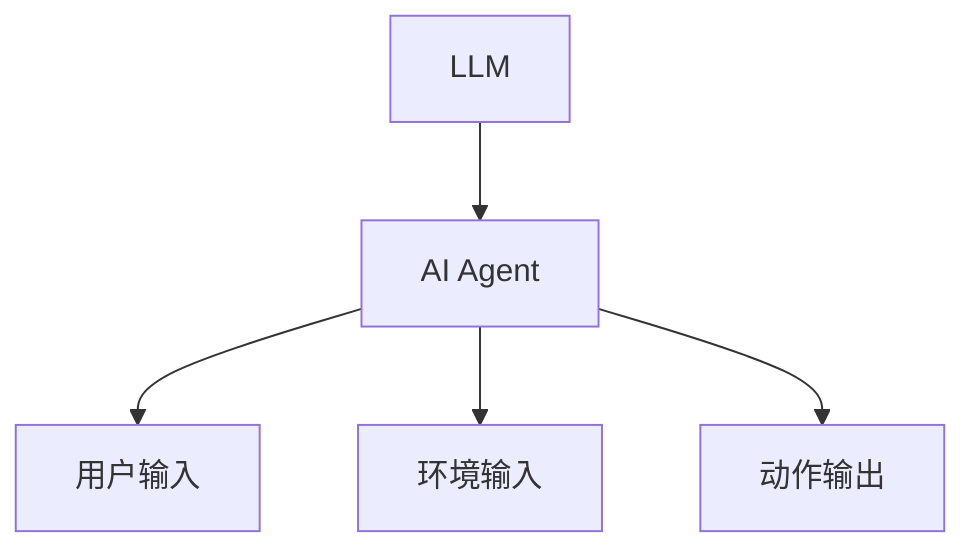
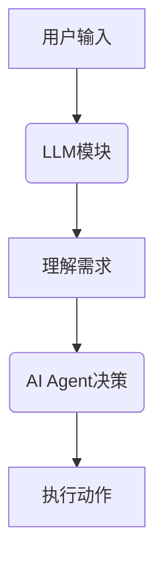
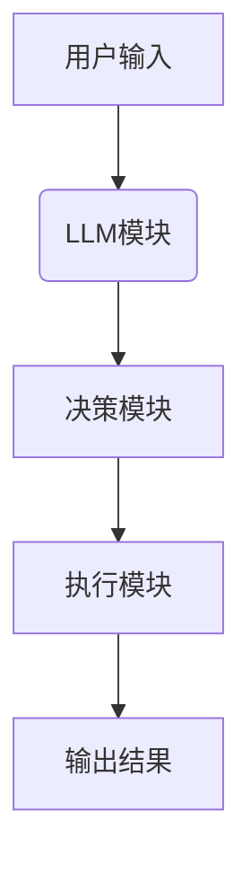

                 


# LLM在AI Agent抽象思维形成中的应用

> 关键词：LLM, AI Agent, 抽象思维, 自然语言处理, 人工智能, 大语言模型

> 摘要：本文探讨了大语言模型（LLM）在AI Agent抽象思维形成中的应用。通过详细分析LLM与AI Agent的核心概念、算法原理、系统架构及实际项目案例，展示了LLM如何赋能AI Agent的抽象思维能力，帮助其在复杂场景中做出更智能的决策。本文还提供了丰富的代码实现和数学建模内容，为读者提供了从理论到实践的全面指导。

---

## 第1章: LLM与AI Agent的基本概念

### 1.1 大语言模型（LLM）的定义与特点

#### 1.1.1 大语言模型的定义
大语言模型（LLM）是一种基于深度学习的自然语言处理模型，通过大量数据的训练，能够理解和生成人类语言。LLM的核心在于其庞大的参数量和复杂的架构设计，使其具备强大的上下文理解和生成能力。

#### 1.1.2 大语言模型的核心特点
- **大规模数据训练**：LLM通常基于海量文本数据进行训练，能够捕捉语言的复杂模式。
- **强大的上下文理解**：通过上下文分析，LLM能够生成连贯且合理的回答。
- **多任务通用性**：LLM可以在多种任务（如文本生成、问答、翻译等）中表现出色。

#### 1.1.3 LLM与传统NLP模型的区别
| 特性                | LLM                       | 传统NLP模型                 |
|---------------------|---------------------------|-----------------------------|
| 数据量              | 大规模（百万甚至更多）    | 较小（特定任务优化）         |
| 参数量              | 数十亿级别                | 数百万级别以下              |
| 任务通用性          | 高度通用                   | 任务专用性较强               |
| 训练效率            | 训练时间长，资源消耗大     | 训练时间短，资源消耗较低     |

### 1.2 AI Agent的基本概念

#### 1.2.1 AI Agent的定义
AI Agent（智能体）是指在特定环境中能够感知环境并采取行动以实现目标的实体。AI Agent可以是软件程序、机器人或其他智能系统。

#### 1.2.2 AI Agent的核心功能
- **感知环境**：通过传感器或数据输入感知外部环境。
- **决策制定**：基于感知信息，通过推理和计算做出决策。
- **行动执行**：根据决策结果执行相应的动作。

#### 1.2.3 AI Agent的应用场景
- **智能家居**：控制家中的设备，如智能音箱、空调等。
- **自动驾驶**：车辆能够感知环境并做出驾驶决策。
- **虚拟助手**：如Siri、Alexa等，帮助用户完成各种任务。

### 1.3 LLM与AI Agent的关系

#### 1.3.1 LLM作为AI Agent的核心模块
LLM可以作为AI Agent的自然语言处理模块，负责理解和生成人类语言，增强AI Agent的交互能力和理解能力。

#### 1.3.2 LLM如何赋能AI Agent的抽象思维
通过LLM的强大语言理解能力，AI Agent能够更好地理解用户需求，推理复杂的场景，并生成合理的回应。

#### 1.3.3 LLM与AI Agent结合的典型应用
- **智能客服**：通过LLM帮助AI Agent理解用户需求并生成合适的回答。
- **智能推荐**：AI Agent利用LLM分析用户需求，推荐个性化内容。

---

## 第2章: LLM在AI Agent中的应用场景

### 2.1 问题背景与挑战

#### 2.1.1 AI Agent面临的抽象思维问题
AI Agent需要在复杂的环境中进行抽象思维，包括理解上下文、推理因果关系、处理不确定性等。

#### 2.1.2 LLM如何解决这些挑战
通过LLM的强大语言理解和生成能力，AI Agent能够更好地处理抽象思维问题。

#### 2.1.3 LLM在AI Agent中的边界与外延
LLM主要用于语言理解和生成，其应用范围受到语言能力的限制。

### 2.2 LLM与AI Agent的结合方式

#### 2.2.1 LLM作为AI Agent的决策支持模块
LLM可以为AI Agent提供决策支持，帮助其理解问题并生成解决方案。

#### 2.2.2 LLM作为AI Agent的知识库模块
通过LLM的知识库功能，AI Agent可以快速获取所需信息。

#### 2.2.3 LLM作为AI Agent的对话模块
LLM可以增强AI Agent的对话能力，使其能够与用户进行更自然的交流。

### 2.3 典型案例分析

#### 2.3.1 电商AI Agent中的LLM应用
在电商场景中，AI Agent可以利用LLM分析用户需求，推荐个性化商品。

#### 2.3.2 金融AI Agent中的LLM应用
金融AI Agent可以利用LLM进行风险评估、投资建议等任务。

#### 2.3.3 医疗AI Agent中的LLM应用
医疗AI Agent可以利用LLM辅助诊断、提供医疗建议等。

---

## 第3章: LLM与AI Agent的核心概念与联系

### 3.1 核心概念原理

#### 3.1.1 LLM的训练与推理机制
- **训练**：基于大规模数据进行监督学习，优化模型参数。
- **推理**：根据输入生成输出，通常采用贪心算法或采样方法。

#### 3.1.2 AI Agent的感知、认知与执行过程
- **感知**：通过传感器或数据输入感知环境。
- **认知**：通过推理和计算理解环境信息。
- **执行**：根据认知结果采取相应动作。

#### 3.1.3 LLM如何影响AI Agent的抽象思维
通过LLM的强大语言能力，AI Agent能够更好地理解复杂场景并做出合理决策。

### 3.2 核心概念属性特征对比

| 特性                | LLM                       | AI Agent                  |
|---------------------|---------------------------|---------------------------|
| 核心功能            | 语言理解和生成            | 感知、推理、执行          |
| 任务目标            | 提供语言支持              | 实现特定目标              |
| 依赖性              | 依赖大规模数据训练        | 依赖感知和执行模块        |

### 3.3 ER实体关系图与Mermaid流程图

#### 3.3.1 LLM与AI Agent的实体关系图


#### 3.3.2 LLM在AI Agent中的流程图


---

## 第4章: LLM的算法原理与数学模型

### 4.1 LLM的训练流程

#### 4.1.1 数据预处理与特征提取
- **数据清洗**：去除噪声数据，确保数据质量。
- **分词处理**：将文本分割成单词或短语。

#### 4.1.2 模型训练与参数优化
- **损失函数**：通常使用交叉熵损失函数。
  $$ \text{Loss} = -\sum_{i=1}^{n} \text{log}(p(y_i|x_i)) $$
- **优化器**：常用Adam优化器，参数更新公式为：
  $$ \theta_{t+1} = \theta_t - \eta \nabla_{\theta} \text{Loss} $$

#### 4.1.3 模型微调与评估
- **微调**：在特定任务上进行微调，提升模型性能。
- **评估指标**：如准确率、困惑度（Perplexity）等。

### 4.2 LLM的数学模型

#### 4.2.1 Transformer架构
- **自注意力机制**：
  $$ \text{Attention}(Q, K, V) = \text{softmax}\left(\frac{QK^T}{\sqrt{d_k}}\right)V $$
- **前馈网络**：每层包含多层感知机（MLP）。

#### 4.2.2 梯度下降与优化算法
- **Adam优化器**：结合动量和自适应学习率。
- **学习率调度器**：如余弦退火。

---

## 第5章: 系统架构与项目实战

### 5.1 系统架构设计

#### 5.1.1 系统功能设计
- **输入模块**：接收用户输入。
- **LLM模块**：处理自然语言理解。
- **决策模块**：基于LLM输出做出决策。
- **执行模块**：执行相应动作。

#### 5.1.2 系统架构图


### 5.2 项目实战

#### 5.2.1 环境安装
- 安装Python和相关库：
  ```bash
  pip install torch transformers
  ```

#### 5.2.2 核心代码实现

```python
from transformers import AutoModelForSequenceClassification, AutoTokenizer

class AI-Agent:
    def __init__(self):
        self.model = AutoModelForSequenceClassification.from_pretrained('roberta-base')
        self.tokenizer = AutoTokenizer.from_pretrained('roberta-base')

    def process_input(self, input_text):
        inputs = self.tokenizer.encode_plus(input_text, return_tensors='pt')
        with torch.no_grad():
            outputs = self.model(**inputs)
        return outputs.logits.argmax().item()

# 示例用法
agent = AI-Agent()
result = agent.process_input("帮我推荐一本书")
print(result)
```

#### 5.2.3 案例分析与解读
- **电商推荐**：基于用户的购买历史和偏好，推荐个性化商品。
- **金融分析**：通过LLM分析市场动态，提供投资建议。

---

## 第6章: 小结与展望

### 6.1 最佳实践 Tips
- **数据质量**：确保训练数据的多样性和高质量。
- **模型选择**：根据具体任务选择合适的模型。
- **持续优化**：定期更新模型和优化算法。

### 6.2 小结
本文详细探讨了LLM在AI Agent抽象思维形成中的应用，从核心概念到算法原理，再到系统架构和项目实战，为读者提供了全面的指导。

### 6.3 展望
未来，随着LLM技术的不断进步，AI Agent的抽象思维能力将得到进一步提升，应用场景也将更加广泛。

---

## 作者信息

作者：AI天才研究院/AI Genius Institute & 禅与计算机程序设计艺术 /Zen And The Art of Computer Programming

---

希望这篇文章能满足您的需求！如果需要进一步修改或补充，请随时告诉我。

