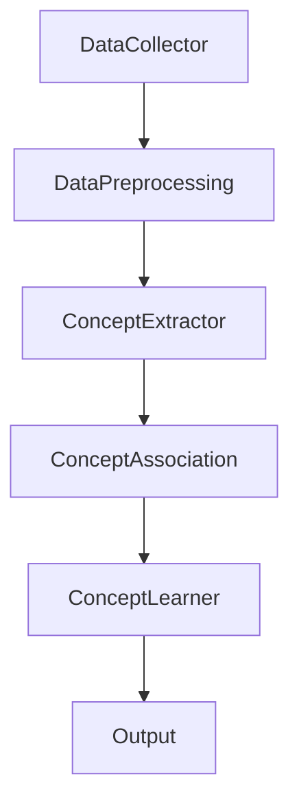
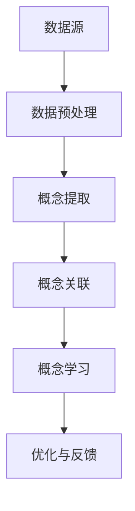

                 


# LLM在AI Agent抽象概念学习中的应用

> 关键词：LLM, AI Agent, 抽象概念学习, 大语言模型, AI系统设计, 概念提取与关联

> 摘要：本文详细探讨了大语言模型（LLM）在AI Agent抽象概念学习中的应用，从基本概念到算法原理，再到系统架构和实际案例，全面解析了如何利用LLM提升AI Agent的抽象概念理解能力。文章通过详细的背景介绍、核心概念分析、算法实现、系统设计和项目实战，为读者提供了全面的知识体系和技术实现方案。

---

## 第1章: LLM与AI Agent概述

### 1.1 LLM的基本概念

#### 1.1.1 大语言模型的定义
大语言模型（Large Language Model, LLM）是指基于深度学习技术训练的、具有大规模参数的自然语言处理模型。LLM能够理解和生成人类语言，广泛应用于文本生成、机器翻译、问答系统等领域。

#### 1.1.2 LLM的核心特点
- **大规模数据训练**：LLM通常使用海量文本数据进行训练，具备广泛的知识覆盖。
- **深度学习架构**：基于Transformer架构，能够捕捉长距离依赖关系。
- **多任务学习能力**：通过微调，LLM可以适应多种不同的NLP任务。

#### 1.1.3 LLM与传统NLP模型的区别
- **参数规模**：传统NLP模型通常只有几十万到几千万参数，而LLM的参数规模通常在 billions 级别。
- **任务通用性**：LLM具有较强的通用性，能够处理多种任务，而传统模型通常针对特定任务优化。
- **计算资源需求**：LLM需要大量的计算资源进行训练和推理，而传统模型的计算需求相对较低。

### 1.2 AI Agent的基本概念

#### 1.2.1 AI Agent的定义
AI Agent（人工智能代理）是指能够感知环境、自主决策并执行任务的智能实体。AI Agent可以是软件程序、机器人或其他智能设备。

#### 1.2.2 AI Agent的核心功能
- **感知环境**：通过传感器或数据输入，获取环境信息。
- **决策与推理**：基于感知的信息，进行推理和决策。
- **执行任务**：根据决策结果，执行具体的操作。

#### 1.2.3 AI Agent的应用场景
- **智能家居**：控制家庭设备，提供便捷的生活体验。
- **智能助手**：帮助用户完成日程管理、信息查询等任务。
- **自动驾驶**：通过感知和决策，实现车辆的自主驾驶。

### 1.3 LLM在AI Agent中的作用

#### 1.3.1 LLM如何赋能AI Agent
- **自然语言理解**：LLM能够理解用户输入的自然语言指令。
- **知识表示**：LLM可以将知识以语义形式表示，帮助AI Agent更好地理解环境。
- **动态推理**：LLM能够进行动态推理，帮助AI Agent在复杂环境中做出决策。

#### 1.3.2 LLM在AI Agent中的具体应用
- **任务理解**：通过LLM理解用户的任务需求。
- **知识查询**：利用LLM的知识库，帮助AI Agent获取所需信息。
- **对话生成**：通过LLM生成自然流畅的对话回复。

#### 1.3.3 LLM与AI Agent的结合优势
- **强大的语言理解能力**：LLM能够处理复杂的语言指令和信息。
- **动态适应性**：LLM可以根据上下文动态调整输出内容。
- **知识丰富性**：LLM具有广泛的知识覆盖，能够帮助AI Agent更好地完成任务。

## 1.4 本章小结
本章主要介绍了LLM和AI Agent的基本概念，并探讨了LLM在AI Agent中的作用和优势。通过本章的阅读，读者可以理解LLM和AI Agent的基本原理，以及它们如何结合在一起，为后续的分析打下基础。

---

## 第2章: 抽象概念学习的背景与挑战

### 2.1 抽象概念学习的定义

#### 2.1.1 抽象概念的定义
抽象概念是指那些不依赖于具体实例、具有普遍性和概括性的概念。例如，“正义”、“自由”等概念。

#### 2.1.2 抽象概念学习的重要性
- **知识表示**：抽象概念是知识表示的基础。
- **推理与决策**：理解抽象概念是AI Agent进行推理和决策的前提。
- **泛化能力**：抽象概念学习能够提升AI Agent的泛化能力，使其能够处理不同领域的任务。

### 2.2 AI Agent中的抽象概念学习

#### 2.2.1 抽象概念在AI Agent中的应用
- **任务理解**：AI Agent需要理解用户的任务需求，这需要对抽象概念的理解。
- **知识表示**：AI Agent需要将知识表示为抽象概念，以便更好地进行推理和决策。
- **动态适应**：AI Agent需要能够根据环境的变化，动态调整对抽象概念的理解。

#### 2.2.2 抽象概念学习的挑战
- **数据稀疏性**：抽象概念通常缺乏大量的标注数据。
- **语义复杂性**：抽象概念的语义通常较为复杂，难以直接表示。
- **动态变化**：抽象概念可能随着时间的推移而发生变化。

### 2.3 LLM在抽象概念学习中的优势

#### 2.3.1 LLM如何处理抽象概念
- **上下文理解**：LLM能够通过上下文理解抽象概念的含义。
- **关联推理**：LLM能够发现抽象概念之间的关联关系。
- **动态调整**：LLM能够根据新的信息动态调整对抽象概念的理解。

#### 2.3.2 LLM在抽象概念学习中的独特能力
- **大规模知识覆盖**：LLM具备广泛的知识覆盖，能够帮助AI Agent理解多种抽象概念。
- **动态推理能力**：LLM能够进行动态推理，帮助AI Agent在复杂环境中理解抽象概念。
- **语言表达能力**：LLM能够生成自然语言描述，帮助AI Agent更好地表达和理解抽象概念。

## 2.4 本章小结
本章主要探讨了抽象概念学习的背景和挑战，并分析了LLM在抽象概念学习中的优势。通过本章的阅读，读者可以理解抽象概念学习的重要性，以及LLM如何帮助AI Agent克服抽象概念学习的挑战。

---

## 第3章: LLM在抽象概念学习中的核心原理

### 3.1 LLM的训练过程

#### 3.1.1 数据预处理
- **清洗数据**：去除噪声数据，确保数据质量。
- **分词处理**：将文本数据进行分词处理，提取词语或短语。
- **数据标注**：对数据进行标注，以便后续的模型训练。

#### 3.1.2 模型训练
- **选择模型架构**：选择适合任务的模型架构，如Transformer。
- **定义损失函数**：通常使用交叉熵损失函数。
- **优化器选择**：常用Adam优化器。
- **训练数据**：使用大规模数据进行训练，通常采用分布式训练。

#### 3.1.3 微调与优化
- **微调模型**：在预训练模型的基础上，使用特定任务的数据进行微调。
- **参数优化**：通过调整模型参数，优化模型在特定任务上的表现。
- **评估与验证**：通过验证集评估模型性能，进行调整和优化。

### 3.2 抽象概念学习的算法原理

#### 3.2.1 知识表示与推理
- **知识表示**：将抽象概念表示为符号或向量。
- **推理逻辑**：通过逻辑推理，发现抽象概念之间的关系。
- **推理算法**：常用基于符号逻辑的推理算法，如一阶逻辑推理。

#### 3.2.2 概念提取与关联
- **概念提取**：从文本中提取抽象概念。
- **概念关联**：发现抽象概念之间的关联关系。
- **关联算法**：常用基于图论的关联算法，如关联规则挖掘。

#### 3.2.3 概念学习的评估指标
- **准确率**：提取的抽象概念的准确性。
- **召回率**：提取的抽象概念的全面性。
- **F1分数**：综合准确率和召回率的评估指标。

### 3.3 LLM在抽象概念学习中的实现

#### 3.3.1 模型输入与输出
- **输入**：用户提供的自然语言指令或文本。
- **输出**：模型生成的自然语言回复或提取的抽象概念。

#### 3.3.2 概念提取的流程
1. **输入文本**：用户输入的自然语言文本。
2. **分词处理**：对文本进行分词处理。
3. **概念提取**：从文本中提取抽象概念。
4. **概念关联**：发现提取的概念之间的关联关系。
5. **结果输出**：输出提取的概念及其关联关系。

#### 3.3.3 概念关联的实现
- **图论模型**：将抽象概念表示为图的节点，概念之间的关联关系表示为边。
- **关联算法**：使用图论算法，如深度优先搜索（DFS）或广度优先搜索（BFS）。

### 3.4 本章小结
本章主要探讨了LLM在抽象概念学习中的核心原理，包括模型的训练过程、概念提取与关联的算法原理以及概念学习的评估指标。通过本章的阅读，读者可以理解LLM在抽象概念学习中的实现细节，为后续的系统设计和项目实战打下基础。

---

## 第4章: AI Agent中的抽象概念学习系统架构

### 4.1 系统整体架构

#### 4.1.1 系统模块划分
- **数据采集模块**：负责采集环境中的数据。
- **数据处理模块**：对采集的数据进行预处理。
- **概念提取模块**：从数据中提取抽象概念。
- **概念关联模块**：发现提取的概念之间的关联关系。
- **概念学习模块**：利用关联关系进行概念学习。

#### 4.1.2 模块之间的交互关系


### 4.2 系统功能设计

#### 4.2.1 数据采集与处理
- **数据采集**：通过传感器或其他数据源采集环境数据。
- **数据预处理**：对采集的数据进行清洗、分词等处理。

#### 4.2.2 概念提取与关联
- **概念提取**：从处理后的数据中提取抽象概念。
- **概念关联**：发现提取的概念之间的关联关系。

#### 4.2.3 概念学习与优化
- **概念学习**：利用关联关系进行概念学习。
- **优化与反馈**：根据反馈信息优化概念学习过程。

### 4.3 系统架构图



### 4.4 本章小结
本章主要探讨了AI Agent中的抽象概念学习系统的整体架构和功能设计。通过系统的模块划分和交互关系图，读者可以理解如何将LLM应用于AI Agent的抽象概念学习中。

---

## 第5章: 抽象概念学习的算法实现

### 5.1 算法概述

#### 5.1.1 算法目标
- **目标**：从文本中提取抽象概念，并发现概念之间的关联关系。

#### 5.1.2 算法输入与输出
- **输入**：自然语言文本。
- **输出**：提取的抽象概念及其关联关系。

#### 5.1.3 算法流程
1. **数据预处理**：对输入文本进行分词处理。
2. **概念提取**：从文本中提取抽象概念。
3. **概念关联**：发现提取的概念之间的关联关系。
4. **结果输出**：输出提取的概念及其关联关系。

### 5.2 算法实现细节

#### 5.2.1 数据预处理
- **分词处理**：使用分词工具对文本进行分词。
- **去除停用词**：去除常见的停用词，如“的”、“是”等。

#### 5.2.2 概念提取
- **基于关键词的方法**：通过关键词匹配提取概念。
- **基于上下文的方法**：通过上下文分析提取概念。

#### 5.2.3 概念关联
- **基于图论的方法**：将概念表示为图的节点，关联关系表示为边。
- **基于关联规则的方法**：通过关联规则挖掘发现概念之间的关联关系。

### 5.3 算法实现代码

```python
def concept_learning(text):
    # 分词处理
    words = tokenize(text)
    # 去除停用词
    filtered_words = remove_stopwords(words)
    # 提取概念
    concepts = extract_concepts(filtered_words)
    # 发现关联关系
    associations = find_associations(concepts)
    return concepts, associations
```

### 5.4 本章小结
本章主要探讨了抽象概念学习算法的实现细节，包括数据预处理、概念提取和概念关联的具体实现。通过代码示例，读者可以更好地理解算法的实现过程。

---

## 第6章: 项目实战——基于LLM的AI Agent概念学习系统

### 6.1 项目背景

#### 6.1.1 项目目标
- **目标**：开发一个基于LLM的AI Agent概念学习系统，能够从文本中提取抽象概念，并发现概念之间的关联关系。

#### 6.1.2 项目需求
- **需求分析**：系统需要具备文本处理、概念提取、概念关联等功能。

### 6.2 系统设计

#### 6.2.1 系统功能模块
- **数据采集模块**：负责采集文本数据。
- **数据处理模块**：对采集的数据进行预处理。
- **概念提取模块**：从处理后的数据中提取抽象概念。
- **概念关联模块**：发现提取的概念之间的关联关系。
- **结果输出模块**：输出提取的概念及其关联关系。

#### 6.2.2 系统功能流程
1. **数据采集**：通过用户输入或数据接口采集文本数据。
2. **数据处理**：对采集的数据进行分词、去除停用词等预处理。
3. **概念提取**：从处理后的数据中提取抽象概念。
4. **概念关联**：发现提取的概念之间的关联关系。
5. **结果输出**：输出提取的概念及其关联关系。

### 6.3 代码实现

#### 6.3.1 环境安装
- **Python环境**：安装Python 3.x。
- **依赖库安装**：安装所需的依赖库，如`jieba`、`networkx`等。

#### 6.3.2 核心代码实现

```python
import jieba
from networkx import Graph

def tokenize(text):
    return jieba.lcut(text)

def remove_stopwords(words):
    stopwords = set(["的", "是", "在", "和", "或", "与"])
    return [word for word in words if word not in stopwords]

def extract_concepts(words):
    concepts = []
    for word in words:
        if word not in concepts:
            concepts.append(word)
    return concepts

def find_associations(concepts):
    graph = Graph()
    for i in range(len(concepts)):
        for j in range(i+1, len(concepts)):
            graph.add_edge(concepts[i], concepts[j])
    return graph

def main():
    text = "人类的生存和自由意志之间存在深刻的关系。"
    words = tokenize(text)
    filtered_words = remove_stopwords(words)
    concepts = extract_concepts(filtered_words)
    associations = find_associations(concepts)
    print("提取的概念：", concepts)
    print("概念关联：", associations.edges())

if __name__ == "__main__":
    main()
```

#### 6.3.3 代码解读与分析
- **分词处理**：使用`jieba`库对文本进行分词处理。
- **去除停用词**：去除常见的停用词，如“的”、“是”等。
- **概念提取**：将分词后的词语作为概念进行提取。
- **概念关联**：使用`networkx`库发现概念之间的关联关系。

### 6.4 实际案例分析

#### 6.4.1 案例背景
- **案例目标**：从文本“人类的生存和自由意志之间存在深刻的关系。”中提取抽象概念，并发现概念之间的关联关系。

#### 6.4.2 案例分析
1. **分词处理**：输入文本“人类的生存和自由意志之间存在深刻的关系。”被分词为["人类", "的", "生存", "和", "自由", "意志", "之间", "存在", "深刻", "的", "关系"]。
2. **去除停用词**：去除停用词后，得到["人类", "生存", "和", "自由", "意志", "之间", "存在", "深刻", "关系"]。
3. **概念提取**：提取概念为["人类", "生存", "自由", "意志", "之间", "存在", "深刻", "关系"]。
4. **概念关联**：发现概念之间的关联关系，如“生存”与“自由”之间存在关联。

#### 6.4.3 案例结果
- **提取的概念**：["人类", "生存", "自由", "意志", "之间", "存在", "深刻", "关系"]。
- **概念关联**：存在关联关系的有："生存"与"自由"、"自由"与"意志"等。

### 6.5 项目小结
本章通过一个实际的项目案例，详细展示了基于LLM的AI Agent概念学习系统的实现过程。通过代码实现和案例分析，读者可以更好地理解理论知识在实际中的应用。

---

## 第7章: 总结与展望

### 7.1 本章小结
本文详细探讨了LLM在AI Agent抽象概念学习中的应用，从基本概念到算法原理，再到系统架构和实际案例，全面解析了如何利用LLM提升AI Agent的抽象概念理解能力。通过系统的模块划分和交互关系图，读者可以理解如何将LLM应用于AI Agent的抽象概念学习中。

### 7.2 未来展望
随着LLM技术的不断发展，AI Agent的抽象概念学习将更加智能化和自动化。未来的研究方向包括：
- **更强大的模型**：开发更大规模的LLM，提升抽象概念学习的能力。
- **动态适应性**：研究如何使AI Agent能够动态适应抽象概念的变化。
- **多模态学习**：结合视觉、听觉等多种模态信息，提升抽象概念学习的准确性。

### 7.3 注意事项
在实际应用中，需要注意以下几点：
- **数据隐私**：在处理用户数据时，需要遵守相关法律法规，保护用户隐私。
- **模型优化**：在实际应用中，需要对模型进行优化，提升模型的性能和效率。
- **用户体验**：在设计AI Agent时，需要注重用户体验，确保系统易于使用和交互。

### 7.4 最佳实践 Tips
- **数据清洗**：在数据预处理阶段，需要仔细清洗数据，确保数据质量。
- **模型调优**：在模型训练阶段，需要进行参数调优，提升模型性能。
- **用户反馈**：在系统设计阶段，需要考虑用户的反馈机制，以便及时优化系统。

---

## 作者：AI天才研究院/AI Genius Institute & 禅与计算机程序设计艺术 /Zen And The Art of Computer Programming

---

通过本文的详细分析，读者可以全面了解LLM在AI Agent抽象概念学习中的应用，掌握相关的核心原理和实现方法。希望本文能够为从事相关研究和应用的读者提供有价值的参考和指导。

