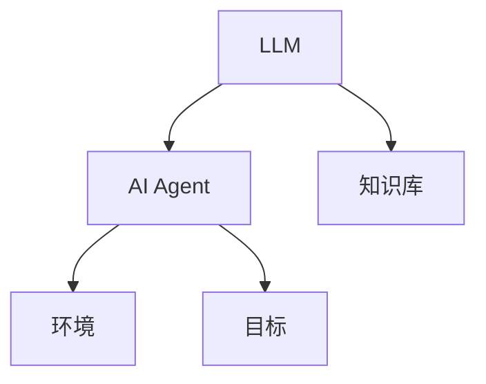
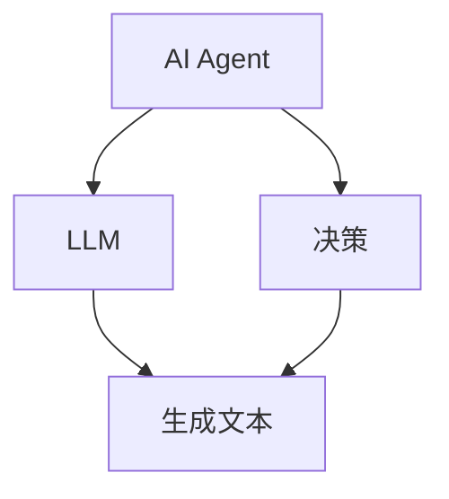
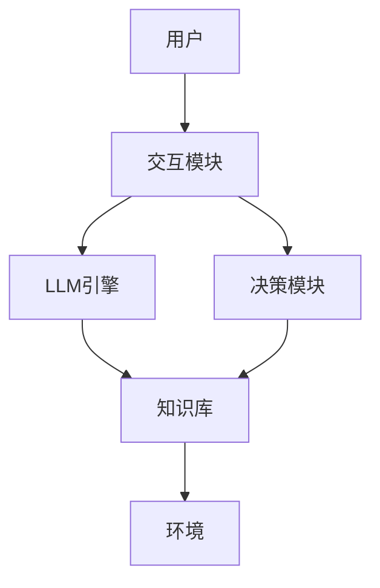
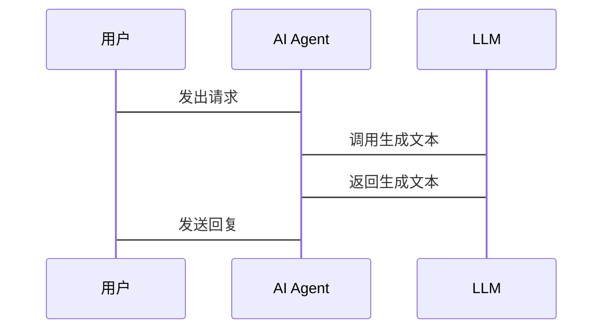

                 


# LLM在AI Agent抽象概念形成中的应用

## 关键词：LLM, AI Agent, 抽象概念形成, 自然语言处理, 强化学习

## 摘要：
本文深入探讨了大语言模型（LLM）在AI Agent抽象概念形成中的应用。通过分析LLM与AI Agent的结合，阐述了如何利用LLM的强大语言理解和生成能力，帮助AI Agent构建抽象概念。文章从背景介绍、核心概念、算法原理、系统架构到项目实战，全面解析了LLM在AI Agent中的应用，并通过实例展示了其实际价值。同时，本文还总结了当前应用中的挑战和未来的发展方向，为读者提供了全面的视角。

---

# 正文

## 第1章: LLM与AI Agent概述

### 1.1 LLM的基本概念

#### 1.1.1 大语言模型的定义
大语言模型（LLM）是指基于深度学习的自然语言处理模型，通常基于Transformer架构，通过大量数据训练，能够理解和生成人类语言。LLM的核心在于其巨大的参数量和强大的上下文理解能力。

#### 1.1.2 LLM的核心特点
- **大规模训练数据**：LLM通常使用海量的文本数据进行训练，涵盖多种语言和领域。
- **自注意力机制**：通过自注意力机制，模型能够捕捉文本中的长距离依赖关系。
- **生成能力强**：LLM可以生成连贯且符合语境的文本，支持多种任务，如文本生成、问答系统等。

#### 1.1.3 LLM与传统NLP模型的区别
与传统NLP模型（如SVM、CRF）相比，LLM具有以下优势：
- **端到端学习**：LLM可以直接从原始数据中学习，无需手动特征提取。
- **通用性**：LLM可以应用于多种NLP任务，而传统模型通常针对特定任务设计。

### 1.2 AI Agent的基本概念

#### 1.2.1 AI Agent的定义
AI Agent是一种智能体，能够感知环境、执行任务并做出决策。AI Agent可以是软件程序、机器人或其他智能系统，其核心目标是通过与环境的交互，完成特定目标。

#### 1.2.2 AI Agent的核心功能
- **感知环境**：通过传感器或数据接口获取环境信息。
- **目标设定**：基于当前状态和目标，制定行动计划。
- **决策与执行**：根据感知信息和知识库，做出决策并执行动作。

#### 1.2.3 AI Agent的应用场景
- **智能助手**：如Siri、Alexa等，帮助用户完成日常任务。
- **自动驾驶**：通过感知环境和决策系统实现自主驾驶。
- **机器人协作**：在工业生产中，机器人协同完成复杂任务。

### 1.3 LLM与AI Agent的结合

#### 1.3.1 LLM在AI Agent中的作用
LLM为AI Agent提供了强大的语言理解和生成能力，使其能够更好地理解用户需求、生成自然语言输出，并通过对话与人类或其他系统进行交互。

#### 1.3.2 LLM如何帮助AI Agent形成抽象概念
- **知识表示**：LLM可以将文本信息转化为结构化的知识表示，帮助AI Agent理解概念之间的关系。
- **概念生成**：通过LLM的生成能力，AI Agent可以自动生成新的概念描述。
- **推理与关联**：LLM通过上下文理解，帮助AI Agent建立概念之间的关联。

#### 1.3.3 LLM与AI Agent结合的典型应用
- **智能对话系统**：通过LLM生成自然语言回复，提升对话质量。
- **知识检索与总结**：利用LLM进行信息检索和知识总结，辅助AI Agent完成任务。

---

## 第2章: 核心概念与联系

### 2.1 LLM的核心原理

#### 2.1.1 大语言模型的训练过程
- **预训练**：使用无监督学习，基于大量文本数据，训练模型理解语言结构。
- **微调**：针对特定任务，使用有监督学习对模型进行优化。

#### 2.1.2 概率生成机制
- LLM通过概率分布预测下一个词，生成符合语境的文本。
- 例如，给定输入“今天天气”，模型会根据概率分布生成“很好”或“不错”等词语。

#### 2.1.3 注意力机制与编码器-解码器结构
- 注意力机制帮助模型关注输入文本中的重要部分。
- 编码器-解码器结构通过编码器将输入文本转化为向量，解码器生成输出文本。

### 2.2 AI Agent的核心原理

#### 2.2.1 状态感知与目标设定
- AI Agent通过传感器或接口获取环境状态。
- 基于当前状态和目标，制定行动计划。

#### 2.2.2 行为决策机制
- AI Agent通过内部知识库和推理能力，选择最优动作。
- 例如，在自动驾驶中，AI Agent会根据道路状况和交通规则做出转向或加速的决策。

#### 2.2.3 与环境的交互过程
- AI Agent通过执行动作改变环境状态，获取新的感知信息。
- 例如，在游戏中，AI Agent通过移动、攻击等动作与游戏环境交互。

### 2.3 LLM与AI Agent的关联

#### 2.3.1 LLM作为AI Agent的“知识库”
- LLM可以作为AI Agent的知识存储，帮助其理解外部信息。
- 例如，AI Agent需要回答用户问题时，可以调用LLM进行信息检索和生成。

#### 2.3.2 LLM作为AI Agent的“决策支持系统”
- LLM可以为AI Agent提供多种决策建议，帮助其做出最优选择。
- 例如，在智能客服中，AI Agent可以利用LLM生成多个可能的回复方案，选择最合适的答案。

#### 2.3.3 LLM与AI Agent的协同工作模式
- **分工合作**：AI Agent负责整体决策，LLM负责语言理解和生成。
- **实时交互**：AI Agent通过LLM与用户或环境进行实时交互。

### 2.4 核心概念对比表

| 比较维度 | LLM | AI Agent |
|----------|------|-----------|
| 核心功能 | 语言理解和生成 | 环境感知与行为决策 |
| 输入 | 文本数据 | 环境状态 |
| 输出 | 生成文本 | 行动指令 |
| 应用场景 | NLP任务 | 多领域智能应用 |

### 2.5 实体关系图（Mermaid）



---

## 第3章: 算法原理

### 3.1 LLM的算法原理

#### 3.1.1 生成过程
- **输入**：用户输入文本，例如“如何制作咖啡？”
- **处理**：LLM将输入文本编码为向量，通过自注意力机制生成响应。
- **输出**：生成连贯的自然语言回复。

#### 3.1.2 概率生成模型
- LLM通过概率分布生成文本，例如：
  - $P(word|context)$ 表示在上下文中生成某个词的概率。
  - 损失函数：交叉熵损失函数 $-\sum_{i=1}^{n} \log P(word_i|context)$。

#### 3.1.3 代码实现（Python示例）
```python
def generate_response(prompt, model):
    # 调用LLM模型生成回复
    response = model.generate(prompts=prompt, max_tokens=500)
    return response.choices[0].message.content
```

### 3.2 AI Agent的算法原理

#### 3.2.1 状态感知
- AI Agent通过传感器或接口获取环境信息，例如：
  - $state = \{x, y, speed\}$ 表示自动驾驶汽车的状态。

#### 3.2.2 行为决策
- AI Agent基于当前状态和目标，选择最优动作：
  - 使用强化学习优化决策策略，例如：
    - 奖励函数 $R(a, s')$ 表示执行动作 $a$ 后得到的奖励。
    - 动作选择：$a = \argmax_{a} Q(s, a)$，其中 $Q$ 是价值函数。

#### 3.2.3 与环境交互
- AI Agent执行动作，观察新的状态，并更新知识库：
  - 例如，在智能客服中，AI Agent根据用户输入生成回复，并根据用户反馈更新知识库。

### 3.3 LLM与AI Agent的协同算法

#### 3.3.1 协同流程（Mermaid）


#### 3.3.2 数学模型
- LLM的生成过程可以用以下公式表示：
  - $P(y|x) = \text{exp}(f(x, y)) / Z(x)$
  - 其中，$f(x, y)$ 是模型的分数函数，$Z(x)$ 是归一化常数。

---

## 第4章: 系统分析与架构设计

### 4.1 系统架构设计

#### 4.1.1 系统组成
- **知识库**：存储领域知识和训练数据。
- **LLM引擎**：负责语言理解和生成。
- **决策模块**：负责AI Agent的行为决策。
- **交互模块**：负责与用户或环境的交互。

#### 4.1.2 系统架构图（Mermaid）


### 4.2 系统接口设计

#### 4.2.1 API接口
- **输入接口**：接受用户输入或环境状态。
- **输出接口**：生成自然语言回复或执行动作。

#### 4.2.2 数据流
- 用户输入 → 交互模块 → LLM引擎 → 生成文本 → 决策模块 → 执行动作。

### 4.3 交互流程（Mermaid）



---

## 第5章: 项目实战

### 5.1 环境安装

#### 5.1.1 安装依赖
- 安装Python和必要的库，例如：
  - `pip install transformers`
  - `pip install torch`

#### 5.1.2 安装LLM模型
- 使用Hugging Face提供的模型，例如GPT-2或GPT-3。

### 5.2 核心代码实现

#### 5.2.1 LLM调用代码
```python
from transformers import AutoModelForCausalLM, AutoTokenizer

model_name = "gpt2"
tokenizer = AutoTokenizer.from_pretrained(model_name)
model = AutoModelForCausalLM.from_pretrained(model_name)

def generate_response(prompt):
    inputs = tokenizer.encode(prompt, return_tensors="pt")
    outputs = model.generate(inputs, max_length=500, temperature=0.7)
    response = tokenizer.decode(outputs[0], skip_special_tokens=True)
    return response
```

#### 5.2.2 AI Agent实现代码
```python
class AIAgent:
    def __init__(self, llm_model):
        self.llm = llm_model
        self.knowledge_base = {}

    def perceive(self, input):
        # 处理输入，提取状态信息
        pass

    def decide(self, state):
        # 基于状态做出决策
        pass

    def interact(self, input):
        response = self.llm.generate_response(input)
        self.perceive(response)
        return response
```

### 5.3 案例分析

#### 5.3.1 应用场景：智能对话系统
- 用户输入：我需要帮助写一篇技术博客。
- AI Agent调用LLM生成回复：我可以为你提供关于如何撰写技术博客的建议。

#### 5.3.2 应用场景：知识检索
- 用户输入：告诉我如何训练一个神经网络。
- AI Agent调用LLM生成详细步骤。

### 5.4 项目小结

---

## 第6章: 最佳实践与注意事项

### 6.1 最佳实践

#### 6.1.1 数据隐私
- 确保训练数据和用户输入的隐私性，避免泄露敏感信息。

#### 6.1.2 模型调优
- 根据具体任务对LLM进行微调，提升性能。

#### 6.1.3 系统优化
- 优化系统架构，提高交互效率。

### 6.2 小结

### 6.3 注意事项

#### 6.3.1 数据质量
- 确保训练数据的质量，避免错误信息的传播。

#### 6.3.2 模型局限性
- LLM可能存在理解偏差或生成错误信息的风险。

#### 6.3.3 系统稳定性
- 确保系统在高并发和复杂环境下的稳定性。

### 6.4 拓展阅读

#### 6.4.1 推荐书籍
- 《深度学习》（Deep Learning）
- 《自然语言处理实战》（Hands-On Natural Language Processing with Python）

#### 6.4.2 推荐论文
- “Attention Is All You Need”（论文标题）
- “Language Models are Few-Shot Learners”（论文标题）

---

## 附录

### 附录A: 参考文献

1. Vaswani, A., et al. "Attention Is All You Need." Advances in Neural Information Processing Systems, 2017.
2. Brown, T., et al. "Language Models are Few-Shot Learners." arXiv preprint arXiv:1909.01037, 2019.

### 附录B: 工具与资源

- Hugging Face Transformers库：https://huggingface.co/transformers
- GPT-2模型：https://huggingface.co/gpt2
- Mermaid图表工具：https://mermaid-js.github.io/mermaid-live-editor/

---

## 作者

**作者：AI天才研究院/AI Genius Institute & 禅与计算机程序设计艺术 /Zen And The Art of Computer Programming**

---

**摘要：** 本文深入探讨了大语言模型（LLM）在AI Agent抽象概念形成中的应用，从背景、核心概念、算法原理到系统架构和项目实战，全面解析了LLM如何帮助AI Agent构建抽象概念，为读者提供了全面的视角和实用的指导。

**关键词：** LLM, AI Agent, 抽象概念形成, 自然语言处理, 强化学习

**注：** 如果需要进一步的帮助或具体章节内容的详细展开，请随时告知。

