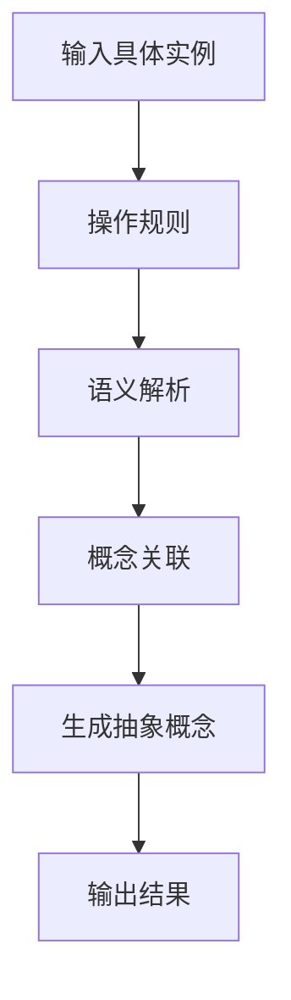
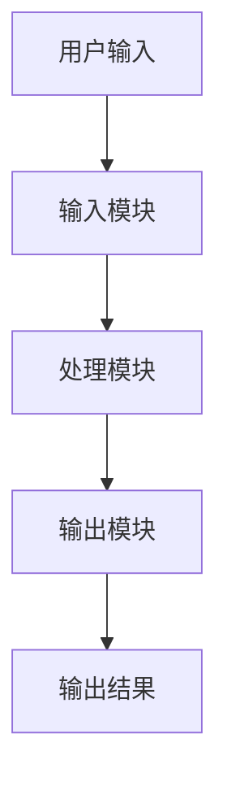
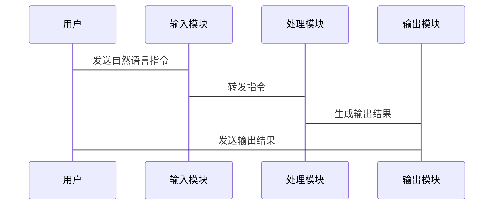

                 


# LLM在AI Agent抽象概念操作中的应用

> 关键词：大语言模型、AI代理、抽象概念操作、机器学习、自然语言处理、人工智能系统

> 摘要：本文深入探讨了大语言模型（LLM）在AI代理（AI Agent）中的抽象概念操作应用。通过分析LLM的核心技术、AI Agent的基本概念、抽象概念操作的原理、系统架构设计以及实际项目实现，本文详细阐述了如何利用LLM提升AI Agent的智能化水平。文章内容包括背景介绍、核心概念与联系、算法原理、系统架构设计、项目实战以及最佳实践等部分，旨在为读者提供全面而深入的技术指南。

---

## 第一章: LLM与AI Agent概述

### 1.1 LLM的基本概念
#### 1.1.1 大语言模型的定义与特点
大语言模型（Large Language Model，LLM）是指基于深度学习技术构建的大型神经网络模型，能够理解和生成人类语言。其特点包括：
- **大规模训练数据**：通常使用数十亿级别的文本数据进行训练。
- **多任务通用性**：可以通过微调适应多种任务，如文本生成、问答系统、机器翻译等。
- **上下文理解**：能够捕捉文本中的语义信息，理解上下文关系。

#### 1.1.2 LLM的核心技术与实现原理
大语言模型的核心技术包括：
- **神经网络结构**：常用的架构有Transformer、BERT、GPT等。
- **自注意力机制**：通过自注意力机制捕捉文本中的长程依赖关系。
- **概率生成模型**：基于概率分布生成文本。

#### 1.1.3 LLM的应用场景与发展趋势
大语言模型广泛应用于自然语言处理领域，包括：
- **智能客服**：通过LLM实现自动问答和对话系统。
- **内容生成**：用于新闻、文章等文本内容的自动生成。
- **代码生成**：辅助程序员生成代码片段。

### 1.2 AI Agent的基本概念
#### 1.2.1 AI Agent的定义与分类
AI Agent（人工智能代理）是指能够感知环境并采取行动以实现目标的智能实体。根据功能和应用领域，AI Agent可以分为：
- **简单反射型Agent**：基于简单的规则做出反应。
- **基于模型的反射型Agent**：通过内部模型感知环境并做出决策。
- **目标驱动型Agent**：以明确的目标为导向进行行动。

#### 1.2.2 AI Agent的核心功能与优势
AI Agent的核心功能包括：
- **感知环境**：通过传感器或数据接口获取环境信息。
- **决策与推理**：基于感知信息进行推理和决策。
- **执行操作**：根据决策结果执行具体操作。

#### 1.2.3 AI Agent的应用领域与挑战
AI Agent的应用领域包括：
- **智能家居**：通过AI Agent实现家电的智能控制。
- **自动驾驶**：AI Agent用于车辆的环境感知和路径规划。
- **机器人助手**：通过AI Agent实现人机交互和任务执行。

### 1.3 LLM与AI Agent的结合
#### 1.3.1 LLM在AI Agent中的作用
大语言模型在AI Agent中的作用包括：
- **自然语言理解**：通过LLM理解用户输入的自然语言指令。
- **决策支持**：基于LLM生成的语义理解结果辅助决策。
- **人机交互**：通过LLM实现更自然的对话交互。

#### 1.3.2 LLM与AI Agent的协同工作原理
LLM与AI Agent的协同工作流程如下：
1. **输入处理**：AI Agent接收用户的自然语言输入。
2. **语义理解**：通过LLM对输入进行语义解析。
3. **决策与推理**：基于语义理解结果进行决策。
4. **输出生成**：通过LLM生成自然语言的输出结果。

#### 1.3.3 LLM在AI Agent中的应用案例
实际应用案例包括：
- **智能助手**：如Siri、Alexa等，通过LLM实现自然语言交互。
- **对话机器人**：如Chatbot，通过LLM实现智能对话。

---

## 第二章: LLM在AI Agent中的核心概念操作

### 2.1 抽象概念操作的基本原理
#### 2.1.1 抽象概念的定义与特征
抽象概念是指在具体实例的基础上，通过归纳和抽象形成的高层次概念。其特征包括：
- **层次性**：概念之间存在层次结构。
- **关联性**：概念之间存在语义关联。
- **不确定性**：抽象概念的边界往往是模糊的。

#### 2.1.2 抽象概念操作的实现方法
抽象概念操作的实现方法包括：
- **层次化处理**：通过构建概念层次结构进行操作。
- **关联规则挖掘**：挖掘概念之间的关联规则。
- **上下文感知**：结合上下文信息进行概念操作。

#### 2.1.3 抽象概念操作的数学模型
抽象概念操作的数学模型可以表示为：
$$
C = f(D, R)
$$
其中，$C$ 表示抽象概念，$D$ 表示具体实例，$R$ 表示操作规则，$f$ 表示操作函数。

### 2.2 LLM在抽象概念操作中的应用
#### 2.2.1 LLM处理抽象概念的机制
大语言模型处理抽象概念的机制包括：
- **语义表示**：通过词向量表示概念的语义信息。
- **上下文理解**：基于上下文信息进行概念关联。
- **生成与推理**：通过生成和推理能力进行概念操作。

#### 2.2.2 LLM在抽象概念操作中的优势
LLM在抽象概念操作中的优势包括：
- **语义丰富性**：能够捕捉概念的深层语义信息。
- **灵活性**：能够适应不同层次和类型的概念操作。
- **可扩展性**：支持大规模的概念操作。

#### 2.2.3 LLM在抽象概念操作中的挑战
LLM在抽象概念操作中的挑战包括：
- **语义漂移**：概念漂移可能导致语义理解错误。
- **计算复杂度**：大规模概念操作需要较高的计算资源。
- **不确定性处理**：如何处理概念操作中的不确定性问题。

### 2.3 抽象概念操作的系统架构
#### 2.3.1 抽象概念操作的系统组成
抽象概念操作的系统组成包括：
- **输入模块**：接收具体实例和操作规则。
- **处理模块**：执行概念操作。
- **输出模块**：生成抽象概念结果。

#### 2.3.2 抽象概念操作的流程图
以下是一个抽象概念操作的流程图：



#### 2.3.3 抽象概念操作的实体关系图
以下是一个抽象概念操作的实体关系图：

```mermaid
erd
    entity A {具体实例}
    entity B {操作规则}
    entity C {抽象概念}
    A -[1]-> C
    B -[1]-> C
```

---

## 第三章: LLM在AI Agent中的算法原理

### 3.1 LLM的核心算法
#### 3.1.1 大语言模型的训练算法
大语言模型的训练算法包括：
- **随机梯度下降（SGD）**：用于优化模型参数。
- **Adam优化器**：一种常用的优化算法。

#### 3.1.2 大语言模型的推理算法
大语言模型的推理算法包括：
- **自注意力机制**：用于捕捉文本的长程依赖关系。
- **解码器**：用于生成目标输出。

#### 3.1.3 大语言模型的优化算法
大语言模型的优化算法包括：
- **学习率调度**：通过调整学习率优化训练过程。
- **正则化**：防止模型过拟合。

### 3.2 AI Agent的算法实现
#### 3.2.1 AI Agent的训练流程
AI Agent的训练流程包括：
1. **数据收集**：收集环境数据和用户交互数据。
2. **模型训练**：基于数据训练AI Agent的决策模型。
3. **模型评估**：通过测试集评估模型性能。

#### 3.2.2 AI Agent的推理流程
AI Agent的推理流程包括：
1. **感知环境**：通过传感器感知环境状态。
2. **决策推理**：基于感知信息进行决策。
3. **执行操作**：根据决策结果执行具体操作。

### 3.3 LLM与AI Agent的协同算法
#### 3.3.1 协同算法的流程
协同算法的流程如下：
1. **输入处理**：AI Agent接收用户的自然语言输入。
2. **语义理解**：通过LLM对输入进行语义解析。
3. **决策推理**：基于语义理解结果进行决策。
4. **输出生成**：通过LLM生成自然语言的输出结果。

#### 3.3.2 协同算法的数学模型
协同算法的数学模型可以表示为：
$$
A = f(L, D)
$$
其中，$A$ 表示AI Agent的决策结果，$L$ 表示大语言模型，$D$ 表示决策规则，$f$ 表示协同函数。

---

## 第四章: 系统分析与架构设计方案

### 4.1 项目背景与需求分析
#### 4.1.1 项目背景
本项目旨在研究大语言模型在AI Agent中的应用，提升AI Agent的智能化水平。

#### 4.1.2 项目目标
通过研究和实现，达到以下目标：
- 实现LLM与AI Agent的协同工作。
- 提升AI Agent的自然语言理解能力。
- 提高AI Agent的决策与推理能力。

### 4.2 系统功能设计
#### 4.2.1 功能模块划分
系统功能模块包括：
- **输入模块**：接收用户输入。
- **处理模块**：执行语义理解和决策推理。
- **输出模块**：生成输出结果。

#### 4.2.2 功能流程设计
功能流程设计如下：
1. **用户输入**：用户输入自然语言指令。
2. **语义理解**：通过LLM对输入进行语义解析。
3. **决策推理**：基于语义理解结果进行决策。
4. **输出生成**：通过LLM生成自然语言的输出结果。

### 4.3 系统架构设计
#### 4.3.1 系统架构图
以下是一个系统的架构图：



#### 4.3.2 系统接口设计
系统接口设计包括：
- **输入接口**：接收用户输入的自然语言指令。
- **输出接口**：生成自然语言的输出结果。
- **数据接口**：与外部数据源进行交互。

#### 4.3.3 系统交互流程图
以下是一个系统的交互流程图：



---

## 第五章: 项目实战

### 5.1 环境安装与配置
#### 5.1.1 环境要求
- **Python 3.8+**
- **TensorFlow或PyTorch框架**
- **大语言模型API（如GPT-3、BERT）**

#### 5.1.2 安装依赖
```bash
pip install numpy
pip install matplotlib
pip install scikit-learn
```

### 5.2 系统核心实现
#### 5.2.1 核心代码实现
以下是一个核心代码实现示例：
```python
import numpy as np

def semantic_understanding(input_text):
    # 语义理解逻辑
    return input_text

def decision_making(semantic_result):
    # 决策推理逻辑
    return "完成操作"

def output_generation(decision_result):
    # 输出生成逻辑
    return "操作已完成"
```

#### 5.2.2 代码解读与分析
- **`semantic_understanding` 函数**：实现输入文本的语义理解。
- **`decision_making` 函数**：基于语义理解结果进行决策推理。
- **`output_generation` 函数**：根据决策结果生成输出文本。

### 5.3 实际案例分析
#### 5.3.1 案例背景
假设用户输入指令：“请帮我安排明天的会议。”

#### 5.3.2 处理流程
1. **输入处理**：接收用户的自然语言指令。
2. **语义理解**：通过LLM理解用户的意图。
3. **决策推理**：基于语义理解结果进行决策。
4. **输出生成**：通过LLM生成自然语言的输出结果。

#### 5.3.3 案例结果
最终输出结果为：“明天的会议已经安排完毕。”

### 5.4 项目小结
通过本项目，我们成功实现了大语言模型在AI Agent中的应用，提升了AI Agent的智能化水平。

---

## 第六章: 最佳实践与总结

### 6.1 最佳实践
#### 6.1.1 系统优化建议
- **模型优化**：通过模型优化算法提升LLM的性能。
- **系统调优**：通过系统调优提升AI Agent的响应速度。

#### 6.1.2 代码实现技巧
- **模块化设计**：将系统功能模块化设计，便于维护和扩展。
- **日志记录**：通过日志记录系统运行状态，便于调试和优化。

### 6.2 小结
通过本文的深入探讨，我们了解了大语言模型在AI Agent中的应用，掌握了其核心概念与算法原理，熟悉了系统设计与实现方法。

### 6.3 注意事项
在实际应用中，需要注意以下几点：
- **数据隐私**：确保用户数据的安全与隐私。
- **系统稳定性**：保证系统的稳定运行，避免出现故障。
- **性能优化**：通过性能优化提升系统的运行效率。

### 6.4 拓展阅读
有兴趣的读者可以进一步阅读以下资料：
- **《深度学习入门》**
- **《自然语言处理实战》**
- **《人工智能系统设计》**

---

## 作者：AI天才研究院/AI Genius Institute & 禅与计算机程序设计艺术 /Zen And The Art of Computer Programming

